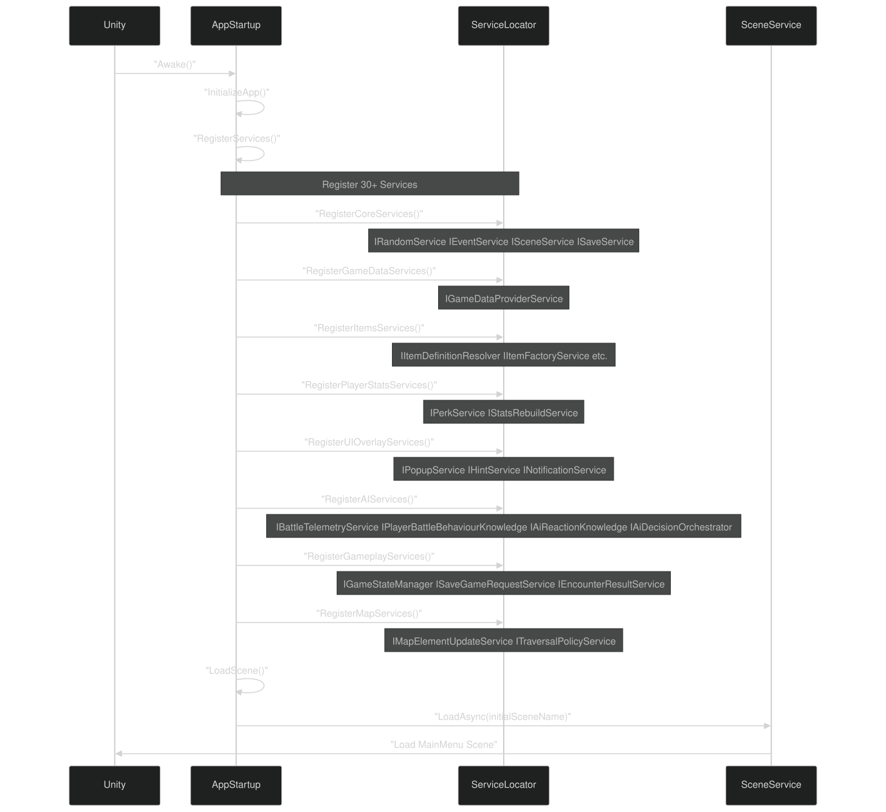

# Carnage Club Overview

Relevant source files

- [CarnageClub/.aiassistant/rules/AI_INSTRUCTIONS.md](https://github.com/Wolfs0ng/CarnageClub/blob/0021fcdc/CarnageClub/.aiassistant/rules/AI_INSTRUCTIONS.md)
- [CarnageClub/.aiassistant/rules/context/AI_SYSTEMS.md](https://github.com/Wolfs0ng/CarnageClub/blob/0021fcdc/CarnageClub/.aiassistant/rules/context/AI_SYSTEMS.md)
- [CarnageClub/.aiassistant/rules/context/ARCHITECTURE.md](https://github.com/Wolfs0ng/CarnageClub/blob/0021fcdc/CarnageClub/.aiassistant/rules/context/ARCHITECTURE.md)
- [CarnageClub/.aiassistant/rules/context/CODING_STANDARDS.md](https://github.com/Wolfs0ng/CarnageClub/blob/0021fcdc/CarnageClub/.aiassistant/rules/context/CODING_STANDARDS.md)
- [CarnageClub/.aiassistant/rules/context/CONTEXT_INDEX.md](https://github.com/Wolfs0ng/CarnageClub/blob/0021fcdc/CarnageClub/.aiassistant/rules/context/CONTEXT_INDEX.md)
- [CarnageClub/.aiassistant/rules/context/GAMEPLAY_RULES.md](https://github.com/Wolfs0ng/CarnageClub/blob/0021fcdc/CarnageClub/.aiassistant/rules/context/GAMEPLAY_RULES.md)
- [CarnageClub/.aiassistant/rules/context/PROJECT_OVERVIEW.md](https://github.com/Wolfs0ng/CarnageClub/blob/0021fcdc/CarnageClub/.aiassistant/rules/context/PROJECT_OVERVIEW.md)
- [CarnageClub/.aiassistant/rules/context/TELEMETRY.md](https://github.com/Wolfs0ng/CarnageClub/blob/0021fcdc/CarnageClub/.aiassistant/rules/context/TELEMETRY.md)
- [CarnageClub/Assets/GameResources/ScriptableObjects/BaseGameData/MapLevels/Level_1_MapData.asset](https://github.com/Wolfs0ng/CarnageClub/blob/0021fcdc/CarnageClub/Assets/GameResources/ScriptableObjects/BaseGameData/MapLevels/Level_1_MapData.asset)
- [CarnageClub/Assets/Scenes/AppStart.unity](https://github.com/Wolfs0ng/CarnageClub/blob/0021fcdc/CarnageClub/Assets/Scenes/AppStart.unity)
- [CarnageClub/Assets/Scripts/Core/AppStartup.cs](https://github.com/Wolfs0ng/CarnageClub/blob/0021fcdc/CarnageClub/Assets/Scripts/Core/AppStartup.cs)
- [CarnageClub/Assets/Scripts/Core/GameStateManager.cs](https://github.com/Wolfs0ng/CarnageClub/blob/0021fcdc/CarnageClub/Assets/Scripts/Core/GameStateManager.cs)
- [CarnageClub/SaveData.json](https://github.com/Wolfs0ng/CarnageClub/blob/0021fcdc/CarnageClub/SaveData.json)
- [GDD_EN.md](https://github.com/Wolfs0ng/CarnageClub/blob/0021fcdc/GDD_EN.md)
- [GDD_UA.md](https://github.com/Wolfs0ng/CarnageClub/blob/0021fcdc/GDD_UA.md)
- [README.md](https://github.com/Wolfs0ng/CarnageClub/blob/0021fcdc/README.md)

## Purpose and Scope

This document provides a high-level introduction to the Carnage Club codebase: a mobile-first, single-player tactical combat game where enemies learn from player behavior. This page covers the core concept "The world remembers your habits," the overall system architecture, and how major systems interact.

For detailed information about specific subsystems, see:

- [Architecture & Design Principles](#2)Architecture and design principles →
- [AI System](#3)AI learning systems →
- [Battle System](#5)Combat mechanics →
- [Map System](#6)Map navigation →

## What is Carnage Club?

Carnage Club is a single-player, turn-based tactical combat game for mobile platforms built in Unity. The game focuses on:

- Tactical directional combat: 4 attack directions and 4 defense directions per turn
- Adaptive AI: Enemies learn from player patterns and persist knowledge across sessions
- Node-based map exploration: Navigate between combat encounters, safe zones, and special events
- Character progression: Stats, equipment, perks, and abilities that affect combat and AI adaptation

The game loop consists of:

Sources:  [README.md #9-36](https://github.com/Wolfs0ng/CarnageClub/blob/0021fcdc/README.md#L9-L36)  [GDD_EN.md #9-38](https://github.com/Wolfs0ng/CarnageClub/blob/0021fcdc/GDD_EN.md#L9-L38)

## Core Concept: "The World Remembers Your Habits"

The defining feature of Carnage Club is that AI opponents learn from player behavior and persist that knowledge across game sessions . This is implemented through a layered AI architecture:

The persistent knowledge layers (1-2) are serialized to disk in `SaveData.json` , ensuring that enemies "remember" how the player fights even after closing the game. The player's `Focus` stat affects how quickly AI learns and adapts.

Sources:  [README.md #34-36](https://github.com/Wolfs0ng/CarnageClub/blob/0021fcdc/README.md#L34-L36)  [GDD_EN.md #196-262](https://github.com/Wolfs0ng/CarnageClub/blob/0021fcdc/GDD_EN.md#L196-L262)  [CarnageClub/SaveData.json #662-1635](https://github.com/Wolfs0ng/CarnageClub/blob/0021fcdc/CarnageClub/SaveData.json#L662-L1635)

## High-Level System Architecture

### System Architecture Diagram

Sources:  [CarnageClub/Assets/Scripts/Core/AppStartup.cs #65-277](https://github.com/Wolfs0ng/CarnageClub/blob/0021fcdc/CarnageClub/Assets/Scripts/Core/AppStartup.cs#L65-L277)  [CarnageClub/Assets/Scripts/Core/GameStateManager.cs #32-280](https://github.com/Wolfs0ng/CarnageClub/blob/0021fcdc/CarnageClub/Assets/Scripts/Core/GameStateManager.cs#L32-L280)

## System Categories

The codebase is organized into five primary system categories:

### Core Systems

Sources:  [CarnageClub/Assets/Scripts/Core/AppStartup.cs #125-131](https://github.com/Wolfs0ng/CarnageClub/blob/0021fcdc/CarnageClub/Assets/Scripts/Core/AppStartup.cs#L125-L131)

### AI Systems

The AI system is the most architecturally significant component (importance: 21.79). See [AI System](#3) for comprehensive documentation.

Sources:  [CarnageClub/Assets/Scripts/Core/AppStartup.cs #166-195](https://github.com/Wolfs0ng/CarnageClub/blob/0021fcdc/CarnageClub/Assets/Scripts/Core/AppStartup.cs#L166-L195)

### Battle System

Handles turn-based combat resolution. See [Battle System](#5) for details.

Sources:  [High-level diagrams - Diagram 5](https://github.com/Wolfs0ng/CarnageClub/blob/0021fcdc/High-level diagrams - Diagram 5)

### Map System

Node-based exploration system. See [Map System](#6) for details.

Sources:  [High-level diagrams - Diagram 5](https://github.com/Wolfs0ng/CarnageClub/blob/0021fcdc/High-level diagrams - Diagram 5)  [CarnageClub/Assets/GameResources/ScriptableObjects/BaseGameData/MapLevels/Level_1_MapData.asset #1-218](https://github.com/Wolfs0ng/CarnageClub/blob/0021fcdc/CarnageClub/Assets/GameResources/ScriptableObjects/BaseGameData/MapLevels/Level_1_MapData.asset#L1-L218)

### UI Systems

See [UI Systems](#7) for comprehensive documentation.

Sources:  [CarnageClub/Assets/Scripts/Core/AppStartup.cs #159-164](https://github.com/Wolfs0ng/CarnageClub/blob/0021fcdc/CarnageClub/Assets/Scripts/Core/AppStartup.cs#L159-L164)

## Application Startup and Service Registration

### Service Registration Flow

The `AppStartup` MonoBehaviour in the `AppStart` scene registers all services at application launch before loading the `MainMenu` scene. Services are plain C# classes (not MonoBehaviours) registered via the static `ServiceLocator` pattern.

Key Registration Methods:

- `RegisterCoreServices()`[CarnageClub/Assets/Scripts/Core/AppStartup.cs#125-131](https://github.com/Wolfs0ng/CarnageClub/blob/0021fcdc/CarnageClub/Assets/Scripts/Core/AppStartup.cs#L125-L131)-
- `RegisterAIServices()`[CarnageClub/Assets/Scripts/Core/AppStartup.cs#166-195](https://github.com/Wolfs0ng/CarnageClub/blob/0021fcdc/CarnageClub/Assets/Scripts/Core/AppStartup.cs#L166-L195)-
- `RegisterGameplayServices()`[CarnageClub/Assets/Scripts/Core/AppStartup.cs#198-204](https://github.com/Wolfs0ng/CarnageClub/blob/0021fcdc/CarnageClub/Assets/Scripts/Core/AppStartup.cs#L198-L204)-
- `RegisterMapServices()`[CarnageClub/Assets/Scripts/Core/AppStartup.cs#206-210](https://github.com/Wolfs0ng/CarnageClub/blob/0021fcdc/CarnageClub/Assets/Scripts/Core/AppStartup.cs#L206-L210)-

Sources:  [CarnageClub/Assets/Scripts/Core/AppStartup.cs #92-123](https://github.com/Wolfs0ng/CarnageClub/blob/0021fcdc/CarnageClub/Assets/Scripts/Core/AppStartup.cs#L92-L123)  [CarnageClub/Assets/Scenes/AppStart.unity #854-899](https://github.com/Wolfs0ng/CarnageClub/blob/0021fcdc/CarnageClub/Assets/Scenes/AppStart.unity#L854-L899)

## Game Flow Overview

### Complete Player Journey

Key Flow Points:

Sources:  [CarnageClub/Assets/Scripts/Core/GameStateManager.cs #144-156](https://github.com/Wolfs0ng/CarnageClub/blob/0021fcdc/CarnageClub/Assets/Scripts/Core/GameStateManager.cs#L144-L156)  [High-level diagrams - Diagram 3](https://github.com/Wolfs0ng/CarnageClub/blob/0021fcdc/High-level diagrams - Diagram 3)

## Data Flow and State Management

### State Management Architecture

Key Separation:

Critical Point: AI knowledge ( `PlayerBattleBehaviorData` , `AiReactionKnowledgeData` ) is saved in `SaveData` , implementing the "world remembers" concept. The `GameStateManager` coordinates with `IPlayerBattleBehaviourKnowledge` and `IAiReactionKnowledge` services to persist/restore this data.

Sources:  [CarnageClub/Assets/Scripts/Core/GameStateManager.cs #130-142](https://github.com/Wolfs0ng/CarnageClub/blob/0021fcdc/CarnageClub/Assets/Scripts/Core/GameStateManager.cs#L130-L142)  [CarnageClub/SaveData.json #1-1635](https://github.com/Wolfs0ng/CarnageClub/blob/0021fcdc/CarnageClub/SaveData.json#L1-L1635)  [High-level diagrams - Diagram 4](https://github.com/Wolfs0ng/CarnageClub/blob/0021fcdc/High-level diagrams - Diagram 4)

## Key Design Principles

### 1. Service-Oriented Architecture

Services are plain C# classes (not MonoBehaviours) registered via `ServiceLocator` . MonoBehaviours act as thin orchestration layers that delegate to services.

Sources:  [CarnageClub/.aiassistant/rules/context/ARCHITECTURE.md #1-45](https://github.com/Wolfs0ng/CarnageClub/blob/0021fcdc/CarnageClub/.aiassistant/rules/context/ARCHITECTURE.md#L1-L45)

### 2. Unidirectional Data Flow

Telemetry never consumes knowledge. Data flows:

- `IBattleTelemetryService`Combat → (records)
- `IPlayerBattleBehaviourKnowledge`Telemetry → (learns)
- `IAiDecisionOrchestrator`Knowledge → (decides)

This prevents circular dependencies and ensures debuggability.

Sources:  [CarnageClub/.aiassistant/rules/context/TELEMETRY.md #1-28](https://github.com/Wolfs0ng/CarnageClub/blob/0021fcdc/CarnageClub/.aiassistant/rules/context/TELEMETRY.md#L1-L28)

### 3. Event-Driven Communication

Systems communicate via `IEventService` pub/sub to prevent tight coupling:

Sources:  [CarnageClub/Assets/Scripts/Core/GameStateManager.cs #219-235](https://github.com/Wolfs0ng/CarnageClub/blob/0021fcdc/CarnageClub/Assets/Scripts/Core/GameStateManager.cs#L219-L235)

### 4. Separation of Concerns: DTO vs Runtime State

This separation prevents serialization concerns from polluting gameplay logic.

Sources:  [CarnageClub/.aiassistant/rules/context/ARCHITECTURE.md #27-34](https://github.com/Wolfs0ng/CarnageClub/blob/0021fcdc/CarnageClub/.aiassistant/rules/context/ARCHITECTURE.md#L27-L34)

### 5. Debuggability Over Elegance

Per the solo-developer philosophy:

- Explicit is better than implicit- No optional parameters, boolean flags, or hidden behaviors
- Observable AI- All AI decisions must be traceable back to telemetry records
- 10-second comprehension rule- Future-you must understand code in 10 seconds

Sources:  [CarnageClub/.aiassistant/rules/AI_INSTRUCTIONS.md #33-43](https://github.com/Wolfs0ng/CarnageClub/blob/0021fcdc/CarnageClub/.aiassistant/rules/AI_INSTRUCTIONS.md#L33-L43)  [CarnageClub/.aiassistant/rules/context/CODING_STANDARDS.md #1-35](https://github.com/Wolfs0ng/CarnageClub/blob/0021fcdc/CarnageClub/.aiassistant/rules/context/CODING_STANDARDS.md#L1-L35)

## Summary

Carnage Club is a mobile tactical combat game where AI learns from player behavior and persists knowledge across sessions . The architecture is service-oriented with clear separation between:

- Core systems`GameStateManager``EventService``SaveService`( , , )
- AI systems(5-layer architecture: Telemetry → Knowledge → Decisions → Intent → Emotions)
- Battle systems(turn-based combat resolution)
- Map systems(node-based exploration)

The design prioritizes debuggability, observability, and maintainability for a solo developer. All systems communicate via events ( `IEventService` ) and dependency injection ( `ServiceLocator` ), with strict unidirectional data flow to prevent circular dependencies.

For deeper dives into specific systems, see the linked pages in the table of contents.