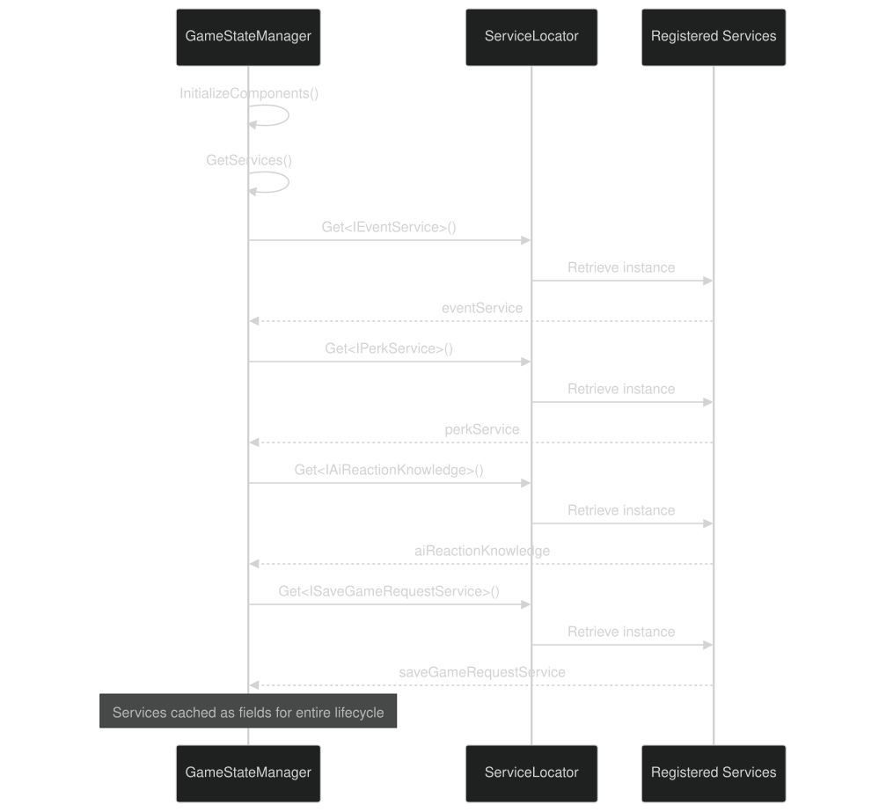

# Service Locator Pattern

<details>
<summary>Relevant source files</summary>


- [CarnageClub/Assets/GameResources/ScriptableObjects/BaseGameData/MapLevels/Level_1_MapData.asset](https://github.com/Wolfs0ng/CarnageClub/blob/0021fcdc/CarnageClub/Assets/GameResources/ScriptableObjects/BaseGameData/MapLevels/Level_1_MapData.asset)
- [CarnageClub/Assets/Scenes/AppStart.unity](https://github.com/Wolfs0ng/CarnageClub/blob/0021fcdc/CarnageClub/Assets/Scenes/AppStart.unity)
- [CarnageClub/Assets/Scripts/Core/AppStartup.cs](https://github.com/Wolfs0ng/CarnageClub/blob/0021fcdc/CarnageClub/Assets/Scripts/Core/AppStartup.cs)
- [CarnageClub/Assets/Scripts/Core/GameStateManager.cs](https://github.com/Wolfs0ng/CarnageClub/blob/0021fcdc/CarnageClub/Assets/Scripts/Core/GameStateManager.cs)
- [CarnageClub/SaveData.json](https://github.com/Wolfs0ng/CarnageClub/blob/0021fcdc/CarnageClub/SaveData.json)


</details>

## Purpose and Scope

This document explains the Service Locator pattern implementation in Carnage Club, which serves as the dependency injection backbone for the entire application. The Service Locator registers and provides access to 30+ services across all major systems, enabling loose coupling between components while maintaining clear dependencies.

For information about how specific services manage game state, see [Game State Manager](#4.1) . For event-based communication between systems, see [Event Service & Communication](#4.2) .

## Architecture Overview

The Service Locator pattern in Carnage Club follows a centralized registration model where all services are instantiated and registered during application startup. The `AppStartup` component orchestrates this process before any game scenes load, ensuring all dependencies are available throughout the application lifecycle.

Service Locator Initialization Flow



Sources:  [CarnageClub/Assets/Scripts/Core/AppStartup.cs #92-123](https://github.com/Wolfs0ng/CarnageClub/blob/0021fcdc/CarnageClub/Assets/Scripts/Core/AppStartup.cs#L92-L123)

## Service Registration at Startup

All services are registered synchronously during the `Awake()` phase of the `AppStartup` MonoBehaviour. This ensures services are available before any scene-specific logic executes.

### Registration Method Structure



The `RegisterService<T>()` helper method provides a consistent interface for all registrations:

```block
private void RegisterService<T>(Func<T> factory) where T : class{    ServiceLocator.Register(factory());}
```

Sources:  [CarnageClub/Assets/Scripts/Core/AppStartup.cs #212-215](https://github.com/Wolfs0ng/CarnageClub/blob/0021fcdc/CarnageClub/Assets/Scripts/Core/AppStartup.cs#L212-L215)

## Service Categories

Services are organized into eight functional categories, each registered through dedicated methods. This organization improves maintainability and clarifies system boundaries.

### Core Services

The foundational services required by all other systems.

Sources:  [CarnageClub/Assets/Scripts/Core/AppStartup.cs #125-131](https://github.com/Wolfs0ng/CarnageClub/blob/0021fcdc/CarnageClub/Assets/Scripts/Core/AppStartup.cs#L125-L131)

### Game Data Services

Provides access to ScriptableObject-based game configuration.

Sources:  [CarnageClub/Assets/Scripts/Core/AppStartup.cs #133-138](https://github.com/Wolfs0ng/CarnageClub/blob/0021fcdc/CarnageClub/Assets/Scripts/Core/AppStartup.cs#L133-L138)

### Item Services

Handles item definitions, procedural generation, and stat resolution.

Note: `ItemContentRegistryService` implements multiple interfaces, serving as a unified registry for all item-related content.

Sources:  [CarnageClub/Assets/Scripts/Core/AppStartup.cs #140-147](https://github.com/Wolfs0ng/CarnageClub/blob/0021fcdc/CarnageClub/Assets/Scripts/Core/AppStartup.cs#L140-L147)

### Player Stats Services

Manages character progression, equipment stats, and perk systems.

Sources:  [CarnageClub/Assets/Scripts/Core/AppStartup.cs #149-157](https://github.com/Wolfs0ng/CarnageClub/blob/0021fcdc/CarnageClub/Assets/Scripts/Core/AppStartup.cs#L149-L157)

### UI Overlay Services

Persistent UI components that exist across all scenes.

These services are injected with references to Unity UI controllers from the persistent CanvasOverlay.

Sources:  [CarnageClub/Assets/Scripts/Core/AppStartup.cs #159-164](https://github.com/Wolfs0ng/CarnageClub/blob/0021fcdc/CarnageClub/Assets/Scripts/Core/AppStartup.cs#L159-L164)

### AI Services

The 5-layer AI system services (see [AI System](#3) for detailed architecture).

The `AiDecisionOrchestrator` is a composite service that orchestrates multiple AI subsystems:



Sources:  [CarnageClub/Assets/Scripts/Core/AppStartup.cs #166-196](https://github.com/Wolfs0ng/CarnageClub/blob/0021fcdc/CarnageClub/Assets/Scripts/Core/AppStartup.cs#L166-L196)

### Gameplay Services

High-level game flow and state management.

Sources:  [CarnageClub/Assets/Scripts/Core/AppStartup.cs #198-204](https://github.com/Wolfs0ng/CarnageClub/blob/0021fcdc/CarnageClub/Assets/Scripts/Core/AppStartup.cs#L198-L204)

### Map Services

Map navigation and element interaction logic.

Sources:  [CarnageClub/Assets/Scripts/Core/AppStartup.cs #206-210](https://github.com/Wolfs0ng/CarnageClub/blob/0021fcdc/CarnageClub/Assets/Scripts/Core/AppStartup.cs#L206-L210)

## Service Consumption Pattern

Any component in the codebase can access registered services using the static `ServiceLocator.Get<T>()` method. The typical pattern for service-dependent classes is:

### Example: GameStateManager Service Retrieval



Concrete Implementation:

```block
// GameStateManager fieldsprivate IEventService eventService;private IPerkService perkService;private IAiReactionKnowledge aiReactionKnowledge;private ISaveGameRequestService saveGameRequestService;private IMapElementUpdateService mapElementUpdateService;private IPlayerBattleBehaviourKnowledge playerBattleBehaviourKnowledge;private IPlayerPerksKnowledge playerPerksKnowledge;private IAiPerksKnowledge aiPerksKnowledge; // Retrieval methodprivate void GetServices(){    eventService = ServiceLocator.Get<IEventService>();    perkService = ServiceLocator.Get<IPerkService>();    aiReactionKnowledge = ServiceLocator.Get<IAiReactionKnowledge>();    saveGameRequestService = ServiceLocator.Get<ISaveGameRequestService>();    mapElementUpdateService = ServiceLocator.Get<IMapElementUpdateService>();    playerBattleBehaviourKnowledge = ServiceLocator.Get<IPlayerBattleBehaviourKnowledge>();    playerPerksKnowledge = ServiceLocator.Get<IPlayerPerksKnowledge>();    aiPerksKnowledge = ServiceLocator.Get<IAiPerksKnowledge>();}
```

Sources:  [CarnageClub/Assets/Scripts/Core/GameStateManager.cs #206-217](https://github.com/Wolfs0ng/CarnageClub/blob/0021fcdc/CarnageClub/Assets/Scripts/Core/GameStateManager.cs#L206-L217)

## Complete Service Registry

This table provides a complete reference of all registered services in the order they are registered at startup.

Sources:  [CarnageClub/Assets/Scripts/Core/AppStartup.cs #105-210](https://github.com/Wolfs0ng/CarnageClub/blob/0021fcdc/CarnageClub/Assets/Scripts/Core/AppStartup.cs#L105-L210)

## Service Lifecycle and Dependencies

Services have different lifecycle characteristics based on their role:

### Stateless Services

Services that perform operations without maintaining state across calls. These can be called anytime after registration.

- `IRandomService`
- `IItemFactoryService`
- `IPerkProfileBuilder`
- `IStatsRebuildService`
- `ITraversalPolicyService`
- `IEncounterResultService`
- `IPlayerLevelUpFlowService`
- `IPerkThreatEvaluator`


### Stateful Services

Services that maintain runtime state and must be properly initialized/disposed.

- `IEventService`- Maintains subscriber lists
- `IGameStateManager``Initialize()`- Maintains game state (requires explicit call)
- `IAiDecisionOrchestrator`- Maintains AI state machines and emotion states


### Persistent Services

Services that load/save data to disk and persist across game sessions.

- `ISaveService`- Reads/writes SaveData.json
- `IPlayerBattleBehaviourKnowledge`- Persisted in SaveData.PlayerBattleBehaviorData
- `IAiReactionKnowledge`- Persisted in SaveData.AiReactionKnowledgeData
- `IPlayerPerksKnowledge`- Persisted in SaveData
- `IAiPerksKnowledge`- Persisted in SaveData


### Dependency Graph



Sources:  [CarnageClub/Assets/Scripts/Core/AppStartup.cs #105-210](https://github.com/Wolfs0ng/CarnageClub/blob/0021fcdc/CarnageClub/Assets/Scripts/Core/AppStartup.cs#L105-L210)  [CarnageClub/Assets/Scripts/Core/GameStateManager.cs #206-217](https://github.com/Wolfs0ng/CarnageClub/blob/0021fcdc/CarnageClub/Assets/Scripts/Core/GameStateManager.cs#L206-L217)

## Design Principles

The Service Locator implementation follows specific design principles that reflect the solo-developer architecture philosophy (see [Architecture & Design Principles](#2) ).

### 1. Explicit Registration Over Auto-Discovery

All services are explicitly registered in `AppStartup` rather than using reflection or auto-discovery. This makes the service registry completely visible and searchable.

Rationale: "10-second comprehension rule" - A developer should be able to find all services by opening one file.

### 2. Interface-Based Dependencies

All services are registered and retrieved via interfaces ( `IServiceName` ), not concrete types. This enables:

- Easy testing with mock implementations
- Clear API contracts
- Separation of interface from implementation


### 3. No Constructor Injection

Services are retrieved via `ServiceLocator.Get<T>()` rather than constructor injection. While this reduces compile-time safety, it provides:

- Simpler initialization logic (no complex dependency graphs)
- Unity-friendly patterns (MonoBehaviours can't use constructor injection easily)
- Explicit service retrieval at initialization time


Trade-off: Runtime errors if service not registered, but registration order is deterministic and centralized.

### 4. Single Responsibility Services

Each service has a focused responsibility. Complex orchestration is handled by composite services (e.g., `AiDecisionOrchestrator` ) that coordinate multiple simple services.

### 5. Persistent Overlay UI

UI services ( `IPopupService` , `IHintService` , `INotificationService` ) are registered with references to Unity GameObjects from the persistent CanvasOverlay. This ensures UI components survive scene transitions.

Implementation: AppStartup scene contains CanvasOverlay with UI controllers that are injected into services.

Sources:  [CarnageClub/Assets/Scenes/AppStart.unity #860-884](https://github.com/Wolfs0ng/CarnageClub/blob/0021fcdc/CarnageClub/Assets/Scenes/AppStart.unity#L860-L884)

## Integration with Save System

Several services integrate with the save/load system (see [Save & Load System](#4.3) ). The `GameStateManager` coordinates saving these services' persistent data:



When loading:



Sources:  [CarnageClub/Assets/Scripts/Core/GameStateManager.cs #130-142](https://github.com/Wolfs0ng/CarnageClub/blob/0021fcdc/CarnageClub/Assets/Scripts/Core/GameStateManager.cs#L130-L142)  [CarnageClub/Assets/Scripts/Core/GameStateManager.cs #96-110](https://github.com/Wolfs0ng/CarnageClub/blob/0021fcdc/CarnageClub/Assets/Scripts/Core/GameStateManager.cs#L96-L110)  [CarnageClub/SaveData.json #662-1260](https://github.com/Wolfs0ng/CarnageClub/blob/0021fcdc/CarnageClub/SaveData.json#L662-L1260)