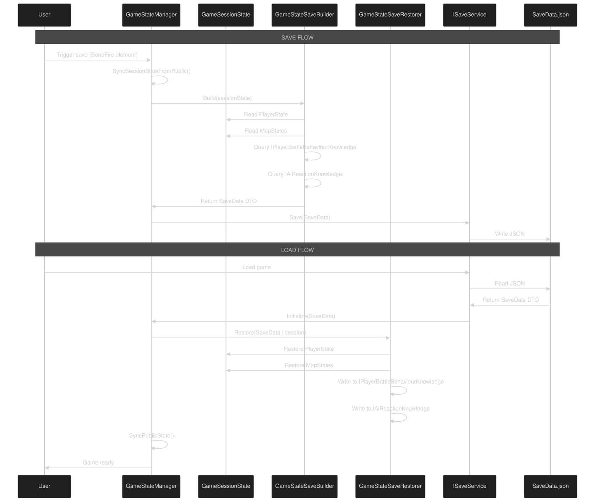
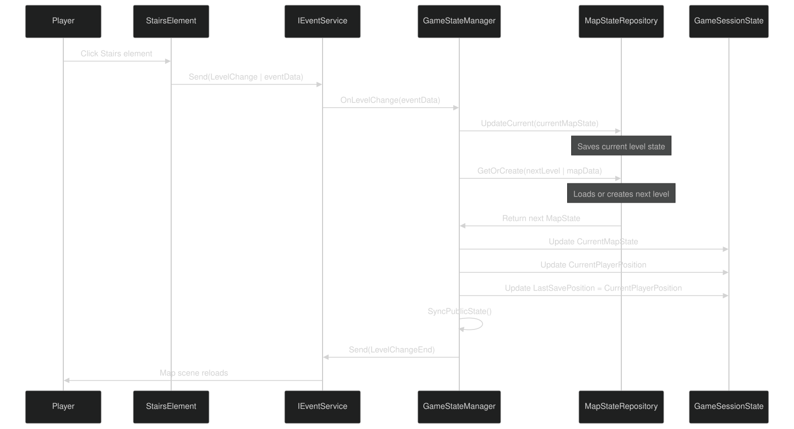

# Data Flow & State Management

<details>
<summary>Relevant source files</summary>


- [CarnageClub/.aiassistant/rules/AI_INSTRUCTIONS.md](https://github.com/Wolfs0ng/CarnageClub/blob/0021fcdc/CarnageClub/.aiassistant/rules/AI_INSTRUCTIONS.md)
- [CarnageClub/.aiassistant/rules/context/AI_SYSTEMS.md](https://github.com/Wolfs0ng/CarnageClub/blob/0021fcdc/CarnageClub/.aiassistant/rules/context/AI_SYSTEMS.md)
- [CarnageClub/.aiassistant/rules/context/ARCHITECTURE.md](https://github.com/Wolfs0ng/CarnageClub/blob/0021fcdc/CarnageClub/.aiassistant/rules/context/ARCHITECTURE.md)
- [CarnageClub/.aiassistant/rules/context/CODING_STANDARDS.md](https://github.com/Wolfs0ng/CarnageClub/blob/0021fcdc/CarnageClub/.aiassistant/rules/context/CODING_STANDARDS.md)
- [CarnageClub/.aiassistant/rules/context/CONTEXT_INDEX.md](https://github.com/Wolfs0ng/CarnageClub/blob/0021fcdc/CarnageClub/.aiassistant/rules/context/CONTEXT_INDEX.md)
- [CarnageClub/.aiassistant/rules/context/GAMEPLAY_RULES.md](https://github.com/Wolfs0ng/CarnageClub/blob/0021fcdc/CarnageClub/.aiassistant/rules/context/GAMEPLAY_RULES.md)
- [CarnageClub/.aiassistant/rules/context/PROJECT_OVERVIEW.md](https://github.com/Wolfs0ng/CarnageClub/blob/0021fcdc/CarnageClub/.aiassistant/rules/context/PROJECT_OVERVIEW.md)
- [CarnageClub/.aiassistant/rules/context/TELEMETRY.md](https://github.com/Wolfs0ng/CarnageClub/blob/0021fcdc/CarnageClub/.aiassistant/rules/context/TELEMETRY.md)
- [CarnageClub/Assets/GameResources/ScriptableObjects/BaseGameData/MapLevels/Level_1_MapData.asset](https://github.com/Wolfs0ng/CarnageClub/blob/0021fcdc/CarnageClub/Assets/GameResources/ScriptableObjects/BaseGameData/MapLevels/Level_1_MapData.asset)
- [CarnageClub/Assets/Scenes/AppStart.unity](https://github.com/Wolfs0ng/CarnageClub/blob/0021fcdc/CarnageClub/Assets/Scenes/AppStart.unity)
- [CarnageClub/Assets/Scripts/Core/AppStartup.cs](https://github.com/Wolfs0ng/CarnageClub/blob/0021fcdc/CarnageClub/Assets/Scripts/Core/AppStartup.cs)
- [CarnageClub/Assets/Scripts/Core/GameStateManager.cs](https://github.com/Wolfs0ng/CarnageClub/blob/0021fcdc/CarnageClub/Assets/Scripts/Core/GameStateManager.cs)
- [CarnageClub/SaveData.json](https://github.com/Wolfs0ng/CarnageClub/blob/0021fcdc/CarnageClub/SaveData.json)


</details>

## Purpose and Scope

This document covers the architectural principles governing how data flows through the Carnage Club codebase and how state is managed during runtime and across save/load cycles. It explains the separation between runtime state and persistence models, the unidirectional data flow principle, and the role of `GameStateManager` as the single source of truth for game state.

For implementation details of specific systems:

- [Service Locator Pattern](#2.1)Service registration and dependency injection: see
- `GameStateManager`[Game State Manager](#4.1)API and detailed behavior: see
- [Save & Load System](#4.3)Save file format and persistence implementation: see
- [AI Architecture Overview](#3.1)AI-specific data flow through layers: see


## Core Principles

### Unidirectional Data Flow

The codebase enforces a strict unidirectional data flow to prevent circular dependencies and ensure debuggability. Data flows in one direction through layers, and no layer consumes data from layers below it.

Key Rule: Components never read from systems they write to.

Example in the AI system:

- `BattleTelemetryService`records combat data (Layer 0)
- `PlayerBattleBehaviourKnowledge`reads from telemetry (Layer 1)
- `AiCandidateRankingService`reads from knowledge (Layer 3)
- Never:Knowledge reads from decision systems, telemetry reads from knowledge


This pattern is replicated across all major systems to ensure:

- Clear ownership of data
- No hidden side effects
- Traceable data transformations
- Predictable debugging flow


Sources:  [CarnageClub/.aiassistant/rules/context/ARCHITECTURE.md #34-35](https://github.com/Wolfs0ng/CarnageClub/blob/0021fcdc/CarnageClub/.aiassistant/rules/context/ARCHITECTURE.md#L34-L35)

### Separation of Runtime vs Persistence Models

The architecture strictly separates runtime state (used during gameplay) from persistence models (DTOs used for save/load).

This separation prevents serialization concerns from polluting gameplay logic and allows persistence format changes without affecting runtime code.

Sources:  [CarnageClub/Assets/Scripts/Core/GameStateManager.cs #51-54](https://github.com/Wolfs0ng/CarnageClub/blob/0021fcdc/CarnageClub/Assets/Scripts/Core/GameStateManager.cs#L51-L54)  [Diagram 4 from high-level architecture](https://github.com/Wolfs0ng/CarnageClub/blob/0021fcdc/Diagram 4 from high-level architecture)

### Single Source of Truth Pattern

`GameStateManager` is the single source of truth for all runtime game state. No other system maintains parallel state about:

- Player attributes, inventory, equipment
- Current map position
- Last save position
- Current map element states


All queries for game state must go through `GameStateManager` 's public API:

- `PlayerState`- complete player state
- `CurrentPlayerPosition`- where the player is now
- `LastSavePosition`- last checkpoint
- `CurrentMapState`- current level's map elements


Sources:  [CarnageClub/Assets/Scripts/Core/GameStateManager.cs #36-39](https://github.com/Wolfs0ng/CarnageClub/blob/0021fcdc/CarnageClub/Assets/Scripts/Core/GameStateManager.cs#L36-L39)

## State Management Architecture



Key Components:

- GameStateManager: Facade exposing public state properties, coordinating internal components
- GameSessionState: Internal mutable container for runtime state
- MapStateRepository`MapState`: Manages multiple instances (one per level)
- GameStateSaveBuilder`SaveData`: Captures runtime state into DTO
- GameStateSaveRestorer`SaveData`: Reconstructs runtime state from DTO
- AfterBattleMapApplier: Applies battle results to map state (unlocking elements, etc.)


Sources:  [CarnageClub/Assets/Scripts/Core/GameStateManager.cs #32-56](https://github.com/Wolfs0ng/CarnageClub/blob/0021fcdc/CarnageClub/Assets/Scripts/Core/GameStateManager.cs#L32-L56)

## Runtime State Structure

Runtime state consists of mutable objects used during active gameplay. These objects are never serialized directly.

### Core State Objects



Sources:  [CarnageClub/Assets/Scripts/Core/GameStateManager.cs #51](https://github.com/Wolfs0ng/CarnageClub/blob/0021fcdc/CarnageClub/Assets/Scripts/Core/GameStateManager.cs#L51-L51) Diagram 4 from high-level architecture

## Persistence Model (DTOs)

Persistence models are Data Transfer Objects designed exclusively for serialization. They are structurally similar to runtime state but serve a different purpose.

### Save Data Structure



Key Differences from Runtime State:

Critical Rule: DTOs never contain logic. They are pure data containers.

Sources:  [CarnageClub/SaveData.json #1-1063](https://github.com/Wolfs0ng/CarnageClub/blob/0021fcdc/CarnageClub/SaveData.json#L1-L1063)  [CarnageClub/Assets/Scripts/Core/GameStateManager.cs #196-199](https://github.com/Wolfs0ng/CarnageClub/blob/0021fcdc/CarnageClub/Assets/Scripts/Core/GameStateManager.cs#L196-L199)

## State Synchronization

`GameStateManager` maintains two parallel representations of state:

These are synchronized bidirectionally at specific lifecycle points.

### Internal → Public Sync

When: After any operation that modifies internal state Method:  `SyncPublicState()`  [CarnageClub/Assets/Scripts/Core/GameStateManager.cs #260-266](https://github.com/Wolfs0ng/CarnageClub/blob/0021fcdc/CarnageClub/Assets/Scripts/Core/GameStateManager.cs#L260-L266)

```block
Session state modified  ↓SyncPublicState() called  ↓Public properties updated  ↓External systems see new state
```

Called by:

- `Initialize()`[GameStateManager.cs#90-106](https://github.com/Wolfs0ng/CarnageClub/blob/0021fcdc/GameStateManager.cs#L90-L106)- after new game or load
- `ApplyLevelChange()`[GameStateManager.cs#232](https://github.com/Wolfs0ng/CarnageClub/blob/0021fcdc/GameStateManager.cs#L232-L232)- after level transition
- `ApplyPlayerWinAfterBattle()`[GameStateManager.cs#147](https://github.com/Wolfs0ng/CarnageClub/blob/0021fcdc/GameStateManager.cs#L147-L147)- after victory
- `ApplyPlayerLossAfterBattle()`[GameStateManager.cs#153](https://github.com/Wolfs0ng/CarnageClub/blob/0021fcdc/GameStateManager.cs#L153-L153)- after defeat


### Public → Internal Sync

When: Before capturing state for save Method:  `SyncSessionStateFromPublic()`  [CarnageClub/Assets/Scripts/Core/GameStateManager.cs #268-274](https://github.com/Wolfs0ng/CarnageClub/blob/0021fcdc/CarnageClub/Assets/Scripts/Core/GameStateManager.cs#L268-L274)

```block
CaptureCurrentState() called  ↓SyncSessionStateFromPublic()  ↓Session state updated from public properties  ↓SaveBuilder reads session state
```

This reverse sync ensures any external modifications to public properties (if any) are captured before serialization.

Sources:  [CarnageClub/Assets/Scripts/Core/GameStateManager.cs #130-274](https://github.com/Wolfs0ng/CarnageClub/blob/0021fcdc/CarnageClub/Assets/Scripts/Core/GameStateManager.cs#L130-L274)

## Data Flow Patterns

### Telemetry → Knowledge → Decisions (AI Pipeline)

The AI system demonstrates the strictest unidirectional data flow in the codebase.



Critical Invariants:

- never readsTelemetry from knowledge systems
- never readsKnowledge from decision systems
- never writeDecision systems to knowledge (only read)
- downward onlyData flows : Battle → Telemetry → Knowledge → Decisions → Battle


Sources:  [Diagram 2 from high-level architecture](https://github.com/Wolfs0ng/CarnageClub/blob/0021fcdc/Diagram 2 from high-level architecture)  [CarnageClub/.aiassistant/rules/context/TELEMETRY.md #17-22](https://github.com/Wolfs0ng/CarnageClub/blob/0021fcdc/CarnageClub/.aiassistant/rules/context/TELEMETRY.md#L17-L22)

### Save/Load Flow



Key Points:

Sources:  [CarnageClub/Assets/Scripts/Core/GameStateManager.cs #64-217](https://github.com/Wolfs0ng/CarnageClub/blob/0021fcdc/CarnageClub/Assets/Scripts/Core/GameStateManager.cs#L64-L217)  [CarnageClub/Assets/Scripts/Core/AppStartup.cs #196-199](https://github.com/Wolfs0ng/CarnageClub/blob/0021fcdc/CarnageClub/Assets/Scripts/Core/AppStartup.cs#L196-L199)

### Level Transition Flow



Design Notes:

- `MapState``MapStateRepository`Each level's is cached in after first visit
- `LastSavePosition`Level transitions automatically update to ensure player returns to the stairs if they die
- `MapData`(ScriptableObject) is used to initialize new levels
- Previous level state is persisted before transitioning


Sources:  [CarnageClub/Assets/Scripts/Core/GameStateManager.cs #224-258](https://github.com/Wolfs0ng/CarnageClub/blob/0021fcdc/CarnageClub/Assets/Scripts/Core/GameStateManager.cs#L224-L258)

## State Management Components

### GameStateManager

Responsibility: Single source of truth for game state; coordinates initialization, updates, and save/load operations.

Public API:

Lifecycle:

Sources:  [CarnageClub/Assets/Scripts/Core/GameStateManager.cs #32-281](https://github.com/Wolfs0ng/CarnageClub/blob/0021fcdc/CarnageClub/Assets/Scripts/Core/GameStateManager.cs#L32-L281)

### GameSessionState

Responsibility: Internal mutable container for runtime state.

Structure:

```block
GameSessionState  ├── PlayerState (character data)  ├── CurrentPlayerPosition (current location)  ├── LastSavePosition (checkpoint)  ├── CurrentMapState (active level)  └── MapStateRepository (all visited levels)
```

Access Pattern:

- Private`GameStateManager`to
- Accessed only by internal helper classes (Builder, Restorer, Applier)
- Never exposed to external systems


This encapsulation ensures state changes go through controlled `GameStateManager` methods rather than arbitrary mutations.

Sources:  [CarnageClub/Assets/Scripts/Core/GameStateManager.cs #51-195](https://github.com/Wolfs0ng/CarnageClub/blob/0021fcdc/CarnageClub/Assets/Scripts/Core/GameStateManager.cs#L51-L195)

### MapStateRepository

Responsibility: Cache and manage `MapState` instances for all visited levels.

Operations:

Caching Strategy:

- `MapState``MapData`First visit: Create from template
- `MapState`Subsequent visits: Retrieve cached (preserves defeated enemies, unlocked areas)
- On level transition: Current level state is saved to cache before loading next


Sources:  [CarnageClub/Assets/Scripts/Core/GameStateManager.cs #52-257](https://github.com/Wolfs0ng/CarnageClub/blob/0021fcdc/CarnageClub/Assets/Scripts/Core/GameStateManager.cs#L52-L257)

### GameStateSaveBuilder / GameStateSaveRestorer

Responsibility: Bidirectional conversion between runtime state and persistence DTOs.
GameStateSaveBuilder
Constructor Dependencies:

- `IPlayerBattleBehaviourKnowledge`- player pattern data
- `IAiReactionKnowledge`- AI reaction matrices
- `IPlayerPerksKnowledge`- player perk knowledge
- `IAiPerksKnowledge`- AI perk knowledge


Operation:

```block
Build(GameSessionState sessionState) → SaveData  ├── Convert PlayerState → PlayerStateDto  ├── Convert MapStates → List<MapStateDto>  ├── Query knowledge services for AI data  └── Package into SaveData DTO
```
GameStateSaveRestorer
Constructor Dependencies: Same as Builder

Operation:

```block
Restore(SaveData saveData, GameSessionState session)  ├── Convert PlayerStateDto → PlayerState  ├── Convert List<MapStateDto> → MapStates  ├── Write AI knowledge back to services  └── Populate session state
```

Critical Detail: Both Builder and Restorer are responsible for ensuring AI knowledge persists. This implements the core concept "The world remembers your habits."

Sources:  [CarnageClub/Assets/Scripts/Core/GameStateManager.cs #53-199](https://github.com/Wolfs0ng/CarnageClub/blob/0021fcdc/CarnageClub/Assets/Scripts/Core/GameStateManager.cs#L53-L199)  [Diagram 4 from high-level architecture](https://github.com/Wolfs0ng/CarnageClub/blob/0021fcdc/Diagram 4 from high-level architecture)

## Key Design Decisions

### Why Separate Runtime State from Persistence Models?

Alternative Considered: Serialize runtime state directly (rejected due to tight coupling between persistence format and gameplay code)

### Why Public/Internal State Duplication?

Alternative Considered: Single mutable state exposed publicly (rejected due to inability to control who modifies state and when)

### Why Knowledge Services in Save/Load?

Alternative Considered: Treat knowledge as transient (rejected as it violates core design pillar)

Sources:  [Diagram 4 from high-level architecture](https://github.com/Wolfs0ng/CarnageClub/blob/0021fcdc/Diagram 4 from high-level architecture)  [CarnageClub/.aiassistant/rules/context/PROJECT_OVERVIEW.md #13-14](https://github.com/Wolfs0ng/CarnageClub/blob/0021fcdc/CarnageClub/.aiassistant/rules/context/PROJECT_OVERVIEW.md#L13-L14)

### State Management Flow Summary Table

Sources:  [CarnageClub/Assets/Scripts/Core/GameStateManager.cs #64-281](https://github.com/Wolfs0ng/CarnageClub/blob/0021fcdc/CarnageClub/Assets/Scripts/Core/GameStateManager.cs#L64-L281)