# Architecture & Design Principles

Relevant source files

- [CarnageClub/.aiassistant/rules/AI_INSTRUCTIONS.md](https://github.com/Wolfs0ng/CarnageClub/blob/0021fcdc/CarnageClub/.aiassistant/rules/AI_INSTRUCTIONS.md)
- [CarnageClub/.aiassistant/rules/context/AI_SYSTEMS.md](https://github.com/Wolfs0ng/CarnageClub/blob/0021fcdc/CarnageClub/.aiassistant/rules/context/AI_SYSTEMS.md)
- [CarnageClub/.aiassistant/rules/context/ARCHITECTURE.md](https://github.com/Wolfs0ng/CarnageClub/blob/0021fcdc/CarnageClub/.aiassistant/rules/context/ARCHITECTURE.md)
- [CarnageClub/.aiassistant/rules/context/CODING_STANDARDS.md](https://github.com/Wolfs0ng/CarnageClub/blob/0021fcdc/CarnageClub/.aiassistant/rules/context/CODING_STANDARDS.md)
- [CarnageClub/.aiassistant/rules/context/CONTEXT_INDEX.md](https://github.com/Wolfs0ng/CarnageClub/blob/0021fcdc/CarnageClub/.aiassistant/rules/context/CONTEXT_INDEX.md)
- [CarnageClub/.aiassistant/rules/context/GAMEPLAY_RULES.md](https://github.com/Wolfs0ng/CarnageClub/blob/0021fcdc/CarnageClub/.aiassistant/rules/context/GAMEPLAY_RULES.md)
- [CarnageClub/.aiassistant/rules/context/PROJECT_OVERVIEW.md](https://github.com/Wolfs0ng/CarnageClub/blob/0021fcdc/CarnageClub/.aiassistant/rules/context/PROJECT_OVERVIEW.md)
- [CarnageClub/.aiassistant/rules/context/TELEMETRY.md](https://github.com/Wolfs0ng/CarnageClub/blob/0021fcdc/CarnageClub/.aiassistant/rules/context/TELEMETRY.md)
- [CarnageClub/Assets/GameResources/ScriptableObjects/BaseGameData/MapLevels/Level_1_MapData.asset](https://github.com/Wolfs0ng/CarnageClub/blob/0021fcdc/CarnageClub/Assets/GameResources/ScriptableObjects/BaseGameData/MapLevels/Level_1_MapData.asset)
- [CarnageClub/Assets/Scenes/AppStart.unity](https://github.com/Wolfs0ng/CarnageClub/blob/0021fcdc/CarnageClub/Assets/Scenes/AppStart.unity)
- [CarnageClub/Assets/Scripts/Core/AppStartup.cs](https://github.com/Wolfs0ng/CarnageClub/blob/0021fcdc/CarnageClub/Assets/Scripts/Core/AppStartup.cs)
- [CarnageClub/Assets/Scripts/Core/GameStateManager.cs](https://github.com/Wolfs0ng/CarnageClub/blob/0021fcdc/CarnageClub/Assets/Scripts/Core/GameStateManager.cs)
- [CarnageClub/SaveData.json](https://github.com/Wolfs0ng/CarnageClub/blob/0021fcdc/CarnageClub/SaveData.json)

## Purpose & Scope

This document describes the high-level architectural approach and design philosophy that governs the Carnage Club codebase. It explains the service-oriented architecture pattern, the solo-developer mindset that drives design decisions, and the core principles that ensure maintainability, debuggability, and observability.

For specific implementation details:

- [Service Locator Pattern](#2.1)Service registration and dependency injection: see
- [Data Flow & State Management](#2.2)Data flow patterns and state management: see

Sources:  [.aiassistant/rules/context/ARCHITECTURE.md](https://github.com/Wolfs0ng/CarnageClub/blob/0021fcdc/.aiassistant/rules/context/ARCHITECTURE.md)  [.aiassistant/rules/AI_INSTRUCTIONS.md](https://github.com/Wolfs0ng/CarnageClub/blob/0021fcdc/.aiassistant/rules/AI_INSTRUCTIONS.md)

## Solo-Developer Design Philosophy

Carnage Club is built by a single developer. This fundamental constraint shapes every architectural decision in the codebase. The architecture exists solely to improve:

- Clarity:Any system should be comprehensible in ~10 seconds
- Observability:All behavior must be traceable and debuggable
- Iteration speed:Changes should be fast and safe
- Long-term maintainability:Future-you should understand past-you's decisions

### The "10-Second Rule"

When choosing between competing designs, prefer the option that a developer can understand in 10 seconds. This means:

- Explicit data models over implicit behavior
- Single-responsibility classes over god objects
- Separate methods over boolean flags
- Clear ownership over clever abstraction

Design Priority Hierarchy:

Sources:  [.aiassistant/rules/AI_INSTRUCTIONS.md #21-47](https://github.com/Wolfs0ng/CarnageClub/blob/0021fcdc/.aiassistant/rules/AI_INSTRUCTIONS.md#L21-L47)  [.aiassistant/rules/context/ARCHITECTURE.md #38-44](https://github.com/Wolfs0ng/CarnageClub/blob/0021fcdc/.aiassistant/rules/context/ARCHITECTURE.md#L38-L44)

## Service-Oriented Architecture (General Pattern)

The codebase follows a service-oriented gameplay architecture as a recommended pattern, not an absolute rule. Services are plain C# classes that encapsulate logic, registered via `ServiceLocator` and resolved through dependency injection.

### Why Services?

Services provide:

- Lifecycle independence:No Unity MonoBehaviour constraints
- Testability:Can be instantiated and tested in isolation
- Clear boundaries:Each service has a single, well-defined responsibility
- Loose coupling:Systems communicate via interfaces, not direct references

### Service vs. Other Patterns

The decision to implement a system as a service (vs. handler, orchestrator, or domain object) is made case-by-case based on:

- Responsibility:Does it encapsulate a domain concern?
- Lifecycle:Does it need to persist across scenes?
- Complexity:Is the logic substantial enough to warrant extraction?
- Ownership clarity:Does it have a clear, singular purpose?

Not every system is a service. Small, focused helpers and data structures may remain as simple classes or structs.

Sources:  [.aiassistant/rules/context/ARCHITECTURE.md #1-18](https://github.com/Wolfs0ng/CarnageClub/blob/0021fcdc/.aiassistant/rules/context/ARCHITECTURE.md#L1-L18)  [Core/AppStartup.cs #99-123](https://github.com/Wolfs0ng/CarnageClub/blob/0021fcdc/Core/AppStartup.cs#L99-L123)

## Service Registration Flow

Service Registration Pattern:

All services are registered in [Core/AppStartup.cs #99-217](https://github.com/Wolfs0ng/CarnageClub/blob/0021fcdc/Core/AppStartup.cs#L99-L217) during app initialization. Registration follows a strict order to respect dependencies:

Sources:  [Core/AppStartup.cs #99-217](https://github.com/Wolfs0ng/CarnageClub/blob/0021fcdc/Core/AppStartup.cs#L99-L217)

## Core Design Principles

### 1. Debuggability Over Elegance

When choosing between a clever solution and a clear solution, always choose clear . The codebase prioritizes:

- Explicit data structures (no "magic" inference)
- Single-responsibility methods (no multi-purpose flags)
- Traceable data flow (no hidden side effects)

Example:  `GameStateManager` maintains separate public properties for `PlayerState` , `CurrentPlayerPosition` , `LastSavePosition` , and `CurrentMapState`  [Core/GameStateManager.cs #36-39](https://github.com/Wolfs0ng/CarnageClub/blob/0021fcdc/Core/GameStateManager.cs#L36-L39) instead of a single "state blob" object. This makes debugging and inspection trivial.

### 2. Unidirectional Data Flow

Data flows in one direction only through the system. There are no circular dependencies.

Example: AI System Data Flow

Critical Rule: Telemetry is the single source of truth . It records data but never consumes knowledge . Knowledge systems consume telemetry, but telemetry never queries knowledge. This prevents circular dependencies and ensures debuggability.

For detailed data flow patterns, see [Data Flow & State Management](#2.2) .

Sources:  [.aiassistant/rules/context/TELEMETRY.md](https://github.com/Wolfs0ng/CarnageClub/blob/0021fcdc/.aiassistant/rules/context/TELEMETRY.md)  [.aiassistant/rules/context/ARCHITECTURE.md #34-35](https://github.com/Wolfs0ng/CarnageClub/blob/0021fcdc/.aiassistant/rules/context/ARCHITECTURE.md#L34-L35)

### 3. Separation of Concerns

The codebase maintains strict separation between:

- DTOs (Data Transfer Objects):Persistence, save files, configuration only
- Runtime State:Active gameplay data (mutable, in-memory)
- Services:Logic and decision-making (stateless or minimal state)
- Controllers:Orchestration only (delegates to services)
- UI:Presentation only (no game logic)

Example: Save/load separation in `GameStateManager` :

This separation prevents serialization concerns from polluting gameplay logic.

Sources:  [Core/GameStateManager.cs #51-54](https://github.com/Wolfs0ng/CarnageClub/blob/0021fcdc/Core/GameStateManager.cs#L51-L54)  [Core/GameStateManager.cs #195-201](https://github.com/Wolfs0ng/CarnageClub/blob/0021fcdc/Core/GameStateManager.cs#L195-L201)

### 4. Explainability

If a system's behavior cannot be explained to the player (or to future-you), it is a design failure . All AI decisions, damage calculations, and state changes must be traceable.

Mechanisms for explainability:

- Telemetry records:[.aiassistant/rules/context/TELEMETRY.md](https://github.com/Wolfs0ng/CarnageClub/blob/0021fcdc/.aiassistant/rules/context/TELEMETRY.md)All combat actions logged
- Knowledge summaries:AI decisions reference specific data sources
- Combat log:Player-facing explanations of what happened
- Debug inspection:All state is queryable via services

Example: The AI system's 5-layer architecture ( [AI Architecture Overview](#3.1) ) ensures every decision can be traced back through Intent → Decisions → Knowledge → Telemetry.

Sources:  [.aiassistant/rules/context/AI_SYSTEMS.md #29-32](https://github.com/Wolfs0ng/CarnageClub/blob/0021fcdc/.aiassistant/rules/context/AI_SYSTEMS.md#L29-L32)

### 5. No Circular Dependencies

Forbidden:

- Service A depends on Service B, and Service B depends on Service A
- Knowledge consuming telemetry, and telemetry querying knowledge
- UI updating game state, and game state updating UI directly

Pattern: Use events ( `IEventService` ) to decouple systems that need bidirectional communication.

Example:  `GameStateManager` sends `LevelChangeEnd` event [Core/GameStateManager.cs #234](https://github.com/Wolfs0ng/CarnageClub/blob/0021fcdc/Core/GameStateManager.cs#L234-L234) rather than directly calling map systems. Map systems subscribe to this event independently.

Sources:  [.aiassistant/rules/context/ARCHITECTURE.md #34-35](https://github.com/Wolfs0ng/CarnageClub/blob/0021fcdc/.aiassistant/rules/context/ARCHITECTURE.md#L34-L35)  [Core/GameStateManager.cs #221-235](https://github.com/Wolfs0ng/CarnageClub/blob/0021fcdc/Core/GameStateManager.cs#L221-L235)

## Architectural Layering

The codebase is organized into distinct layers, each with clear responsibilities:

### Layer Responsibilities

Sources:  [.aiassistant/rules/context/ARCHITECTURE.md #27-35](https://github.com/Wolfs0ng/CarnageClub/blob/0021fcdc/.aiassistant/rules/context/ARCHITECTURE.md#L27-L35)  [Core/GameStateManager.cs #32-56](https://github.com/Wolfs0ng/CarnageClub/blob/0021fcdc/Core/GameStateManager.cs#L32-L56)

## MonoBehaviour vs. Plain C# Services

### MonoBehaviour Usage (Controllers)

MonoBehaviours are thin orchestration layers that:

- `Awake``Start``Update`Manage Unity lifecycle ( , , )
- Handle scene-specific setup/teardown
- Coordinate service calls
- Delegate logic to services

Example:  `AppStartup` [Core/AppStartup.cs] is a MonoBehaviour that:

### Plain C# Services (Logic)

Services are plain C# classes that:

- Implement business logic
- Are Unity-agnostic (can be tested without Unity)
- `ServiceLocator`Are registered via
- Have well-defined interfaces

Example:  `GameStateManager` [Core/GameStateManager.cs:32] is a plain C# class implementing `IGameStateManager` . It manages game state but has no Unity dependencies.

Rule: If a system doesn't need Unity lifecycle hooks or scene hierarchy, it should be a plain C# service.

Sources:  [.aiassistant/rules/context/ARCHITECTURE.md #20-23](https://github.com/Wolfs0ng/CarnageClub/blob/0021fcdc/.aiassistant/rules/context/ARCHITECTURE.md#L20-L23)  [Core/AppStartup.cs #92-101](https://github.com/Wolfs0ng/CarnageClub/blob/0021fcdc/Core/AppStartup.cs#L92-L101)

## Concrete Examples in Code

### Example 1: GameStateManager Architecture

`GameStateManager` demonstrates the layered architecture:

Key architectural choices:

Sources:  [Core/GameStateManager.cs #32-280](https://github.com/Wolfs0ng/CarnageClub/blob/0021fcdc/Core/GameStateManager.cs#L32-L280)

### Example 2: AI System Unidirectional Flow

The AI system demonstrates strict unidirectional data flow:

Telemetry Layer (L0):

- `IBattleTelemetryService`records raw data
- Never queries knowledge
- Single source of truth

Knowledge Layer (L1-2):

- `IPlayerBattleBehaviourKnowledge`learns player patterns
- `IAiReactionKnowledge`learns AI effectiveness
- Consume telemetry via`ProcessTurn()`
- Never modify telemetry

Decision Layer (L3+):

- `IAiDecisionOrchestrator`makes decisions
- Queries knowledge via`GetSummary()`
- Never writes to knowledge directly

This strict layering prevents circular dependencies and ensures all AI behavior is traceable.

Sources:  [Core/AppStartup.cs #166-196](https://github.com/Wolfs0ng/CarnageClub/blob/0021fcdc/Core/AppStartup.cs#L166-L196)  [.aiassistant/rules/context/TELEMETRY.md](https://github.com/Wolfs0ng/CarnageClub/blob/0021fcdc/.aiassistant/rules/context/TELEMETRY.md)

## Design Trade-offs

### Clarity vs. Elegance

Chosen: Clarity   Reason: Solo-dev maintainability

Example:  `GameStateManager` exposes four separate properties ( `PlayerState` , `CurrentPlayerPosition` , `LastSavePosition` , `CurrentMapState` ) [Core/GameStateManager.cs #36-39](https://github.com/Wolfs0ng/CarnageClub/blob/0021fcdc/Core/GameStateManager.cs#L36-L39) instead of a single `GetState(StateType type)` method. This is more verbose but eliminates ambiguity and makes debugging trivial.

### Abstraction vs. Simplicity

Chosen: Simplicity (until complexity demands abstraction)   Reason: Premature abstraction is harder to debug

Example: Map element behaviors use a simple strategy pattern ( `IMapElementBehaviour` ) with concrete implementations, rather than a complex command pattern or behavior tree. This is sufficient for current needs and easy to extend.

### Performance vs. Readability

Chosen: Readability (with performance constraints in hot paths)   Reason: Premature optimization is the root of all evil

Hot path exceptions:

- [.aiassistant/rules/context/CODING_STANDARDS.md#27-28](https://github.com/Wolfs0ng/CarnageClub/blob/0021fcdc/.aiassistant/rules/context/CODING_STANDARDS.md#L27-L28)No LINQ in combat loops
- Struct-based data for frequent allocations
- Component caching in MonoBehaviours

Sources:  [.aiassistant/rules/AI_INSTRUCTIONS.md #70-72](https://github.com/Wolfs0ng/CarnageClub/blob/0021fcdc/.aiassistant/rules/AI_INSTRUCTIONS.md#L70-L72)  [.aiassistant/rules/context/CODING_STANDARDS.md](https://github.com/Wolfs0ng/CarnageClub/blob/0021fcdc/.aiassistant/rules/context/CODING_STANDARDS.md)

## Forbidden Patterns

The following patterns are explicitly forbidden in the codebase:

Sources:  [.aiassistant/rules/AI_INSTRUCTIONS.md #106-120](https://github.com/Wolfs0ng/CarnageClub/blob/0021fcdc/.aiassistant/rules/AI_INSTRUCTIONS.md#L106-L120)  [.aiassistant/rules/context/CODING_STANDARDS.md #15-20](https://github.com/Wolfs0ng/CarnageClub/blob/0021fcdc/.aiassistant/rules/context/CODING_STANDARDS.md#L15-L20)

## Summary

The Carnage Club architecture prioritizes debuggability, observability, and maintainability over abstract elegance. Key principles:

The architecture exists to serve a single developer. When in doubt, choose the option that future-you can understand in 10 seconds.

For implementation details:

- [Service Locator Pattern](#2.1)Service registration:
- [Data Flow & State Management](#2.2)State management:
- [AI Architecture Overview](#3.1)AI system design:

Sources:  [.aiassistant/rules/context/ARCHITECTURE.md](https://github.com/Wolfs0ng/CarnageClub/blob/0021fcdc/.aiassistant/rules/context/ARCHITECTURE.md)  [.aiassistant/rules/AI_INSTRUCTIONS.md](https://github.com/Wolfs0ng/CarnageClub/blob/0021fcdc/.aiassistant/rules/AI_INSTRUCTIONS.md)  [Core/AppStartup.cs](https://github.com/Wolfs0ng/CarnageClub/blob/0021fcdc/Core/AppStartup.cs)  [Core/GameStateManager.cs](https://github.com/Wolfs0ng/CarnageClub/blob/0021fcdc/Core/GameStateManager.cs)