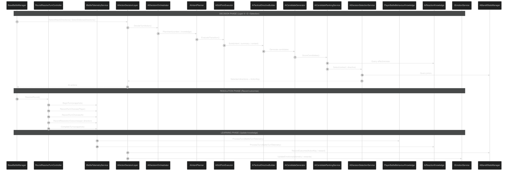

# AI Architecture Overview

Relevant source files

- [CarnageClub/.aiassistant/rules/AI_INSTRUCTIONS.md](https://github.com/Wolfs0ng/CarnageClub/blob/0021fcdc/CarnageClub/.aiassistant/rules/AI_INSTRUCTIONS.md)
- [CarnageClub/.aiassistant/rules/context/AI_SYSTEMS.md](https://github.com/Wolfs0ng/CarnageClub/blob/0021fcdc/CarnageClub/.aiassistant/rules/context/AI_SYSTEMS.md)
- [CarnageClub/.aiassistant/rules/context/ARCHITECTURE.md](https://github.com/Wolfs0ng/CarnageClub/blob/0021fcdc/CarnageClub/.aiassistant/rules/context/ARCHITECTURE.md)
- [CarnageClub/.aiassistant/rules/context/CODING_STANDARDS.md](https://github.com/Wolfs0ng/CarnageClub/blob/0021fcdc/CarnageClub/.aiassistant/rules/context/CODING_STANDARDS.md)
- [CarnageClub/.aiassistant/rules/context/CONTEXT_INDEX.md](https://github.com/Wolfs0ng/CarnageClub/blob/0021fcdc/CarnageClub/.aiassistant/rules/context/CONTEXT_INDEX.md)
- [CarnageClub/.aiassistant/rules/context/GAMEPLAY_RULES.md](https://github.com/Wolfs0ng/CarnageClub/blob/0021fcdc/CarnageClub/.aiassistant/rules/context/GAMEPLAY_RULES.md)
- [CarnageClub/.aiassistant/rules/context/PROJECT_OVERVIEW.md](https://github.com/Wolfs0ng/CarnageClub/blob/0021fcdc/CarnageClub/.aiassistant/rules/context/PROJECT_OVERVIEW.md)
- [CarnageClub/.aiassistant/rules/context/TELEMETRY.md](https://github.com/Wolfs0ng/CarnageClub/blob/0021fcdc/CarnageClub/.aiassistant/rules/context/TELEMETRY.md)
- [Carnage_Club_AI_Architecture_EN.md](https://github.com/Wolfs0ng/CarnageClub/blob/0021fcdc/Carnage_Club_AI_Architecture_EN.md)
- [Carnage_Club_AI_Architecture_UA.md](https://github.com/Wolfs0ng/CarnageClub/blob/0021fcdc/Carnage_Club_AI_Architecture_UA.md)
- [Diagrams/0_Runtime Sequence.md](https://github.com/Wolfs0ng/CarnageClub/blob/0021fcdc/Diagrams/0_Runtime Sequence.md)
- [Diagrams/10_Emotion_System.md](https://github.com/Wolfs0ng/CarnageClub/blob/0021fcdc/Diagrams/10_Emotion_System.md)
- [Diagrams/1_Telemetry_Data_Model.md](https://github.com/Wolfs0ng/CarnageClub/blob/0021fcdc/Diagrams/1_Telemetry_Data_Model.md)
- [Diagrams/2_Knowledge_1.md](https://github.com/Wolfs0ng/CarnageClub/blob/0021fcdc/Diagrams/2_Knowledge_1.md)
- [Diagrams/3_Knowledge_2.md](https://github.com/Wolfs0ng/CarnageClub/blob/0021fcdc/Diagrams/3_Knowledge_2.md)
- [Diagrams/4_Decision.md](https://github.com/Wolfs0ng/CarnageClub/blob/0021fcdc/Diagrams/4_Decision.md)

## Purpose & Scope

This page introduces the 5-layer AI architecture that powers enemy behavior in Carnage Club. It covers the overall design philosophy, layer responsibilities, data flow principles, and how the AI integrates with the battle system. For detailed documentation of individual layers, see:

- [#3.2](#3.2)Layer 0: Telemetry System ( )
- [#3.3](#3.3)Layers 1-2: Knowledge Systems ( )
- [#3.4](#3.4)Layer 3: Tactical Decision System ( )
- [#3.5](#3.5)Layer 4: Strategic Intent & Planning ( )
- [#3.6](#3.6)Layer 5: Emotion System ( )

For testing and debugging AI systems, see [#9.2](#9.2) . For extending the AI system, see [#9.4](#9.4) .

## Design Philosophy

The AI system prioritizes explainability over black-box machine learning . Every decision must be traceable through a clear chain of reasoning. This approach provides:

The architecture enforces unidirectional data flow : telemetry never consumes knowledge, knowledge never makes decisions, decisions never modify telemetry. This prevents circular dependencies and ensures every layer has a single, clear purpose.

Sources:

- [CarnageClub/.aiassistant/rules/AI_INSTRUCTIONS.md#1-157](https://github.com/Wolfs0ng/CarnageClub/blob/0021fcdc/CarnageClub/.aiassistant/rules/AI_INSTRUCTIONS.md#L1-L157)
- [CarnageClub/.aiassistant/rules/context/AI_SYSTEMS.md#1-33](https://github.com/Wolfs0ng/CarnageClub/blob/0021fcdc/CarnageClub/.aiassistant/rules/context/AI_SYSTEMS.md#L1-L33)
- [Carnage_Club_AI_Architecture_EN.md#1-367](https://github.com/Wolfs0ng/CarnageClub/blob/0021fcdc/Carnage_Club_AI_Architecture_EN.md#L1-L367)

## Five-Layer Architecture

The AI system is organized into five distinct layers, each with a specific responsibility. Data flows downward during decision-making and upward during learning.

### Architecture Diagram: Layer Responsibilities

Sources:

- [Diagrams/0_Runtime Sequence.md#1-51](https://github.com/Wolfs0ng/CarnageClub/blob/0021fcdc/Diagrams/0_Runtime Sequence.md#L1-L51)
- [Carnage_Club_AI_Architecture_EN.md#14-20](https://github.com/Wolfs0ng/CarnageClub/blob/0021fcdc/Carnage_Club_AI_Architecture_EN.md#L14-L20)
- [CarnageClub/.aiassistant/rules/context/AI_SYSTEMS.md#19-26](https://github.com/Wolfs0ng/CarnageClub/blob/0021fcdc/CarnageClub/.aiassistant/rules/context/AI_SYSTEMS.md#L19-L26)

### Layer Responsibilities Summary

Sources:

- [Carnage_Club_AI_Architecture_EN.md#327-340](https://github.com/Wolfs0ng/CarnageClub/blob/0021fcdc/Carnage_Club_AI_Architecture_EN.md#L327-L340)
- [Diagrams/1_Telemetry_Data_Model.md#1-50](https://github.com/Wolfs0ng/CarnageClub/blob/0021fcdc/Diagrams/1_Telemetry_Data_Model.md#L1-L50)
- [Diagrams/2_Knowledge_1.md#1-25](https://github.com/Wolfs0ng/CarnageClub/blob/0021fcdc/Diagrams/2_Knowledge_1.md#L1-L25)
- [Diagrams/3_Knowledge_2.md#1-31](https://github.com/Wolfs0ng/CarnageClub/blob/0021fcdc/Diagrams/3_Knowledge_2.md#L1-L31)
- [Diagrams/4_Decision.md#1-58](https://github.com/Wolfs0ng/CarnageClub/blob/0021fcdc/Diagrams/4_Decision.md#L1-L58)

## Data Flow Principles

The AI architecture enforces strict unidirectional data flow to prevent circular dependencies and maintain debuggability.

### Data Flow Rules

### Data Flow Diagram: One Battle Turn

Sources:

- [Diagrams/0_Runtime Sequence.md#1-51](https://github.com/Wolfs0ng/CarnageClub/blob/0021fcdc/Diagrams/0_Runtime Sequence.md#L1-L51)
- [CarnageClub/.aiassistant/rules/context/TELEMETRY.md#1-28](https://github.com/Wolfs0ng/CarnageClub/blob/0021fcdc/CarnageClub/.aiassistant/rules/context/TELEMETRY.md#L1-L28)
- [Carnage_Club_AI_Architecture_EN.md#52-72](https://github.com/Wolfs0ng/CarnageClub/blob/0021fcdc/Carnage_Club_AI_Architecture_EN.md#L52-L72)

### Data Flow Invariants

These invariants are enforced throughout the codebase:

- Telemetry writes are append-only— No retroactive modification of recorded data
- Knowledge updates are atomic`ProcessTurn()`— Each call is self-contained
- Direction normalization happens once`TelemetryDirections.NormalizeToList()`— Lists are sorted and de-duplicated early via
- Snapshots are immutable`BattleTurnTelemetry`— Before/after states in are read-only
- Emotion state resets per battle— No carry-over between battles, only knowledge persists

Sources:

- [Carnage_Club_AI_Architecture_EN.md#74-125](https://github.com/Wolfs0ng/CarnageClub/blob/0021fcdc/Carnage_Club_AI_Architecture_EN.md#L74-L125)
- [CarnageClub/.aiassistant/rules/context/ARCHITECTURE.md#26-35](https://github.com/Wolfs0ng/CarnageClub/blob/0021fcdc/CarnageClub/.aiassistant/rules/context/ARCHITECTURE.md#L26-L35)

## Core Components Map

This section bridges natural language concepts to concrete code entities. Use these class names to navigate the codebase.

### Component Ownership Table

Sources:

- [Diagrams/4_Decision.md#1-58](https://github.com/Wolfs0ng/CarnageClub/blob/0021fcdc/Diagrams/4_Decision.md#L1-L58)
- [Diagrams/10_Emotion_System.md#1-32](https://github.com/Wolfs0ng/CarnageClub/blob/0021fcdc/Diagrams/10_Emotion_System.md#L1-L32)
- [Carnage_Club_AI_Architecture_EN.md#86-93](https://github.com/Wolfs0ng/CarnageClub/blob/0021fcdc/Carnage_Club_AI_Architecture_EN.md#L86-L93)

### Service Registration and Lifecycle

All AI services are registered via the Service Locator pattern during application startup. The registration happens in the `AppStartup` phase (see [#2.1](#2.1) for details on service registration).

Key lifecycle points:

Sources:

- [CarnageClub/.aiassistant/rules/context/ARCHITECTURE.md#1-44](https://github.com/Wolfs0ng/CarnageClub/blob/0021fcdc/CarnageClub/.aiassistant/rules/context/ARCHITECTURE.md#L1-L44)
- [Diagrams/0_Runtime Sequence.md#26-27](https://github.com/Wolfs0ng/CarnageClub/blob/0021fcdc/Diagrams/0_Runtime Sequence.md#L26-L27)

## Integration with Battle System

The AI system integrates with the battle runtime through well-defined interfaces. The battle system provides combat context and records outcomes; the AI system provides action decisions.

### Integration Points Diagram

Sources:

- [Diagrams/0_Runtime Sequence.md#1-51](https://github.com/Wolfs0ng/CarnageClub/blob/0021fcdc/Diagrams/0_Runtime Sequence.md#L1-L51)
- [Carnage_Club_AI_Architecture_EN.md#52-72](https://github.com/Wolfs0ng/CarnageClub/blob/0021fcdc/Carnage_Club_AI_Architecture_EN.md#L52-L72)

### Interface Contracts

The battle system and AI system communicate through these interfaces:

Battle → AI:

- `AiActionDecisionLayer.SelectAttackDirections(combatState, turnIndex)``List<int>`— Returns of attack directions
- `AiActionDecisionLayer.SelectDefenseDirections(combatState, turnIndex)``List<int>`— Returns of defense directions

Battle → Telemetry:

- `IBattleTelemetryService.BeginTurn(roundIndex, playerState, aiState)`— Captures before-snapshots
- `IBattleTelemetryService.RecordTurnChoices(actor, attackDirs, defendDirs)`— Records player/AI actions
- `IBattleTelemetryService.RecordResolutionOutcomes(roundIndex, attackerActor, results)`— Records per-direction outcomes
- `IBattleTelemetryService.CompleteTurn(roundIndex, playerState, aiState)`— Finalizes turn with after-snapshots

Telemetry → Knowledge:

- `PlayerBattleBehaviourKnowledge.ProcessTurn(BattleTurnTelemetry)`— Updates player pattern models
- `AiReactionKnowledge.ProcessTurn(BattleTurnTelemetry)`— Updates action-reaction matrices

Sources:

- [Carnage_Club_AI_Architecture_EN.md#95-125](https://github.com/Wolfs0ng/CarnageClub/blob/0021fcdc/Carnage_Club_AI_Architecture_EN.md#L95-L125)
- [Diagrams/1_Telemetry_Data_Model.md#1-50](https://github.com/Wolfs0ng/CarnageClub/blob/0021fcdc/Diagrams/1_Telemetry_Data_Model.md#L1-L50)

## Persistence Strategy

The AI system implements selective persistence to support the core concept "The world remembers your habits" while maintaining battle-to-battle variety.

### Persistence Rules

### Save/Load Integration

Knowledge systems integrate with the save system (see [#4.3](#4.3) ) through the `GameStateManager` :

Example: When a player defeats an enemy and saves at a BoneFire, the AI's learned patterns about that player persist. On the next session, enemies immediately recognize those patterns.

Sources:

- [Carnage_Club_AI_Architecture_EN.md#327-341](https://github.com/Wolfs0ng/CarnageClub/blob/0021fcdc/Carnage_Club_AI_Architecture_EN.md#L327-L341)
- [Diagrams/2_Knowledge_1.md#24-25](https://github.com/Wolfs0ng/CarnageClub/blob/0021fcdc/Diagrams/2_Knowledge_1.md#L24-L25)
- [Diagrams/3_Knowledge_2.md#29-31](https://github.com/Wolfs0ng/CarnageClub/blob/0021fcdc/Diagrams/3_Knowledge_2.md#L29-L31)

## Observability & Debugging

The AI architecture is designed for complete observability . Every decision is traceable through a clear chain of reasoning.

### Debug Chain

To understand why the AI made a specific decision, follow this chain:

### Observability Guarantees

Each layer provides inspection methods:

- `IBattleTelemetryService.GetTurnsSnapshot()`— Returns all recorded turns
- `PlayerBattleBehaviourKnowledge.GetDirectionFrequency()`— Inspects learned patterns
- `AiReactionKnowledge.GetOffenseCell()/GetDefenseCell()`— Inspects effectiveness matrices
- `IEmotionService.GetCurrentState()`— Returns emotion values [0..1]
- `TelemetryPrettyPrinter`Pretty-printers available: for human-readable telemetry logs

For detailed testing and debugging procedures, see [#9.2](#9.2) .

Sources:

- [Carnage_Club_AI_Architecture_EN.md#342-354](https://github.com/Wolfs0ng/CarnageClub/blob/0021fcdc/Carnage_Club_AI_Architecture_EN.md#L342-L354)
- [CarnageClub/.aiassistant/rules/context/AI_SYSTEMS.md#26-32](https://github.com/Wolfs0ng/CarnageClub/blob/0021fcdc/CarnageClub/.aiassistant/rules/context/AI_SYSTEMS.md#L26-L32)
- [Carnage_Club_AI_Architecture_EN.md#86-93](https://github.com/Wolfs0ng/CarnageClub/blob/0021fcdc/Carnage_Club_AI_Architecture_EN.md#L86-L93)

## Summary

The AI system achieves adaptive, explainable enemy behavior through a strict 5-layer architecture:

- Layer 0records what happened (telemetry)
- Layers 1-2learn what works (knowledge)
- Layer 3picks concrete actions (tactical decisions)
- Layer 4decides how to fight (strategic intent)
- Layer 5biases decisions emotionally (psychological momentum)

Data flows unidirectionally, knowledge persists across sessions, and every decision is traceable. This design enables solo-developer maintainability while providing deep, adaptive AI behavior without black-box machine learning.

For implementation details of each layer, see pages [#3.2](#3.2) through [#3.6](#3.6) .

Sources:

- [Carnage_Club_AI_Architecture_EN.md#1-367](https://github.com/Wolfs0ng/CarnageClub/blob/0021fcdc/Carnage_Club_AI_Architecture_EN.md#L1-L367)
- [CarnageClub/.aiassistant/rules/AI_INSTRUCTIONS.md#1-157](https://github.com/Wolfs0ng/CarnageClub/blob/0021fcdc/CarnageClub/.aiassistant/rules/AI_INSTRUCTIONS.md#L1-L157)
- [CarnageClub/.aiassistant/rules/context/AI_SYSTEMS.md#1-33](https://github.com/Wolfs0ng/CarnageClub/blob/0021fcdc/CarnageClub/.aiassistant/rules/context/AI_SYSTEMS.md#L1-L33)