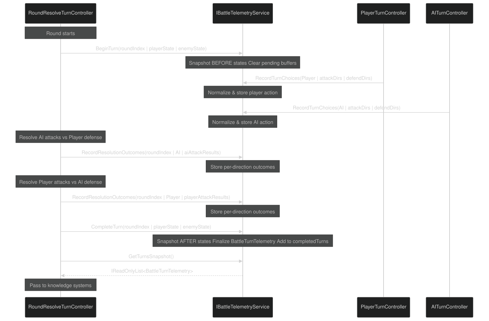

# Layer 0: Telemetry System

<details>
<summary>Relevant source files</summary>


- [CarnageClub/Assets/Scenes/Battle.unity](https://github.com/Wolfs0ng/CarnageClub/blob/0021fcdc/CarnageClub/Assets/Scenes/Battle.unity)
- [CarnageClub/Assets/Scripts/Battle/Turns/Controllers/RoundResolveTurnController.cs](https://github.com/Wolfs0ng/CarnageClub/blob/0021fcdc/CarnageClub/Assets/Scripts/Battle/Turns/Controllers/RoundResolveTurnController.cs)
- [CarnageClub/Assets/Scripts/Battle/Turns/RoundResolveTurn.cs](https://github.com/Wolfs0ng/CarnageClub/blob/0021fcdc/CarnageClub/Assets/Scripts/Battle/Turns/RoundResolveTurn.cs)
- [Carnage_Club_AI_Architecture_EN.md](https://github.com/Wolfs0ng/CarnageClub/blob/0021fcdc/Carnage_Club_AI_Architecture_EN.md)
- [Carnage_Club_AI_Architecture_UA.md](https://github.com/Wolfs0ng/CarnageClub/blob/0021fcdc/Carnage_Club_AI_Architecture_UA.md)
- [Diagrams/0_Runtime Sequence.md](https://github.com/Wolfs0ng/CarnageClub/blob/0021fcdc/Diagrams/0_Runtime Sequence.md)
- [Diagrams/10_Emotion_System.md](https://github.com/Wolfs0ng/CarnageClub/blob/0021fcdc/Diagrams/10_Emotion_System.md)
- [Diagrams/1_Telemetry_Data_Model.md](https://github.com/Wolfs0ng/CarnageClub/blob/0021fcdc/Diagrams/1_Telemetry_Data_Model.md)
- [Diagrams/2_Knowledge_1.md](https://github.com/Wolfs0ng/CarnageClub/blob/0021fcdc/Diagrams/2_Knowledge_1.md)
- [Diagrams/3_Knowledge_2.md](https://github.com/Wolfs0ng/CarnageClub/blob/0021fcdc/Diagrams/3_Knowledge_2.md)
- [Diagrams/4_Decision.md](https://github.com/Wolfs0ng/CarnageClub/blob/0021fcdc/Diagrams/4_Decision.md)


</details>

## Purpose and Scope

The Telemetry System is the foundational layer of the AI architecture, serving as the single source of truth for all combat events. It records what happened during each battle turn—player actions, AI actions, resolution outcomes, and character state snapshots—without making any decisions or interpretations.

This page documents the telemetry infrastructure: data models, service contracts, lifecycle management, and integration points with the battle system. For how this data is consumed and interpreted, see [Layers 1-2: Knowledge Systems](#3.3) . For the broader AI architecture context, see [AI Architecture Overview](#3.1) .

Key principle : Telemetry is purely observational. It captures facts, not decisions.

## Why Telemetry Exists

The telemetry layer solves three critical problems:

Without telemetry:

- Knowledge systems would rely on partial or inconsistent data
- AI behavior becomes a "black box" that cannot be explained
- Debugging requires guesswork instead of evidence
- No foundation for post-battle analysis or tuning


Sources: [Carnage_Club_AI_Architecture_EN.md #73-84](https://github.com/Wolfs0ng/CarnageClub/blob/0021fcdc/Carnage_Club_AI_Architecture_EN.md#L73-L84)  [Diagrams/1_Telemetry_Data_Model.md #1-50](https://github.com/Wolfs0ng/CarnageClub/blob/0021fcdc/Diagrams/1_Telemetry_Data_Model.md#L1-L50)

## Core Architecture

### Separation of Concerns



Critical Design Rule : Telemetry never consumes knowledge or makes decisions. Data flows unidirectionally from telemetry to knowledge, never backward.

Sources: [Carnage_Club_AI_Architecture_EN.md #53-71](https://github.com/Wolfs0ng/CarnageClub/blob/0021fcdc/Carnage_Club_AI_Architecture_EN.md#L53-L71)  [CarnageClub/Assets/Scripts/Battle/Turns/Controllers/RoundResolveTurnController.cs #79-128](https://github.com/Wolfs0ng/CarnageClub/blob/0021fcdc/CarnageClub/Assets/Scripts/Battle/Turns/Controllers/RoundResolveTurnController.cs#L79-L128)

## Data Model

### BattleTurnTelemetry Structure



### Direction Encoding

Example : Defending directions [1, 3] → mask = 0b1010 = 10

Sources: [Diagrams/1_Telemetry_Data_Model.md #1-50](https://github.com/Wolfs0ng/CarnageClub/blob/0021fcdc/Diagrams/1_Telemetry_Data_Model.md#L1-L50)  [Carnage_Club_AI_Architecture_EN.md #24-35](https://github.com/Wolfs0ng/CarnageClub/blob/0021fcdc/Carnage_Club_AI_Architecture_EN.md#L24-L35)

## Service Contract

### IBattleTelemetryService Interface



### Method Responsibilities

Sources: [Diagrams/1_Telemetry_Data_Model.md #5-11](https://github.com/Wolfs0ng/CarnageClub/blob/0021fcdc/Diagrams/1_Telemetry_Data_Model.md#L5-L11)  [Carnage_Club_AI_Architecture_EN.md #96-120](https://github.com/Wolfs0ng/CarnageClub/blob/0021fcdc/Carnage_Club_AI_Architecture_EN.md#L96-L120)

## Turn Lifecycle

### Canonical Execution Order



Sources: [CarnageClub/Assets/Scripts/Battle/Turns/Controllers/RoundResolveTurnController.cs #79-128](https://github.com/Wolfs0ng/CarnageClub/blob/0021fcdc/CarnageClub/Assets/Scripts/Battle/Turns/Controllers/RoundResolveTurnController.cs#L79-L128)  [Carnage_Club_AI_Architecture_EN.md #96-120](https://github.com/Wolfs0ng/CarnageClub/blob/0021fcdc/Carnage_Club_AI_Architecture_EN.md#L96-L120)  [Diagrams/0_Runtime Sequence.md #1-51](https://github.com/Wolfs0ng/CarnageClub/blob/0021fcdc/Diagrams/0_Runtime Sequence.md#L1-L51)

## Integration with Battle System

### RoundResolveTurnController Integration

[CarnageClub/Assets/Scripts/Battle/Turns/Controllers/RoundResolveTurnController.cs #79-128](https://github.com/Wolfs0ng/CarnageClub/blob/0021fcdc/CarnageClub/Assets/Scripts/Battle/Turns/Controllers/RoundResolveTurnController.cs#L79-L128)

```block
public UniTask RoundResolve(){    // 1. Begin turn - capture before-snapshots    telemetryService.BeginTurn(roundIndex, battleStateManager.PlayerState, battleStateManager.EnemyState);        // 2. Resolve attacks (uses data from RecordTurnChoices called earlier)    List<AttackResolutionResult> aiAttackResults = ResolveAttacks(...);    List<AttackResolutionResult> playerAttackResults = ResolveAttacks(...);        // 3. Pre-apply reactive perks (can modify results)    ProcessPreApplyReactivePerks(...);        // 4. Record outcomes to telemetry    telemetryService.RecordResolutionOutcomes(roundIndex, BattleActor.AI, aiAttackResults);    telemetryService.RecordResolutionOutcomes(roundIndex, BattleActor.Player, playerAttackResults);        // 5. Apply damage    attackApplierHelper.ApplyAttacks(...);        // 6. Post-apply reactive perks    ProcessPostApplyReactivePerks(...);        // 7. Complete turn - capture after-snapshots    telemetryService.CompleteTurn(roundIndex, battleStateManager.PlayerState, battleStateManager.EnemyState);        // 8. Notify AI orchestrator (knowledge update happens here)    IReadOnlyList<BattleTurnTelemetry> turnsSnapshot = telemetryService.GetTurnsSnapshot();    BattleTurnTelemetry lastTurn = turnsSnapshot[^1];    aiOrchestrator.OnTurnResolved(roundIndex, lastTurn);        return UniTask.WaitForSeconds(.5f);}
```

### Key Integration Points

Sources: [CarnageClub/Assets/Scripts/Battle/Turns/Controllers/RoundResolveTurnController.cs #1-289](https://github.com/Wolfs0ng/CarnageClub/blob/0021fcdc/CarnageClub/Assets/Scripts/Battle/Turns/Controllers/RoundResolveTurnController.cs#L1-L289)

## Normalization and Utilities

### TelemetryDirections Normalization

Direction lists must be normalized to prevent duplicate pattern detection in knowledge systems.

Normalization Rules :

Example :

- Input: [3, 1, 1, 2]
- Output: [1, 2, 3]


Implementation: `TelemetryDirections.NormalizeToList(IReadOnlyList<BattleDirection> dirs)`

### BattleStateSnapshotBuilder

Captures character state at a specific moment:

```block
TelemetryStatsSnapshot snapshot = BattleStateSnapshotBuilder.FromCharacterState(characterState);
```

Captured fields:

- `Hp`(current health)
- `GuardStance`(current guard/stamina)


Why snapshots matter : Knowledge systems need before/after deltas to calculate effectiveness and reward values.

Sources: [Carnage_Club_AI_Architecture_EN.md #47-50](https://github.com/Wolfs0ng/CarnageClub/blob/0021fcdc/Carnage_Club_AI_Architecture_EN.md#L47-L50)  [Carnage_Club_AI_Architecture_EN.md #90-92](https://github.com/Wolfs0ng/CarnageClub/blob/0021fcdc/Carnage_Club_AI_Architecture_EN.md#L90-L92)

## Debugging and Observability

### TelemetryPrettyPrinter

Generates human-readable logs of telemetry data for debugging.

Usage Context :

- Post-battle analysis
- AI behavior investigation
- Knowledge system validation
- Turn-by-turn replay


### GetTurnsSnapshot() Access Pattern

```block
IReadOnlyList<BattleTurnTelemetry> turnsSnapshot = telemetryService.GetTurnsSnapshot();BattleTurnTelemetry lastTurn = turnsSnapshot[^1];Debug.LogError($"Last turn snapshot: {lastTurn}");
```

Immutability Guarantee : `GetTurnsSnapshot()` returns a read-only view. Telemetry records cannot be modified after `CompleteTurn()` .

### Debug Checklist

When investigating AI behavior:

Sources: [Carnage_Club_AI_Architecture_EN.md #92-93](https://github.com/Wolfs0ng/CarnageClub/blob/0021fcdc/Carnage_Club_AI_Architecture_EN.md#L92-L93)  [Carnage_Club_AI_Architecture_EN.md #344-353](https://github.com/Wolfs0ng/CarnageClub/blob/0021fcdc/Carnage_Club_AI_Architecture_EN.md#L344-L353)  [CarnageClub/Assets/Scripts/Battle/Turns/Controllers/RoundResolveTurnController.cs #115-116](https://github.com/Wolfs0ng/CarnageClub/blob/0021fcdc/CarnageClub/Assets/Scripts/Battle/Turns/Controllers/RoundResolveTurnController.cs#L115-L116)

## Hot Path Performance

### Allocation Discipline

Telemetry runs every turn and must avoid allocations:

### BeginTurn() Buffer Management

```block
public void BeginTurn(...){    // Clear pending buffers (reuse allocated memory)    pendingPlayerAction = null;    pendingAiAction = null;    pendingOutcomes.Clear(); // List reuse, not reallocate        // Capture snapshots    currentTurn = new BattleTurnTelemetry { ... };}
```

Why this matters : Mobile platforms have limited CPU and memory budgets. Excessive allocations trigger garbage collection pauses, causing frame drops during combat.

Sources: [Carnage_Club_AI_Architecture_EN.md #12](https://github.com/Wolfs0ng/CarnageClub/blob/0021fcdc/Carnage_Club_AI_Architecture_EN.md#L12-L12)  [Carnage_Club_AI_Architecture_EN.md #45-50](https://github.com/Wolfs0ng/CarnageClub/blob/0021fcdc/Carnage_Club_AI_Architecture_EN.md#L45-L50)

## Persistence Rules

### What Persists

### Lifecycle Boundaries

- Battle Start: Telemetry buffer is empty
- During Battle`completedTurns`: Telemetry accumulates in list
- Battle End: Telemetry is discarded; knowledge persists


Design Rationale : Telemetry is too granular to save (high storage cost, low value). Only aggregated knowledge (patterns, statistics) persists across sessions.

Sources: [Carnage_Club_AI_Architecture_EN.md #327-342](https://github.com/Wolfs0ng/CarnageClub/blob/0021fcdc/Carnage_Club_AI_Architecture_EN.md#L327-L342)

## Summary

The Telemetry System provides:

- ✓ Complete, factual record of each battle turn
- ✓ Structured data for knowledge systems
- ✓ Debugging foundation for AI behavior
- ✓ Performance-conscious implementation
- ✓ Unidirectional data flow (telemetry → knowledge, never backward)


Next Steps : See [Layers 1-2: Knowledge Systems](#3.3) for how telemetry data is consumed and transformed into persistent learning.