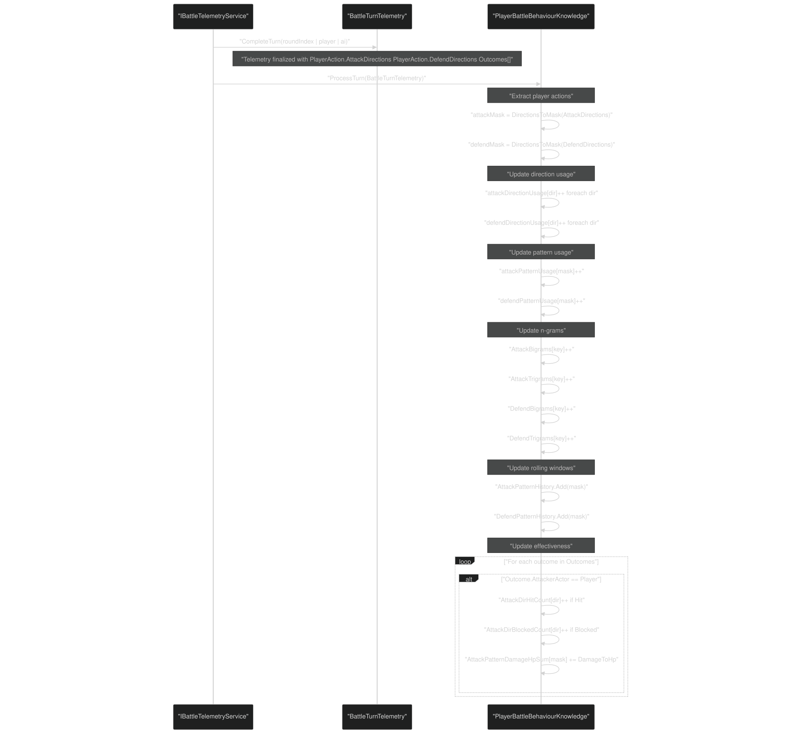
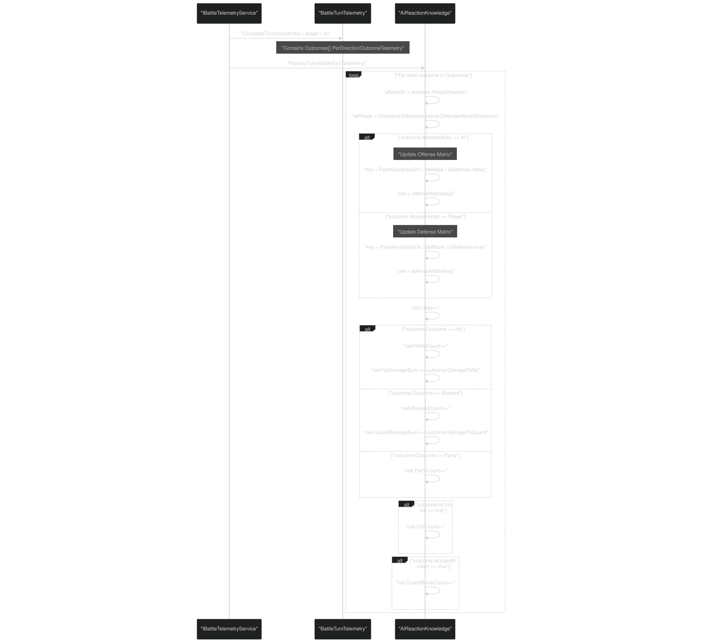

# Layers 1-2: Knowledge Systems

<details>
<summary>Relevant source files</summary>


- [CarnageClub/Assets/GameResources/ScriptableObjects/BaseGameData/MapLevels/Level_1_MapData.asset](https://github.com/Wolfs0ng/CarnageClub/blob/0021fcdc/CarnageClub/Assets/GameResources/ScriptableObjects/BaseGameData/MapLevels/Level_1_MapData.asset)
- [CarnageClub/Assets/Scenes/AppStart.unity](https://github.com/Wolfs0ng/CarnageClub/blob/0021fcdc/CarnageClub/Assets/Scenes/AppStart.unity)
- [CarnageClub/Assets/Scripts/Core/AppStartup.cs](https://github.com/Wolfs0ng/CarnageClub/blob/0021fcdc/CarnageClub/Assets/Scripts/Core/AppStartup.cs)
- [CarnageClub/Assets/Scripts/Core/GameStateManager.cs](https://github.com/Wolfs0ng/CarnageClub/blob/0021fcdc/CarnageClub/Assets/Scripts/Core/GameStateManager.cs)
- [CarnageClub/SaveData.json](https://github.com/Wolfs0ng/CarnageClub/blob/0021fcdc/CarnageClub/SaveData.json)
- [Carnage_Club_AI_Architecture_EN.md](https://github.com/Wolfs0ng/CarnageClub/blob/0021fcdc/Carnage_Club_AI_Architecture_EN.md)
- [Carnage_Club_AI_Architecture_UA.md](https://github.com/Wolfs0ng/CarnageClub/blob/0021fcdc/Carnage_Club_AI_Architecture_UA.md)
- [Diagrams/0_Runtime Sequence.md](https://github.com/Wolfs0ng/CarnageClub/blob/0021fcdc/Diagrams/0_Runtime Sequence.md)
- [Diagrams/10_Emotion_System.md](https://github.com/Wolfs0ng/CarnageClub/blob/0021fcdc/Diagrams/10_Emotion_System.md)
- [Diagrams/1_Telemetry_Data_Model.md](https://github.com/Wolfs0ng/CarnageClub/blob/0021fcdc/Diagrams/1_Telemetry_Data_Model.md)
- [Diagrams/2_Knowledge_1.md](https://github.com/Wolfs0ng/CarnageClub/blob/0021fcdc/Diagrams/2_Knowledge_1.md)
- [Diagrams/3_Knowledge_2.md](https://github.com/Wolfs0ng/CarnageClub/blob/0021fcdc/Diagrams/3_Knowledge_2.md)
- [Diagrams/4_Decision.md](https://github.com/Wolfs0ng/CarnageClub/blob/0021fcdc/Diagrams/4_Decision.md)


</details>

## Purpose & Scope

This document details the persistent learning systems that form Layers 1-2 of the AI architecture: `PlayerBattleBehaviourKnowledge` and `AiReactionKnowledge` . These systems consume telemetry from Layer 0 ( [see Layer 0: Telemetry System](#3.2) ) and provide learned data to tactical decisions in Layer 3 ( [see Layer 3: Tactical Decision System](#3.4) ) and strategic intent in Layer 4 ( [see Layer 4: Strategic Intent & Planning](#3.5) ).

Key characteristics:

- Persistent: Saved to disk across sessions, implementing "The world remembers your habits"
- Read-only during combat: Updated after each turn, never modified mid-decision
- Deterministic: Same telemetry input produces same knowledge updates
- Cold-start safe: Provides meaningful defaults when no data exists


Sources:  [Carnage_Club_AI_Architecture_EN.md #1-367](https://github.com/Wolfs0ng/CarnageClub/blob/0021fcdc/Carnage_Club_AI_Architecture_EN.md#L1-L367)  [Diagrams/2_Knowledge_1.md #1-29](https://github.com/Wolfs0ng/CarnageClub/blob/0021fcdc/Diagrams/2_Knowledge_1.md#L1-L29)  [Diagrams/3_Knowledge_2.md #1-31](https://github.com/Wolfs0ng/CarnageClub/blob/0021fcdc/Diagrams/3_Knowledge_2.md#L1-L31)

## Architecture Overview



Diagram: Knowledge Systems Data Flow

The knowledge systems sit between telemetry (Layer 0) and decision-making (Layers 3-4). They consume `BattleTurnTelemetry` after each turn and provide summaries to strategic and tactical planners. Both systems implement save/restore through dedicated data DTOs.

Sources:  [Core/GameStateManager.cs #196-199](https://github.com/Wolfs0ng/CarnageClub/blob/0021fcdc/Core/GameStateManager.cs#L196-L199)  [Core/AppStartup.cs #170-182](https://github.com/Wolfs0ng/CarnageClub/blob/0021fcdc/Core/AppStartup.cs#L170-L182)  [Diagrams/0_Runtime Sequence.md #1-51](https://github.com/Wolfs0ng/CarnageClub/blob/0021fcdc/Diagrams/0_Runtime Sequence.md#L1-L51)

## Layer 1: PlayerBattleBehaviourKnowledge

### Purpose

`PlayerBattleBehaviourKnowledge` tracks what the player tends to do , not just what works. It models player habits, patterns, and tendencies over time, providing the AI with predictive information about likely player actions.

Used by:

- `KnowledgeSummaryProvider`- creates summary statistics
- `AiIntentPlanner`- informs intent selection based on player predictability
- `AiCandidateGenerator`- shapes candidate generation (future feature)


Sources:  [Carnage_Club_AI_Architecture_EN.md #127-154](https://github.com/Wolfs0ng/CarnageClub/blob/0021fcdc/Carnage_Club_AI_Architecture_EN.md#L127-L154)  [Diagrams/2_Knowledge_1.md #1-29](https://github.com/Wolfs0ng/CarnageClub/blob/0021fcdc/Diagrams/2_Knowledge_1.md#L1-L29)

### Data Structures



Diagram: PlayerBattleBehaviourKnowledge Structure

Key concepts:

Pattern encoding: Attack/defense choices with multiple directions are encoded as bitmasks:

- `[0,2]``0101``5`→ binary → decimal
- `[1,3]``1010``10`→ binary → decimal


Bigram/Trigram keys: N-grams are encoded as packed integers:

- `lastPattern | (currentPattern << 8)`Bigram:
- `a | (b << 8) | (c << 16)`Trigram:


Sources:  [SaveData.json #662-1018](https://github.com/Wolfs0ng/CarnageClub/blob/0021fcdc/SaveData.json#L662-L1018)  [Carnage_Club_AI_Architecture_EN.md #127-154](https://github.com/Wolfs0ng/CarnageClub/blob/0021fcdc/Carnage_Club_AI_Architecture_EN.md#L127-L154)

### Processing Telemetry



Diagram: Telemetry Processing Sequence

Processing steps:

Hot path considerations:

- already normalizedDirection lists are by telemetry (sorted, distinct)
- No LINQ or allocations during processing
- Dictionary lookups use cached keys when possible


Sources:  [Diagrams/2_Knowledge_1.md #1-29](https://github.com/Wolfs0ng/CarnageClub/blob/0021fcdc/Diagrams/2_Knowledge_1.md#L1-L29)  [Diagrams/0_Runtime Sequence.md #46-47](https://github.com/Wolfs0ng/CarnageClub/blob/0021fcdc/Diagrams/0_Runtime Sequence.md#L46-L47)

### Example Data

From an actual save file showing learned player behavior:

Sources:  [SaveData.json #662-1018](https://github.com/Wolfs0ng/CarnageClub/blob/0021fcdc/SaveData.json#L662-L1018)

## Layer 2: AiReactionKnowledge

### Purpose

`AiReactionKnowledge` learns what works against what through two 4×16 matrices:

- Offense Matrix: AI attack directions vs Player defense masks
- Defense Matrix: Player attack directions vs AI defense masks


This knowledge directly informs:

- `AiCandidateRankingService`- scores attack/defense candidates
- `AiOffenseEvaluator`- finds best attack against a defense mask
- `AiDefenseEvaluator`- finds best defense mask against an attack direction
- `AiIntentPlanner`- evaluates confidence in current knowledge


Sources:  [Carnage_Club_AI_Architecture_EN.md #155-175](https://github.com/Wolfs0ng/CarnageClub/blob/0021fcdc/Carnage_Club_AI_Architecture_EN.md#L155-L175)  [Diagrams/3_Knowledge_2.md #1-31](https://github.com/Wolfs0ng/CarnageClub/blob/0021fcdc/Diagrams/3_Knowledge_2.md#L1-L31)

### Matrix Structure



Diagram: AiReactionKnowledge Matrix Architecture

Matrix dimensions:

- Rows: Attack directions (0-3) → 4 rows
- Columns
- `0`Mask ("no defense") is excluded
- `1``2``15`Valid masks: (dir 0 only), (dir 1 only), ..., (all directions)

: Defense masks (1-15) → 16 columns


Total cells: 4 × 16 = 64 cells per matrix, 128 total

Sources:  [Carnage_Club_AI_Architecture_EN.md #155-175](https://github.com/Wolfs0ng/CarnageClub/blob/0021fcdc/Carnage_Club_AI_Architecture_EN.md#L155-L175)  [SaveData.json #1020-1364](https://github.com/Wolfs0ng/CarnageClub/blob/0021fcdc/SaveData.json#L1020-L1364)

### Cell Statistics

Each cell in the matrix tracks detailed outcome statistics:

Effectiveness scoring:

- Hit rate`HitHpCount / Uses`:
- Block rate`BlockedCount / Uses`:
- Average HP damage`HpDamageSum / Uses`:
- Average Guard pressure`GuardDamageSum / Uses`:


Sources:  [SaveData.json #1024-1364](https://github.com/Wolfs0ng/CarnageClub/blob/0021fcdc/SaveData.json#L1024-L1364)

### Processing Telemetry



Diagram: Reaction Knowledge Update Sequence

Processing logic:

Key packing format:

```block
key = attackDir | (defMask << 8) | (isDefense ? (1 << 12) : 0)
```

This ensures unique keys for all 128 cells across both matrices.

Sources:  [Diagrams/3_Knowledge_2.md #1-31](https://github.com/Wolfs0ng/CarnageClub/blob/0021fcdc/Diagrams/3_Knowledge_2.md#L1-L31)  [SaveData.json #1020-1364](https://github.com/Wolfs0ng/CarnageClub/blob/0021fcdc/SaveData.json#L1020-L1364)

### Example Data

From an actual save file showing learned reaction patterns:

Offense Matrix (AI Attack vs Player Defense):

Interpretation:

- Key 1536: AI attacking direction 0 against player defending [1,2] succeeds 100% (3/3 hits)
- Key 1280: AI attacking direction 0 against player defending [0,2] is blocked (defense covers attack)
- Key 2304: AI attacking direction 0 against player defending [0,3] succeeds 100% (defense doesn't cover attack)


Defense Matrix (Player Attack vs AI Defense):

Interpretation: When AI doesn't defend (mask 0), player attacks always hit.

Sources:  [SaveData.json #1020-1364](https://github.com/Wolfs0ng/CarnageClub/blob/0021fcdc/SaveData.json#L1020-L1364)

## Integration with Consumers

### KnowledgeSummaryProvider



Diagram: Knowledge Summary Creation

`KnowledgeSummaryProvider` aggregates both knowledge systems into a unified summary consumed by strategic layers. It calculates:

- Predictability: How consistent are player patterns?
- Effectiveness: What's actually working in combat?
- Confidence: How much data supports our knowledge?
- Trends: Is behavior changing recently?


Sources:  [Carnage_Club_AI_Architecture_EN.md #127-154](https://github.com/Wolfs0ng/CarnageClub/blob/0021fcdc/Carnage_Club_AI_Architecture_EN.md#L127-L154)  [Diagrams/0_Runtime Sequence.md #33](https://github.com/Wolfs0ng/CarnageClub/blob/0021fcdc/Diagrams/0_Runtime Sequence.md#L33-L33)

### AiCandidateRankingService



Diagram: Reaction Knowledge in Candidate Scoring

`AiCandidateRankingService` uses `AiReactionKnowledge` to:

Sources:  [Diagrams/4_Decision.md #1-58](https://github.com/Wolfs0ng/CarnageClub/blob/0021fcdc/Diagrams/4_Decision.md#L1-L58)  [Carnage_Club_AI_Architecture_EN.md #176-201](https://github.com/Wolfs0ng/CarnageClub/blob/0021fcdc/Carnage_Club_AI_Architecture_EN.md#L176-L201)

## Cold-Start Behavior

When no prior knowledge exists (new game or first encounter), both systems provide safe fallbacks:

### PlayerBattleBehaviourKnowledge

Fallback strategies:

- Uniform priors: Assume equal probability for all directions/patterns
- No pattern assumptions: Treat player as unpredictable until data accumulates
- Minimal confidence: Knowledge consumers receive low confidence scores
- Gradual learning: First few turns establish baseline, subsequent turns refine


Threshold for "sufficient data":

- Typically 10-20 turns before patterns become statistically meaningful
- N-grams require more data (20-30+ turns)


### AiReactionKnowledge

Fallback strategies:

- Empty cells`Uses == 0`: Cells with return neutral scores
- Expected values: Use combat mechanics defaults (e.g., 25% hit rate for uncovered directions)
- Exploration priority: Unpopulated cells get higher exploration weights
- Asymmetric learning: Offense matrix fills faster than defense (AI attacks more often)


Matrix coverage evolution:

- Turn 1-5: ~10-20% cells populated
- Turn 10-20: ~40-60% cells populated
- Turn 30+: ~70-90% cells populated (some combinations never occur)


Sources:  [Carnage_Club_AI_Architecture_EN.md #1-40](https://github.com/Wolfs0ng/CarnageClub/blob/0021fcdc/Carnage_Club_AI_Architecture_EN.md#L1-L40)

## Persistence & Save/Load

### Data Transfer Objects



Diagram: Knowledge Persistence Flow

Sources:  [Core/GameStateManager.cs #196-199](https://github.com/Wolfs0ng/CarnageClub/blob/0021fcdc/Core/GameStateManager.cs#L196-L199)  [SaveData.json #662-1364](https://github.com/Wolfs0ng/CarnageClub/blob/0021fcdc/SaveData.json#L662-L1364)

### Save Process

Triggered by:

- `GameStateManager.CaptureCurrentState()``ISaveGameRequestService`called from
- Typically at BoneFire/Store elements or level transitions


Process flow:

Data transformations:

- Internal dictionaries`Dictionary<string, int>`→ (Unity-serializable)
- Packed integer keys→ String keys for JSON compatibility
- Direction lists`List<int>`→ arrays


Sources:  [Core/GameStateManager.cs #130-142](https://github.com/Wolfs0ng/CarnageClub/blob/0021fcdc/Core/GameStateManager.cs#L130-L142)  [Core/GameStateManager.cs #196-199](https://github.com/Wolfs0ng/CarnageClub/blob/0021fcdc/Core/GameStateManager.cs#L196-L199)

### Load Process

Triggered by:

- `GameStateManager.Initialize(SaveData)`called from Main Menu "Load Game"


Process flow:

Data transformations (reverse):

- String keys → Parsed integers (bigram/trigram keys)
- `List<int>`→ Appended to rolling windows
- Dictionary entries → Rebuilt internal lookup tables


Validation:

- Check for data corruption (negative counts, invalid keys)
- Validate mask ranges (1-15 for defense masks)
- Ensure direction values are 0-3


Sources:  [Core/GameStateManager.cs #96-109](https://github.com/Wolfs0ng/CarnageClub/blob/0021fcdc/Core/GameStateManager.cs#L96-L109)  [Core/GameStateManager.cs #198-199](https://github.com/Wolfs0ng/CarnageClub/blob/0021fcdc/Core/GameStateManager.cs#L198-L199)

### Persistence Guarantees

Important: Emotion state ( [see Layer 5](#3.6) ) is NOT persisted. Only knowledge persists, implementing "The world remembers your habits, not your emotions."

Sources:  [Carnage_Club_AI_Architecture_EN.md #298-311](https://github.com/Wolfs0ng/CarnageClub/blob/0021fcdc/Carnage_Club_AI_Architecture_EN.md#L298-L311)  [SaveData.json #1-1364](https://github.com/Wolfs0ng/CarnageClub/blob/0021fcdc/SaveData.json#L1-L1364)

## Summary

Layers 1-2 provide the memory foundation for the AI system:

Data flow:

```block
Telemetry (Layer 0) → ProcessTurn() → Knowledge (Layers 1-2) → Consumers (Layers 3-4)                                              ↓                                        SaveData.json
```

Key design principles:

- Single source of truth: Telemetry is the only input
- Unidirectional flow: Knowledge never writes to telemetry
- Read-only during decisions: Updated after turn completes
- Persistent learning: "The world remembers your habits"


For how knowledge is consumed to make decisions, see:

- [Layer 3: Tactical Decision System](#3.4)- candidate ranking and selection
- [Layer 4: Strategic Intent & Planning](#3.5)- intent planning and directive building


Sources:  [Carnage_Club_AI_Architecture_EN.md #1-367](https://github.com/Wolfs0ng/CarnageClub/blob/0021fcdc/Carnage_Club_AI_Architecture_EN.md#L1-L367)  [Core/GameStateManager.cs #1-281](https://github.com/Wolfs0ng/CarnageClub/blob/0021fcdc/Core/GameStateManager.cs#L1-L281)  [Core/AppStartup.cs #166-196](https://github.com/Wolfs0ng/CarnageClub/blob/0021fcdc/Core/AppStartup.cs#L166-L196)