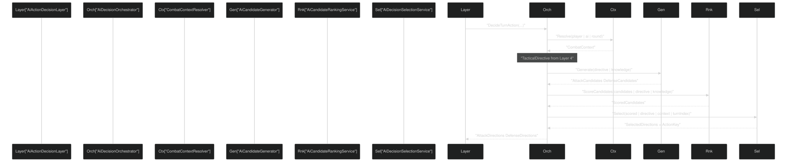
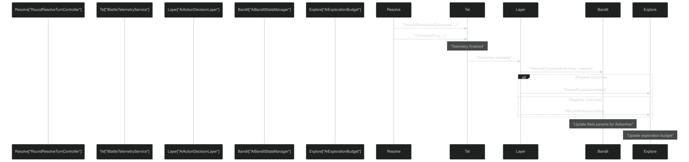

# Layer 3: Tactical Decision System

<details>
<summary>Relevant source files</summary>


- [Carnage_Club_AI_Architecture_EN.md](https://github.com/Wolfs0ng/CarnageClub/blob/0021fcdc/Carnage_Club_AI_Architecture_EN.md)
- [Carnage_Club_AI_Architecture_UA.md](https://github.com/Wolfs0ng/CarnageClub/blob/0021fcdc/Carnage_Club_AI_Architecture_UA.md)
- [Diagrams/0_Runtime Sequence.md](https://github.com/Wolfs0ng/CarnageClub/blob/0021fcdc/Diagrams/0_Runtime Sequence.md)
- [Diagrams/10_Emotion_System.md](https://github.com/Wolfs0ng/CarnageClub/blob/0021fcdc/Diagrams/10_Emotion_System.md)
- [Diagrams/1_Telemetry_Data_Model.md](https://github.com/Wolfs0ng/CarnageClub/blob/0021fcdc/Diagrams/1_Telemetry_Data_Model.md)
- [Diagrams/2_Knowledge_1.md](https://github.com/Wolfs0ng/CarnageClub/blob/0021fcdc/Diagrams/2_Knowledge_1.md)
- [Diagrams/3_Knowledge_2.md](https://github.com/Wolfs0ng/CarnageClub/blob/0021fcdc/Diagrams/3_Knowledge_2.md)
- [Diagrams/4_Decision.md](https://github.com/Wolfs0ng/CarnageClub/blob/0021fcdc/Diagrams/4_Decision.md)


</details>

## Purpose and Scope

Layer 3 is responsible for selecting concrete attack and defense directions for the current turn. Given a high-level strategy from Layer 4 (the `TacticalDirective` ), this layer generates candidate action combinations, scores them using learned knowledge, and selects the final actions through a balance of exploitation and exploration.

This layer does not:

- how[3.5](#3.5)Decide the AI wants to fight (that's Layer 4: Strategic Intent, see )
- [3.3](#3.3)Learn player patterns or action effectiveness (that's Layers 1-2: Knowledge Systems, see )
- [3.2](#3.2)Record combat outcomes (that's Layer 0: Telemetry, see )


This layer focuses exclusively on:

- Generating feasible action combinations
- Ranking them based on expected rewards and learned effectiveness
- Selecting actions that balance exploitation (using what works) with exploration (trying new things)


## Overview: The Three-Stage Pipeline

Layer 3 operates as a three-stage pipeline executed every turn:



Sources:  [Diagrams/4_Decision.md #1-58](https://github.com/Wolfs0ng/CarnageClub/blob/0021fcdc/Diagrams/4_Decision.md#L1-L58)  [Diagrams/0_Runtime Sequence.md #1-51](https://github.com/Wolfs0ng/CarnageClub/blob/0021fcdc/Diagrams/0_Runtime Sequence.md#L1-L51)

## Entry Point and Orchestration

### AiActionDecisionLayer

The entry point for Layer 3 is `AiActionDecisionLayer` , which exposes two methods:

These methods delegate to `AiDecisionOrchestrator.DecideTurnAction(...)` , which coordinates the three-stage pipeline.

Sources:  [Diagrams/4_Decision.md #6-8](https://github.com/Wolfs0ng/CarnageClub/blob/0021fcdc/Diagrams/4_Decision.md#L6-L8)  [Diagrams/0_Runtime Sequence.md #30-31](https://github.com/Wolfs0ng/CarnageClub/blob/0021fcdc/Diagrams/0_Runtime Sequence.md#L30-L31)

### AiDecisionOrchestrator

`AiDecisionOrchestrator` is the coordinator class that:



Sources:  [Diagrams/4_Decision.md #10-12](https://github.com/Wolfs0ng/CarnageClub/blob/0021fcdc/Diagrams/4_Decision.md#L10-L12)  [Diagrams/0_Runtime Sequence.md #32-40](https://github.com/Wolfs0ng/CarnageClub/blob/0021fcdc/Diagrams/0_Runtime Sequence.md#L32-L40)

## Stage 1: Candidate Generation

### AiCandidateGenerator

`AiCandidateGenerator` creates feasible action combinations based on:

- TacticalDirective parameters(attack weight, defense weight, preferred defense behavior)
- Player behavior patterns`PlayerBattleBehaviourKnowledge`(from )
- Combat context(available stamina, health thresholds)


The generator uses strategy pattern for extensibility:

### Candidate Filtering

Candidates are filtered by:



Example Candidate Structure:

Sources:  [Diagrams/4_Decision.md #19-24](https://github.com/Wolfs0ng/CarnageClub/blob/0021fcdc/Diagrams/4_Decision.md#L19-L24)  [Diagrams/0_Runtime Sequence.md #37](https://github.com/Wolfs0ng/CarnageClub/blob/0021fcdc/Diagrams/0_Runtime Sequence.md#L37-L37)

## Stage 2: Candidate Ranking

### AiCandidateRankingService

`AiCandidateRankingService` scores each candidate by computing expected reward. The service integrates:

### AiRewardCalculator

`AiRewardCalculator` uses `AiRewardTuningSO` (ScriptableObject) to define reward values for different outcomes:

The calculator computes expected reward by weighting each outcome by its learned probability from `AiReactionKnowledge` .

### Scoring Formula

```block
CandidateScore = BaseReward × DirectiveWeight × KnowledgeConfidence Where:- BaseReward = Σ(OutcomeProbability × OutcomeReward)- DirectiveWeight = AttackWeight (for attack) or DefenseWeight (for defense)- KnowledgeConfidence = 1.0 if sufficient data, lower if cold-start
```



Sources:  [Diagrams/4_Decision.md #25-30](https://github.com/Wolfs0ng/CarnageClub/blob/0021fcdc/Diagrams/4_Decision.md#L25-L30)  [Diagrams/3_Knowledge_2.md #1-31](https://github.com/Wolfs0ng/CarnageClub/blob/0021fcdc/Diagrams/3_Knowledge_2.md#L1-L31)

## Stage 3: Decision Selection

### AiDecisionSelectionService

`AiDecisionSelectionService` chooses the final action from scored candidates. The selection balances:

- Exploitation- Choose high-scoring actions (Thompson Sampling)
- Exploration- Try less-tested actions (Exploration Budget)


The service uses `ExplorationBias` from `TacticalDirective` to determine the exploration probability.

### Selection Decision Tree



Sources:  [Diagrams/4_Decision.md #31-36](https://github.com/Wolfs0ng/CarnageClub/blob/0021fcdc/Diagrams/4_Decision.md#L31-L36)  [Diagrams/0_Runtime Sequence.md #39-40](https://github.com/Wolfs0ng/CarnageClub/blob/0021fcdc/Diagrams/0_Runtime Sequence.md#L39-L40)

### AiThompsonSamplingSelector

Thompson Sampling is a Bayesian bandit algorithm that:

This provides optimistic exploration in early stages and exploitation of proven actions as data accumulates.



Properties:

- Automatically balances exploration/exploitation
- Actions with less data have higher variance (more exploration)
- Actions with proven success converge to high mean (exploitation)
- No hard-coded thresholds or decay schedules


Sources:  [Diagrams/4_Decision.md #33](https://github.com/Wolfs0ng/CarnageClub/blob/0021fcdc/Diagrams/4_Decision.md#L33-L33)  [Carnage_Club_AI_Architecture_EN.md #183-201](https://github.com/Wolfs0ng/CarnageClub/blob/0021fcdc/Carnage_Club_AI_Architecture_EN.md#L183-L201)

### AiExplorationBudget

`AiExplorationBudget` tracks contextual exploration - how often to try new things based on current situation:

The budget is depleted on exploration and regenerated on success , creating adaptive behavior:

- Successful exploration → more confidence → more exploration
- Failed exploration → less confidence → fall back to exploitation


Sources:  [Diagrams/4_Decision.md #34](https://github.com/Wolfs0ng/CarnageClub/blob/0021fcdc/Diagrams/4_Decision.md#L34-L34)  [Diagrams/0_Runtime Sequence.md #50](https://github.com/Wolfs0ng/CarnageClub/blob/0021fcdc/Diagrams/0_Runtime Sequence.md#L50-L50)

## The ActionKey System

### What is an ActionKey?

An `ActionKey` is a packed integer that uniquely identifies an attack-defense combination:

```block
ActionKey = PackedAttackDirs | (PackedDefenseMask << 16)
```

Example:

- Attack directions: [0, 2] → mask 5 (binary 0101)
- Defense mask: 10 (binary 1010)
- `5 | (10 << 16) = 655365`ActionKey:


### Why ActionKey Matters

The ActionKey enables:

### AiBanditStatsManager

`AiBanditStatsManager` maintains `BanditArmStats` for each ActionKey:



Update Flow:

Sources:  [Diagrams/4_Decision.md #35-36](https://github.com/Wolfs0ng/CarnageClub/blob/0021fcdc/Diagrams/4_Decision.md#L35-L36)  [Diagrams/0_Runtime Sequence.md #49](https://github.com/Wolfs0ng/CarnageClub/blob/0021fcdc/Diagrams/0_Runtime Sequence.md#L49-L49)

## Integration with Other Layers

### Input from Layer 4: TacticalDirective

Layer 4 (Strategic Intent) produces a `TacticalDirective` that parameterizes Layer 3:

These parameters shape:

- Candidate generation(number and types of candidates)
- Candidate ranking(relative scoring of offense vs defense)
- Decision selection(exploitation vs exploration balance)


Sources:  [Diagrams/4_Decision.md #14-17](https://github.com/Wolfs0ng/CarnageClub/blob/0021fcdc/Diagrams/4_Decision.md#L14-L17)  [Diagrams/0_Runtime Sequence.md #36](https://github.com/Wolfs0ng/CarnageClub/blob/0021fcdc/Diagrams/0_Runtime Sequence.md#L36-L36)

### Output to Battle Runtime

Layer 3 returns:

- `AttackDirections`(List)
- `DefenseDirections`(List)
- `ActionKey`(int) - for outcome tracking


These are passed to `RoundResolveTurnController` for combat resolution.

Sources:  [Diagrams/0_Runtime Sequence.md #40-41](https://github.com/Wolfs0ng/CarnageClub/blob/0021fcdc/Diagrams/0_Runtime Sequence.md#L40-L41)

### Feedback Loop: Bandit Stats

After combat resolution:



Sources:  [Diagrams/0_Runtime Sequence.md #42-50](https://github.com/Wolfs0ng/CarnageClub/blob/0021fcdc/Diagrams/0_Runtime Sequence.md#L42-L50)

## Decision Traceability

Every decision made by Layer 3 is fully explainable through:

### 1. Candidate Generation Log

For each turn, log:

- Number of attack candidates generated
- Number of defense candidates generated
- Filtering criteria applied (from directive)
- Whether player patterns influenced generation


### 2. Ranking Log

For each candidate, log:

- Base reward score (from AiRewardCalculator)
- Knowledge confidence modifier
- Directive weight modifier
- Final score


### 3. Selection Log

Log the selection decision:

- Was exploration triggered? (Yes/No)
- If exploration: Guided or Random?
- If exploitation: Thompson sample values for top 5 ActionKeys
- Selected ActionKey
- Selected directions


### 4. Outcome Tracking

After turn resolution:

- ActionKey used
- Actual reward received
- Bandit stats update (Alpha/Beta changes)
- Exploration budget change


Example Trace:

```block
[Turn 12] Layer 3: Tactical Decision├─ Generation: 45 attack candidates, 23 defense candidates│  └─ Filtered by AttackWeight=0.7, DefenseWeight=0.3├─ Ranking: Top scored│  ├─ Candidate A: BaseReward=8.2, Knowledge=0.9, Final=7.38│  ├─ Candidate B: BaseReward=7.5, Knowledge=0.8, Final=6.00│  └─ Candidate C: BaseReward=6.8, Knowledge=1.0, Final=6.80├─ Selection: Exploitation (ExplorationBias=0.15 < rand=0.42)│  ├─ Thompson samples: A=0.84, B=0.71, C=0.79│  └─ Selected: Candidate A (ActionKey=655365)├─ Result: Attack=[0,2], Defense=[1,3]└─ Outcome: Reward=+9.5, Success → Alpha: 14→15
```

Sources:  [Carnage_Club_AI_Architecture_EN.md #344-354](https://github.com/Wolfs0ng/CarnageClub/blob/0021fcdc/Carnage_Club_AI_Architecture_EN.md#L344-L354)

## Summary: Layer 3 Responsibilities

Layer 3 is the tactical execution layer that bridges high-level strategy (Layer 4) with concrete actions (Battle Runtime):

Key Design Principles:

- No hard-coded patterns- All behavior emerges from scoring and learning
- Bounded exploration- Exploration is contextual and budget-limited
- Stateless decisions- Each turn is independent (state is in bandit stats)
- Transparent selection- Every choice can be explained through logs


Sources:  [Carnage_Club_AI_Architecture_EN.md #183-201](https://github.com/Wolfs0ng/CarnageClub/blob/0021fcdc/Carnage_Club_AI_Architecture_EN.md#L183-L201)  [Diagrams/4_Decision.md #1-58](https://github.com/Wolfs0ng/CarnageClub/blob/0021fcdc/Diagrams/4_Decision.md#L1-L58)