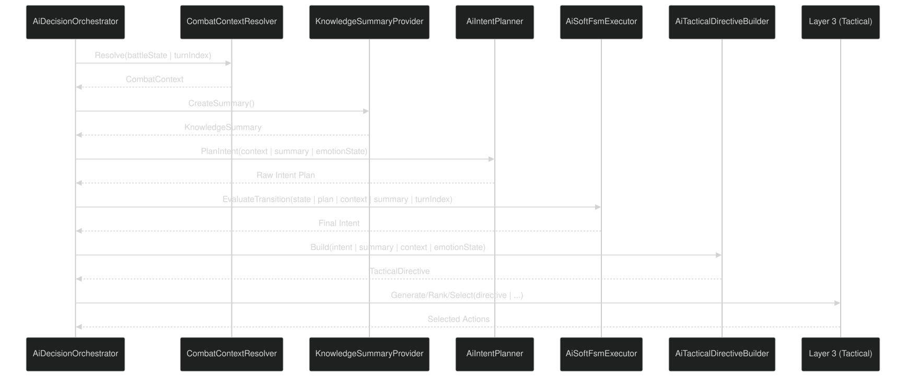

# Layer 4: Strategic Intent & Planning

<details>
<summary>Relevant source files</summary>


- [Carnage_Club_AI_Architecture_EN.md](https://github.com/Wolfs0ng/CarnageClub/blob/0021fcdc/Carnage_Club_AI_Architecture_EN.md)
- [Carnage_Club_AI_Architecture_UA.md](https://github.com/Wolfs0ng/CarnageClub/blob/0021fcdc/Carnage_Club_AI_Architecture_UA.md)
- [Diagrams/0_Runtime Sequence.md](https://github.com/Wolfs0ng/CarnageClub/blob/0021fcdc/Diagrams/0_Runtime Sequence.md)
- [Diagrams/10_Emotion_System.md](https://github.com/Wolfs0ng/CarnageClub/blob/0021fcdc/Diagrams/10_Emotion_System.md)
- [Diagrams/1_Telemetry_Data_Model.md](https://github.com/Wolfs0ng/CarnageClub/blob/0021fcdc/Diagrams/1_Telemetry_Data_Model.md)
- [Diagrams/2_Knowledge_1.md](https://github.com/Wolfs0ng/CarnageClub/blob/0021fcdc/Diagrams/2_Knowledge_1.md)
- [Diagrams/3_Knowledge_2.md](https://github.com/Wolfs0ng/CarnageClub/blob/0021fcdc/Diagrams/3_Knowledge_2.md)
- [Diagrams/4_Decision.md](https://github.com/Wolfs0ng/CarnageClub/blob/0021fcdc/Diagrams/4_Decision.md)


</details>

## Purpose and Scope

Layer 4 implements the strategic decision-making layer of the AI system. While Layer 3 ( [Tactical Decision System](#3.4) ) handles concrete action selection for individual turns, Layer 4 determines how the AI wants to fight at a higher level—choosing between aggressive pressure, defensive survival, or tactical punishment based on combat context and learned knowledge.

This layer consists of three core systems:

For telemetry and knowledge systems that feed into this layer, see [Layer 0: Telemetry System](#3.2) and [Layers 1-2: Knowledge Systems](#3.3) . For the emotion system that biases these decisions, see [Layer 5: Emotion System](#3.6) .

Sources: [Carnage_Club_AI_Architecture_EN.md #207-235](https://github.com/Wolfs0ng/CarnageClub/blob/0021fcdc/Carnage_Club_AI_Architecture_EN.md#L207-L235)  [Diagrams/4_Decision.md #14-17](https://github.com/Wolfs0ng/CarnageClub/blob/0021fcdc/Diagrams/4_Decision.md#L14-L17)

## Strategic Intents

The AI operates under one of three strategic intents at any given time. Each intent represents a distinct fighting philosophy and influences all downstream tactical decisions.

### Intent Selection is NOT Random

Intent selection uses utility-based scoring , not probability distributions. Each intent is scored based on:

- Combat context (HP ratios, stamina, Guard state)
- Knowledge confidence and player predictability
- Recent combat outcomes
- Emotional bias modifiers


The highest-scoring intent is selected, but the Soft FSM can enforce commitment to prevent rapid switching.

Sources: [Carnage_Club_AI_Architecture_EN.md #212-213](https://github.com/Wolfs0ng/CarnageClub/blob/0021fcdc/Carnage_Club_AI_Architecture_EN.md#L212-L213)  [Diagrams/0_Runtime Sequence.md #12](https://github.com/Wolfs0ng/CarnageClub/blob/0021fcdc/Diagrams/0_Runtime Sequence.md#L12-L12)

## Intent Planning Process

### AiIntentPlanner: Utility-Based Selection

The `AiIntentPlanner` evaluates all three intents and assigns a utility score to each based on current conditions.



Diagram 1: Intent Planning - Utility Scoring Flow

Sources: [Diagrams/0_Runtime Sequence.md #11-14](https://github.com/Wolfs0ng/CarnageClub/blob/0021fcdc/Diagrams/0_Runtime Sequence.md#L11-L14)  [Carnage_Club_AI_Architecture_EN.md #217-221](https://github.com/Wolfs0ng/CarnageClub/blob/0021fcdc/Carnage_Club_AI_Architecture_EN.md#L217-L221)

### Utility Calculation Inputs

The planner consumes three primary data sources:

The planner does NOT directly access raw knowledge systems—it only consumes the summarized view provided by `KnowledgeSummaryProvider` .

Sources: [Diagrams/0_Runtime Sequence.md #10-13](https://github.com/Wolfs0ng/CarnageClub/blob/0021fcdc/Diagrams/0_Runtime Sequence.md#L10-L13)  [Diagrams/4_Decision.md #14-17](https://github.com/Wolfs0ng/CarnageClub/blob/0021fcdc/Diagrams/4_Decision.md#L14-L17)

## Soft FSM: Commitment Enforcement

### The Problem: Intent Flip-Flopping

Without stabilization, utility-based planning can cause rapid intent changes:

```block
Turn 1: Pressure (utility: 0.72)Turn 2: Survive  (utility: 0.71)  ← minor utility differenceTurn 3: Pressure (utility: 0.73)  ← flip back
```

This creates incoherent, unpredictable AI behavior that players cannot read or respond to.

### The Solution: Soft FSM with Hysteresis

The `AiSoftFsmExecutor` implements a "soft" finite state machine that enforces commitment while allowing critical overrides .



Diagram 2: Soft FSM State Transitions

Sources: [Carnage_Club_AI_Architecture_EN.md #223-226](https://github.com/Wolfs0ng/CarnageClub/blob/0021fcdc/Carnage_Club_AI_Architecture_EN.md#L223-L226)  [Diagrams/0_Runtime Sequence.md #13-14](https://github.com/Wolfs0ng/CarnageClub/blob/0021fcdc/Diagrams/0_Runtime Sequence.md#L13-L14)

### FSM Execution Logic

The `AiSoftFsmExecutor.EvaluateTransition()` method implements the following decision tree:

This ensures the AI commits to a strategy for multiple turns unless emergency conditions require adaptation.

Sources: [Diagrams/0_Runtime Sequence.md #13](https://github.com/Wolfs0ng/CarnageClub/blob/0021fcdc/Diagrams/0_Runtime Sequence.md#L13-L13)  [Carnage_Club_AI_Architecture_EN.md #224](https://github.com/Wolfs0ng/CarnageClub/blob/0021fcdc/Carnage_Club_AI_Architecture_EN.md#L224-L224)

## Tactical Directive: Intent Translation

The `AiTacticalDirectiveBuilder` translates the selected intent into concrete parameters that drive tactical decision-making in Layer 3.

### TacticalDirective Structure



Diagram 3: TacticalDirective Data Model

Sources: [Diagrams/4_Decision.md #16-17](https://github.com/Wolfs0ng/CarnageClub/blob/0021fcdc/Diagrams/4_Decision.md#L16-L17)  [Carnage_Club_AI_Architecture_EN.md #230-235](https://github.com/Wolfs0ng/CarnageClub/blob/0021fcdc/Carnage_Club_AI_Architecture_EN.md#L230-L235)

### Intent-to-Directive Mapping

Each intent has a characteristic directive profile:

These base values are then modified by:

- `EmotionModifiers`Emotional bias (from )
- `KnowledgeSummaryProvider`Knowledge confidence (from )
- Combat context urgency


Sources: [Diagrams/4_Decision.md #16-17](https://github.com/Wolfs0ng/CarnageClub/blob/0021fcdc/Diagrams/4_Decision.md#L16-L17)  [Carnage_Club_AI_Architecture_EN.md #230-235](https://github.com/Wolfs0ng/CarnageClub/blob/0021fcdc/Carnage_Club_AI_Architecture_EN.md#L230-L235)

### Directive Application in Layer 3

The tactical directive influences Layer 3 ( [Tactical Decision System](#3.4) ) in three ways:

Sources: [Diagrams/4_Decision.md #14-57](https://github.com/Wolfs0ng/CarnageClub/blob/0021fcdc/Diagrams/4_Decision.md#L14-L57)

## Complete Data Flow: Context → Intent → Directive → Tactics



Diagram 4: Complete Layer 4 Data Flow

Sources: [Diagrams/0_Runtime Sequence.md #10-16](https://github.com/Wolfs0ng/CarnageClub/blob/0021fcdc/Diagrams/0_Runtime Sequence.md#L10-L16)  [Diagrams/4_Decision.md #10-53](https://github.com/Wolfs0ng/CarnageClub/blob/0021fcdc/Diagrams/4_Decision.md#L10-L53)

## Integration Points

### Entry Point: AiDecisionOrchestrator

The orchestrator coordinates all Layer 4 operations during the `DecideTurnAction()` call:



Diagram 5: Layer 4 Integration in Decision Pipeline

Sources: [Diagrams/0_Runtime Sequence.md #8-16](https://github.com/Wolfs0ng/CarnageClub/blob/0021fcdc/Diagrams/0_Runtime Sequence.md#L8-L16)  [Diagrams/4_Decision.md #5-53](https://github.com/Wolfs0ng/CarnageClub/blob/0021fcdc/Diagrams/4_Decision.md#L5-L53)

### Emotion System Integration

Layer 5 ( [Emotion System](#3.6) ) integrates at two points:

Critical Rule : Emotion biases decisions but never overrides FSM critical transitions or forces specific intents.

Sources: [Diagrams/10_Emotion_System.md #17-24](https://github.com/Wolfs0ng/CarnageClub/blob/0021fcdc/Diagrams/10_Emotion_System.md#L17-L24)  [Carnage_Club_AI_Architecture_EN.md #300-309](https://github.com/Wolfs0ng/CarnageClub/blob/0021fcdc/Carnage_Club_AI_Architecture_EN.md#L300-L309)

## Lifecycle and State Management

### Per-Battle Initialization

At battle start, the orchestrator initializes Layer 4 state:

```block
AiDecisionOrchestrator.Initialize()  → AiSoftFsmExecutor.Reset()    - Clear current intent    - Reset commitment counter    - Clear transition history  → EmotionManager.ResetForNewBattle()    - Initialize emotion values to base levels
```

This ensures each battle begins with a clean strategic state.

Sources: [Diagrams/0_Runtime Sequence.md #26](https://github.com/Wolfs0ng/CarnageClub/blob/0021fcdc/Diagrams/0_Runtime Sequence.md#L26-L26)  [Carnage_Club_AI_Architecture_EN.md #295](https://github.com/Wolfs0ng/CarnageClub/blob/0021fcdc/Carnage_Club_AI_Architecture_EN.md#L295-L295)

### Per-Turn Updates

After each turn resolution:

```block
AiDecisionOrchestrator.OnTurnResolved()  → Update FSM commitment counters  → Decay emotion values toward baseline  → Record transition history for debugging
```

Intent transitions are logged for observability and debugging.

Sources: [Diagrams/0_Runtime Sequence.md #51](https://github.com/Wolfs0ng/CarnageClub/blob/0021fcdc/Diagrams/0_Runtime Sequence.md#L51-L51)  [Diagrams/10_Emotion_System.md #11-14](https://github.com/Wolfs0ng/CarnageClub/blob/0021fcdc/Diagrams/10_Emotion_System.md#L11-L14)

### Persistence Rules

Layer 4 state is NOT persisted across save/load:

- Current intent resets
- FSM commitment counters reset
- Emotion state resets


Only knowledge (Layers 1-2) persists. This ensures "the world remembers your habits, not your emotions."

Sources: [Carnage_Club_AI_Architecture_EN.md #327-341](https://github.com/Wolfs0ng/CarnageClub/blob/0021fcdc/Carnage_Club_AI_Architecture_EN.md#L327-L341)

## Observability and Debugging

### Debug Checklist

When debugging AI strategic behavior:

Every strategic decision must be explainable through this chain.

Sources: [Carnage_Club_AI_Architecture_EN.md #343-352](https://github.com/Wolfs0ng/CarnageClub/blob/0021fcdc/Carnage_Club_AI_Architecture_EN.md#L343-L352)

### Logging Points

Key logging locations for Layer 4:

Sources: [Carnage_Club_AI_Architecture_EN.md #343-352](https://github.com/Wolfs0ng/CarnageClub/blob/0021fcdc/Carnage_Club_AI_Architecture_EN.md#L343-L352)

## Design Rationale

### Why Utility-Based, Not Rule-Based?

Rule-based intent selection would create rigid, predictable patterns:

```block
if (HP < 30%) then Surviveelse if (KnowledgeConfidence > 0.7) then Punishelse Pressure
```

Utility scoring allows graceful transitions and context sensitivity . Multiple factors blend naturally, and emotional bias integrates cleanly without brittle if/else chains.

Sources: [Carnage_Club_AI_Architecture_EN.md #217-221](https://github.com/Wolfs0ng/CarnageClub/blob/0021fcdc/Carnage_Club_AI_Architecture_EN.md#L217-L221)

### Why Soft FSM, Not Hard FSM?

A hard FSM would require explicit state transition conditions for all 9 possible transitions (3x3 states). This becomes unmaintainable and cannot adapt to emergent situations.

The Soft FSM:

- Lets utility scoring handle most transitions naturally
- Only enforces commitment to prevent flip-flopping
- Allows critical overrides for emergency adaptation
- Remains debuggable and explainable


Sources: [Carnage_Club_AI_Architecture_EN.md #223-226](https://github.com/Wolfs0ng/CarnageClub/blob/0021fcdc/Carnage_Club_AI_Architecture_EN.md#L223-L226)

### Why Separate Directive Building?

The directive is a clean interface boundary between strategic and tactical layers. It prevents:

- Layer 3 from directly accessing knowledge or context
- Strategic concerns from leaking into candidate scoring
- Circular dependencies between layers


The directive is the only data that flows from Layer 4 to Layer 3, enforcing unidirectional data flow.

Sources: [Carnage_Club_AI_Architecture_EN.md #230-235](https://github.com/Wolfs0ng/CarnageClub/blob/0021fcdc/Carnage_Club_AI_Architecture_EN.md#L230-L235)  [Diagrams/4_Decision.md #14-17](https://github.com/Wolfs0ng/CarnageClub/blob/0021fcdc/Diagrams/4_Decision.md#L14-L17)

## Summary

Layer 4 provides strategic coherence to AI behavior by:

The layer sits between knowledge-driven awareness (Layers 1-2) and concrete tactical execution (Layer 3), ensuring the AI fights with purpose rather than reacting turn-by-turn.

All decisions remain explainable through observable utility scores, FSM state, and directive parameters, maintaining the core architectural principle of debuggability over elegance.

Sources: [Carnage_Club_AI_Architecture_EN.md #207-235](https://github.com/Wolfs0ng/CarnageClub/blob/0021fcdc/Carnage_Club_AI_Architecture_EN.md#L207-L235)  [Diagrams/0_Runtime Sequence.md #8-16](https://github.com/Wolfs0ng/CarnageClub/blob/0021fcdc/Diagrams/0_Runtime Sequence.md#L8-L16)