# Layer 5: Emotion System

<details>
<summary>Relevant source files</summary>


- [Carnage_Club_AI_Architecture_EN.md](https://github.com/Wolfs0ng/CarnageClub/blob/0021fcdc/Carnage_Club_AI_Architecture_EN.md)
- [Carnage_Club_AI_Architecture_UA.md](https://github.com/Wolfs0ng/CarnageClub/blob/0021fcdc/Carnage_Club_AI_Architecture_UA.md)
- [Diagrams/0_Runtime Sequence.md](https://github.com/Wolfs0ng/CarnageClub/blob/0021fcdc/Diagrams/0_Runtime Sequence.md)
- [Diagrams/10_Emotion_System.md](https://github.com/Wolfs0ng/CarnageClub/blob/0021fcdc/Diagrams/10_Emotion_System.md)
- [Diagrams/1_Telemetry_Data_Model.md](https://github.com/Wolfs0ng/CarnageClub/blob/0021fcdc/Diagrams/1_Telemetry_Data_Model.md)
- [Diagrams/2_Knowledge_1.md](https://github.com/Wolfs0ng/CarnageClub/blob/0021fcdc/Diagrams/2_Knowledge_1.md)
- [Diagrams/3_Knowledge_2.md](https://github.com/Wolfs0ng/CarnageClub/blob/0021fcdc/Diagrams/3_Knowledge_2.md)
- [Diagrams/4_Decision.md](https://github.com/Wolfs0ng/CarnageClub/blob/0021fcdc/Diagrams/4_Decision.md)


</details>

## Purpose and Scope

This document describes the Emotion System , the fifth and final layer of the AI architecture. The Emotion System models the AI's short-term psychological momentum , providing bias modifiers that influence tactical and strategic decisions without overriding them.

This page covers:

- The three emotion values (Aggression, Fear, Confidence) and their lifecycle
- How emotions are updated after each turn using telemetry and rewards
- How emotion modifiers bias intent utilities and tactical directives
- Integration points with Layers 3 and 4
- Why emotions reset per battle and never persist to disk


For the overall AI architecture, see [AI Architecture Overview](#3.1) . For how emotions integrate with intent planning, see [Layer 4: Strategic Intent & Planning](#3.5) . For how telemetry feeds emotion updates, see [Layer 0: Telemetry System](#3.2) .

Sources:  [Carnage_Club_AI_Architecture_EN.md #238-356](https://github.com/Wolfs0ng/CarnageClub/blob/0021fcdc/Carnage_Club_AI_Architecture_EN.md#L238-L356)  [Carnage_Club_AI_Architecture_UA.md #212-324](https://github.com/Wolfs0ng/CarnageClub/blob/0021fcdc/Carnage_Club_AI_Architecture_UA.md#L212-L324)  [Diagrams/10_Emotion_System.md #1-32](https://github.com/Wolfs0ng/CarnageClub/blob/0021fcdc/Diagrams/10_Emotion_System.md#L1-L32)

## Conceptual Overview

### What Emotions Are (and Are Not)

The Emotion System answers a question that neither knowledge nor intent can address alone:

Emotions ARE:

- Short-lived (reset each battle)
- Reactive to recent turn outcomes
- Contextual (influenced by combat situation)
- Fully explainable (no black-box randomness)
- Bias modifiers, not decision-makers


Emotions are NOT:

- A knowledge layer (knowledge persists, emotions don't)
- Persistent across sessions (they reset per battle)
- A decision-making system (they only bias existing systems)
- A hard override of intent or FSM transitions
- A source of unpredictability or "randomness"


The design philosophy is: Emotion biases planning, but never controls it.

Sources:  [Carnage_Club_AI_Architecture_EN.md #252-266](https://github.com/Wolfs0ng/CarnageClub/blob/0021fcdc/Carnage_Club_AI_Architecture_EN.md#L252-L266)  [Carnage_Club_AI_Architecture_UA.md #227-240](https://github.com/Wolfs0ng/CarnageClub/blob/0021fcdc/Carnage_Club_AI_Architecture_UA.md#L227-L240)

## Emotion State Structure

### The Three Emotion Values

The AI maintains three normalized emotion values, each in the range [0..1] :

These values are independent (not mutually exclusive). An AI can simultaneously have high Aggression and high Fear (e.g., desperate situation), or low Confidence but high Aggression (e.g., tilted and reckless).

Sources:  [Carnage_Club_AI_Architecture_EN.md #270-276](https://github.com/Wolfs0ng/CarnageClub/blob/0021fcdc/Carnage_Club_AI_Architecture_EN.md#L270-L276)  [Carnage_Club_AI_Architecture_UA.md #243-250](https://github.com/Wolfs0ng/CarnageClub/blob/0021fcdc/Carnage_Club_AI_Architecture_UA.md#L243-L250)

### Emotion Lifecycle



Diagram: Emotion Lifecycle - Initialization, Update, Decay, and Reset

Properties:

- Initialized`AiDecisionOrchestrator.ResetForNewBattle()`at battle start (via )
- Updated`IEmotionService.UpdateEmotions(...)`after each turn resolution (via )
- Decaystoward baseline over time to prevent runaway values
- Discardedat battle end (NOT saved to disk)


Sources:  [Carnage_Club_AI_Architecture_EN.md #277-281](https://github.com/Wolfs0ng/CarnageClub/blob/0021fcdc/Carnage_Club_AI_Architecture_EN.md#L277-L281)  [Diagrams/0_Runtime Sequence.md #26-51](https://github.com/Wolfs0ng/CarnageClub/blob/0021fcdc/Diagrams/0_Runtime Sequence.md#L26-L51)  [Diagrams/10_Emotion_System.md #1-32](https://github.com/Wolfs0ng/CarnageClub/blob/0021fcdc/Diagrams/10_Emotion_System.md#L1-L32)

## Update Mechanism

### When Updates Occur

Emotion updates happen after turn resolution , ensuring emotions only affect future turns , never the current turn. This maintains unidirectional data flow.

The update sequence:

Sources:  [Carnage_Club_AI_Architecture_EN.md #286-294](https://github.com/Wolfs0ng/CarnageClub/blob/0021fcdc/Carnage_Club_AI_Architecture_EN.md#L286-L294)  [Diagrams/0_Runtime Sequence.md #42-51](https://github.com/Wolfs0ng/CarnageClub/blob/0021fcdc/Diagrams/0_Runtime Sequence.md#L42-L51)

### Update Inputs (EmotionUpdateContext)



Diagram: Emotion Update Data Flow - Inputs, Logic, and Outputs

Key Input Components:

Update Logic Examples:

- Aggression increaseswhen: attack rewards are high, AI deals significant damage, player shows defensive patterns
- Fear increaseswhen: AI HP is low, defense rewards are poor, player is aggressive
- Confidence increaseswhen: knowledge predictions are accurate, patterns are clear, rewards match expectations
- Decaypulls all values back toward baseline (typically 0.5) to prevent permanent emotional states


Sources:  [Carnage_Club_AI_Architecture_EN.md #286-294](https://github.com/Wolfs0ng/CarnageClub/blob/0021fcdc/Carnage_Club_AI_Architecture_EN.md#L286-L294)  [Carnage_Club_AI_Architecture_UA.md #258-268](https://github.com/Wolfs0ng/CarnageClub/blob/0021fcdc/Carnage_Club_AI_Architecture_UA.md#L258-L268)  [Diagrams/10_Emotion_System.md #10-15](https://github.com/Wolfs0ng/CarnageClub/blob/0021fcdc/Diagrams/10_Emotion_System.md#L10-L15)

## Emotion Modifiers (Outputs)

### Modifier Structure

Emotions produce a set of modifiers that bias decision-making. These modifiers never directly control actions; they shift parameters in other systems.



Diagram: Emotion Modifiers - How Emotion State Maps to Bias Parameters

### Modifier Semantics

Important: These are bias parameters , not absolute overrides. A high Aggression doesn't force 4 attacks; it shifts the scoring function to favor more attacks.

Sources:  [Carnage_Club_AI_Architecture_EN.md #298-309](https://github.com/Wolfs0ng/CarnageClub/blob/0021fcdc/Carnage_Club_AI_Architecture_EN.md#L298-L309)  [Carnage_Club_AI_Architecture_UA.md #272-288](https://github.com/Wolfs0ng/CarnageClub/blob/0021fcdc/Carnage_Club_AI_Architecture_UA.md#L272-L288)  [Diagrams/10_Emotion_System.md #17-19](https://github.com/Wolfs0ng/CarnageClub/blob/0021fcdc/Diagrams/10_Emotion_System.md#L17-L19)

## Integration Points

### Layer 4 Integration: AiIntentPlanner

The `AiIntentPlanner` applies emotion modifiers before FSM stabilization, shifting utility scores for each intent.

Diagram: Intent Planning with Emotion Bias

Key Points:

- beforeEmotion modifiers shift utilities FSM evaluation
- FSM can still override if commitment rules apply
- Critical overrides (e.g., HP < 10%) take precedence over emotion


Code References:

- [AiIntentPlanner](https://github.com/Wolfs0ng/CarnageClub/blob/0021fcdc/AiIntentPlanner)Intent planning: (specific file path not provided in sources)
- `ApplyEmotionalModifiers(...)`Modifier application: method
- [AiSoftFsmExecutor](https://github.com/Wolfs0ng/CarnageClub/blob/0021fcdc/AiSoftFsmExecutor)FSM integration:


Sources:  [Carnage_Club_AI_Architecture_EN.md #317-324](https://github.com/Wolfs0ng/CarnageClub/blob/0021fcdc/Carnage_Club_AI_Architecture_EN.md#L317-L324)  [Diagrams/10_Emotion_System.md #21-24](https://github.com/Wolfs0ng/CarnageClub/blob/0021fcdc/Diagrams/10_Emotion_System.md#L21-L24)  [Diagrams/0_Runtime Sequence.md #34-36](https://github.com/Wolfs0ng/CarnageClub/blob/0021fcdc/Diagrams/0_Runtime Sequence.md#L34-L36)

### Layer 3 Integration: AiTacticalDirectiveBuilder

The `AiTacticalDirectiveBuilder` applies emotion modifiers when constructing the `TacticalDirective` , which guides candidate ranking and selection.



Diagram: Tactical Directive Construction with Emotion Bias

Example Emotion Effects:

Code References:

- [AiTacticalDirectiveBuilder](https://github.com/Wolfs0ng/CarnageClub/blob/0021fcdc/AiTacticalDirectiveBuilder)Directive builder:
- [TacticalDirective](https://github.com/Wolfs0ng/CarnageClub/blob/0021fcdc/TacticalDirective)Directive structure:
- `AiDecisionOrchestrator.DecideTurnAction(...)`Integration: Called by


Sources:  [Carnage_Club_AI_Architecture_EN.md #228-235](https://github.com/Wolfs0ng/CarnageClub/blob/0021fcdc/Carnage_Club_AI_Architecture_EN.md#L228-L235)  [Diagrams/10_Emotion_System.md #21-24](https://github.com/Wolfs0ng/CarnageClub/blob/0021fcdc/Diagrams/10_Emotion_System.md#L21-L24)  [Diagrams/4_Decision.md #14-17](https://github.com/Wolfs0ng/CarnageClub/blob/0021fcdc/Diagrams/4_Decision.md#L14-L17)

### Orchestration: AiDecisionOrchestrator Lifecycle

The `AiDecisionOrchestrator` manages emotion lifecycle through two key methods:

Diagram: Emotion Lifecycle Management by AiDecisionOrchestrator

Key Methods:

Sources:  [Diagrams/0_Runtime Sequence.md #26-51](https://github.com/Wolfs0ng/CarnageClub/blob/0021fcdc/Diagrams/0_Runtime Sequence.md#L26-L51)  [Diagrams/10_Emotion_System.md #21-26](https://github.com/Wolfs0ng/CarnageClub/blob/0021fcdc/Diagrams/10_Emotion_System.md#L21-L26)

## Persistence Rules

### What Persists vs What Doesn't

The Emotion System follows the principle:



Diagram: Persistence Design - What Saves vs What Resets

### Rationale

Why Emotions Don't Persist:

Why Knowledge Persists:

Sources:  [Carnage_Club_AI_Architecture_EN.md #327-341](https://github.com/Wolfs0ng/CarnageClub/blob/0021fcdc/Carnage_Club_AI_Architecture_EN.md#L327-L341)  [Carnage_Club_AI_Architecture_UA.md #299-311](https://github.com/Wolfs0ng/CarnageClub/blob/0021fcdc/Carnage_Club_AI_Architecture_UA.md#L299-L311)

## Code Entry Points

### Key Classes and Interfaces

### Service Registration

The emotion service is registered in the AppStartup service locator initialization:

```block
ServiceLocator.Register<IEmotionService>(new EmotionService(...))
```

This occurs during the AI system registration phase, after telemetry and knowledge systems are registered.

Sources:  [Diagrams/10_Emotion_System.md #1-32](https://github.com/Wolfs0ng/CarnageClub/blob/0021fcdc/Diagrams/10_Emotion_System.md#L1-L32)  [Carnage_Club_AI_Architecture_EN.md #238-356](https://github.com/Wolfs0ng/CarnageClub/blob/0021fcdc/Carnage_Club_AI_Architecture_EN.md#L238-L356)

## Debug and Observability

### Inspecting Emotion State

To debug emotion behavior, inspect:

### Debug Questions

When debugging unexpected AI behavior:

- What are the current Aggression, Fear, Confidence values?
- What was the last turn's reward (attack and defense)?
- How did emotion modifiers shift the intent utilities?
- How did emotion modifiers bias the tactical directive?
- Is the AI stuck in high Fear due to low HP?
- Is high Confidence causing over-reliance on patterns?


### Explainability Chain

Every emotion-influenced decision should be explainable through:

Sources:  [Carnage_Club_AI_Architecture_EN.md #343-354](https://github.com/Wolfs0ng/CarnageClub/blob/0021fcdc/Carnage_Club_AI_Architecture_EN.md#L343-L354)

## Summary

The Emotion System provides the AI with short-term psychological momentum that adds naturalistic variation to behavior without sacrificing explainability. Key takeaways:

- Three emotions(Aggression, Fear, Confidence) in range [0..1]
- Updated after each turnusing telemetry, rewards, and context
- Produces modifiersthat bias intent planning and tactical directives
- Never controls decisions directly- only shifts parameters
- Resets each battle- does not persist to disk
- Decays toward baselineto prevent runaway emotional states


The system completes the 5-layer AI architecture, adding human-like emotional dynamics while maintaining the core principles of explainability and debuggability that define the entire AI system.

Sources:  [Carnage_Club_AI_Architecture_EN.md #238-356](https://github.com/Wolfs0ng/CarnageClub/blob/0021fcdc/Carnage_Club_AI_Architecture_EN.md#L238-L356)  [Carnage_Club_AI_Architecture_UA.md #212-324](https://github.com/Wolfs0ng/CarnageClub/blob/0021fcdc/Carnage_Club_AI_Architecture_UA.md#L212-L324)  [Diagrams/10_Emotion_System.md #1-32](https://github.com/Wolfs0ng/CarnageClub/blob/0021fcdc/Diagrams/10_Emotion_System.md#L1-L32)