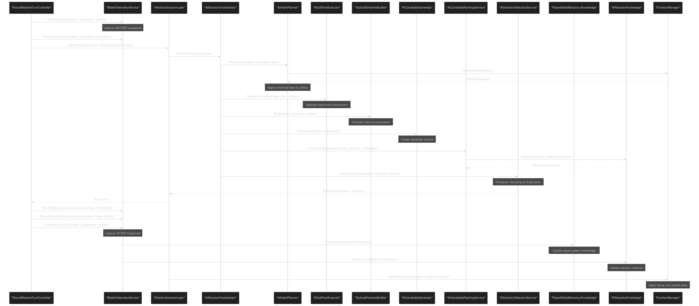

# AI System

<details>
<summary>Relevant source files</summary>


- [Carnage_Club_AI_Architecture_EN.md](https://github.com/Wolfs0ng/CarnageClub/blob/0021fcdc/Carnage_Club_AI_Architecture_EN.md)
- [Carnage_Club_AI_Architecture_UA.md](https://github.com/Wolfs0ng/CarnageClub/blob/0021fcdc/Carnage_Club_AI_Architecture_UA.md)
- [Diagrams/0_Runtime Sequence.md](https://github.com/Wolfs0ng/CarnageClub/blob/0021fcdc/Diagrams/0_Runtime Sequence.md)
- [Diagrams/10_Emotion_System.md](https://github.com/Wolfs0ng/CarnageClub/blob/0021fcdc/Diagrams/10_Emotion_System.md)
- [Diagrams/1_Telemetry_Data_Model.md](https://github.com/Wolfs0ng/CarnageClub/blob/0021fcdc/Diagrams/1_Telemetry_Data_Model.md)
- [Diagrams/2_Knowledge_1.md](https://github.com/Wolfs0ng/CarnageClub/blob/0021fcdc/Diagrams/2_Knowledge_1.md)
- [Diagrams/3_Knowledge_2.md](https://github.com/Wolfs0ng/CarnageClub/blob/0021fcdc/Diagrams/3_Knowledge_2.md)
- [Diagrams/4_Decision.md](https://github.com/Wolfs0ng/CarnageClub/blob/0021fcdc/Diagrams/4_Decision.md)
- [GDD_EN.md](https://github.com/Wolfs0ng/CarnageClub/blob/0021fcdc/GDD_EN.md)
- [GDD_UA.md](https://github.com/Wolfs0ng/CarnageClub/blob/0021fcdc/GDD_UA.md)
- [README.md](https://github.com/Wolfs0ng/CarnageClub/blob/0021fcdc/README.md)


</details>

## Purpose and Scope

This page provides a comprehensive overview of the AI System, the most critical component in the Carnage Club codebase (importance score: 21.79). The AI System implements a 5-layer architecture that enables enemies to learn from player behavior and adapt their tactics across game sessions, realizing the core concept: "The world remembers your habits."

This overview covers the architectural design, data flow, and integration points. For detailed information about specific layers, see:

- [Layer 0: Telemetry System](#3.2)
- [Layers 1-2: Knowledge Systems](#3.3)
- [Layer 3: Tactical Decision System](#3.4)
- [Layer 4: Strategic Intent & Planning](#3.5)
- [Layer 5: Emotion System](#3.6)


For information about how the AI integrates with combat, see [Battle System](#5) . For information about how AI knowledge persists, see [Save & Load System](#4.3) .

Sources:  [README.md #26-36](https://github.com/Wolfs0ng/CarnageClub/blob/0021fcdc/README.md#L26-L36)  [GDD_EN.md #195-264](https://github.com/Wolfs0ng/CarnageClub/blob/0021fcdc/GDD_EN.md#L195-L264)  [Carnage_Club_AI_Architecture_EN.md #1-367](https://github.com/Wolfs0ng/CarnageClub/blob/0021fcdc/Carnage_Club_AI_Architecture_EN.md#L1-L367)

## Core Philosophy

The AI System is built on three foundational principles:

The system explicitly avoids black-box machine learning in favor of transparent, debuggable decision-making. Every action the AI takes can be explained through inspection of telemetry, knowledge summaries, intent state, and emotional bias.

Sources:  [Carnage_Club_AI_Architecture_EN.md #4-12](https://github.com/Wolfs0ng/CarnageClub/blob/0021fcdc/Carnage_Club_AI_Architecture_EN.md#L4-L12)  [GDD_EN.md #27](https://github.com/Wolfs0ng/CarnageClub/blob/0021fcdc/GDD_EN.md#L27-L27)

## Layered Architecture

The AI System is structured as a unidirectional data pipeline with 5 distinct layers:



Diagram: AI System Layered Architecture

Key characteristics:

- Unidirectional flow: Data flows downward only. Telemetry never consumes knowledge; knowledge never queries telemetry.
- Layer isolation: Each layer has a single responsibility and minimal coupling.
- Persistence boundary: Layers 1-2 persist to disk. Layers 0, 3, 4, 5 are runtime-only.


Sources:  [Carnage_Club_AI_Architecture_EN.md #14-20](https://github.com/Wolfs0ng/CarnageClub/blob/0021fcdc/Carnage_Club_AI_Architecture_EN.md#L14-L20)  [Diagrams/0_Runtime Sequence.md #1-51](https://github.com/Wolfs0ng/CarnageClub/blob/0021fcdc/Diagrams/0_Runtime Sequence.md#L1-L51)

## Layer Responsibilities

### Layer 0: Telemetry (Foundation)

Purpose: Record raw combat data as the "single source of truth"

The telemetry layer captures every turn's actions, outcomes, and state snapshots without making decisions. It provides the foundation for all higher layers.

Key classes:

- `IBattleTelemetryService`- Interface contract
- `BattleTelemetryService`- Implementation
- `BattleTurnTelemetry`- DTO containing complete turn data
- `TurnActionTelemetry`- Player/AI action choices
- `PerDirectionOutcomeTelemetry`- Per-direction resolution results


Data captured per turn:

- Attack and defense direction choices (normalized)
- Per-direction outcomes (Hit, Block, Parry)
- Damage dealt (HP and Guard)
- Special effects (Critical, Guard Break)
- Before/after state snapshots (HP, Guard, Stamina)


For detailed information, see [Layer 0: Telemetry System](#3.2) .

Sources:  [Carnage_Club_AI_Architecture_EN.md #74-124](https://github.com/Wolfs0ng/CarnageClub/blob/0021fcdc/Carnage_Club_AI_Architecture_EN.md#L74-L124)  [Diagrams/1_Telemetry_Data_Model.md #1-50](https://github.com/Wolfs0ng/CarnageClub/blob/0021fcdc/Diagrams/1_Telemetry_Data_Model.md#L1-L50)

### Layers 1-2: Knowledge (Persistent Learning)

Purpose: Learn player patterns and action effectiveness

Two independent knowledge systems that persist across game sessions:
Layer 1: Player Behaviour Knowledge
Tracks what the player tends to do , not just effectiveness.

Key class:  `PlayerBattleBehaviourKnowledge`

Tracks:

- Direction usage frequencies (per attack/defense direction)
- Pattern masks (bitmask combinations 1-15)
- Bigrams and trigrams (sequential patterns)
- Rolling windows for recent behavior
- Player attack effectiveness statistics

Layer 2: AI Reaction Knowledge
Tracks what actions work against which defenses.

Key class:  `AiReactionKnowledge`

Structure: Two 4×16 matrices

- Offense Matrix:AI attack direction × Player defense mask
- Defense Matrix:Player attack direction × AI defense mask


Per-cell statistics:

- Usage count
- Hit/Block/Parry counts
- HP and Guard damage sums
- Critical and Guard Break counts


Key evaluators:

- `AiOffenseEvaluator`- Best attack vs. specific defense
- `AiDefenseEvaluator`- Best defense vs. specific attack


For detailed information, see [Layers 1-2: Knowledge Systems](#3.3) .

Sources:  [Carnage_Club_AI_Architecture_EN.md #126-180](https://github.com/Wolfs0ng/CarnageClub/blob/0021fcdc/Carnage_Club_AI_Architecture_EN.md#L126-L180)  [Diagrams/2_Knowledge_1.md #1-25](https://github.com/Wolfs0ng/CarnageClub/blob/0021fcdc/Diagrams/2_Knowledge_1.md#L1-L25)  [Diagrams/3_Knowledge_2.md #1-31](https://github.com/Wolfs0ng/CarnageClub/blob/0021fcdc/Diagrams/3_Knowledge_2.md#L1-L31)

### Layer 3: Tactical Decisions (Action Selection)

Purpose: Select concrete attack and defense directions for the current turn

This layer generates candidate actions, scores them using knowledge and rewards, then selects using bandit algorithms.



Diagram: Tactical Decision Pipeline

Key components:

- AiCandidateGenerator- Creates valid attack/defense combinations
- AiCandidateRankingService- Scores using rewards and knowledge
- AiDecisionSelectionService- Thompson Sampling or exploration
- AiBanditStatsManager- Per-ActionKey prior statistics


Exploration vs Exploitation:

- Thompson Sampling uses learned priors for exploitation
- Contextual exploration provides bounded, explainable randomness
- Exploration budget prevents excessive randomness


For detailed information, see [Layer 3: Tactical Decision System](#3.4) .

Sources:  [Carnage_Club_AI_Architecture_EN.md #182-200](https://github.com/Wolfs0ng/CarnageClub/blob/0021fcdc/Carnage_Club_AI_Architecture_EN.md#L182-L200)  [Diagrams/4_Decision.md #1-58](https://github.com/Wolfs0ng/CarnageClub/blob/0021fcdc/Diagrams/4_Decision.md#L1-L58)

### Layer 4: Strategic Intent (High-Level Planning)

Purpose: Decide how the AI wants to fight, not just what actions to take

This layer uses GOAP-inspired utility scoring combined with a Soft FSM to provide stable, context-aware strategy.

Intents:

- Pressure- Aggressive offense, apply damage
- Survive- Defensive focus, preserve HP
- Punish- Counter-attack, exploit player patterns


Key classes:

- AiIntentPlanner- Utility-based intent selection
- AiSoftFsmExecutor- Enforces commitment, prevents flip-flopping
- TacticalDirectiveBuilder- Translates intent into parameters


TacticalDirective parameters:

FSM behavior:

- Maintains current intent with commitment counter
- Requires threshold advantage to switch intents
- Applies critical overrides (e.g., low HP forces Survive)


For detailed information, see [Layer 4: Strategic Intent & Planning](#3.5) .

Sources:  [Carnage_Club_AI_Architecture_EN.md #202-236](https://github.com/Wolfs0ng/CarnageClub/blob/0021fcdc/Carnage_Club_AI_Architecture_EN.md#L202-L236)  [GDD_EN.md #247-253](https://github.com/Wolfs0ng/CarnageClub/blob/0021fcdc/GDD_EN.md#L247-L253)

### Layer 5: Emotion System (Psychological Momentum)

Purpose: Model short-term psychological state that biases decisions

Emotions answer: "Given what just happened, how should the AI feel right now?"

Emotion state (all values 0..1):

- Aggression- Tendency toward risk and pressure
- Fear- Tendency toward caution and defense
- Confidence- Trust in learned knowledge


Key properties:

- Updated after each turn resolution
- Decays toward baseline over time
- Does not persist- resets each battle
- Biases but never controlsdecisions


Integration points:

What emotion is NOT:

- Not a decision-maker (it's a modifier)
- Not persistent (runtime only)
- Not a hard override of intent or FSM
- Not a source of randomness


For detailed information, see [Layer 5: Emotion System](#3.6) .

Sources:  [Carnage_Club_AI_Architecture_EN.md #238-341](https://github.com/Wolfs0ng/CarnageClub/blob/0021fcdc/Carnage_Club_AI_Architecture_EN.md#L238-L341)  [Diagrams/10_Emotion_System.md #1-32](https://github.com/Wolfs0ng/CarnageClub/blob/0021fcdc/Diagrams/10_Emotion_System.md#L1-L32)

## Data Flow: One Complete Turn

The following diagram shows how data flows through all layers during a single turn:



Diagram: Complete Turn Data Flow Through All Layers

Key observations:

Sources:  [Diagrams/0_Runtime Sequence.md #1-51](https://github.com/Wolfs0ng/CarnageClub/blob/0021fcdc/Diagrams/0_Runtime Sequence.md#L1-L51)  [Carnage_Club_AI_Architecture_EN.md #357-367](https://github.com/Wolfs0ng/CarnageClub/blob/0021fcdc/Carnage_Club_AI_Architecture_EN.md#L357-L367)

## Integration with Battle System

The AI System integrates with the battle system through clear entry and exit points:

### Entry Point: AiActionDecisionLayer

The battle system invokes AI decisions through `AiActionDecisionLayer` :

```block
AiActionDecisionLayer.SelectAttackDirections(context)AiActionDecisionLayer.SelectDefenseDirections(context)
```

This layer serves as the facade for the entire AI stack.

Location: The AI layer is invoked during the AI turn phase managed by `AITurnController` , which is part of the battle turn sequence.

### Exit Point: Selected Actions

The AI returns:

- List of attack directions (0-3)
- List of defense directions (0-3)
- `ActionKey`for bandit tracking


These are normalized (sorted, distinct) before returning.

### Battle-AI Communication Flow



Diagram: Battle System Integration Points

Sources:  [Diagrams/0_Runtime Sequence.md #1-51](https://github.com/Wolfs0ng/CarnageClub/blob/0021fcdc/Diagrams/0_Runtime Sequence.md#L1-L51) Battle system files from context

## Persistence and Save System

The AI System implements selective persistence to realize "The world remembers your habits":

### What Persists

### Save Data Structure

Knowledge systems provide `CreateSaveData()` and `RestoreFromSaveData()` methods:

PlayerBattleBehaviourKnowledge:

- `PlayerBattleBehaviorData`Serializes to
- Contains Unity-friendly lists (no dictionaries)
- Normalized keys for patterns and n-grams


AiReactionKnowledge:

- `AiReactionKnowledgeData`Serializes to
- `attackDir | (defMask << 8)`Uses packed integer keys:
- Includes flag bit for offense vs defense matrix


### Integration with GameStateManager

AI knowledge is saved and loaded through `GameStateManager` :

For detailed information, see [Save & Load System](#4.3) .

Sources:  [Carnage_Club_AI_Architecture_EN.md #328-341](https://github.com/Wolfs0ng/CarnageClub/blob/0021fcdc/Carnage_Club_AI_Architecture_EN.md#L328-L341)  [Diagrams/2_Knowledge_1.md #25](https://github.com/Wolfs0ng/CarnageClub/blob/0021fcdc/Diagrams/2_Knowledge_1.md#L25-L25)  [Diagrams/3_Knowledge_2.md #31](https://github.com/Wolfs0ng/CarnageClub/blob/0021fcdc/Diagrams/3_Knowledge_2.md#L31-L31)

## Design Principles

### Unidirectional Data Flow

Data flows in one direction through the layers:

```block
Telemetry → Knowledge → Decisions → Intent → Emotions
```

Enforced rules:

- neverTelemetry consumes knowledge
- neverKnowledge queries telemetry
- neverLower layers know about higher layers
- neverDecisions directly modify knowledge


This prevents circular dependencies and ensures debuggability.

### Explainability First

Every AI decision is traceable:

No "black box" - every decision has a clear chain of reasoning.

### Cold-Start Handling

The system gracefully handles limited data:

PlayerBattleBehaviourKnowledge:

- Provides "baseline" frequencies when no data exists
- Falls back to uniform distribution for patterns
- Gradually gains confidence as data accumulates


AiReactionKnowledge:

- Returns neutral scores for untested combinations
- Uses evaluator fallback logic when cells are empty
- Balances exploration in early battles


AiBanditStatsManager:

- Initializes with optimistic priors
- Encourages exploration of untested actions
- Converges to exploitation as confidence grows


### Mobile Performance Discipline

Hot path optimizations:

- No LINQ in turn processing
- Minimal allocations per turn
- Direction lists normalized once and reused
- Object pooling for telemetry DTOs
- Struct-based value types where appropriate


Sources:  [Carnage_Club_AI_Architecture_EN.md #46-49](https://github.com/Wolfs0ng/CarnageClub/blob/0021fcdc/Carnage_Club_AI_Architecture_EN.md#L46-L49)  [Carnage_Club_AI_Architecture_EN.md #344-354](https://github.com/Wolfs0ng/CarnageClub/blob/0021fcdc/Carnage_Club_AI_Architecture_EN.md#L344-L354)

## Key Code Entities

The following table maps high-level concepts to concrete code entities for easy navigation:

Sources:  [Diagrams/0_Runtime Sequence.md](https://github.com/Wolfs0ng/CarnageClub/blob/0021fcdc/Diagrams/0_Runtime Sequence.md)  [Diagrams/1_Telemetry_Data_Model.md](https://github.com/Wolfs0ng/CarnageClub/blob/0021fcdc/Diagrams/1_Telemetry_Data_Model.md)  [Diagrams/4_Decision.md](https://github.com/Wolfs0ng/CarnageClub/blob/0021fcdc/Diagrams/4_Decision.md)  [Diagrams/10_Emotion_System.md](https://github.com/Wolfs0ng/CarnageClub/blob/0021fcdc/Diagrams/10_Emotion_System.md)

## Debugging and Observability

The AI System provides multiple debug surfaces:

### Telemetry Inspection

- `TelemetryPrettyPrinter`- Human-readable turn logs
- `IBattleTelemetryService.GetTurnsSnapshot()`- Runtime snapshot
- Per-direction outcome inspection


### Knowledge Inspection

- `KnowledgeSummaryProvider.CreateSummary()`- Current knowledge state
- `PlayerBattleBehaviourKnowledge`Direct inspection of fields
- `AiReactionKnowledge`matrix cell queries


### Decision Inspection

- Candidate generation logs
- Scoring breakdown per candidate
- Thompson Sampling statistics
- Exploration budget state


### Intent Inspection

- Current intent and commitment counter
- Utility scores per intent
- FSM transition logic
- Directive parameter values


### Emotion Inspection

- Current emotion state (Aggression, Fear, Confidence)
- Emotion modifiers applied
- Decay and update history


Debug checklist for AI behavior:

Sources:  [Carnage_Club_AI_Architecture_EN.md #344-354](https://github.com/Wolfs0ng/CarnageClub/blob/0021fcdc/Carnage_Club_AI_Architecture_EN.md#L344-L354)

## Summary

The AI System implements a 5-layer architecture that provides:

- Explainable behaviorthrough observable layers and clear data flow
- Persistent learningof player patterns and action effectiveness
- Adaptive tacticsusing bandit algorithms and knowledge
- Strategic planningwith GOAP-inspired utility scoring
- Psychological momentumthrough emotion-based bias


The system realizes the core concept "The world remembers your habits" while maintaining solo-developer maintainability and mobile performance discipline. Every decision is traceable, every layer has a single responsibility, and data flows unidirectionally from telemetry through knowledge to decisions.

For detailed information about each layer, see the child pages linked at the top of this document.

Sources:  [README.md #34-36](https://github.com/Wolfs0ng/CarnageClub/blob/0021fcdc/README.md#L34-L36)  [GDD_EN.md #27](https://github.com/Wolfs0ng/CarnageClub/blob/0021fcdc/GDD_EN.md#L27-L27)  [Carnage_Club_AI_Architecture_EN.md #1-367](https://github.com/Wolfs0ng/CarnageClub/blob/0021fcdc/Carnage_Club_AI_Architecture_EN.md#L1-L367)