# Game State Manager

<details>
<summary>Relevant source files</summary>


- [CarnageClub/Assets/GameResources/ScriptableObjects/BaseGameData/MapLevels/Level_1_MapData.asset](https://github.com/Wolfs0ng/CarnageClub/blob/0021fcdc/CarnageClub/Assets/GameResources/ScriptableObjects/BaseGameData/MapLevels/Level_1_MapData.asset)
- [CarnageClub/Assets/Scenes/AppStart.unity](https://github.com/Wolfs0ng/CarnageClub/blob/0021fcdc/CarnageClub/Assets/Scenes/AppStart.unity)
- [CarnageClub/Assets/Scripts/Core/AppStartup.cs](https://github.com/Wolfs0ng/CarnageClub/blob/0021fcdc/CarnageClub/Assets/Scripts/Core/AppStartup.cs)
- [CarnageClub/Assets/Scripts/Core/GameStateManager.cs](https://github.com/Wolfs0ng/CarnageClub/blob/0021fcdc/CarnageClub/Assets/Scripts/Core/GameStateManager.cs)
- [CarnageClub/SaveData.json](https://github.com/Wolfs0ng/CarnageClub/blob/0021fcdc/CarnageClub/SaveData.json)


</details>

## Purpose and Scope

The `GameStateManager` is the single source of truth for all runtime game state in Carnage Club. It maintains the player's current state, map position, level data, and coordinates state persistence across game sessions. This system ensures that all gameplay systems—including Map, Battle, and AI—access consistent, synchronized state data.

Related Documentation:

- [Save & Load System](#4.3)For save/load file format and serialization, see
- [Event Service & Communication](#4.2)For event-driven communication patterns, see
- [Level Management & Transitions](#6.4)For map state structure and level management, see


## Architecture Overview

The `GameStateManager` separates public read-only state from internal mutable session state , preventing uncontrolled modifications while allowing authorized updates through explicit methods. It orchestrates multiple helper components to manage initialization, persistence, and state transitions.


Sources:  [CarnageClub/Assets/Scripts/Core/GameStateManager.cs #32-56](https://github.com/Wolfs0ng/CarnageClub/blob/0021fcdc/CarnageClub/Assets/Scripts/Core/GameStateManager.cs#L32-L56)

## Core State Components

The `GameStateManager` exposes four primary state properties that define the current game session:

### State Data Structures


Sources:  [CarnageClub/Assets/Scripts/Core/GameStateManager.cs #36-39](https://github.com/Wolfs0ng/CarnageClub/blob/0021fcdc/CarnageClub/Assets/Scripts/Core/GameStateManager.cs#L36-L39)

## Internal Session State Architecture

The `GameStateManager` maintains internal mutable state through the `GameSessionState` class, which wraps all runtime state in a modifiable container. Public properties are synchronized from session state using `SyncPublicState()` .

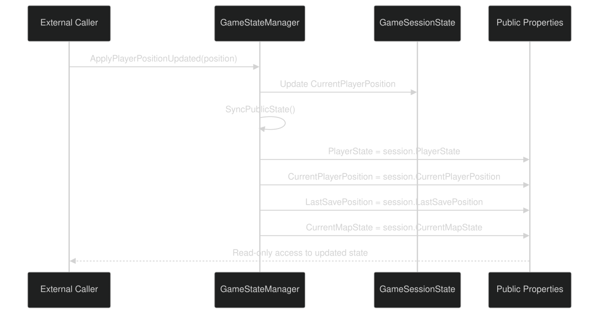

This pattern ensures that:

Sources:  [CarnageClub/Assets/Scripts/Core/GameStateManager.cs #51](https://github.com/Wolfs0ng/CarnageClub/blob/0021fcdc/CarnageClub/Assets/Scripts/Core/GameStateManager.cs#L51-L51)  [CarnageClub/Assets/Scripts/Core/GameStateManager.cs #260-274](https://github.com/Wolfs0ng/CarnageClub/blob/0021fcdc/CarnageClub/Assets/Scripts/Core/GameStateManager.cs#L260-L274)

## Initialization System

The `GameStateManager` supports two initialization paths: New Game and Load Game . Both paths share common setup but differ in how initial state is constructed.

### Initialization Flow Diagram


### New Game Initialization

When starting a new game, the manager creates fresh player state from a `PlayerDTO` configuration and initializes the map structure from `MapData` ScriptableObjects.

Key Steps:

Sources:  [CarnageClub/Assets/Scripts/Core/GameStateManager.cs #64-93](https://github.com/Wolfs0ng/CarnageClub/blob/0021fcdc/CarnageClub/Assets/Scripts/Core/GameStateManager.cs#L64-L93)

### Load Game Initialization

When loading a saved game, the manager delegates to `GameStateSaveRestorer` to reconstruct all state from the `SaveData` DTO, including AI knowledge systems.

Key Steps:

Critical Detail: The save restorer also repopulates AI knowledge services ( `IPlayerBattleBehaviourKnowledge` , `IAiReactionKnowledge` , etc.) so that enemies remember learned player patterns across sessions.

Sources:  [CarnageClub/Assets/Scripts/Core/GameStateManager.cs #96-110](https://github.com/Wolfs0ng/CarnageClub/blob/0021fcdc/CarnageClub/Assets/Scripts/Core/GameStateManager.cs#L96-L110)  [CarnageClub/Assets/Scripts/Core/GameStateManager.cs #196-201](https://github.com/Wolfs0ng/CarnageClub/blob/0021fcdc/CarnageClub/Assets/Scripts/Core/GameStateManager.cs#L196-L201)

## State Update Operations

The `GameStateManager` provides explicit methods for updating state in response to gameplay events. Each method follows the pattern: modify session state → sync public state.

### Update Methods Table

### Position Update Flow

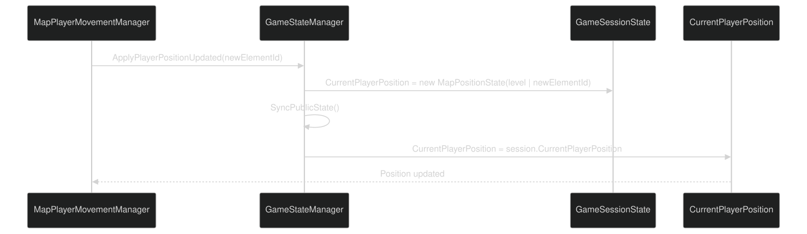

Sources:  [CarnageClub/Assets/Scripts/Core/GameStateManager.cs #112-122](https://github.com/Wolfs0ng/CarnageClub/blob/0021fcdc/CarnageClub/Assets/Scripts/Core/GameStateManager.cs#L112-L122)

### Battle Outcome Handling

The `AfterBattleMapApplier` helper component handles post-battle state changes, coordinating map element updates and save triggers.
Player Victory Flow

Sources:  [CarnageClub/Assets/Scripts/Core/GameStateManager.cs #144-148](https://github.com/Wolfs0ng/CarnageClub/blob/0021fcdc/CarnageClub/Assets/Scripts/Core/GameStateManager.cs#L144-L148)  [CarnageClub/Assets/Scripts/Core/GameStateManager.cs #200-201](https://github.com/Wolfs0ng/CarnageClub/blob/0021fcdc/CarnageClub/Assets/Scripts/Core/GameStateManager.cs#L200-L201)
Player Defeat Flow

Note: On defeat, the `OnPlayerPositionForced` event triggers map orchestrator to teleport player back to their last save point, implementing the respawn mechanic.

Sources:  [CarnageClub/Assets/Scripts/Core/GameStateManager.cs #150-156](https://github.com/Wolfs0ng/CarnageClub/blob/0021fcdc/CarnageClub/Assets/Scripts/Core/GameStateManager.cs#L150-L156)

## Save/Load Integration

The `GameStateManager` coordinates state persistence through two specialized components: `GameStateSaveBuilder` and `GameStateSaveRestorer` . These components bridge runtime state to the serializable `SaveData` DTO format.

### Save Capture Flow

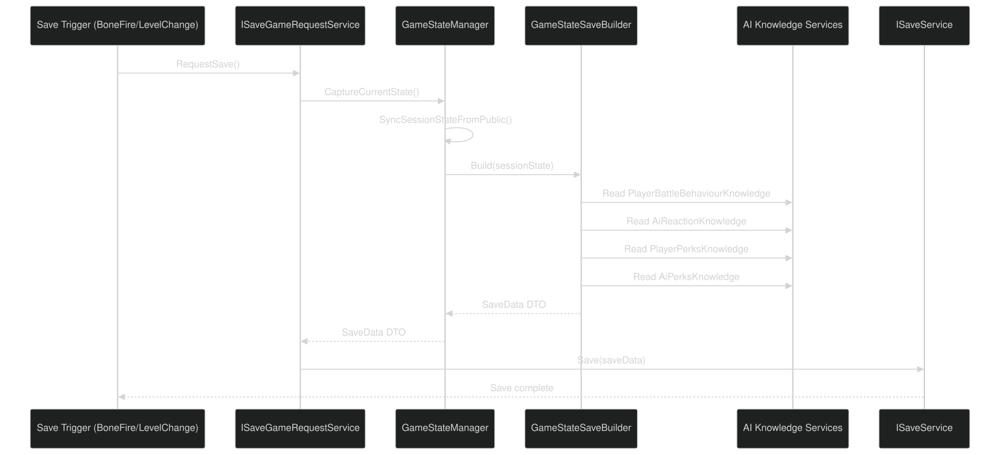

### SaveData Structure

The `SaveData` DTO contains:

- Player State:Character stats, equipment, inventory
- Position Data:Current position and last save position
- Map States:All visited levels with element states
- AI Knowledge:Player behavior patterns and AI reaction matrices (persisted across sessions)


Example from SaveData.json:

```block
{  "Player": { "Name": "Wolfsong", "LevelProgression": {...}, "VitalsDto": [...] },  "LastSavePosition": { "Level": 1, "MapElementId": { "id": 0, "subId": 0 } },  "SavedLevels": [    { "Level": 1, "MapElements": [...] },    { "Level": 2, "MapElements": [...] }  ],  "PlayerBattleBehaviorData": { "AttackPatternHistory": [...], "AttackBigrams": [...] },  "AiReactionKnowledgeData": { "Cells": [...] }}
```

Critical Insight: AI knowledge persistence means enemies remember player patterns across game sessions, implementing the core design tenet "The world remembers your habits."

Sources:  [CarnageClub/Assets/Scripts/Core/GameStateManager.cs #130-142](https://github.com/Wolfs0ng/CarnageClub/blob/0021fcdc/CarnageClub/Assets/Scripts/Core/GameStateManager.cs#L130-L142)  [CarnageClub/Assets/Scripts/Core/GameStateManager.cs #196-199](https://github.com/Wolfs0ng/CarnageClub/blob/0021fcdc/CarnageClub/Assets/Scripts/Core/GameStateManager.cs#L196-L199)  [CarnageClub/SaveData.json #1-1515](https://github.com/Wolfs0ng/CarnageClub/blob/0021fcdc/CarnageClub/SaveData.json#L1-L1515)

## Level Transition System

The `GameStateManager` listens to `LevelChange` events to coordinate level transitions, updating map state and player position atomically.

### Level Change Event Flow

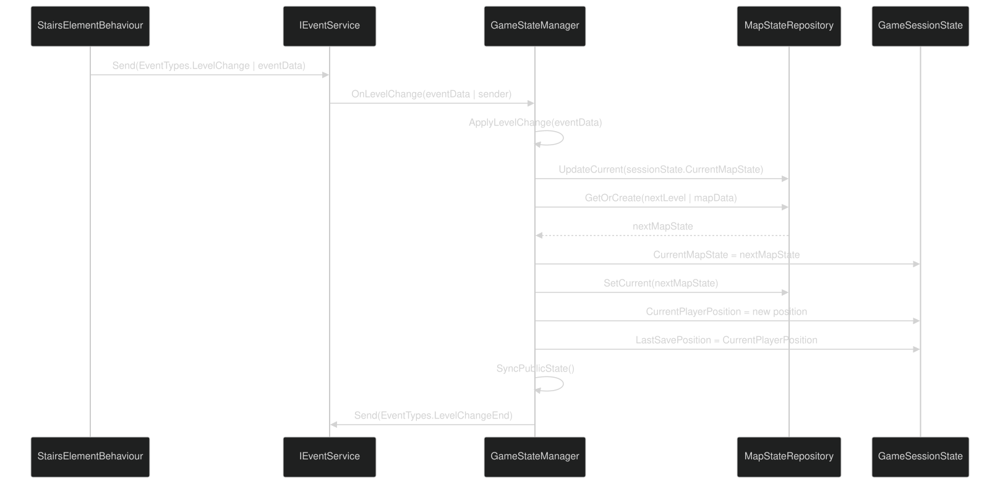

### Map Repository Role

The `MapStateRepository` maintains a collection of all visited levels, allowing the game to:

Sources:  [CarnageClub/Assets/Scripts/Core/GameStateManager.cs #219-235](https://github.com/Wolfs0ng/CarnageClub/blob/0021fcdc/CarnageClub/Assets/Scripts/Core/GameStateManager.cs#L219-L235)  [CarnageClub/Assets/Scripts/Core/GameStateManager.cs #237-258](https://github.com/Wolfs0ng/CarnageClub/blob/0021fcdc/CarnageClub/Assets/Scripts/Core/GameStateManager.cs#L237-L258)

## Service Dependencies

The `GameStateManager` requires eight service dependencies, retrieved from `ServiceLocator` during initialization.

### Service Dependency Table

### Service Resolution


Sources:  [CarnageClub/Assets/Scripts/Core/GameStateManager.cs #41-49](https://github.com/Wolfs0ng/CarnageClub/blob/0021fcdc/CarnageClub/Assets/Scripts/Core/GameStateManager.cs#L41-L49)  [CarnageClub/Assets/Scripts/Core/GameStateManager.cs #206-217](https://github.com/Wolfs0ng/CarnageClub/blob/0021fcdc/CarnageClub/Assets/Scripts/Core/GameStateManager.cs#L206-L217)

## Component Collaboration

The `GameStateManager` delegates specific responsibilities to internal helper components, maintaining separation of concerns.

### Internal Component Responsibilities


### Component Implementation Details

Sources:  [CarnageClub/Assets/Scripts/Core/GameStateManager.cs #51-55](https://github.com/Wolfs0ng/CarnageClub/blob/0021fcdc/CarnageClub/Assets/Scripts/Core/GameStateManager.cs#L51-L55)  [CarnageClub/Assets/Scripts/Core/GameStateManager.cs #188-204](https://github.com/Wolfs0ng/CarnageClub/blob/0021fcdc/CarnageClub/Assets/Scripts/Core/GameStateManager.cs#L188-L204)

## Registration and Lifecycle

The `GameStateManager` is registered as a singleton service during application startup and persists across scene transitions.

### Service Registration in AppStartup

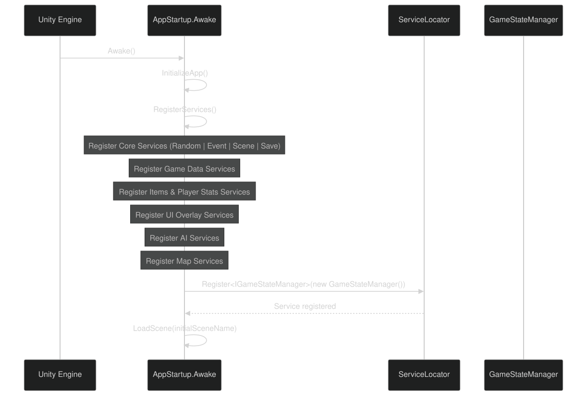

Registration Order: GameStateManager is registered in the "Gameplay Services" phase, after AI and Map services but before scene loading.

Sources:  [CarnageClub/Assets/Scripts/Core/AppStartup.cs #92-101](https://github.com/Wolfs0ng/CarnageClub/blob/0021fcdc/CarnageClub/Assets/Scripts/Core/AppStartup.cs#L92-L101)  [CarnageClub/Assets/Scripts/Core/AppStartup.cs #198-204](https://github.com/Wolfs0ng/CarnageClub/blob/0021fcdc/CarnageClub/Assets/Scripts/Core/AppStartup.cs#L198-L204)

## Usage Patterns

### Accessing Current Player State

External systems access player state through the read-only public properties:

```block
// Example: Battle system checking player HPIGameStateManager gameState = ServiceLocator.Get<IGameStateManager>();int currentHP = gameState.PlayerState.Vitals    .First(v => v.Type == VitalType.HP).Value;
```

### Updating Player Position

Map movement systems call the position update method:

```block
// Example: Player moves to new map elementIGameStateManager gameState = ServiceLocator.Get<IGameStateManager>();MapElementId newPosition = new MapElementId(1, 0);gameState.ApplyPlayerPositionUpdated(newPosition);
```

### Triggering Save Points

Checkpoint elements (BoneFire, Store) request saves:

```block
// Example: Player reaches BoneFire checkpointIGameStateManager gameState = ServiceLocator.Get<IGameStateManager>();gameState.ApplySaveRequested(currentElementId);
```

### Handling Battle Outcomes

Battle manager applies outcomes after combat:

```block
// Example: Player wins battleIGameStateManager gameState = ServiceLocator.Get<IGameStateManager>();gameState.ApplyPlayerWinAfterBattle(); // Updates map, triggers save // Example: Player loses battlegameState.ApplyPlayerLossAfterBattle(); // Resets to last checkpoint
```

Sources: Inferred from [CarnageClub/Assets/Scripts/Core/GameStateManager.cs #32-156](https://github.com/Wolfs0ng/CarnageClub/blob/0021fcdc/CarnageClub/Assets/Scripts/Core/GameStateManager.cs#L32-L156)

## Thread Safety and Mutation Control

The `GameStateManager` is not thread-safe and expects all operations to occur on Unity's main thread. State mutation is controlled through:

This design prevents:

- Uncontrolled state mutations from external systems
- Inconsistent state between public and internal representations
- Race conditions from concurrent state modifications


Sources:  [CarnageClub/Assets/Scripts/Core/GameStateManager.cs #260-274](https://github.com/Wolfs0ng/CarnageClub/blob/0021fcdc/CarnageClub/Assets/Scripts/Core/GameStateManager.cs#L260-L274)

## Summary

The `GameStateManager` serves as the authoritative state container for Carnage Club, coordinating:

- State Ownership:Single source of truth for player, map, and position data
- Initialization:Two-phase setup for new games and save loading
- State Updates:Controlled mutation through explicit methods
- Persistence:Seamless save/load with AI knowledge preservation
- Level Transitions:Atomic updates during map changes
- Battle Integration:Post-combat state synchronization
- Service Coordination:Dependency injection for cross-system communication


By centralizing state management, this system ensures gameplay consistency and provides a clean integration point for all major subsystems.