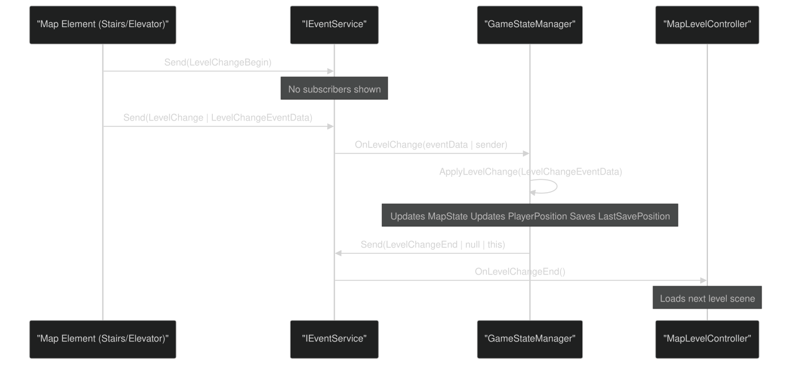
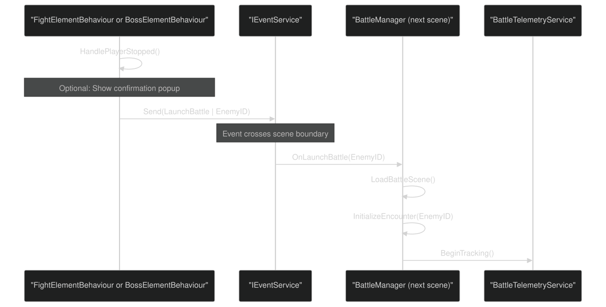
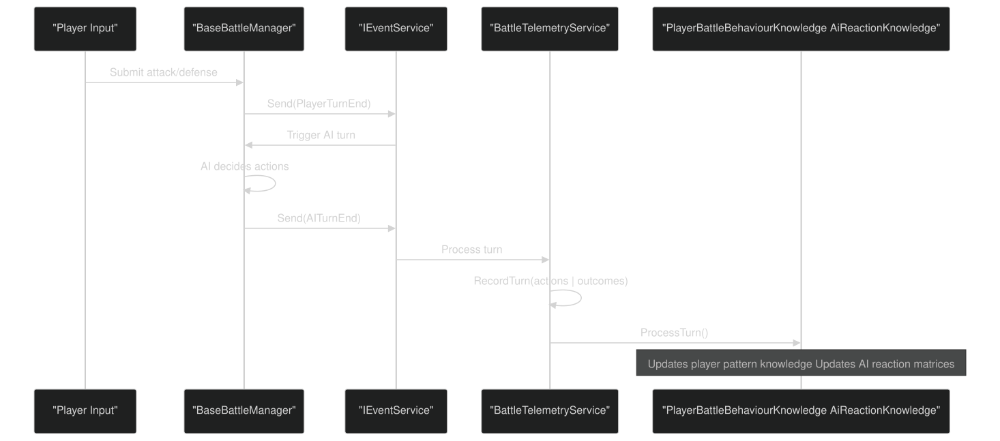

# Event Service & Communication

<details>
<summary>Relevant source files</summary>


- [CarnageClub/Assets/GameResources/Font/Cinzel-VariableFont_wght SDF.asset](https://github.com/Wolfs0ng/CarnageClub/blob/0021fcdc/CarnageClub/Assets/GameResources/Font/Cinzel-VariableFont_wght SDF.asset)
- [CarnageClub/Assets/GameResources/ScriptableObjects/BaseGameData/MapLevels/Level_1_MapData.asset](https://github.com/Wolfs0ng/CarnageClub/blob/0021fcdc/CarnageClub/Assets/GameResources/ScriptableObjects/BaseGameData/MapLevels/Level_1_MapData.asset)
- [CarnageClub/Assets/Scenes/AppStart.unity](https://github.com/Wolfs0ng/CarnageClub/blob/0021fcdc/CarnageClub/Assets/Scenes/AppStart.unity)
- [CarnageClub/Assets/Scripts/Core/AppStartup.cs](https://github.com/Wolfs0ng/CarnageClub/blob/0021fcdc/CarnageClub/Assets/Scripts/Core/AppStartup.cs)
- [CarnageClub/Assets/Scripts/Core/GameStateManager.cs](https://github.com/Wolfs0ng/CarnageClub/blob/0021fcdc/CarnageClub/Assets/Scripts/Core/GameStateManager.cs)
- [CarnageClub/Assets/Scripts/Map/Data/MapData.cs](https://github.com/Wolfs0ng/CarnageClub/blob/0021fcdc/CarnageClub/Assets/Scripts/Map/Data/MapData.cs)
- [CarnageClub/Assets/Scripts/Map/Elements/MapElement.cs](https://github.com/Wolfs0ng/CarnageClub/blob/0021fcdc/CarnageClub/Assets/Scripts/Map/Elements/MapElement.cs)
- [CarnageClub/Assets/Scripts/Utils/Core/Enum/EventTypes.cs](https://github.com/Wolfs0ng/CarnageClub/blob/0021fcdc/CarnageClub/Assets/Scripts/Utils/Core/Enum/EventTypes.cs)
- [CarnageClub/Assets/Scripts/Utils/Core/SaveService.cs](https://github.com/Wolfs0ng/CarnageClub/blob/0021fcdc/CarnageClub/Assets/Scripts/Utils/Core/SaveService.cs)
- [CarnageClub/SaveData.json](https://github.com/Wolfs0ng/CarnageClub/blob/0021fcdc/CarnageClub/SaveData.json)


</details>

## Purpose & Scope

This document explains the publish-subscribe event system that provides loose coupling between the Map, Battle, and AI systems. The `IEventService` acts as a central message bus, allowing systems to communicate without direct dependencies.

For information about how the GameStateManager coordinates state using events, see [Game State Manager](#4.1) . For details on the save/load system that uses events to trigger persistence, see [Save & Load System](#4.3) .

## Architecture Overview

The event system follows a classic observer pattern (pub/sub) where:

- `IEventService.Send()`Publishers send events via
- `IEventService.Subscribe()`Subscribers register handlers via
- Event delivery is synchronous and happens immediately on send
- No direct coupling exists between publishers and subscribers


Sources:  [CarnageClub/Assets/Scripts/Core/AppStartup.cs #128](https://github.com/Wolfs0ng/CarnageClub/blob/0021fcdc/CarnageClub/Assets/Scripts/Core/AppStartup.cs#L128-L128)  [CarnageClub/Assets/Scripts/Core/GameStateManager.cs #41-278](https://github.com/Wolfs0ng/CarnageClub/blob/0021fcdc/CarnageClub/Assets/Scripts/Core/GameStateManager.cs#L41-L278)

### Service Registration

The `EventService` is registered early in the application lifecycle as a singleton:


Sources:  [CarnageClub/Assets/Scripts/Core/AppStartup.cs #99-131](https://github.com/Wolfs0ng/CarnageClub/blob/0021fcdc/CarnageClub/Assets/Scripts/Core/AppStartup.cs#L99-L131)

## Event Types & Enumeration

All events in the system are defined in the `EventTypes` enum:

Sources:  [CarnageClub/Assets/Scripts/Utils/Core/Enum/EventTypes.cs #14-24](https://github.com/Wolfs0ng/CarnageClub/blob/0021fcdc/CarnageClub/Assets/Scripts/Utils/Core/Enum/EventTypes.cs#L14-L24)

### Event Data Structures

While `EventTypes` defines the event identifiers, event-specific data is passed as separate objects:



Sources:  [CarnageClub/Assets/Scripts/Core/GameStateManager.cs #226-232](https://github.com/Wolfs0ng/CarnageClub/blob/0021fcdc/CarnageClub/Assets/Scripts/Core/GameStateManager.cs#L226-L232)  [CarnageClub/Assets/Scripts/Map/Events/LevelChangeEventData.cs](https://github.com/Wolfs0ng/CarnageClub/blob/0021fcdc/CarnageClub/Assets/Scripts/Map/Events/LevelChangeEventData.cs) (inferred)

## Event Flow Patterns

### Level Change Flow

The level change event sequence demonstrates a three-phase pattern (Begin → Execute → End):



Sources:  [CarnageClub/Assets/Scripts/Core/GameStateManager.cs #219-258](https://github.com/Wolfs0ng/CarnageClub/blob/0021fcdc/CarnageClub/Assets/Scripts/Core/GameStateManager.cs#L219-L258)

### Battle Launch Flow

Map elements trigger battle scenes via the `LaunchBattle` event:



Sources:  [Diagram 5 from high-level architecture](https://github.com/Wolfs0ng/CarnageClub/blob/0021fcdc/Diagram 5 from high-level architecture)

### Battle Turn Events

The battle system uses turn events to coordinate AI learning:



Sources:  [CarnageClub/Assets/Scripts/Utils/Core/Enum/EventTypes.cs #21-22](https://github.com/Wolfs0ng/CarnageClub/blob/0021fcdc/CarnageClub/Assets/Scripts/Utils/Core/Enum/EventTypes.cs#L21-L22)  [Diagram 2 from high-level architecture (AI telemetry flow)](https://github.com/Wolfs0ng/CarnageClub/blob/0021fcdc/Diagram 2 from high-level architecture (AI telemetry flow))

## System Integration Examples

### GameStateManager: Level Change Handler

The `GameStateManager` subscribes to level changes and updates persistent state:



Code Flow:

Sources:  [CarnageClub/Assets/Scripts/Core/GameStateManager.cs #219-279](https://github.com/Wolfs0ng/CarnageClub/blob/0021fcdc/CarnageClub/Assets/Scripts/Core/GameStateManager.cs#L219-L279)

### Map Elements: Fire-and-Forget Pattern

Map elements send events without subscribing to responses (fire-and-forget):

Sources:  [Diagram 5 from high-level architecture](https://github.com/Wolfs0ng/CarnageClub/blob/0021fcdc/Diagram 5 from high-level architecture)  [CarnageClub/Assets/GameResources/ScriptableObjects/BaseGameData/MapLevels/Level_1_MapData.asset](https://github.com/Wolfs0ng/CarnageClub/blob/0021fcdc/CarnageClub/Assets/GameResources/ScriptableObjects/BaseGameData/MapLevels/Level_1_MapData.asset) (shows behavior data structure)

### Battle System: Telemetry Coordination

The battle system uses turn events to trigger telemetry processing without tight coupling:



Sources:  [Diagram 2 from high-level architecture](https://github.com/Wolfs0ng/CarnageClub/blob/0021fcdc/Diagram 2 from high-level architecture)  [CarnageClub/Assets/Scripts/Utils/Core/Enum/EventTypes.cs #21-22](https://github.com/Wolfs0ng/CarnageClub/blob/0021fcdc/CarnageClub/Assets/Scripts/Utils/Core/Enum/EventTypes.cs#L21-L22)

## Subscription Lifecycle & Memory Management

### Subscribe/Unsubscribe Pattern

All systems that subscribe to events must unsubscribe to prevent memory leaks:



Example from GameStateManager:

```block
// Subscriptionprivate void EventSubscribe(){    eventService.Subscribe(EventTypes.LevelChange, OnLevelChange);} // Handlerprivate void OnLevelChange(object eventData, object sender){    if (eventData is not LevelChangeEventData levelChangeEventData)    {        return;    }    // ... handle event} // Cleanupprivate void EventUnsubscribe(){    eventService?.Unsubscribe(EventTypes.LevelChange, OnLevelChange);}
```

Sources:  [CarnageClub/Assets/Scripts/Core/GameStateManager.cs #219-279](https://github.com/Wolfs0ng/CarnageClub/blob/0021fcdc/CarnageClub/Assets/Scripts/Core/GameStateManager.cs#L219-L279)

### Null-Safe Unsubscription

Notice the null-conditional operator ( `?.` ) in unsubscribe calls. This pattern handles cases where:

- The service was never initialized
- Multiple dispose calls occur
- Initialization failed partway through


Sources:  [CarnageClub/Assets/Scripts/Core/GameStateManager.cs #278](https://github.com/Wolfs0ng/CarnageClub/blob/0021fcdc/CarnageClub/Assets/Scripts/Core/GameStateManager.cs#L278-L278)

## Event Data Type Safety

The event system uses `object` types for flexibility but requires runtime type checking:



Pattern:

```block
private void OnLevelChange(object eventData, object sender){    if (eventData is not LevelChangeEventData levelChangeEventData)    {        return;  // Type mismatch, ignore    }        ApplyLevelChange(levelChangeEventData);  // Safe to use}
```

Sources:  [CarnageClub/Assets/Scripts/Core/GameStateManager.cs #224-232](https://github.com/Wolfs0ng/CarnageClub/blob/0021fcdc/CarnageClub/Assets/Scripts/Core/GameStateManager.cs#L224-L232)

## Key Event Flows Summary

Sources:  [CarnageClub/Assets/Scripts/Utils/Core/Enum/EventTypes.cs #14-24](https://github.com/Wolfs0ng/CarnageClub/blob/0021fcdc/CarnageClub/Assets/Scripts/Utils/Core/Enum/EventTypes.cs#L14-L24)  [CarnageClub/Assets/Scripts/Core/GameStateManager.cs #219-235](https://github.com/Wolfs0ng/CarnageClub/blob/0021fcdc/CarnageClub/Assets/Scripts/Core/GameStateManager.cs#L219-L235)  [Diagram 5 from high-level architecture](https://github.com/Wolfs0ng/CarnageClub/blob/0021fcdc/Diagram 5 from high-level architecture)

## Design Benefits

The event-based architecture provides:

Trade-offs:

- Runtime type checking required (no compile-time safety for event data)
- Subscription lifecycle must be managed manually (risk of memory leaks)
- Event flow can be harder to trace than direct method calls


Sources:  [Diagram 1 from high-level architecture (shows EventService connections)](https://github.com/Wolfs0ng/CarnageClub/blob/0021fcdc/Diagram 1 from high-level architecture (shows EventService connections))