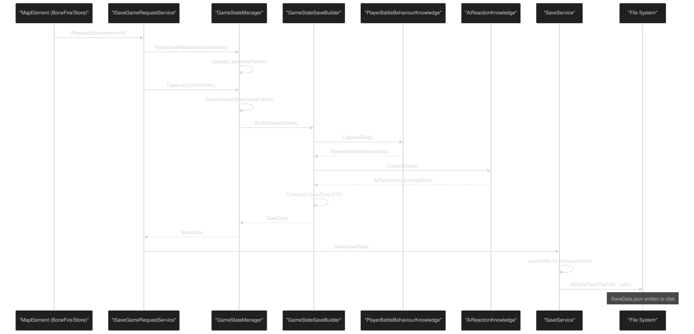
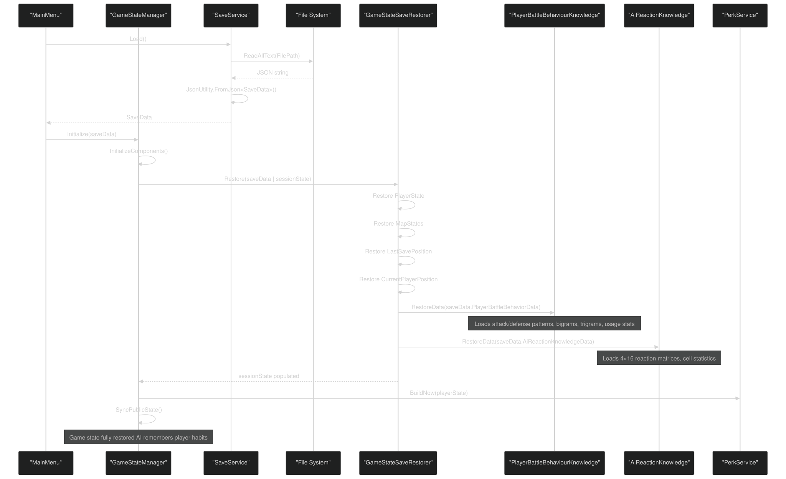

# Save & Load System

<details>
<summary>Relevant source files</summary>


- [CarnageClub/Assets/GameResources/Font/Cinzel-VariableFont_wght SDF.asset](https://github.com/Wolfs0ng/CarnageClub/blob/0021fcdc/CarnageClub/Assets/GameResources/Font/Cinzel-VariableFont_wght SDF.asset)
- [CarnageClub/Assets/GameResources/ScriptableObjects/BaseGameData/MapLevels/Level_1_MapData.asset](https://github.com/Wolfs0ng/CarnageClub/blob/0021fcdc/CarnageClub/Assets/GameResources/ScriptableObjects/BaseGameData/MapLevels/Level_1_MapData.asset)
- [CarnageClub/Assets/Scenes/AppStart.unity](https://github.com/Wolfs0ng/CarnageClub/blob/0021fcdc/CarnageClub/Assets/Scenes/AppStart.unity)
- [CarnageClub/Assets/Scripts/Core/AppStartup.cs](https://github.com/Wolfs0ng/CarnageClub/blob/0021fcdc/CarnageClub/Assets/Scripts/Core/AppStartup.cs)
- [CarnageClub/Assets/Scripts/Core/GameStateManager.cs](https://github.com/Wolfs0ng/CarnageClub/blob/0021fcdc/CarnageClub/Assets/Scripts/Core/GameStateManager.cs)
- [CarnageClub/Assets/Scripts/Map/Data/MapData.cs](https://github.com/Wolfs0ng/CarnageClub/blob/0021fcdc/CarnageClub/Assets/Scripts/Map/Data/MapData.cs)
- [CarnageClub/Assets/Scripts/Map/Elements/MapElement.cs](https://github.com/Wolfs0ng/CarnageClub/blob/0021fcdc/CarnageClub/Assets/Scripts/Map/Elements/MapElement.cs)
- [CarnageClub/Assets/Scripts/Utils/Core/Enum/EventTypes.cs](https://github.com/Wolfs0ng/CarnageClub/blob/0021fcdc/CarnageClub/Assets/Scripts/Utils/Core/Enum/EventTypes.cs)
- [CarnageClub/Assets/Scripts/Utils/Core/SaveService.cs](https://github.com/Wolfs0ng/CarnageClub/blob/0021fcdc/CarnageClub/Assets/Scripts/Utils/Core/SaveService.cs)
- [CarnageClub/SaveData.json](https://github.com/Wolfs0ng/CarnageClub/blob/0021fcdc/CarnageClub/SaveData.json)


</details>

## Purpose & Scope

The Save & Load System provides persistence for all game state across sessions, including player progression, map exploration, and AI learning data . This system ensures that "The world remembers your habits" by serializing player behavior patterns and AI reaction matrices to disk. For information about how the AI uses this persisted knowledge, see [Layers 1-2: Knowledge Systems](#3.3) . For details on game state management during runtime, see [Game State Manager](#4.1) .

Sources:  [CarnageClub/Assets/Scripts/Core/GameStateManager.cs #1-281](https://github.com/Wolfs0ng/CarnageClub/blob/0021fcdc/CarnageClub/Assets/Scripts/Core/GameStateManager.cs#L1-L281)

## SaveData Structure

The `SaveData` class is the root DTO (Data Transfer Object) that encapsulates all persistable game state. It uses Unity's `JsonUtility` for serialization, resulting in a human-readable JSON file.

### SaveData Schema



### Key Data Categories

Sources:  [CarnageClub/SaveData.json #1-1362](https://github.com/Wolfs0ng/CarnageClub/blob/0021fcdc/CarnageClub/SaveData.json#L1-L1362)  [CarnageClub/Assets/Scripts/Core/GameStateManager.cs #130-142](https://github.com/Wolfs0ng/CarnageClub/blob/0021fcdc/CarnageClub/Assets/Scripts/Core/GameStateManager.cs#L130-L142)

## Save Flow Architecture

The save process involves capturing runtime state from `GameStateManager` , transforming it into a `SaveData` DTO, and writing it to disk.

### Save Orchestration



### GameStateSaveBuilder

The `GameStateSaveBuilder` is responsible for capturing the complete game state from various sources and assembling it into a `SaveData` object.

Key Responsibilities:

- Capture player state (vitals, equipment, progression)
- Capture map states for all levels
- `PlayerBattleBehaviourKnowledge`Capture AI knowledge from
- `AiReactionKnowledge`Capture AI knowledge from
- `PlayerPerksKnowledge``AiPerksKnowledge`Capture perk knowledge from and
- Set metadata (version, timestamp)


Sources:  [CarnageClub/Assets/Scripts/Core/GameStateManager.cs #196-199](https://github.com/Wolfs0ng/CarnageClub/blob/0021fcdc/CarnageClub/Assets/Scripts/Core/GameStateManager.cs#L196-L199)  [CarnageClub/Assets/Scripts/Core/GameStateManager.cs #130-142](https://github.com/Wolfs0ng/CarnageClub/blob/0021fcdc/CarnageClub/Assets/Scripts/Core/GameStateManager.cs#L130-L142)

## Load Flow Architecture

The load process deserializes the `SaveData` JSON file and restores runtime state across all systems.

### Load Orchestration



### GameStateSaveRestorer

The `GameStateSaveRestorer` reverses the save process, populating runtime state from the `SaveData` DTO.

Key Responsibilities:

- `GameSessionState`Restore player state to
- `MapStateRepository`Restore map states to
- Restore player position and last save position
- `PlayerBattleBehaviourKnowledge`Restore AI knowledge to
- `AiReactionKnowledge`Restore AI knowledge to
- `PlayerPerksKnowledge``AiPerksKnowledge`Restore perk knowledge to and


Sources:  [CarnageClub/Assets/Scripts/Core/GameStateManager.cs #96-110](https://github.com/Wolfs0ng/CarnageClub/blob/0021fcdc/CarnageClub/Assets/Scripts/Core/GameStateManager.cs#L96-L110)  [CarnageClub/Assets/Scripts/Core/GameStateManager.cs #198-199](https://github.com/Wolfs0ng/CarnageClub/blob/0021fcdc/CarnageClub/Assets/Scripts/Core/GameStateManager.cs#L198-L199)

## AI Knowledge Persistence (Critical Feature)

One of the most important aspects of the save system is the persistence of AI learning data. This implements the core game concept: "The world remembers your habits."

### Persisted AI Data



### PlayerBattleBehaviorData Example

From [CarnageClub/SaveData.json #662-1019](https://github.com/Wolfs0ng/CarnageClub/blob/0021fcdc/CarnageClub/SaveData.json#L662-L1019) :

```block
"<PlayerBattleBehaviorData>k__BackingField": {    "AttackPatternHistory": [1, 4, 8, 1, 2, 4, 8, 4, 1, 2, 2, 4],    "DefendPatternHistory": [10, 6, 5, 10, 5, 6, 9, 6, 6, 6, 12, 9],    "AttackBigrams": [        {"Key": "1025", "Value": 1},        {"Key": "2052", "Value": 2}    ],    "AttackPatternUsageCount": [        {"Key": "1", "Value": 3},        {"Key": "4", "Value": 4},        {"Key": "8", "Value": 2}    ]}
```

What This Means:

- `4`The AI has learned the player uses attack pattern most frequently (4 times)
- `"2052"`Bigrams like track sequential pattern transitions
- This data feeds into the AI's decision-making in future battles


### AiReactionKnowledgeData Example

From [CarnageClub/SaveData.json #1020-1362](https://github.com/Wolfs0ng/CarnageClub/blob/0021fcdc/CarnageClub/SaveData.json#L1020-L1362) :

```block
"<AiReactionKnowledgeData>k__BackingField": {    "Cells": [        {            "Key": 1536,            "Stats": {                "Uses": 3,                "HitHpCount": 3,                "HpDamageSum": 9            }        }    ]}
```

What This Means:

- `1536`The packed key represents a specific AI attack/defense combination
- Against this player, this combo succeeded 3 times, dealing 9 total HP damage
- The AI uses this effectiveness data to rank future action candidates


Sources:  [CarnageClub/SaveData.json #662-1362](https://github.com/Wolfs0ng/CarnageClub/blob/0021fcdc/CarnageClub/SaveData.json#L662-L1362)  [CarnageClub/Assets/Scripts/Core/GameStateManager.cs #196-199](https://github.com/Wolfs0ng/CarnageClub/blob/0021fcdc/CarnageClub/Assets/Scripts/Core/GameStateManager.cs#L196-L199)

## Save Triggers

The save system is triggered by specific map element interactions, ensuring players can establish checkpoints.

### Trigger Points

### BoneFire/Store Save Flow


### Level Transition Save

When the player uses Stairs or Elevator elements to change levels, the system:

Sources:  [CarnageClub/Assets/Scripts/Core/GameStateManager.cs #124-128](https://github.com/Wolfs0ng/CarnageClub/blob/0021fcdc/CarnageClub/Assets/Scripts/Core/GameStateManager.cs#L124-L128)  [CarnageClub/Assets/Scripts/Core/GameStateManager.cs #224-258](https://github.com/Wolfs0ng/CarnageClub/blob/0021fcdc/CarnageClub/Assets/Scripts/Core/GameStateManager.cs#L224-L258)

## File Management

### SaveService Implementation

The `SaveService` class handles low-level file I/O operations for the save system.

File Path Logic:



File Format:

- Format:`JsonUtility`JSON (Unity's )
- Pretty Print:`JsonUtility.ToJson(data, true)`Enabled in current implementation (see line 106: )
- Encoding:UTF-8
- Extension:`.json`


Key Methods:

| Method | Purpose | Implementation | 
| --- | --- | --- |
| Save(SaveData data) | Write SaveData to disk | CarnageClub/Assets/Scripts/Utils/Core/SaveService.cs#91-111 | 
| Load() | Read SaveData from disk | CarnageClub/Assets/Scripts/Utils/Core/SaveService.cs#120-143 | 
| DeleteSave() | Remove save file | CarnageClub/Assets/Scripts/Utils/Core/SaveService.cs#152-168 | 
| SetDataName(string) | Change save file name | CarnageClub/Assets/Scripts/Utils/Core/SaveService.cs#71-84 | 


### Error Handling

The `Load()` method includes fallback logic:

Sources:  [CarnageClub/Assets/Scripts/Utils/Core/SaveService.cs #1-182](https://github.com/Wolfs0ng/CarnageClub/blob/0021fcdc/CarnageClub/Assets/Scripts/Utils/Core/SaveService.cs#L1-L182)

## Integration with GameStateManager

The save/load system is tightly integrated with `GameStateManager` , which acts as the single source of truth for runtime state.

### State Synchronization



### Key Methods

Sources:  [CarnageClub/Assets/Scripts/Core/GameStateManager.cs #59-110](https://github.com/Wolfs0ng/CarnageClub/blob/0021fcdc/CarnageClub/Assets/Scripts/Core/GameStateManager.cs#L59-L110)  [CarnageClub/Assets/Scripts/Core/GameStateManager.cs #260-274](https://github.com/Wolfs0ng/CarnageClub/blob/0021fcdc/CarnageClub/Assets/Scripts/Core/GameStateManager.cs#L260-L274)

## Service Registration

The save/load components are registered during application startup as part of the Service Locator pattern.



Registration Order:

Sources:  [CarnageClub/Assets/Scripts/Core/AppStartup.cs #98-123](https://github.com/Wolfs0ng/CarnageClub/blob/0021fcdc/CarnageClub/Assets/Scripts/Core/AppStartup.cs#L98-L123)  [CarnageClub/Assets/Scripts/Core/AppStartup.cs #198-204](https://github.com/Wolfs0ng/CarnageClub/blob/0021fcdc/CarnageClub/Assets/Scripts/Core/AppStartup.cs#L198-L204)

## Nemesis System Integration

When a player loses a battle, the save/load system works with the Nemesis System to reset player position:

This creates the core loop: player defeats strengthen enemies and the AI becomes smarter over time.

Sources:  [CarnageClub/Assets/Scripts/Core/GameStateManager.cs #150-156](https://github.com/Wolfs0ng/CarnageClub/blob/0021fcdc/CarnageClub/Assets/Scripts/Core/GameStateManager.cs#L150-L156)