# Core Systems

Relevant source files

- [CarnageClub/Assets/GameResources/ScriptableObjects/BaseGameData/MapLevels/Level_1_MapData.asset](https://github.com/Wolfs0ng/CarnageClub/blob/0021fcdc/CarnageClub/Assets/GameResources/ScriptableObjects/BaseGameData/MapLevels/Level_1_MapData.asset)
- [CarnageClub/Assets/Scenes/AppStart.unity](https://github.com/Wolfs0ng/CarnageClub/blob/0021fcdc/CarnageClub/Assets/Scenes/AppStart.unity)
- [CarnageClub/Assets/Scripts/Core/AppStartup.cs](https://github.com/Wolfs0ng/CarnageClub/blob/0021fcdc/CarnageClub/Assets/Scripts/Core/AppStartup.cs)
- [CarnageClub/Assets/Scripts/Core/GameStateManager.cs](https://github.com/Wolfs0ng/CarnageClub/blob/0021fcdc/CarnageClub/Assets/Scripts/Core/GameStateManager.cs)
- [CarnageClub/SaveData.json](https://github.com/Wolfs0ng/CarnageClub/blob/0021fcdc/CarnageClub/SaveData.json)

## Purpose and Scope

This page documents the foundational infrastructure systems that support all gameplay in Carnage Club. The Core Systems consist of three interconnected components:

For detailed implementation of the Game State Manager, see [4.1](#4.1) . For event system specifics, see [4.2](#4.2) . For save/load mechanics, see [4.3](#4.3) .

These systems form the backbone of the application, initialized during app startup and persisting throughout the entire session lifecycle.

## System Architecture Overview

The Core Systems operate as a layered architecture where the Service Locator pattern provides dependency injection, the Event Service enables decoupled communication, and the Game State Manager orchestrates state mutations through specialized handlers.


Sources:  [CarnageClub/Assets/Scripts/Core/AppStartup.cs #92-123](https://github.com/Wolfs0ng/CarnageClub/blob/0021fcdc/CarnageClub/Assets/Scripts/Core/AppStartup.cs#L92-L123)  [CarnageClub/Assets/Scripts/Core/GameStateManager.cs #32-56](https://github.com/Wolfs0ng/CarnageClub/blob/0021fcdc/CarnageClub/Assets/Scripts/Core/GameStateManager.cs#L32-L56)

## Service Registration Flow

All Core Systems are registered during application startup through the Service Locator pattern. The registration order is critical, as later services depend on earlier ones.

### Registration Sequence

The registration happens in `AppStartup.Awake()` :

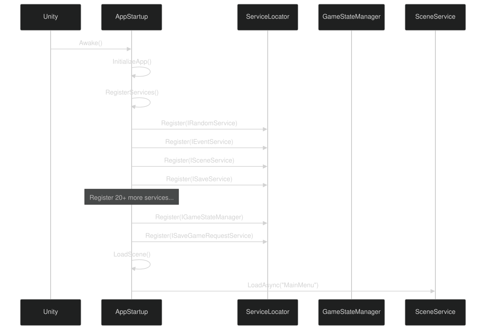

Sources:  [CarnageClub/Assets/Scripts/Core/AppStartup.cs #92-101](https://github.com/Wolfs0ng/CarnageClub/blob/0021fcdc/CarnageClub/Assets/Scripts/Core/AppStartup.cs#L92-L101)  [CarnageClub/Assets/Scripts/Core/AppStartup.cs #105-123](https://github.com/Wolfs0ng/CarnageClub/blob/0021fcdc/CarnageClub/Assets/Scripts/Core/AppStartup.cs#L105-L123)  [CarnageClub/Assets/Scripts/Core/AppStartup.cs #198-204](https://github.com/Wolfs0ng/CarnageClub/blob/0021fcdc/CarnageClub/Assets/Scripts/Core/AppStartup.cs#L198-L204)

### Service Locator Access Pattern

All systems retrieve dependencies via static `ServiceLocator.Get<T>()` calls:


Sources:  [CarnageClub/Assets/Scripts/Core/GameStateManager.cs #206-217](https://github.com/Wolfs0ng/CarnageClub/blob/0021fcdc/CarnageClub/Assets/Scripts/Core/GameStateManager.cs#L206-L217)

## Game State Manager Architecture

The `GameStateManager` is the single source of truth for all runtime game state. It maintains public immutable properties and manages internal mutable state through `GameSessionState` .

### State Hierarchy


Sources:  [CarnageClub/Assets/Scripts/Core/GameStateManager.cs #32-56](https://github.com/Wolfs0ng/CarnageClub/blob/0021fcdc/CarnageClub/Assets/Scripts/Core/GameStateManager.cs#L32-L56)  [CarnageClub/Assets/Scripts/Core/GameStateManager.cs #260-266](https://github.com/Wolfs0ng/CarnageClub/blob/0021fcdc/CarnageClub/Assets/Scripts/Core/GameStateManager.cs#L260-L266)

### Initialization Patterns

The `GameStateManager` supports two initialization modes:
New Game Initialization
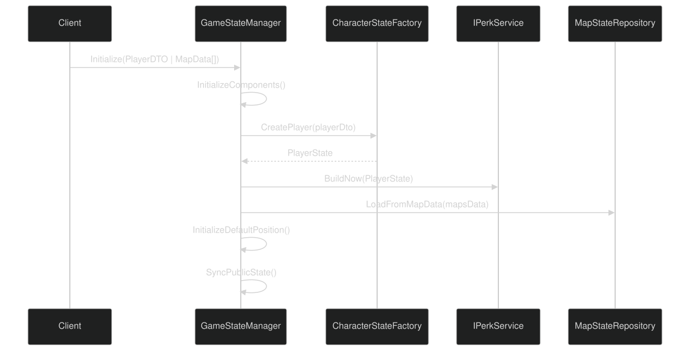

Sources:  [CarnageClub/Assets/Scripts/Core/GameStateManager.cs #64-93](https://github.com/Wolfs0ng/CarnageClub/blob/0021fcdc/CarnageClub/Assets/Scripts/Core/GameStateManager.cs#L64-L93)
Load Game Initialization
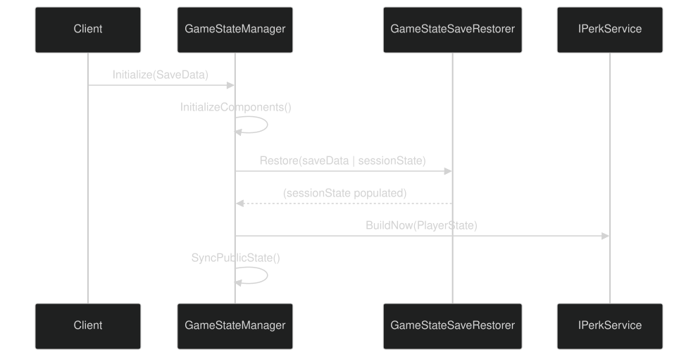

Sources:  [CarnageClub/Assets/Scripts/Core/GameStateManager.cs #96-110](https://github.com/Wolfs0ng/CarnageClub/blob/0021fcdc/CarnageClub/Assets/Scripts/Core/GameStateManager.cs#L96-L110)

### State Mutation Methods

Sources:  [CarnageClub/Assets/Scripts/Core/GameStateManager.cs #112-156](https://github.com/Wolfs0ng/CarnageClub/blob/0021fcdc/CarnageClub/Assets/Scripts/Core/GameStateManager.cs#L112-L156)

## Event Service Communication

The `IEventService` provides a pub/sub event bus that decouples systems. The `GameStateManager` subscribes to events and sends events to notify other systems of state changes.

### Event Subscription Pattern


The `GameStateManager` subscribes during initialization:

Sources:  [CarnageClub/Assets/Scripts/Core/GameStateManager.cs #219-222](https://github.com/Wolfs0ng/CarnageClub/blob/0021fcdc/CarnageClub/Assets/Scripts/Core/GameStateManager.cs#L219-L222)  [CarnageClub/Assets/Scripts/Core/GameStateManager.cs #224-235](https://github.com/Wolfs0ng/CarnageClub/blob/0021fcdc/CarnageClub/Assets/Scripts/Core/GameStateManager.cs#L224-L235)

### Level Change Event Flow

When a level change event occurs, the `GameStateManager` orchestrates the transition:

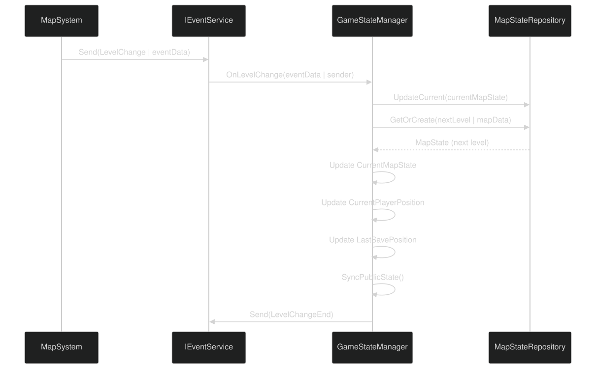

Sources:  [CarnageClub/Assets/Scripts/Core/GameStateManager.cs #224-258](https://github.com/Wolfs0ng/CarnageClub/blob/0021fcdc/CarnageClub/Assets/Scripts/Core/GameStateManager.cs#L224-L258)

## Save and Load System Architecture

The persistence system uses a builder/restorer pattern to convert between runtime state and serializable DTOs. AI knowledge systems are also included in the save data to implement "The world remembers your habits."

### SaveData Structure

The `SaveData` JSON includes:

Sources:  [CarnageClub/SaveData.json #1-1515](https://github.com/Wolfs0ng/CarnageClub/blob/0021fcdc/CarnageClub/SaveData.json#L1-L1515)

### Save Operation Flow

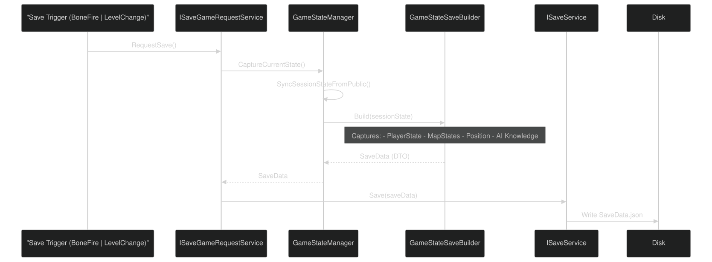

Sources:  [CarnageClub/Assets/Scripts/Core/GameStateManager.cs #130-142](https://github.com/Wolfs0ng/CarnageClub/blob/0021fcdc/CarnageClub/Assets/Scripts/Core/GameStateManager.cs#L130-L142)  [CarnageClub/Assets/Scripts/Core/GameStateManager.cs #268-274](https://github.com/Wolfs0ng/CarnageClub/blob/0021fcdc/CarnageClub/Assets/Scripts/Core/GameStateManager.cs#L268-L274)

### Load Operation Flow

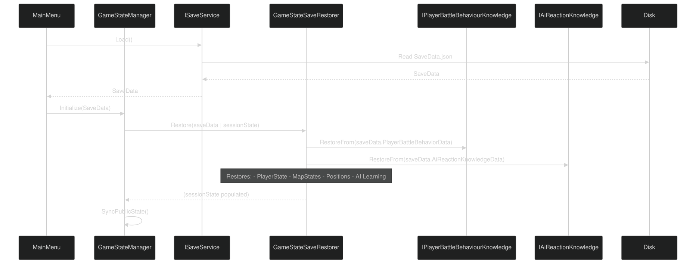

Sources:  [CarnageClub/Assets/Scripts/Core/GameStateManager.cs #96-110](https://github.com/Wolfs0ng/CarnageClub/blob/0021fcdc/CarnageClub/Assets/Scripts/Core/GameStateManager.cs#L96-L110)

### GameStateSaveBuilder Dependencies

The save builder requires references to all persistent knowledge systems to include them in the save file:


Sources:  [CarnageClub/Assets/Scripts/Core/GameStateManager.cs #196-199](https://github.com/Wolfs0ng/CarnageClub/blob/0021fcdc/CarnageClub/Assets/Scripts/Core/GameStateManager.cs#L196-L199)

## After-Battle State Application

The `AfterBattleMapApplier` handles post-combat map state updates. This ensures victories unlock new areas and defeats respawn the player.

### Win/Loss State Mutations


Sources:  [CarnageClub/Assets/Scripts/Core/GameStateManager.cs #144-156](https://github.com/Wolfs0ng/CarnageClub/blob/0021fcdc/CarnageClub/Assets/Scripts/Core/GameStateManager.cs#L144-L156)

### Integration with Map System

The `AfterBattleMapApplier` coordinates with the map element update service:

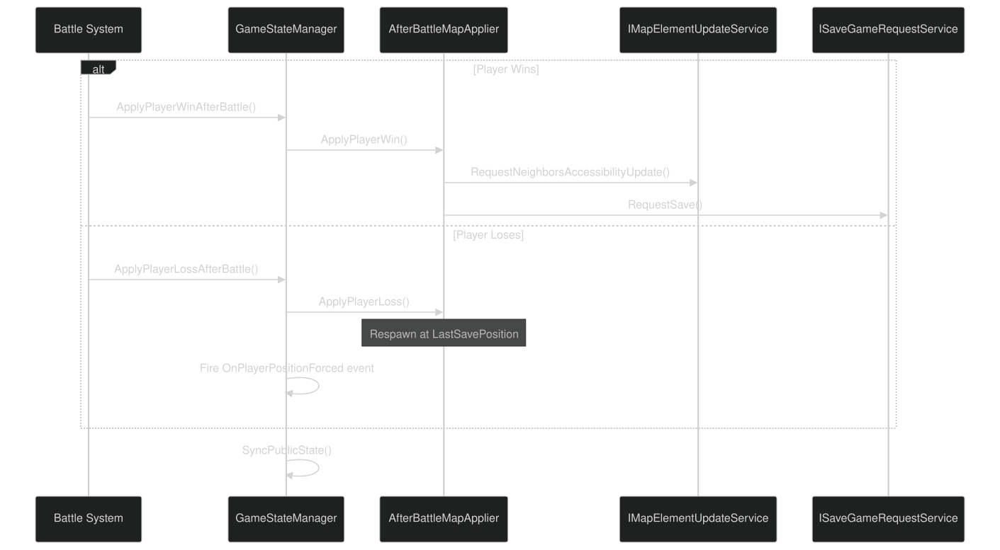

Sources:  [CarnageClub/Assets/Scripts/Core/GameStateManager.cs #144-156](https://github.com/Wolfs0ng/CarnageClub/blob/0021fcdc/CarnageClub/Assets/Scripts/Core/GameStateManager.cs#L144-L156)

## State Synchronization Pattern

The `GameStateManager` maintains a strict separation between internal mutable state ( `GameSessionState` ) and public immutable state (properties). Synchronization happens explicitly via `SyncPublicState()` .

### Synchronization Flow


This pattern ensures:

- External systems cannot mutate state directly
- `GameStateManager`All mutations go through methods
- State changes are atomic and traceable

Sources:  [CarnageClub/Assets/Scripts/Core/GameStateManager.cs #260-266](https://github.com/Wolfs0ng/CarnageClub/blob/0021fcdc/CarnageClub/Assets/Scripts/Core/GameStateManager.cs#L260-L266)  [CarnageClub/Assets/Scripts/Core/GameStateManager.cs #268-274](https://github.com/Wolfs0ng/CarnageClub/blob/0021fcdc/CarnageClub/Assets/Scripts/Core/GameStateManager.cs#L268-L274)

## Dependency Graph

The Core Systems form the foundation for all other systems. This graph shows which systems depend on Core Systems:


Sources:  [CarnageClub/Assets/Scripts/Core/AppStartup.cs #105-210](https://github.com/Wolfs0ng/CarnageClub/blob/0021fcdc/CarnageClub/Assets/Scripts/Core/AppStartup.cs#L105-L210)  [CarnageClub/Assets/Scripts/Core/GameStateManager.cs #206-217](https://github.com/Wolfs0ng/CarnageClub/blob/0021fcdc/CarnageClub/Assets/Scripts/Core/GameStateManager.cs#L206-L217)