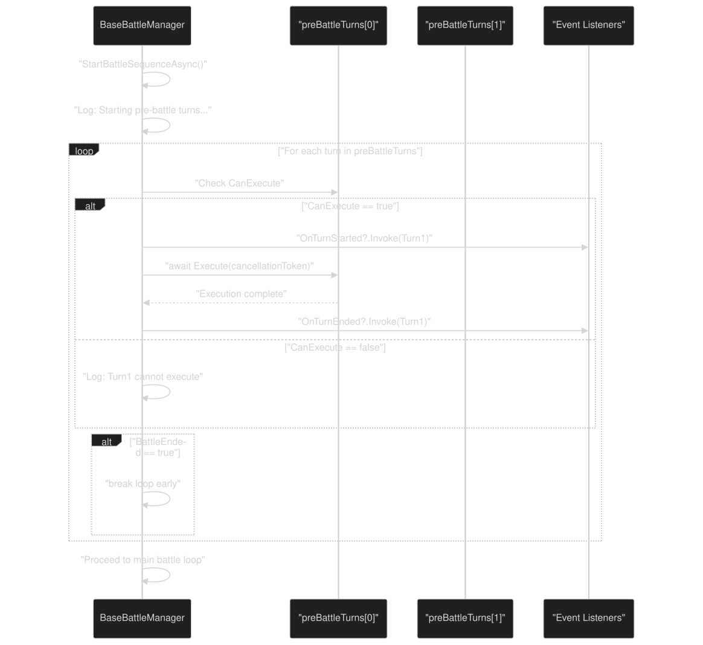
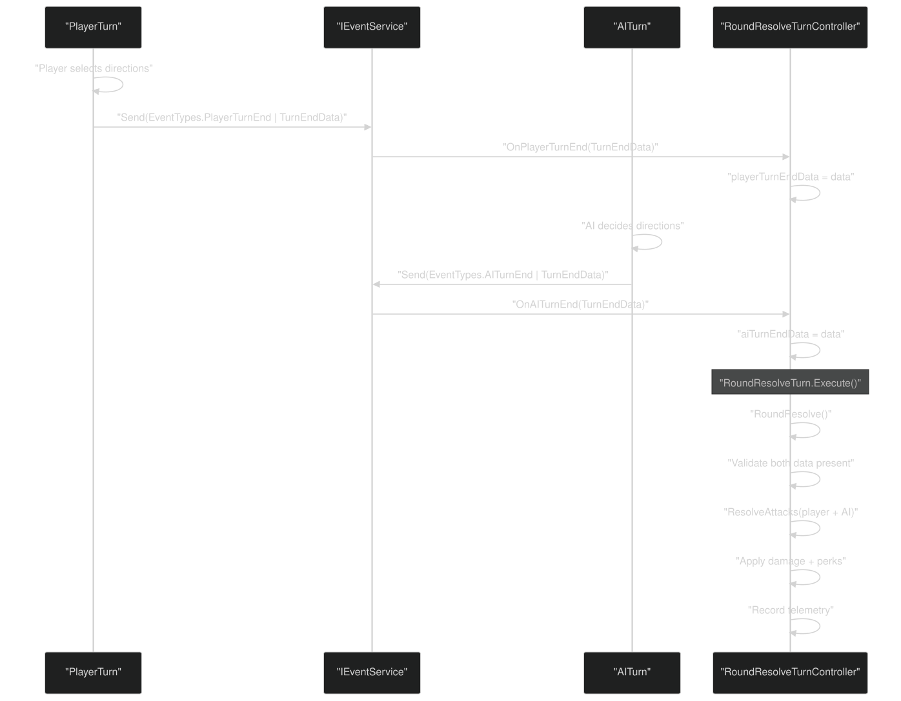

# Battle Flow & Turn Management

<details>
<summary>Relevant source files</summary>


- [CarnageClub/Assets/Scenes/Battle.unity](https://github.com/Wolfs0ng/CarnageClub/blob/0021fcdc/CarnageClub/Assets/Scenes/Battle.unity)
- [CarnageClub/Assets/Scripts/Battle/Abstract/BaseBattleManager.cs](https://github.com/Wolfs0ng/CarnageClub/blob/0021fcdc/CarnageClub/Assets/Scripts/Battle/Abstract/BaseBattleManager.cs)
- [CarnageClub/Assets/Scripts/Battle/Turns/Controllers/RoundResolveTurnController.cs](https://github.com/Wolfs0ng/CarnageClub/blob/0021fcdc/CarnageClub/Assets/Scripts/Battle/Turns/Controllers/RoundResolveTurnController.cs)
- [CarnageClub/Assets/Scripts/Battle/Turns/RoundResolveTurn.cs](https://github.com/Wolfs0ng/CarnageClub/blob/0021fcdc/CarnageClub/Assets/Scripts/Battle/Turns/RoundResolveTurn.cs)
- [CarnageClub/Assets/Scripts/Utils/Core/Abstract/ISceneService.cs](https://github.com/Wolfs0ng/CarnageClub/blob/0021fcdc/CarnageClub/Assets/Scripts/Utils/Core/Abstract/ISceneService.cs)
- [CarnageClub/Assets/Scripts/Utils/Core/SceneService.cs](https://github.com/Wolfs0ng/CarnageClub/blob/0021fcdc/CarnageClub/Assets/Scripts/Utils/Core/SceneService.cs)


</details>

## Purpose and Scope

This document explains the battle lifecycle and turn management system in Carnage Club. It covers how battles are structured as a sequence of pre-battle , main battle loop , and post-battle phases, and how the `BaseBattleManager` orchestrates the execution of `IBattleTurn` implementations.

For details on attack resolution mechanics (Hit/Block/Parry outcomes, damage calculation), see [5.3](#5.3) . For round resolution specifics (perk execution, telemetry recording), see [5.2](#5.2) . For battle UI components , see [5.4](#5.4) .

Sources:  [CarnageClub/Assets/Scripts/Battle/Abstract/BaseBattleManager.cs #1-263](https://github.com/Wolfs0ng/CarnageClub/blob/0021fcdc/CarnageClub/Assets/Scripts/Battle/Abstract/BaseBattleManager.cs#L1-L263)

## Battle Lifecycle Overview

Battles follow a strict three-phase lifecycle managed by `BaseBattleManager` :

### Battle Lifecycle Diagram



Sources:  [CarnageClub/Assets/Scripts/Battle/Abstract/BaseBattleManager.cs #87-228](https://github.com/Wolfs0ng/CarnageClub/blob/0021fcdc/CarnageClub/Assets/Scripts/Battle/Abstract/BaseBattleManager.cs#L87-L228)

## Turn System Architecture

### The IBattleTurn Interface

All turns implement the `IBattleTurn` interface, which defines the contract for executable battle logic units:

```block
public interface IBattleTurn{    string Name { get; }    bool CanExecute { get; }    void SetRoundIndex(int index);    UniTask Execute(CancellationToken cancellationToken);}
```

Sources:  [CarnageClub/Assets/Scripts/Battle/Turns/RoundResolveTurn.cs #22-40](https://github.com/Wolfs0ng/CarnageClub/blob/0021fcdc/CarnageClub/Assets/Scripts/Battle/Turns/RoundResolveTurn.cs#L22-L40)

### BaseBattleManager Architecture



Key responsibilities:

- `BaseBattleManager`: Orchestrates the sequential and looping execution of turn lists. Does not contain battle logic itself—only manages the execution flow and event notifications.
- `IBattleTurn`implementations: Encapsulate specific battle logic (e.g., player input, AI decision, round resolution).
- Controllers`RoundResolveTurnController`(e.g., ): Contain the actual implementation logic for turns, separated from the turn wrapper classes for testability and dependency injection.


Sources:  [CarnageClub/Assets/Scripts/Battle/Abstract/BaseBattleManager.cs #20-85](https://github.com/Wolfs0ng/CarnageClub/blob/0021fcdc/CarnageClub/Assets/Scripts/Battle/Abstract/BaseBattleManager.cs#L20-L85)  [CarnageClub/Assets/Scripts/Battle/Turns/RoundResolveTurn.cs #1-82](https://github.com/Wolfs0ng/CarnageClub/blob/0021fcdc/CarnageClub/Assets/Scripts/Battle/Turns/RoundResolveTurn.cs#L1-L82)  [CarnageClub/Assets/Scripts/Battle/Turns/Controllers/RoundResolveTurnController.cs #36-65](https://github.com/Wolfs0ng/CarnageClub/blob/0021fcdc/CarnageClub/Assets/Scripts/Battle/Turns/Controllers/RoundResolveTurnController.cs#L36-L65)

## Turn Execution Flow

### Pre-Battle Phase

Pre-battle turns execute once in sequential order . Each turn is checked for `CanExecute` before execution:



Implementation details:

- `null`Each turn is validated for before execution
- `CanExecute`acts as a dynamic gate (e.g., skip if prerequisites not met)
- `BattleEnded`Early termination via flag allows pre-battle turns to end the battle
- `OnTurnStarted``OnTurnEnded`and events fire for each executed turn


Sources:  [CarnageClub/Assets/Scripts/Battle/Abstract/BaseBattleManager.cs #118-144](https://github.com/Wolfs0ng/CarnageClub/blob/0021fcdc/CarnageClub/Assets/Scripts/Battle/Abstract/BaseBattleManager.cs#L118-L144)

### Post-Battle Phase

Post-battle turns follow the same sequential execution pattern as pre-battle, but occur after the main loop terminates:

Sources:  [CarnageClub/Assets/Scripts/Battle/Abstract/BaseBattleManager.cs #192-212](https://github.com/Wolfs0ng/CarnageClub/blob/0021fcdc/CarnageClub/Assets/Scripts/Battle/Abstract/BaseBattleManager.cs#L192-L212)

## Main Battle Loop

The main battle loop cycles through `mainBattleTurns` repeatedly until `BattleEnded` is set:

### Round and Turn Index Management



Key behaviors:

- Round increment`mainBattleRound``mainTurnIndex == 0`: increments only when (start of each cycle)
- Circular indexing`mainTurnIndex = (mainTurnIndex + 1) % mainBattleTurns.Count`: wraps around after the last turn
- Round injection`SetRoundIndex()``Execute()`: Each turn receives the current round number via before
- Yield point`await UniTask.Yield()`: after each turn allows frame-based responsiveness


Sources:  [CarnageClub/Assets/Scripts/Battle/Abstract/BaseBattleManager.cs #147-189](https://github.com/Wolfs0ng/CarnageClub/blob/0021fcdc/CarnageClub/Assets/Scripts/Battle/Abstract/BaseBattleManager.cs#L147-L189)

### Example Turn Cycle Sequence

For a battle with 3 main turns: `[PlayerTurn, AITurn, RoundResolveTurn]`

Sources:  [CarnageClub/Assets/Scripts/Battle/Abstract/BaseBattleManager.cs #155-187](https://github.com/Wolfs0ng/CarnageClub/blob/0021fcdc/CarnageClub/Assets/Scripts/Battle/Abstract/BaseBattleManager.cs#L155-L187)

## Turn Communication & Events

Turns coordinate via the `IEventService` pub/sub system rather than direct coupling. The `RoundResolveTurnController` demonstrates this pattern:

### Event-Based Turn Coordination



Event subscriptions in`RoundResolveTurnController`:

Sources:  [CarnageClub/Assets/Scripts/Battle/Turns/Controllers/RoundResolveTurnController.cs #146-170](https://github.com/Wolfs0ng/CarnageClub/blob/0021fcdc/CarnageClub/Assets/Scripts/Battle/Turns/Controllers/RoundResolveTurnController.cs#L146-L170)

### Turn Data Flow for Round Resolution



Sources:  [CarnageClub/Assets/Scripts/Battle/Turns/Controllers/RoundResolveTurnController.cs #79-128](https://github.com/Wolfs0ng/CarnageClub/blob/0021fcdc/CarnageClub/Assets/Scripts/Battle/Turns/Controllers/RoundResolveTurnController.cs#L79-L128)

## Battle Termination

### Ending the Battle

Any turn can terminate the battle by calling `BaseBattleManager.EndBattle(string reason)` :

Termination effects:

Sources:  [CarnageClub/Assets/Scripts/Battle/Abstract/BaseBattleManager.cs #230-247](https://github.com/Wolfs0ng/CarnageClub/blob/0021fcdc/CarnageClub/Assets/Scripts/Battle/Abstract/BaseBattleManager.cs#L230-L247)

### Cleanup Process

When the battle sequence completes (normally or via cancellation):

```block
private void CleanupResources(){    preBattleTurns?.Clear();    mainBattleTurns?.Clear();    postBattleTurns?.Clear();        OnTurnStarted = null;    OnTurnEnded = null;    OnBattleEnded = null;    BattleEnded = false;}
```

Cleanup guarantees:

- All turn lists cleared (releases references)
- All event handlers unsubscribed (prevents memory leaks)
- `BattleEnded``false`reset to (allows reuse if manager instance persists)
- `finally`Executes in block (runs even if exception or cancellation occurs)


Sources:  [CarnageClub/Assets/Scripts/Battle/Abstract/BaseBattleManager.cs #249-261](https://github.com/Wolfs0ng/CarnageClub/blob/0021fcdc/CarnageClub/Assets/Scripts/Battle/Abstract/BaseBattleManager.cs#L249-L261)

### Cancellation Support

All turn execution supports `CancellationToken` :



Cancellation behavior:

- `Execute()``CancellationToken`Each turn's method receives the same
- `cancellationToken.ThrowIfCancellationRequested()`Turns call at safe points
- `StartBattleSequenceAsync``OperationCanceledException`catches specifically
- always`finally`Cleanup occurs via block


Sources:  [CarnageClub/Assets/Scripts/Battle/Abstract/BaseBattleManager.cs #90-228](https://github.com/Wolfs0ng/CarnageClub/blob/0021fcdc/CarnageClub/Assets/Scripts/Battle/Abstract/BaseBattleManager.cs#L90-L228)  [CarnageClub/Assets/Scripts/Battle/Turns/RoundResolveTurn.cs #41-76](https://github.com/Wolfs0ng/CarnageClub/blob/0021fcdc/CarnageClub/Assets/Scripts/Battle/Turns/RoundResolveTurn.cs#L41-L76)

## Integration with Scene Management

Battles run in the Battle scene , loaded via `ISceneService` :

Scene transition triggers:

- Map → Battle`LaunchBattle`: event sent by map element behaviors
- Battle → Map`OnBattleEnded`: Battle ends, event triggers scene transition


Sources:  [CarnageClub/Assets/Scripts/Utils/Core/Abstract/ISceneService.cs #20-64](https://github.com/Wolfs0ng/CarnageClub/blob/0021fcdc/CarnageClub/Assets/Scripts/Utils/Core/Abstract/ISceneService.cs#L20-L64)  [CarnageClub/Assets/Scripts/Utils/Core/SceneService.cs #27-122](https://github.com/Wolfs0ng/CarnageClub/blob/0021fcdc/CarnageClub/Assets/Scripts/Utils/Core/SceneService.cs#L27-L122)