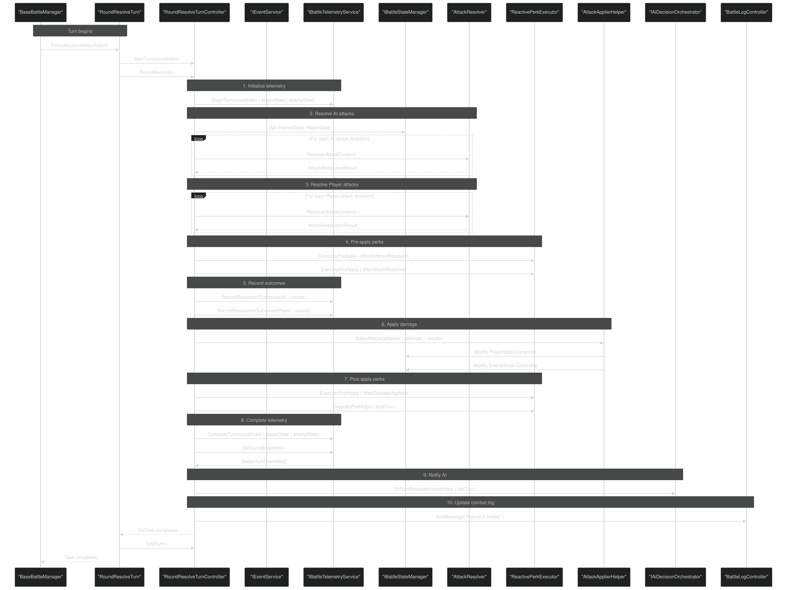
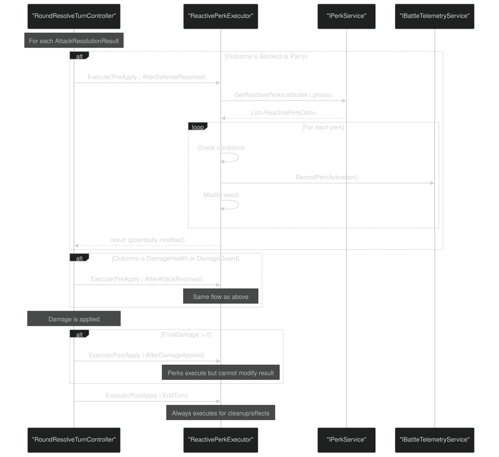

# Round Resolution & Combat Mechanics

<details>
<summary>Relevant source files</summary>


- [CarnageClub/Assets/Scenes/Battle.unity](https://github.com/Wolfs0ng/CarnageClub/blob/0021fcdc/CarnageClub/Assets/Scenes/Battle.unity)
- [CarnageClub/Assets/Scripts/Battle/Turns/Controllers/RoundResolveTurnController.cs](https://github.com/Wolfs0ng/CarnageClub/blob/0021fcdc/CarnageClub/Assets/Scripts/Battle/Turns/Controllers/RoundResolveTurnController.cs)
- [CarnageClub/Assets/Scripts/Battle/Turns/RoundResolveTurn.cs](https://github.com/Wolfs0ng/CarnageClub/blob/0021fcdc/CarnageClub/Assets/Scripts/Battle/Turns/RoundResolveTurn.cs)
- [GDD_EN.md](https://github.com/Wolfs0ng/CarnageClub/blob/0021fcdc/GDD_EN.md)
- [GDD_UA.md](https://github.com/Wolfs0ng/CarnageClub/blob/0021fcdc/GDD_UA.md)
- [README.md](https://github.com/Wolfs0ng/CarnageClub/blob/0021fcdc/README.md)


</details>

This document details the round resolution phase of the battle system: the process that occurs after both the player and AI have committed their attack and defense directions for a turn. Round resolution determines combat outcomes, applies damage, executes perks, and records telemetry data.

Scope : This page covers the orchestration and flow of round resolution. For detailed attack outcome calculation (Hit/Block/Parry logic), see [Attack Resolution & Damage System](#5.3) . For battle UI and combat log display, see [Battle UI & Combat Log](#5.4) . For the overall battle lifecycle, see [Battle Flow & Turn Management](#5.1) .

## Round Resolution Architecture

Round resolution is orchestrated by the `RoundResolveTurnController` , which acts as the central coordinator for processing combat between two actors (Player and AI). The controller receives attack/defense data from both sides, resolves all attacks, executes perks at appropriate stages, applies damage, and records outcomes.



Sources :

- [CarnageClub/Assets/Scripts/Battle/Turns/RoundResolveTurn.cs#1-82](https://github.com/Wolfs0ng/CarnageClub/blob/0021fcdc/CarnageClub/Assets/Scripts/Battle/Turns/RoundResolveTurn.cs#L1-L82)
- [CarnageClub/Assets/Scripts/Battle/Turns/Controllers/RoundResolveTurnController.cs#36-145](https://github.com/Wolfs0ng/CarnageClub/blob/0021fcdc/CarnageClub/Assets/Scripts/Battle/Turns/Controllers/RoundResolveTurnController.cs#L36-L145)


### Key Components

Sources :

- [CarnageClub/Assets/Scripts/Battle/Turns/Controllers/RoundResolveTurnController.cs#36-66](https://github.com/Wolfs0ng/CarnageClub/blob/0021fcdc/CarnageClub/Assets/Scripts/Battle/Turns/Controllers/RoundResolveTurnController.cs#L36-L66)


## Resolution Process Flow

The round resolution process follows a strict sequence to ensure deterministic combat outcomes and proper telemetry recording. The process handles attacks from both actors simultaneously, with careful attention to pre- and post-damage perk execution.



Sources :

- [CarnageClub/Assets/Scripts/Battle/Turns/Controllers/RoundResolveTurnController.cs#79-128](https://github.com/Wolfs0ng/CarnageClub/blob/0021fcdc/CarnageClub/Assets/Scripts/Battle/Turns/Controllers/RoundResolveTurnController.cs#L79-L128)
- [CarnageClub/Assets/Scripts/Battle/Turns/RoundResolveTurn.cs#41-76](https://github.com/Wolfs0ng/CarnageClub/blob/0021fcdc/CarnageClub/Assets/Scripts/Battle/Turns/RoundResolveTurn.cs#L41-L76)


### Resolution Stages

The resolution process consists of 10 distinct stages executed in strict order:

Sources :

- [CarnageClub/Assets/Scripts/Battle/Turns/Controllers/RoundResolveTurnController.cs#79-128](https://github.com/Wolfs0ng/CarnageClub/blob/0021fcdc/CarnageClub/Assets/Scripts/Battle/Turns/Controllers/RoundResolveTurnController.cs#L79-L128)


## The 4-Direction Combat System

Carnage Club uses a 4-direction attack/defense system where each direction is resolved independently. This allows for nuanced tactical play where blocking high attacks leaves you vulnerable to low attacks, and vice versa.

### Direction Enumeration

The `BattleDirection` enum defines the four combat zones:

Note : While the GDD mentions a 4th direction, the current implementation uses a 3-direction system (Head, Belly, Legs) plus None.

### Multi-Direction Support

Both attack and defense support multiple simultaneous directions :

- Attack: A character can attack 1-3 directions in a single turn (e.g., Head + Belly)
- Defense: A character can defend 1-3 directions (e.g., Belly + Legs)


Each attack direction is resolved independently against the defender's full defense set.

Sources :

- [GDD_EN.md#82-85](https://github.com/Wolfs0ng/CarnageClub/blob/0021fcdc/GDD_EN.md#L82-L85)
- [CarnageClub/Assets/Scripts/Battle/Turns/Controllers/RoundResolveTurnController.cs#172-201](https://github.com/Wolfs0ng/CarnageClub/blob/0021fcdc/CarnageClub/Assets/Scripts/Battle/Turns/Controllers/RoundResolveTurnController.cs#L172-L201)


### Per-Direction Resolution



Sources :

- [CarnageClub/Assets/Scripts/Battle/Turns/Controllers/RoundResolveTurnController.cs#83-106](https://github.com/Wolfs0ng/CarnageClub/blob/0021fcdc/CarnageClub/Assets/Scripts/Battle/Turns/Controllers/RoundResolveTurnController.cs#L83-L106)
- [CarnageClub/Assets/Scripts/Battle/Turns/Controllers/RoundResolveTurnController.cs#172-201](https://github.com/Wolfs0ng/CarnageClub/blob/0021fcdc/CarnageClub/Assets/Scripts/Battle/Turns/Controllers/RoundResolveTurnController.cs#L172-L201)


### Resolution Order

Attacks are resolved in this order:

This simultaneous resolution means both actors can damage each other in the same turn. There is no "first strike" advantage based on who acts first.

Sources :

- [CarnageClub/Assets/Scripts/Battle/Turns/Controllers/RoundResolveTurnController.cs#83-106](https://github.com/Wolfs0ng/CarnageClub/blob/0021fcdc/CarnageClub/Assets/Scripts/Battle/Turns/Controllers/RoundResolveTurnController.cs#L83-L106)


## Perk Execution During Resolution

The `ReactivePerkExecutor` processes perks at specific phases of combat resolution. Perks can modify attack outcomes before damage is applied (pre-apply) or trigger effects after damage (post-apply).

### Execution Stages



Sources :

- [CarnageClub/Assets/Scripts/Battle/Turns/Controllers/RoundResolveTurnController.cs#97-111](https://github.com/Wolfs0ng/CarnageClub/blob/0021fcdc/CarnageClub/Assets/Scripts/Battle/Turns/Controllers/RoundResolveTurnController.cs#L97-L111)
- [CarnageClub/Assets/Scripts/Battle/Turns/Controllers/RoundResolveTurnController.cs#203-263](https://github.com/Wolfs0ng/CarnageClub/blob/0021fcdc/CarnageClub/Assets/Scripts/Battle/Turns/Controllers/RoundResolveTurnController.cs#L203-L263)


### Pre-Apply vs Post-Apply

The distinction is critical: pre-apply perks can change what damage gets applied , while post-apply perks react to the damage that was applied .

Sources :

- [CarnageClub/Assets/Scripts/Battle/Turns/Controllers/RoundResolveTurnController.cs#203-263](https://github.com/Wolfs0ng/CarnageClub/blob/0021fcdc/CarnageClub/Assets/Scripts/Battle/Turns/Controllers/RoundResolveTurnController.cs#L203-L263)


### Perk Execution Flow



Sources :

- [CarnageClub/Assets/Scripts/Battle/Turns/Controllers/RoundResolveTurnController.cs#203-263](https://github.com/Wolfs0ng/CarnageClub/blob/0021fcdc/CarnageClub/Assets/Scripts/Battle/Turns/Controllers/RoundResolveTurnController.cs#L203-L263)


## Telemetry Integration

Round resolution is tightly integrated with the telemetry system (Layer 0 of the AI architecture). Every combat action, outcome, and state change is recorded for AI learning.

### Telemetry Recording Flow



Sources :

- [CarnageClub/Assets/Scripts/Battle/Turns/Controllers/RoundResolveTurnController.cs#81-122](https://github.com/Wolfs0ng/CarnageClub/blob/0021fcdc/CarnageClub/Assets/Scripts/Battle/Turns/Controllers/RoundResolveTurnController.cs#L81-L122)


### Data Captured Per Turn

The telemetry service records:

This data feeds directly into the AI's knowledge systems (see [Layer 0: Telemetry System](#3.2) and [Layers 1-2: Knowledge Systems](#3.3) ).

Sources :

- [CarnageClub/Assets/Scripts/Battle/Turns/Controllers/RoundResolveTurnController.cs#81-122](https://github.com/Wolfs0ng/CarnageClub/blob/0021fcdc/CarnageClub/Assets/Scripts/Battle/Turns/Controllers/RoundResolveTurnController.cs#L81-L122)


## Combat Log Generation

Each attack resolution produces a human-readable log message that is displayed in the Battle UI. The `AttackLogBuilder` generates these messages based on the resolution context and outcome.

### Log Generation Flow



Sources :

- [CarnageClub/Assets/Scripts/Battle/Turns/Controllers/RoundResolveTurnController.cs#227-240](https://github.com/Wolfs0ng/CarnageClub/blob/0021fcdc/CarnageClub/Assets/Scripts/Battle/Turns/Controllers/RoundResolveTurnController.cs#L227-L240)


### Log Message Structure

Combat logs follow this general pattern:

```block
[Attacker] attacked [Direction].[Defender] [Outcome].[Damage] damage dealt.[Effects].
```

Example messages:

- `"AI attacked Head. Player blocked. No damage."`
- `"Player attacked Belly. AI failed to defend. 15 damage to HP."`
- `"AI attacked Legs. Player parried. Counter-attack: 8 damage."`


Logs are generated after pre-apply perks so they reflect the final modified outcome.

Sources :

- [CarnageClub/Assets/Scripts/Battle/Turns/Controllers/RoundResolveTurnController.cs#227-240](https://github.com/Wolfs0ng/CarnageClub/blob/0021fcdc/CarnageClub/Assets/Scripts/Battle/Turns/Controllers/RoundResolveTurnController.cs#L227-L240)


## Turn Controller Lifecycle

The `RoundResolveTurnController` manages its state across multiple rounds through a well-defined lifecycle.

### Lifecycle Methods

Sources :

- [CarnageClub/Assets/Scripts/Battle/Turns/Controllers/RoundResolveTurnController.cs#56-82](https://github.com/Wolfs0ng/CarnageClub/blob/0021fcdc/CarnageClub/Assets/Scripts/Battle/Turns/Controllers/RoundResolveTurnController.cs#L56-L82)
- [CarnageClub/Assets/Scripts/Battle/Turns/Controllers/RoundResolveTurnController.cs#130-135](https://github.com/Wolfs0ng/CarnageClub/blob/0021fcdc/CarnageClub/Assets/Scripts/Battle/Turns/Controllers/RoundResolveTurnController.cs#L130-L135)
- [CarnageClub/Assets/Scripts/Battle/Turns/Controllers/RoundResolveTurnController.cs#265-288](https://github.com/Wolfs0ng/CarnageClub/blob/0021fcdc/CarnageClub/Assets/Scripts/Battle/Turns/Controllers/RoundResolveTurnController.cs#L265-L288)


### Event Subscriptions

The controller listens to these events to receive turn data:

These events are published by `AITurnController` and `PlayerTurnController` (see [Battle Flow & Turn Management](#5.1) ).

Sources :

- [CarnageClub/Assets/Scripts/Battle/Turns/Controllers/RoundResolveTurnController.cs#146-170](https://github.com/Wolfs0ng/CarnageClub/blob/0021fcdc/CarnageClub/Assets/Scripts/Battle/Turns/Controllers/RoundResolveTurnController.cs#L146-L170)


## Summary

The Round Resolution system orchestrates the core combat loop in Carnage Club:

This deterministic, well-instrumented process ensures that every combat interaction is:

- Explainable: Full telemetry and logging
- Predictable: Strict execution order
- Learnable: All data feeds into AI knowledge systems
- Debuggable: Human-readable logs at every stage


The separation between resolution orchestration (this page), attack outcome calculation ( [5.3](#5.3) ), and UI presentation ( [5.4](#5.4) ) maintains clean separation of concerns while enabling sophisticated tactical combat.

Sources :

- [CarnageClub/Assets/Scripts/Battle/Turns/Controllers/RoundResolveTurnController.cs#1-290](https://github.com/Wolfs0ng/CarnageClub/blob/0021fcdc/CarnageClub/Assets/Scripts/Battle/Turns/Controllers/RoundResolveTurnController.cs#L1-L290)
- [CarnageClub/Assets/Scripts/Battle/Turns/RoundResolveTurn.cs#1-82](https://github.com/Wolfs0ng/CarnageClub/blob/0021fcdc/CarnageClub/Assets/Scripts/Battle/Turns/RoundResolveTurn.cs#L1-L82)