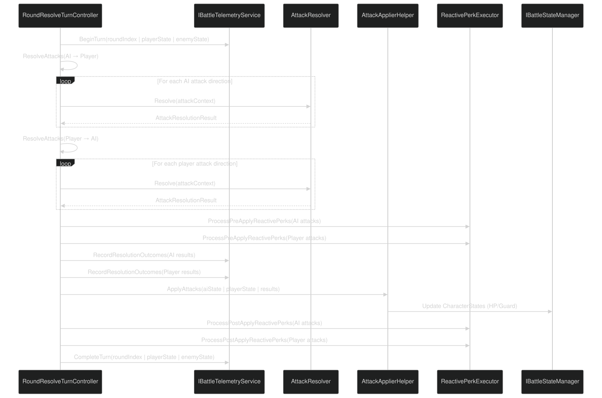

# Attack Resolution & Damage System

<details>
<summary>Relevant source files</summary>


- [CarnageClub/Assets/Scenes/Battle.unity](https://github.com/Wolfs0ng/CarnageClub/blob/0021fcdc/CarnageClub/Assets/Scenes/Battle.unity)
- [CarnageClub/Assets/Scripts/Battle/Turns/Controllers/RoundResolveTurnController.cs](https://github.com/Wolfs0ng/CarnageClub/blob/0021fcdc/CarnageClub/Assets/Scripts/Battle/Turns/Controllers/RoundResolveTurnController.cs)
- [CarnageClub/Assets/Scripts/Battle/Turns/RoundResolveTurn.cs](https://github.com/Wolfs0ng/CarnageClub/blob/0021fcdc/CarnageClub/Assets/Scripts/Battle/Turns/RoundResolveTurn.cs)
- [GDD_EN.md](https://github.com/Wolfs0ng/CarnageClub/blob/0021fcdc/GDD_EN.md)
- [GDD_UA.md](https://github.com/Wolfs0ng/CarnageClub/blob/0021fcdc/GDD_UA.md)
- [README.md](https://github.com/Wolfs0ng/CarnageClub/blob/0021fcdc/README.md)


</details>

## Purpose and Scope

This document details the attack resolution and damage application mechanics in Carnage Club's combat system. It covers how attacks are resolved per-direction, damage types (HP vs Guard), attack outcomes (Hit/Block/Parry), and special mechanics (Guard Break, Critical, Exhaust).

For information about the overall battle flow and turn management, see [Battle Flow & Turn Management](#5.1) . For details on round orchestration and perk execution, see [Round Resolution & Combat Mechanics](#5.2) .

## System Overview

The attack resolution system processes individual attack directions against defense directions to determine outcomes. Each attack is resolved independently, producing results that indicate whether the attack hit, was blocked, or parried, along with the final damage values.

Key Components:

- `AttackResolver`- Determines attack outcomes based on attack/defense match
- `AttackApplierHelper`- Applies resolved damage to character states
- `AttackContext`- Input data for resolution (attacker, defender, directions)
- `AttackResolutionResult`- Output data from resolution (outcome, damage, effects)
- `AttackOutcome``DamageHealth``DamageGuard``Blocked``Parry`enum - Hit types ( , , , )


Sources:  [CarnageClub/Assets/Scripts/Battle/Turns/Controllers/RoundResolveTurnController.cs #172-201](https://github.com/Wolfs0ng/CarnageClub/blob/0021fcdc/CarnageClub/Assets/Scripts/Battle/Turns/Controllers/RoundResolveTurnController.cs#L172-L201)

## Attack Resolution Flow

The following diagram illustrates the complete flow from attack selection through damage application:

Diagram: Attack Resolution Pipeline



Sources:  [CarnageClub/Assets/Scripts/Battle/Turns/Controllers/RoundResolveTurnController.cs #79-128](https://github.com/Wolfs0ng/CarnageClub/blob/0021fcdc/CarnageClub/Assets/Scripts/Battle/Turns/Controllers/RoundResolveTurnController.cs#L79-L128)

## AttackContext Structure

`AttackContext` is the input data model passed to `AttackResolver.Resolve()` . It encapsulates all information needed to determine the outcome of a single attack direction.

Code Construction Example:

```block
AttackContext context = new(){    Attacker = attacker,    Defender = defender,    AttackDirection = attack,    DefenderDefenceDirections = defenderBlockDirections,    DefenderDefenceType = defenceType};
```

Sources:  [CarnageClub/Assets/Scripts/Battle/Turns/Controllers/RoundResolveTurnController.cs #187-194](https://github.com/Wolfs0ng/CarnageClub/blob/0021fcdc/CarnageClub/Assets/Scripts/Battle/Turns/Controllers/RoundResolveTurnController.cs#L187-L194)

## AttackResolutionResult Structure

`AttackResolutionResult` is the output from `AttackResolver.Resolve()` . It contains the final outcome and all calculated damage values.

Sources:  [CarnageClub/Assets/Scripts/Battle/Turns/Controllers/RoundResolveTurnController.cs #196-197](https://github.com/Wolfs0ng/CarnageClub/blob/0021fcdc/CarnageClub/Assets/Scripts/Battle/Turns/Controllers/RoundResolveTurnController.cs#L196-L197)  [CarnageClub/Assets/Scripts/Battle/Turns/Controllers/RoundResolveTurnController.cs #212-225](https://github.com/Wolfs0ng/CarnageClub/blob/0021fcdc/CarnageClub/Assets/Scripts/Battle/Turns/Controllers/RoundResolveTurnController.cs#L212-L225)

## AttackResolver - Core Resolution Logic

`AttackResolver` is a static utility class that implements the core attack resolution logic. It determines whether an attack hits, is blocked, or parried based on the match between attack and defense directions.

Diagram: AttackResolver Resolution Logic



Resolution Steps:

Sources:  [CarnageClub/Assets/Scripts/Battle/Turns/Controllers/RoundResolveTurnController.cs #196](https://github.com/Wolfs0ng/CarnageClub/blob/0021fcdc/CarnageClub/Assets/Scripts/Battle/Turns/Controllers/RoundResolveTurnController.cs#L196-L196)

## Attack Outcomes

The `AttackOutcome` enum defines the possible results of attack resolution:

### DamageHealth

Description: Attack successfully hits and deals damage to the defender's HP pool.

Conditions:

- Attack direction does NOT match any defense direction
- Defender's Guard is at 0 or below
- Attack bypasses or breaks through Guard


Effects:

- `FinalDamageToHp > 0`
- HP reduced by damage amount
- May trigger Critical multiplier
- May cause Exhaust if stamina depletes


### DamageGuard

Description: Attack hits but is absorbed by the defender's Guard stance.

Conditions:

- Attack direction does NOT match any defense direction
- Defender has Guard > 0
- Attack does not break Guard completely


Effects:

- `FinalDamageToGuard > 0`
- Guard reduced by damage amount
- May trigger Guard Break if Guard reaches 0
- No HP damage


### Blocked

Description: Attack is blocked by matching defense direction.

Conditions:

- Attack direction matches a defense direction
- `DefenseType.Block`Defense type is (or default)


Effects:

- `WasBlocked = true`
- No HP damage to defender
- Defender may take Guard damage (depends on stats/perks)
- Attack is completely stopped


Sources:  [CarnageClub/Assets/Scripts/Battle/Turns/Controllers/RoundResolveTurnController.cs #215](https://github.com/Wolfs0ng/CarnageClub/blob/0021fcdc/CarnageClub/Assets/Scripts/Battle/Turns/Controllers/RoundResolveTurnController.cs#L215-L215)

### Parry

Description: Attack is parried, potentially reflecting damage back.

Conditions:

- Attack direction matches a defense direction
- `DefenseType.Parry`Defense type is


Effects:

- `WasParried = true`
- Attack is deflected
- May trigger counter-attack mechanics (design in progress)
- Parry-specific perks may activate


Sources:  [CarnageClub/Assets/Scripts/Battle/Turns/Controllers/RoundResolveTurnController.cs #215](https://github.com/Wolfs0ng/CarnageClub/blob/0021fcdc/CarnageClub/Assets/Scripts/Battle/Turns/Controllers/RoundResolveTurnController.cs#L215-L215)  [GDD_EN.md #99](https://github.com/Wolfs0ng/CarnageClub/blob/0021fcdc/GDD_EN.md#L99-L99)

## Special Attack Effects

### Guard Break

Description: When Guard damage reduces the defender's Guard to 0 or below during an attack.

Trigger Conditions:

- `AttackOutcome.DamageGuard`applied
- Defender's Guard reaches ≤ 0 after damage


Effects:

- `IsGuardBreak = true`
- Overflow damage may spill to HP (perk-dependent)
- Defender becomes vulnerable for subsequent attacks in same round


Design Status: In design phase per GDD

Sources:  [GDD_EN.md #102](https://github.com/Wolfs0ng/CarnageClub/blob/0021fcdc/GDD_EN.md#L102-L102)

### Critical Hit

Description: Attack damage is multiplied by a critical damage modifier.

Trigger Conditions:

- Random roll based on attacker's Mastery stat
- Specific perk effects (e.g., "See Weak Spots")
- Attack lands (not blocked/parried)


Effects:

- `IsCritical = true`
- `FinalDamageToHp`multiplied by critical modifier
- Visual/audio feedback to player


Design Status: In design phase per GDD

Sources:  [GDD_EN.md #103](https://github.com/Wolfs0ng/CarnageClub/blob/0021fcdc/GDD_EN.md#L103-L103)  [GDD_EN.md #144](https://github.com/Wolfs0ng/CarnageClub/blob/0021fcdc/GDD_EN.md#L144-L144)

### Exhaust

Description: Attacker's stamina depletes to 0 or below during the attack.

Trigger Conditions:

- Attacker's current stamina ≤ cost of attack
- Stamina reaches ≤ 0 after attack execution


Effects:

- `IsExhaust = true`
- Attacker may suffer penalties on next turn
- May limit available actions/directions


Design Status: In design phase per GDD

Sources:  [GDD_EN.md #104](https://github.com/Wolfs0ng/CarnageClub/blob/0021fcdc/GDD_EN.md#L104-L104)

## Damage Types

The system distinguishes between two primary damage types:

### HP Damage

Target: Character's health pool (current HP)

When Applied:

- `AttackOutcome.DamageHealth`occurs
- Guard Break with overflow (perk-dependent)
- Direct HP attacks that bypass Guard


Calculation:

- Base damage from attacker's Strength stat
- Modified by weapon stats
- Multiplied by Critical modifier if applicable
- Reduced by defender's armor/resistance


Result:

- `FinalDamageToHp`applied to defender's HP
- Character defeated if HP ≤ 0


### Guard Damage

Target: Character's Guard stance (temporary defense layer)

When Applied:

- `AttackOutcome.DamageGuard`occurs
- Blocked attacks (attacker may still damage defender's Guard)
- Attacks land while Guard > 0


Calculation:

- Base damage from attacker's Strength
- Modified by Fortitude stat (defender's Guard strength)
- May be reduced by defense stance bonuses


Result:

- `FinalDamageToGuard`applied to defender's Guard
- If Guard reaches 0 → Guard Break
- Subsequent attacks in round may hit HP directly


Sources:  [CarnageClub/Assets/Scripts/Battle/Turns/Controllers/RoundResolveTurnController.cs #254](https://github.com/Wolfs0ng/CarnageClub/blob/0021fcdc/CarnageClub/Assets/Scripts/Battle/Turns/Controllers/RoundResolveTurnController.cs#L254-L254)  [GDD_EN.md #97-99](https://github.com/Wolfs0ng/CarnageClub/blob/0021fcdc/GDD_EN.md#L97-L99)

## AttackApplierHelper

`AttackApplierHelper` is responsible for applying the final resolved damage values to character states. It processes both player and AI attack results simultaneously.

Diagram: AttackApplierHelper Application Process



Method Signature (inferred):

```block
attackApplierHelper.ApplyAttacks(    CharacterState aiState,    CharacterState playerState,    List<AttackResolutionResult> aiAttackResults,    List<AttackResolutionResult> playerAttackResults)
```

Application Order:

Sources:  [CarnageClub/Assets/Scripts/Battle/Turns/Controllers/RoundResolveTurnController.cs #105-106](https://github.com/Wolfs0ng/CarnageClub/blob/0021fcdc/CarnageClub/Assets/Scripts/Battle/Turns/Controllers/RoundResolveTurnController.cs#L105-L106)

## Per-Direction Resolution

Each attack direction is resolved independently in sequence. This allows for complex multi-direction scenarios.

Example Scenario:

Player's Attacks Resolved:

AI's Attacks Resolved:

Sources:  [CarnageClub/Assets/Scripts/Battle/Turns/Controllers/RoundResolveTurnController.cs #183-199](https://github.com/Wolfs0ng/CarnageClub/blob/0021fcdc/CarnageClub/Assets/Scripts/Battle/Turns/Controllers/RoundResolveTurnController.cs#L183-L199)  [GDD_EN.md #89-91](https://github.com/Wolfs0ng/CarnageClub/blob/0021fcdc/GDD_EN.md#L89-L91)

## Integration with Round Resolution

The attack resolution system is invoked during the `RoundResolve` phase of each battle turn.

Diagram: Resolution Integration in RoundResolveTurnController



Key Integration Points:

Sources:  [CarnageClub/Assets/Scripts/Battle/Turns/Controllers/RoundResolveTurnController.cs #79-128](https://github.com/Wolfs0ng/CarnageClub/blob/0021fcdc/CarnageClub/Assets/Scripts/Battle/Turns/Controllers/RoundResolveTurnController.cs#L79-L128)

## Reactive Perk Execution

Perks can modify attack resolution at two stages:

### PreApply Stage

Executed after resolution but before damage is applied .

Trigger Conditions:

- `AttackOutcome.Blocked``AttackOutcome.Parry``AfterDefenseResolved`or → Phase:
- `AttackOutcome.DamageHealth``AttackOutcome.DamageGuard``AfterAttackResolved`or → Phase:


Possible Modifications:

- `FinalDamageToHp``FinalDamageToGuard`Change or
- Convert damage types (HP ↔ Guard)
- Add special effect flags (Critical, Guard Break)
- Prevent attack outcome entirely


Code Reference:

```block
if (result.Outcome is AttackOutcome.Blocked or AttackOutcome.Parry){    reactivePerkExecutor.Execute(        roundIndex,         ReactivePerkExecutionStage.PreApply,        BattleEventPhase.AfterDefenseResolved,         attacker,         defender,         ref result    );}
```

Sources:  [CarnageClub/Assets/Scripts/Battle/Turns/Controllers/RoundResolveTurnController.cs #203-226](https://github.com/Wolfs0ng/CarnageClub/blob/0021fcdc/CarnageClub/Assets/Scripts/Battle/Turns/Controllers/RoundResolveTurnController.cs#L203-L226)

### PostApply Stage

Executed after damage has been applied to character states.

Trigger Conditions:

- `FinalDamageToHp > 0``FinalDamageToGuard > 0``AfterDamageApplied`or → Phase:
- `EndTurn`Always executed → Phase:


Possible Effects:

- Trigger counter-attacks
- Apply status effects (bleed, stun)
- Heal attacker based on damage dealt
- Modify character stats for next turn


Code Reference:

```block
if (result.FinalDamageToHp > 0 || result.FinalDamageToGuard > 0){    reactivePerkExecutor.Execute(        roundIndex,         ReactivePerkExecutionStage.PostApply,        BattleEventPhase.AfterDamageApplied,         attacker,         defender,         ref result    );}
```

Sources:  [CarnageClub/Assets/Scripts/Battle/Turns/Controllers/RoundResolveTurnController.cs #243-262](https://github.com/Wolfs0ng/CarnageClub/blob/0021fcdc/CarnageClub/Assets/Scripts/Battle/Turns/Controllers/RoundResolveTurnController.cs#L243-L262)

## Combat Log Generation

Each `AttackResolutionResult` generates a human-readable log entry via `AttackLogBuilder.BuildLog()` .

Log Generation Flow:

Log Entry Contents:

- Attacker name
- Attack direction
- Defender name
- Defense directions
- Outcome (Hit/Blocked/Parried)
- Damage values (HP/Guard)
- Special effects (Critical/Guard Break/Exhaust)


Code Reference:

```block
result.AttackLog = AttackLogBuilder.BuildLog(    new AttackContext    {        Attacker = attacker,        Defender = defender,        AttackDirection = result.AttackDirection,        DefenderDefenceDirections = result.DefenceDirections,        DefenderDefenceType = result.DefenceType    },    result); battleLogController.AddMessage(result.AttackLog);
```

Sources:  [CarnageClub/Assets/Scripts/Battle/Turns/Controllers/RoundResolveTurnController.cs #227-240](https://github.com/Wolfs0ng/CarnageClub/blob/0021fcdc/CarnageClub/Assets/Scripts/Battle/Turns/Controllers/RoundResolveTurnController.cs#L227-L240)

## Data Flow Summary

Diagram: Complete Attack Resolution Data Flow



Sources:  [CarnageClub/Assets/Scripts/Battle/Turns/Controllers/RoundResolveTurnController.cs #79-128](https://github.com/Wolfs0ng/CarnageClub/blob/0021fcdc/CarnageClub/Assets/Scripts/Battle/Turns/Controllers/RoundResolveTurnController.cs#L79-L128)

## Key Design Principles

### Independence of Direction Resolution

Each attack direction is resolved as a separate, independent calculation. This design:

- Allows multi-direction attacks to have different outcomes
- Supports complex defense coverage patterns
- Enables per-direction perk effects
- Simplifies telemetry tracking for AI learning


### Separation of Resolution and Application

The system strictly separates:

Benefits:

- Pre-application perk modifications
- Telemetry recording before state changes
- Easier testing and debugging
- Clear single-responsibility boundaries


### Two-Phase Perk Execution

Perks execute in two distinct phases:

This allows for:

- Damage prevention/reduction perks (PreApply)
- Counter-attack/healing perks (PostApply)
- Clean separation of concerns
- Predictable execution order


Sources:  [CarnageClub/Assets/Scripts/Battle/Turns/Controllers/RoundResolveTurnController.cs #203-262](https://github.com/Wolfs0ng/CarnageClub/blob/0021fcdc/CarnageClub/Assets/Scripts/Battle/Turns/Controllers/RoundResolveTurnController.cs#L203-L262)