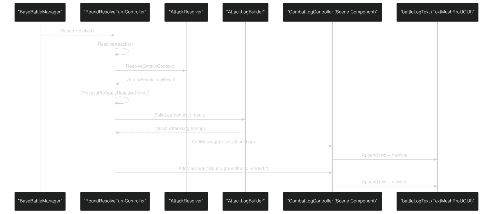

# Battle UI & Combat Log

<details>
<summary>Relevant source files</summary>


- [CarnageClub/Assets/Scenes/Battle.unity](https://github.com/Wolfs0ng/CarnageClub/blob/0021fcdc/CarnageClub/Assets/Scenes/Battle.unity)
- [CarnageClub/Assets/Scripts/Battle/Turns/Controllers/RoundResolveTurnController.cs](https://github.com/Wolfs0ng/CarnageClub/blob/0021fcdc/CarnageClub/Assets/Scripts/Battle/Turns/Controllers/RoundResolveTurnController.cs)
- [CarnageClub/Assets/Scripts/Battle/Turns/RoundResolveTurn.cs](https://github.com/Wolfs0ng/CarnageClub/blob/0021fcdc/CarnageClub/Assets/Scripts/Battle/Turns/RoundResolveTurn.cs)


</details>

## Purpose and Scope

This page documents the user interface components and combat logging system in the Battle scene. It covers the UI structure, direction selection controls, combat log display, and battle result screens. For information about the battle turn flow and how these UI components are triggered, see [Battle Flow & Turn Management](#5.1) . For details on combat resolution logic that generates the log messages, see [Round Resolution & Combat Mechanics](#5.2) .

## Battle Scene UI Hierarchy

The Battle scene contains several major UI groups that provide visual feedback during combat. The root canvas contains four primary sections:



Sources:  [CarnageClub/Assets/Scenes/Battle.unity #122-1758](https://github.com/Wolfs0ng/CarnageClub/blob/0021fcdc/CarnageClub/Assets/Scenes/Battle.unity#L122-L1758)

## Combat Log Controller

The `CombatLogController` manages the scrollable combat log that displays turn-by-turn battle events. It is attached to the Scroll View GameObject and receives messages from the battle resolution system.

### Component Structure



### Integration with Round Resolution

The `RoundResolveTurnController` has a serialized reference to `BattleLogController` and calls `AddMessage()` to append combat events:

| Call Site | Message Type | Example | 
| --- | --- | --- |
| RoundResolveTurnController.cs#124 | Round summary | "Round {roundIndex} ended." | 
| RoundResolveTurnController.cs#239 | Attack result | result.AttackLog (generated by AttackLogBuilder) | 


### Scene Configuration

The `CombatLogController` component is configured in the Unity scene with two serialized fields:

```block
CombatLogController (Component on GameObject "Scroll View")├─ battleLogText: Reference to "CombatLog" TextMeshProUGUI└─ battleLogScrollRect: Reference to "Scroll View" ScrollRect
```

The combat log text uses:

- [Battle.unity#1463](https://github.com/Wolfs0ng/CarnageClub/blob/0021fcdc/Battle.unity#L1463-L1463)Font Asset: Referenced at
- [Battle.unity#1488](https://github.com/Wolfs0ng/CarnageClub/blob/0021fcdc/Battle.unity#L1488-L1488)Font Size: 58
- [Battle.unity#1498](https://github.com/Wolfs0ng/CarnageClub/blob/0021fcdc/Battle.unity#L1498-L1498)Character Spacing: 8
- [Battle.unity#1505](https://github.com/Wolfs0ng/CarnageClub/blob/0021fcdc/Battle.unity#L1505-L1505)Text Wrapping: Enabled
- [Battle.unity#1495](https://github.com/Wolfs0ng/CarnageClub/blob/0021fcdc/Battle.unity#L1495-L1495)Alignment: Left


Sources:  [CarnageClub/Assets/Scenes/Battle.unity #883-992](https://github.com/Wolfs0ng/CarnageClub/blob/0021fcdc/CarnageClub/Assets/Scenes/Battle.unity#L883-L992)  [CarnageClub/Assets/Scripts/Battle/Turns/Controllers/RoundResolveTurnController.cs #38-239](https://github.com/Wolfs0ng/CarnageClub/blob/0021fcdc/CarnageClub/Assets/Scripts/Battle/Turns/Controllers/RoundResolveTurnController.cs#L38-L239)

## Direction Selection UI

The Battle scene provides two main UI blocks for player input: Attack Directions and Defense Directions. Both use toggle-based selection with visual feedback.

### Attack Directions Block

The `AttackDirectionsBlock` contains a grid layout with four direction toggles:



Each toggle has:

- Toggle Component[Battle.unity#337-375](https://github.com/Wolfs0ng/CarnageClub/blob/0021fcdc/Battle.unity#L337-L375): Unity UI Toggle with color transitions
- ToggleVisualChange Script[Battle.unity#321-327](https://github.com/Wolfs0ng/CarnageClub/blob/0021fcdc/Battle.unity#L321-L327)
- `rgba(0.158, 0.896, 0.147, 1)`Active Color: (green)
- `rgba(0.5, 0.5, 0.5, 1)`Inactive Color: (gray)

: Changes toggle color based on state
- Image Component: Visual representation (circle at direction position)


### Defense Directions Block

Similar structure to Attack Directions, but for defensive actions:

```block
DefenseDirectionsBlock├─ DefenseLabel: "Defense Directions"├─ LayoutGroup: GridLayoutGroup (2 columns)│   └─ BlockGroup: Container│       ├─ ToggleHead (Defense)│       ├─ ToggleBelly (Defense)│       ├─ ToggleLegs (Defense)│       └─ ToggleGroin (Defense)└─ BlockModeToggle: Switch between Block/Parry
```

### Grid Layout Configuration

Both attack and defense grids use `GridLayoutGroup` with:

- Cell Size[Battle.unity#470](https://github.com/Wolfs0ng/CarnageClub/blob/0021fcdc/Battle.unity#L470-L470): 150×100
- Spacing[Battle.unity#471](https://github.com/Wolfs0ng/CarnageClub/blob/0021fcdc/Battle.unity#L471-L471): 175×50
- Constraint[Battle.unity#472-473](https://github.com/Wolfs0ng/CarnageClub/blob/0021fcdc/Battle.unity#L472-L473): Fixed column count of 2
- Padding[Battle.unity#462-466](https://github.com/Wolfs0ng/CarnageClub/blob/0021fcdc/Battle.unity#L462-L466): 30 (left/right), 110 (top), 30 (bottom)


### Visual Direction Representation

The scene includes a visual "Directions" group that shows the anatomical layout:

```block
Directions (GameObject, scale 1.5)├─ DirectionHead (Top position: y=110)│   ├─ OutlineHead (yellow outline)│   └─ ToggleHead (interactive)├─ DirectionBelly (Middle position: y=0)│   ├─ OutlineBelly│   └─ ToggleBelly└─ DirectionLegs (Bottom position: y=-110)    ├─ OutlineLegs    └─ ToggleLegs
```

Position anchored at: (360, -240) from top-left corner [Battle.unity #157](https://github.com/Wolfs0ng/CarnageClub/blob/0021fcdc/Battle.unity#L157-L157)

Sources:  [CarnageClub/Assets/Scenes/Battle.unity #122-1166](https://github.com/Wolfs0ng/CarnageClub/blob/0021fcdc/CarnageClub/Assets/Scenes/Battle.unity#L122-L1166)

## Battle Result Screens

The Battle scene contains result screens for both victory and defeat outcomes, managed under the `BattleResultCanvas` GameObject.

### Result Screen Structure



### Result Info Configuration

The `ResultInfo` TextMeshProUGUI component displays battle outcome details:

- Font Size[Battle.unity#1352-1356](https://github.com/Wolfs0ng/CarnageClub/blob/0021fcdc/Battle.unity#L1352-L1356): Auto-sizing from 18 to 72, base 36
- Alignment[Battle.unity#1358-1360](https://github.com/Wolfs0ng/CarnageClub/blob/0021fcdc/Battle.unity#L1358-L1360): Center horizontal, Center vertical
- Size Delta[Battle.unity#1302](https://github.com/Wolfs0ng/CarnageClub/blob/0021fcdc/Battle.unity#L1302-L1302): Full width, 500 height
- Text`"Battle Result : \n"`[Battle.unity#1324](https://github.com/Wolfs0ng/CarnageClub/blob/0021fcdc/Battle.unity#L1324-L1324): Initially


### Close/Continue Buttons

Both victory and defeat screens include buttons to exit:

Button configuration:

- Button Component[Battle.unity#2043-2088](https://github.com/Wolfs0ng/CarnageClub/blob/0021fcdc/Battle.unity#L2043-L2088): Unity UI Button with color transitions
- Text Child[Battle.unity#1628-1630](https://github.com/Wolfs0ng/CarnageClub/blob/0021fcdc/Battle.unity#L1628-L1630): TextMeshProUGUI with auto-sizing
- Colors
- `(1, 1, 1, 1)`Normal: White
- `(0.96, 0.96, 0.96, 1)`Highlighted: Light gray
- `(0.78, 0.78, 0.78, 1)`Pressed: Dark gray

:


Sources:  [CarnageClub/Assets/Scenes/Battle.unity #1267-2088](https://github.com/Wolfs0ng/CarnageClub/blob/0021fcdc/CarnageClub/Assets/Scenes/Battle.unity#L1267-L2088)

## UI Integration with Battle System

The battle UI components integrate with the battle resolution pipeline through event subscriptions and direct controller references.

### Data Flow: Combat Events to UI Display



### Controller Initialization

The `RoundResolveTurnController` is initialized with a serialized reference to the `BattleLogController` :

[RoundResolveTurnController.cs #38](https://github.com/Wolfs0ng/CarnageClub/blob/0021fcdc/RoundResolveTurnController.cs#L38-L38) :

```block
[SerializeField] private BattleLogController battleLogController;
```

This serialization is configured in the Battle scene, establishing the binding between:

- Controller`RoundResolveTurnController`: component (on scene root or manager GameObject)
- UI Target`CombatLogController`: component (on "Scroll View" GameObject)


### Message Flow

During combat resolution, messages are added at two key points:

1. Per-Attack Logging  [RoundResolveTurnController.cs #227-239](https://github.com/Wolfs0ng/CarnageClub/blob/0021fcdc/RoundResolveTurnController.cs#L227-L239) :

```block
For each attack resolution result:├─ Build attack context├─ AttackLogBuilder.BuildLog() generates formatted string├─ Assign to result.AttackLog└─ battleLogController.AddMessage(result.AttackLog)
```

2. Round Summary Logging  [RoundResolveTurnController.cs #124](https://github.com/Wolfs0ng/CarnageClub/blob/0021fcdc/RoundResolveTurnController.cs#L124-L124) :

```block
After all attacks resolved:└─ battleLogController.AddMessage($"Round {roundIndex} ended.")
```

### UI Update Lifecycle

The combat log updates follow this lifecycle:



The scroll rect automatically scrolls to the bottom when new messages are added, ensuring the latest combat events are visible to the player.

Sources:  [CarnageClub/Assets/Scripts/Battle/Turns/Controllers/RoundResolveTurnController.cs #36-241](https://github.com/Wolfs0ng/CarnageClub/blob/0021fcdc/CarnageClub/Assets/Scripts/Battle/Turns/Controllers/RoundResolveTurnController.cs#L36-L241)  [CarnageClub/Assets/Scenes/Battle.unity #883-992](https://github.com/Wolfs0ng/CarnageClub/blob/0021fcdc/CarnageClub/Assets/Scenes/Battle.unity#L883-L992)

## Scene Component Wiring

The Battle scene uses Unity's serialization system to wire UI components to controllers. Key references:

These references are configured in the Unity Inspector and serialized in the scene file at [Battle.unity #990-992](https://github.com/Wolfs0ng/CarnageClub/blob/0021fcdc/Battle.unity#L990-L992) :

```block
m_Script: {fileID: 11500000, guid: 8ecb2abc0c3d945018e089fb17d3ecaf, type: 3}battleLogText: {fileID: 268426842}battleLogScrollRect: {fileID: 252132599}
```

The `RoundResolveTurnController` is initialized during battle setup and maintains its reference to the log controller throughout the battle sequence, as shown in [RoundResolveTurnController.cs #56-66](https://github.com/Wolfs0ng/CarnageClub/blob/0021fcdc/RoundResolveTurnController.cs#L56-L66)

Sources:  [CarnageClub/Assets/Scenes/Battle.unity #979-992](https://github.com/Wolfs0ng/CarnageClub/blob/0021fcdc/CarnageClub/Assets/Scenes/Battle.unity#L979-L992)  [CarnageClub/Assets/Scripts/Battle/Turns/Controllers/RoundResolveTurnController.cs #36-66](https://github.com/Wolfs0ng/CarnageClub/blob/0021fcdc/CarnageClub/Assets/Scripts/Battle/Turns/Controllers/RoundResolveTurnController.cs#L36-L66)