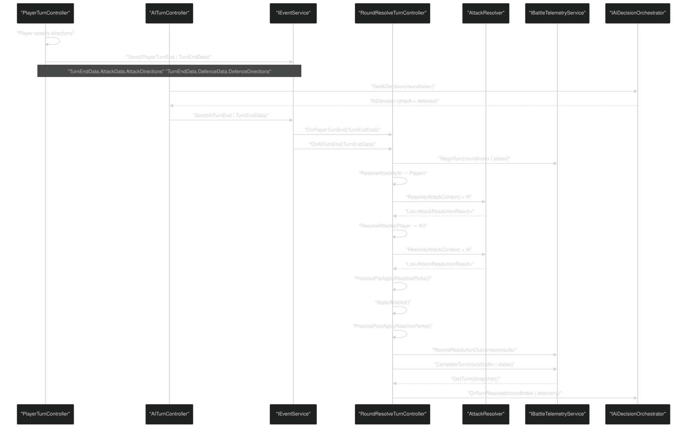

# Battle System

<details>
<summary>Relevant source files</summary>


- [CarnageClub/Assets/Scenes/Battle.unity](https://github.com/Wolfs0ng/CarnageClub/blob/0021fcdc/CarnageClub/Assets/Scenes/Battle.unity)
- [CarnageClub/Assets/Scripts/Battle/Turns/Controllers/RoundResolveTurnController.cs](https://github.com/Wolfs0ng/CarnageClub/blob/0021fcdc/CarnageClub/Assets/Scripts/Battle/Turns/Controllers/RoundResolveTurnController.cs)
- [CarnageClub/Assets/Scripts/Battle/Turns/RoundResolveTurn.cs](https://github.com/Wolfs0ng/CarnageClub/blob/0021fcdc/CarnageClub/Assets/Scripts/Battle/Turns/RoundResolveTurn.cs)
- [GDD_EN.md](https://github.com/Wolfs0ng/CarnageClub/blob/0021fcdc/GDD_EN.md)
- [GDD_UA.md](https://github.com/Wolfs0ng/CarnageClub/blob/0021fcdc/GDD_UA.md)
- [README.md](https://github.com/Wolfs0ng/CarnageClub/blob/0021fcdc/README.md)


</details>

## Purpose and Scope

The Battle System implements the turn-based combat mechanics of Carnage Club, including the 4-direction attack/defense model, damage calculation, and round resolution. This page provides an overview of the entire battle system architecture and data flow.

For detailed information about specific subsystems:

- [Battle Flow & Turn Management](#5.1)Battle initialization and turn orchestration: see
- [Round Resolution & Combat Mechanics](#5.2)Attack resolution logic and damage application: see
- [Attack Resolution & Damage System](#5.3)Hit/block/parry mechanics and damage types: see
- [Battle UI & Combat Log](#5.4)Combat log and direction selection UI: see


The Battle System is tightly integrated with the AI System (see [AI System](#3) ) which consumes telemetry data from every combat round to learn player patterns.

## High-Level Architecture

The Battle System follows a turn-based state machine pattern with three primary phases: Player Turn → AI Turn → Round Resolution. Each phase is implemented as an `IBattleTurn` component managed by `BaseBattleManager` .

### Battle System Component Overview



Sources:  [CarnageClub/Assets/Scripts/Battle/Turns/Controllers/RoundResolveTurnController.cs #36-289](https://github.com/Wolfs0ng/CarnageClub/blob/0021fcdc/CarnageClub/Assets/Scripts/Battle/Turns/Controllers/RoundResolveTurnController.cs#L36-L289)  [CarnageClub/Assets/Scripts/Battle/Turns/RoundResolveTurn.cs #22-81](https://github.com/Wolfs0ng/CarnageClub/blob/0021fcdc/CarnageClub/Assets/Scripts/Battle/Turns/RoundResolveTurn.cs#L22-L81)

## Battle Lifecycle

The battle system progresses through a sequence of states from initialization to completion. The lifecycle is managed by `BaseBattleManager` which orchestrates turn execution.

### Battle State Machine



Sources:  [CarnageClub/Assets/Scripts/Battle/Turns/Controllers/RoundResolveTurnController.cs #56-128](https://github.com/Wolfs0ng/CarnageClub/blob/0021fcdc/CarnageClub/Assets/Scripts/Battle/Turns/Controllers/RoundResolveTurnController.cs#L56-L128) Diagram 3 (Game Flow) from high-level system architecture

## Turn-Based Combat Model

The battle system implements a simultaneous turn-based model where both combatants select their actions (attack directions + defense directions) before resolution. All attacks are resolved in a single phase.

### Turn Data Flow



Sources:  [CarnageClub/Assets/Scripts/Battle/Turns/Controllers/RoundResolveTurnController.cs #79-128](https://github.com/Wolfs0ng/CarnageClub/blob/0021fcdc/CarnageClub/Assets/Scripts/Battle/Turns/Controllers/RoundResolveTurnController.cs#L79-L128)  [CarnageClub/Assets/Scripts/Battle/Turns/Controllers/RoundResolveTurnController.cs #146-170](https://github.com/Wolfs0ng/CarnageClub/blob/0021fcdc/CarnageClub/Assets/Scripts/Battle/Turns/Controllers/RoundResolveTurnController.cs#L146-L170)

## Core Combat Mechanics

### 4-Direction System

The combat system uses a 4-direction model for both attacks and defenses, represented by the `BattleDirection` enum:

Players and AI can select multiple directions simultaneously (1-3 attack directions, 1-4 defense directions).

Sources:  [CarnageClub/Assets/Scenes/Battle.unity #132-159](https://github.com/Wolfs0ng/CarnageClub/blob/0021fcdc/CarnageClub/Assets/Scenes/Battle.unity#L132-L159) (UI structure), GDD_EN.md combat system section

### Attack Resolution Process

Each attack direction is resolved independently using the `AttackResolver` class. The resolution follows this logic:



Sources:  [CarnageClub/Assets/Scripts/Battle/Turns/Controllers/RoundResolveTurnController.cs #172-201](https://github.com/Wolfs0ng/CarnageClub/blob/0021fcdc/CarnageClub/Assets/Scripts/Battle/Turns/Controllers/RoundResolveTurnController.cs#L172-L201) GDD_EN.md combat mechanics

### Attack Resolution Results

The `AttackResolutionResult` structure contains all outcome data from a single attack direction:

Sources:  [CarnageClub/Assets/Scripts/Battle/Turns/Controllers/RoundResolveTurnController.cs #196-198](https://github.com/Wolfs0ng/CarnageClub/blob/0021fcdc/CarnageClub/Assets/Scripts/Battle/Turns/Controllers/RoundResolveTurnController.cs#L196-L198)

## Integration with AI System

The Battle System serves as the primary data source for AI learning. Every combat round generates telemetry data that feeds into the AI knowledge systems.

### Telemetry Recording Flow



Sources:  [CarnageClub/Assets/Scripts/Battle/Turns/Controllers/RoundResolveTurnController.cs #81](https://github.com/Wolfs0ng/CarnageClub/blob/0021fcdc/CarnageClub/Assets/Scripts/Battle/Turns/Controllers/RoundResolveTurnController.cs#L81-L81)  [CarnageClub/Assets/Scripts/Battle/Turns/Controllers/RoundResolveTurnController.cs #102-122](https://github.com/Wolfs0ng/CarnageClub/blob/0021fcdc/CarnageClub/Assets/Scripts/Battle/Turns/Controllers/RoundResolveTurnController.cs#L102-L122) Diagram 2 (AI Architecture) from high-level system architecture

### Telemetry Data Structure

Each turn records a `BattleTurnTelemetry` DTO containing:

- Pre-state:HP, Guard, Stamina for both combatants
- Post-state:HP, Guard, Stamina after resolution
- Player actions:Attack directions, Defense directions, DefenseType
- AI actions:Attack directions, Defense directions, DefenseType
- Per-direction outcomes:For each attack direction, records hit/block/parry, damage amounts
- Round metadata:Round index, timestamp


This data is consumed by:

- `PlayerBattleBehaviourKnowledge`(Layer 1) - tracks player patterns
- `AiReactionKnowledge`(Layer 2) - builds action-reaction matrices
- `AiDecisionOrchestrator`(Layer 3) - informs next-turn decisions


Sources:  [CarnageClub/Assets/Scripts/Battle/Turns/Controllers/RoundResolveTurnController.cs #113-122](https://github.com/Wolfs0ng/CarnageClub/blob/0021fcdc/CarnageClub/Assets/Scripts/Battle/Turns/Controllers/RoundResolveTurnController.cs#L113-L122) Diagram 2 (AI Architecture)

## Reactive Perks System

The Battle System supports reactive perks that execute at specific phases of combat resolution. Perks can modify attack outcomes before or after damage is applied.

### Perk Execution Stages



The `ReactivePerkExecutor` queries `IPerkService` for active perks and executes them with the current `AttackResolutionResult` , allowing perks to:

- Modify damage values before application
- Trigger secondary effects after damage
- React to defensive outcomes (blocks/parries)


Sources:  [CarnageClub/Assets/Scripts/Battle/Turns/Controllers/RoundResolveTurnController.cs #97-111](https://github.com/Wolfs0ng/CarnageClub/blob/0021fcdc/CarnageClub/Assets/Scripts/Battle/Turns/Controllers/RoundResolveTurnController.cs#L97-L111)  [CarnageClub/Assets/Scripts/Battle/Turns/Controllers/RoundResolveTurnController.cs #203-263](https://github.com/Wolfs0ng/CarnageClub/blob/0021fcdc/CarnageClub/Assets/Scripts/Battle/Turns/Controllers/RoundResolveTurnController.cs#L203-L263)

## Event-Driven Communication

The Battle System uses `IEventService` for loose coupling between components. Key events:

The `TurnEndData` structure contains:

- `AttackData``List<BattleDirection>`: attack directions
- `DefenceData``List<BattleDirection>``DefenseType`: defense directions + (Block/Parry)


Sources:  [CarnageClub/Assets/Scripts/Battle/Turns/Controllers/RoundResolveTurnController.cs #146-170](https://github.com/Wolfs0ng/CarnageClub/blob/0021fcdc/CarnageClub/Assets/Scripts/Battle/Turns/Controllers/RoundResolveTurnController.cs#L146-L170) Diagram 5 (Map and Battle Integration)

## Battle Scene Structure

The Battle scene (Battle.unity) contains the following hierarchy:

Sources:  [CarnageClub/Assets/Scenes/Battle.unity #122-1129](https://github.com/Wolfs0ng/CarnageClub/blob/0021fcdc/CarnageClub/Assets/Scenes/Battle.unity#L122-L1129)

## State Management

Battle state is managed by `IBattleStateManager` , which provides:

- `CharacterState PlayerState`- Current player HP, Guard, Stamina, perks
- `CharacterState EnemyState`- Current enemy HP, Guard, Stamina, perks
- State mutation methods for damage application
- State snapshot methods for telemetry


The `CharacterState` structure is a mutable runtime model distinct from the persistent `PlayerState` managed by `GameStateManager` . After battle completion, battle outcomes are applied back to the game state.

Sources:  [CarnageClub/Assets/Scripts/Battle/Turns/Controllers/RoundResolveTurnController.cs #52](https://github.com/Wolfs0ng/CarnageClub/blob/0021fcdc/CarnageClub/Assets/Scripts/Battle/Turns/Controllers/RoundResolveTurnController.cs#L52-L52)  [CarnageClub/Assets/Scripts/Battle/Turns/Controllers/RoundResolveTurnController.cs #81-106](https://github.com/Wolfs0ng/CarnageClub/blob/0021fcdc/CarnageClub/Assets/Scripts/Battle/Turns/Controllers/RoundResolveTurnController.cs#L81-L106)

## Key Classes and Interfaces

### IBattleTurn Interface

```block
IBattleTurn├── string Name├── bool CanExecute└── UniTask Execute(CancellationToken)
```

All battle phases implement this interface for uniform orchestration by `BaseBattleManager` .

Sources:  [CarnageClub/Assets/Scripts/Battle/Turns/RoundResolveTurn.cs #22-26](https://github.com/Wolfs0ng/CarnageClub/blob/0021fcdc/CarnageClub/Assets/Scripts/Battle/Turns/RoundResolveTurn.cs#L22-L26)

### RoundResolveTurnController

Core responsibilities:

- `PlayerTurnEnd``AITurnEnd`Subscribe to and events
- `AttackResolver.Resolve()`Call for each attack direction
- `ReactivePerkExecutor`Execute at PreApply and PostApply stages
- `AttackApplierHelper`Apply damage via
- `IBattleTelemetryService`Record telemetry via
- `IAiDecisionOrchestrator`Notify with completed turn data
- Generate combat log messages


Sources:  [CarnageClub/Assets/Scripts/Battle/Turns/Controllers/RoundResolveTurnController.cs #36-289](https://github.com/Wolfs0ng/CarnageClub/blob/0021fcdc/CarnageClub/Assets/Scripts/Battle/Turns/Controllers/RoundResolveTurnController.cs#L36-L289)

### AttackContext and AttackResolutionResult

`AttackContext` is the input to `AttackResolver.Resolve()` :

- `CharacterState Attacker`
- `CharacterState Defender`
- `BattleDirection AttackDirection`
- `IReadOnlyList<BattleDirection> DefenderDefenceDirections`
- `DefenseType DefenderDefenceType`


`AttackResolutionResult` is the output, containing outcome and damage data.

Sources:  [CarnageClub/Assets/Scripts/Battle/Turns/Controllers/RoundResolveTurnController.cs #187-197](https://github.com/Wolfs0ng/CarnageClub/blob/0021fcdc/CarnageClub/Assets/Scripts/Battle/Turns/Controllers/RoundResolveTurnController.cs#L187-L197)

## Design Principles

The Battle System adheres to the codebase's architectural principles:

Sources: GDD_EN.md technical architecture section, Diagram 1 (Overall System Architecture)