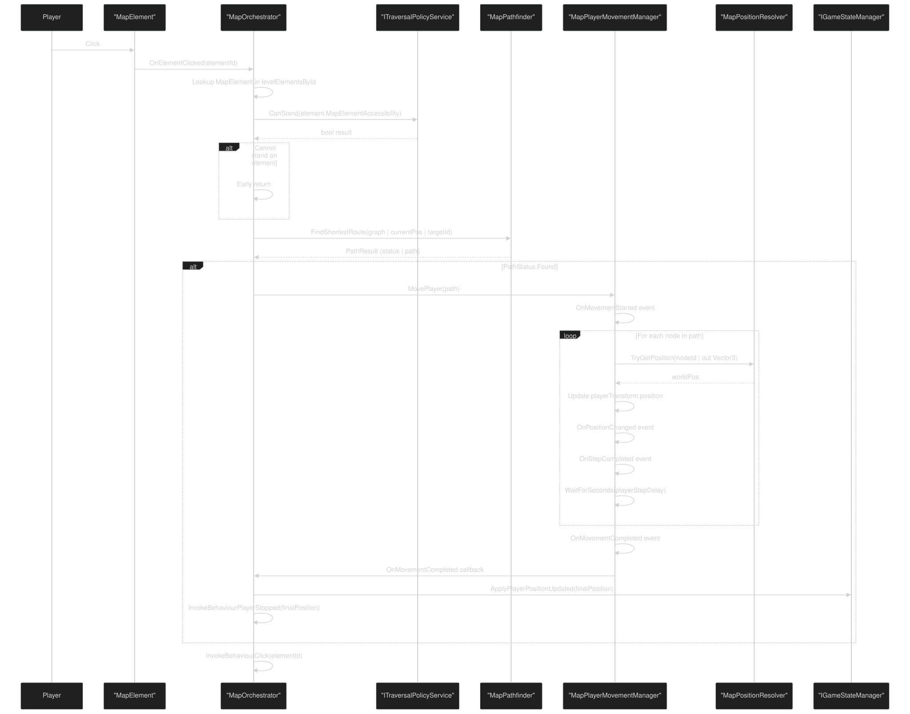
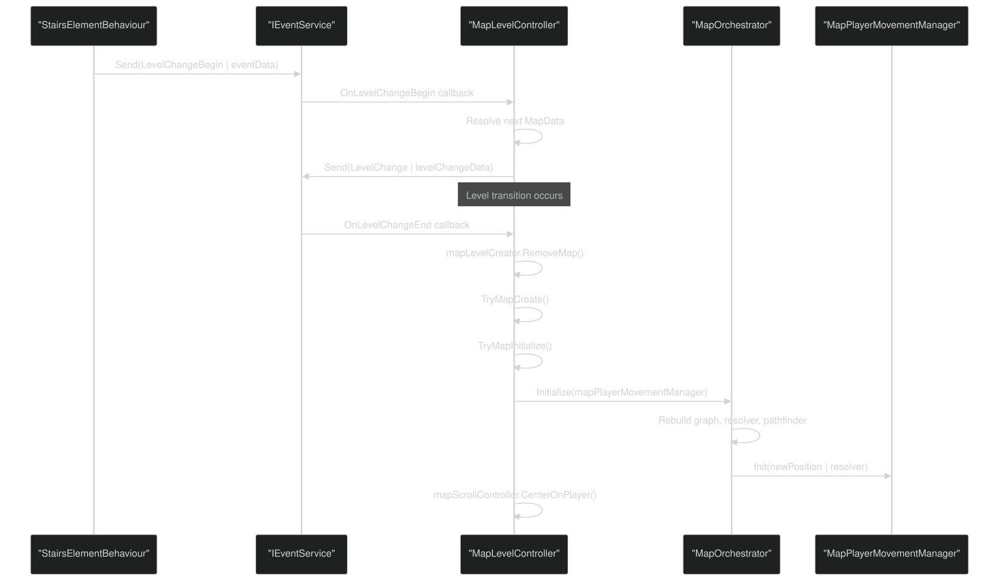

# Map Navigation & Movement

<details>
<summary>Relevant source files</summary>


- [CarnageClub/Assets/GameResources/ScriptableObjects/BaseGameData/MapLevels/Level_2_MapData.asset](https://github.com/Wolfs0ng/CarnageClub/blob/0021fcdc/CarnageClub/Assets/GameResources/ScriptableObjects/BaseGameData/MapLevels/Level_2_MapData.asset)
- [CarnageClub/Assets/Scenes/Map.unity](https://github.com/Wolfs0ng/CarnageClub/blob/0021fcdc/CarnageClub/Assets/Scenes/Map.unity)
- [CarnageClub/Assets/Scripts/Core/Abstract/IGameStateManager.cs](https://github.com/Wolfs0ng/CarnageClub/blob/0021fcdc/CarnageClub/Assets/Scripts/Core/Abstract/IGameStateManager.cs)
- [CarnageClub/Assets/Scripts/Map/Controllers/MapCompositionRoot.cs](https://github.com/Wolfs0ng/CarnageClub/blob/0021fcdc/CarnageClub/Assets/Scripts/Map/Controllers/MapCompositionRoot.cs)
- [CarnageClub/Assets/Scripts/Map/Controllers/MapLevelController.cs](https://github.com/Wolfs0ng/CarnageClub/blob/0021fcdc/CarnageClub/Assets/Scripts/Map/Controllers/MapLevelController.cs)
- [CarnageClub/Assets/Scripts/Map/Controllers/MapOrchestrator.cs](https://github.com/Wolfs0ng/CarnageClub/blob/0021fcdc/CarnageClub/Assets/Scripts/Map/Controllers/MapOrchestrator.cs)
- [CarnageClub/Assets/Scripts/Map/Elements/Behaviours/Data/StairsElementBehaviourData.cs](https://github.com/Wolfs0ng/CarnageClub/blob/0021fcdc/CarnageClub/Assets/Scripts/Map/Elements/Behaviours/Data/StairsElementBehaviourData.cs)
- [CarnageClub/Assets/Scripts/Map/Elements/Behaviours/StairsElementBehaviour.cs](https://github.com/Wolfs0ng/CarnageClub/blob/0021fcdc/CarnageClub/Assets/Scripts/Map/Elements/Behaviours/StairsElementBehaviour.cs)
- [CarnageClub/Assets/Scripts/Map/Events/LevelChangeBeginEventData.cs](https://github.com/Wolfs0ng/CarnageClub/blob/0021fcdc/CarnageClub/Assets/Scripts/Map/Events/LevelChangeBeginEventData.cs)
- [CarnageClub/Assets/Scripts/Map/Events/LevelChangeEventData.cs](https://github.com/Wolfs0ng/CarnageClub/blob/0021fcdc/CarnageClub/Assets/Scripts/Map/Events/LevelChangeEventData.cs)
- [CarnageClub/Assets/Scripts/Map/MapMovement/MapPlayerMovementManager.cs](https://github.com/Wolfs0ng/CarnageClub/blob/0021fcdc/CarnageClub/Assets/Scripts/Map/MapMovement/MapPlayerMovementManager.cs)


</details>

## Purpose and Scope

This page documents the player movement system on the map: how the player navigates between nodes, pathfinding algorithms, position tracking, and movement animation. This covers the technical implementation of player locomotion through the node-based map graph.

For information about map elements themselves (nodes, types, states), see [Map Elements & Interactive Nodes](#6.2) . For element behaviors triggered when the player stops, see [Element Behaviors & Interactions](#6.3) . For level loading and transitions between maps, see [Level Management & Transitions](#6.4) .

## System Architecture

The navigation system consists of four core components that work together to enable player movement:

Sources:  [CarnageClub/Assets/Scripts/Map/Controllers/MapOrchestrator.cs #34-359](https://github.com/Wolfs0ng/CarnageClub/blob/0021fcdc/CarnageClub/Assets/Scripts/Map/Controllers/MapOrchestrator.cs#L34-L359)  [CarnageClub/Assets/Scripts/Map/MapMovement/MapPlayerMovementManager.cs #23-153](https://github.com/Wolfs0ng/CarnageClub/blob/0021fcdc/CarnageClub/Assets/Scripts/Map/MapMovement/MapPlayerMovementManager.cs#L23-L153)

## Core Components

| Component | File | Responsibility | 
| --- | --- | --- |
| MapPlayerMovementManager | CarnageClub/Assets/Scripts/Map/MapMovement/MapPlayerMovementManager.cs | Animates player Transform along calculated paths, fires movement events | 
| MapPathfinder | Referenced in MapOrchestrator.cs#170 | Implements pathfinding algorithms to find shortest routes between nodes | 
| MapPositionResolver | Referenced in MapOrchestrator.cs#165 | Implements IMapPositionResolver, translates MapElementId to world Vector3 positions | 
| MapGraph | Referenced in MapOrchestrator.cs#159 | Represents node adjacency data structure for pathfinding | 
| MapGraphBuilder | Referenced in MapOrchestrator.cs#160 | Static utility to construct graph from MapElement list | 
| ITraversalPolicyService | Referenced in MapOrchestrator.cs#90 | Service that determines if elements can be traversed based on accessibility flags | 


Sources:  [CarnageClub/Assets/Scripts/Map/Controllers/MapOrchestrator.cs #34-359](https://github.com/Wolfs0ng/CarnageClub/blob/0021fcdc/CarnageClub/Assets/Scripts/Map/Controllers/MapOrchestrator.cs#L34-L359)  [CarnageClub/Assets/Scripts/Map/MapMovement/MapPlayerMovementManager.cs #23-153](https://github.com/Wolfs0ng/CarnageClub/blob/0021fcdc/CarnageClub/Assets/Scripts/Map/MapMovement/MapPlayerMovementManager.cs#L23-L153)

## MapPlayerMovementManager

The `MapPlayerMovementManager` is responsible for the physical movement of the player's `Transform` along a calculated path. It does not perform pathfinding or position lookups—those are delegated to injected services.

### Key Responsibilities

### Public API

```block
// Initializationvoid Init(MapElementId initialPosition, IMapPositionResolver resolver) // Movement controlvoid MovePlayer(IReadOnlyList<MapElementId> path)void SnapToPosition(MapElementId position)void CancelMovement() // State queriesMapElementId PlayerPosition { get; }bool IsMoving { get; } // Eventsevent Action<MapElementId> OnPositionChangedevent Action<IReadOnlyList<MapElementId>> OnMovementStartedevent Action<MapElementId> OnStepCompletedevent Action<MapElementId> OnMovementCompletedevent Action OnMovementCanceled
```

### Configuration

The manager has a serialized field `playerStepDelay` ( [MapPlayerMovementManager.cs #33](https://github.com/Wolfs0ng/CarnageClub/blob/0021fcdc/MapPlayerMovementManager.cs#L33-L33) ) that controls the delay between steps. This creates the visual effect of the player "walking" through nodes rather than teleporting.

### Movement Execution

The core movement logic is implemented in `MovePlayerAlongPath` ( [MapPlayerMovementManager.cs #110-140](https://github.com/Wolfs0ng/CarnageClub/blob/0021fcdc/MapPlayerMovementManager.cs#L110-L140) ):

Key Implementation Detail: Movement is instantaneous per-step; the "animation" comes from the delays between steps, not from interpolating the transform position.

Sources:  [CarnageClub/Assets/Scripts/Map/MapMovement/MapPlayerMovementManager.cs #23-153](https://github.com/Wolfs0ng/CarnageClub/blob/0021fcdc/CarnageClub/Assets/Scripts/Map/MapMovement/MapPlayerMovementManager.cs#L23-L153)

## Pathfinding System

The pathfinding system calculates the shortest route between two nodes on the map graph.

### MapGraph Structure

The `MapGraph` is built by `MapGraphBuilder.Build()` ( [MapOrchestrator.cs #160](https://github.com/Wolfs0ng/CarnageClub/blob/0021fcdc/MapOrchestrator.cs#L160-L160) ) from the list of `MapElement` objects and their indexed lookup dictionary. The graph represents the adjacency relationships defined in each element's `NeighborElementsHandler` .



Sources:  [CarnageClub/Assets/Scripts/Map/Controllers/MapOrchestrator.cs #158-161](https://github.com/Wolfs0ng/CarnageClub/blob/0021fcdc/CarnageClub/Assets/Scripts/Map/Controllers/MapOrchestrator.cs#L158-L161)

### MapPathfinder

The `MapPathfinder` is instantiated with an `ITraversalPolicyService` ( [MapOrchestrator.cs #170](https://github.com/Wolfs0ng/CarnageClub/blob/0021fcdc/MapOrchestrator.cs#L170-L170) ). When `FindShortestRoute` is called, it:

The orchestrator invokes pathfinding in `OnElementClicked` ( [MapOrchestrator.cs #205-206](https://github.com/Wolfs0ng/CarnageClub/blob/0021fcdc/MapOrchestrator.cs#L205-L206) ):

```block
PathResult pathResult = mapPathfinder.FindShortestRoute(graph,    playerMovementManager.PlayerPosition, element.ElementId);
```

Sources:  [CarnageClub/Assets/Scripts/Map/Controllers/MapOrchestrator.cs #168-213](https://github.com/Wolfs0ng/CarnageClub/blob/0021fcdc/CarnageClub/Assets/Scripts/Map/Controllers/MapOrchestrator.cs#L168-L213)

### Traversal Policy

Before pathfinding is attempted, the orchestrator checks if the target element can be stood on ( [MapOrchestrator.cs #199-202](https://github.com/Wolfs0ng/CarnageClub/blob/0021fcdc/MapOrchestrator.cs#L199-L202) ):

```block
if (!traversalPolicyService.CanStand(element.MapElementAccessibility)){    return;}
```

The `ITraversalPolicyService` evaluates `MapElementAccessibility` flags to determine valid movement targets. This prevents pathfinding to inaccessible nodes.

Sources:  [CarnageClub/Assets/Scripts/Map/Controllers/MapOrchestrator.cs #199-202](https://github.com/Wolfs0ng/CarnageClub/blob/0021fcdc/CarnageClub/Assets/Scripts/Map/Controllers/MapOrchestrator.cs#L199-L202)

## Position Resolution

The `MapPositionResolver` implements the `IMapPositionResolver` interface and translates `MapElementId` identifiers into world-space `Vector3` positions.

### Initialization

The resolver is instantiated in `MapOrchestrator.InitializePositionResolver()` ( [MapOrchestrator.cs #163-166](https://github.com/Wolfs0ng/CarnageClub/blob/0021fcdc/MapOrchestrator.cs#L163-L166) ):

```block
private void InitializePositionResolver(){    positionResolver = new MapPositionResolver(levelElementsById);}
```

It receives the `Dictionary<MapElementId, MapElement>` that indexes all elements by their ID.

### Interface Contract

The `IMapPositionResolver` interface ( [referenced in MapPlayerMovementManager.cs #35](https://github.com/Wolfs0ng/CarnageClub/blob/0021fcdc/referenced in MapPlayerMovementManager.cs#L35-L35) ) provides:

```block
bool TryGetPosition(MapElementId id, out Vector3 position)
```

The `MapPlayerMovementManager` uses this to resolve positions during movement ( [MapPlayerMovementManager.cs #142-151](https://github.com/Wolfs0ng/CarnageClub/blob/0021fcdc/MapPlayerMovementManager.cs#L142-L151) ):

```block
private bool TryResolveWorldPosition(MapElementId id, out Vector3 position){    if (positionResolver == null)    {        position = default;        return false;    }     return positionResolver.TryGetPosition(id, out position);}
```

Sources:  [CarnageClub/Assets/Scripts/Map/Controllers/MapOrchestrator.cs #163-166](https://github.com/Wolfs0ng/CarnageClub/blob/0021fcdc/CarnageClub/Assets/Scripts/Map/Controllers/MapOrchestrator.cs#L163-L166)  [CarnageClub/Assets/Scripts/Map/MapMovement/MapPlayerMovementManager.cs #142-151](https://github.com/Wolfs0ng/CarnageClub/blob/0021fcdc/CarnageClub/Assets/Scripts/Map/MapMovement/MapPlayerMovementManager.cs#L142-L151)

## Movement Event Flow

The following sequence diagram illustrates the complete flow from user click to position update:



Sources:  [CarnageClub/Assets/Scripts/Map/Controllers/MapOrchestrator.cs #192-239](https://github.com/Wolfs0ng/CarnageClub/blob/0021fcdc/CarnageClub/Assets/Scripts/Map/Controllers/MapOrchestrator.cs#L192-L239)  [CarnageClub/Assets/Scripts/Map/MapMovement/MapPlayerMovementManager.cs #59-140](https://github.com/Wolfs0ng/CarnageClub/blob/0021fcdc/CarnageClub/Assets/Scripts/Map/MapMovement/MapPlayerMovementManager.cs#L59-L140)

## Integration with MapOrchestrator

The `MapOrchestrator` acts as the central coordinator for all movement operations.

### Initialization Sequence



Sources:  [CarnageClub/Assets/Scripts/Map/Controllers/MapOrchestrator.cs #59-85](https://github.com/Wolfs0ng/CarnageClub/blob/0021fcdc/CarnageClub/Assets/Scripts/Map/Controllers/MapOrchestrator.cs#L59-L85)

### Key Orchestrator Methods

| Method | Line | Purpose | 
| --- | --- | --- |
| BuildMapIndexes() | 144-156 | Creates levelElementsById dictionary for O(1) lookups | 
| BuildMapGraph() | 158-161 | Constructs graph from elements using MapGraphBuilder | 
| InitializePositionResolver() | 163-166 | Instantiates resolver with element dictionary | 
| InitializePathfinding() | 168-171 | Instantiates pathfinder with traversal policy service | 
| InitializePlayerMovement() | 173-177 | Initializes movement manager and subscribes to events | 
| InitializePlayerStartAccessibility() | 179-185 | Sets initial accessibility flags for player position and neighbors | 
| OnElementClicked() | 192-213 | Handles click: validates, pathfinds, starts movement | 
| OnMovementCompleted() | 215-219 | Updates game state, invokes element behavior | 


Sources:  [CarnageClub/Assets/Scripts/Map/Controllers/MapOrchestrator.cs #59-239](https://github.com/Wolfs0ng/CarnageClub/blob/0021fcdc/CarnageClub/Assets/Scripts/Map/Controllers/MapOrchestrator.cs#L59-L239)

### Event Subscription

The orchestrator subscribes to movement completion ( [MapOrchestrator.cs #176](https://github.com/Wolfs0ng/CarnageClub/blob/0021fcdc/MapOrchestrator.cs#L176-L176) ):

```block
playerMovementManager.OnMovementCompleted += OnMovementCompleted;
```

It also subscribes to position forced events from the game state manager ( [MapOrchestrator.cs #81](https://github.com/Wolfs0ng/CarnageClub/blob/0021fcdc/MapOrchestrator.cs#L81-L81) ):

```block
gameStateManager.OnPlayerPositionForced += PlayerPositionForced;
```

This allows the system to handle forced position changes (e.g., player defeat respawn at last save point) by calling `SnapToPosition` ( [MapOrchestrator.cs #187-190](https://github.com/Wolfs0ng/CarnageClub/blob/0021fcdc/MapOrchestrator.cs#L187-L190) ):

```block
private void PlayerPositionForced(MapElementId position){    playerMovementManager.SnapToPosition(position);}
```

Sources:  [CarnageClub/Assets/Scripts/Map/Controllers/MapOrchestrator.cs #81-190](https://github.com/Wolfs0ng/CarnageClub/blob/0021fcdc/CarnageClub/Assets/Scripts/Map/Controllers/MapOrchestrator.cs#L81-L190)

## Position Tracking and Persistence

### Current Position State

The `MapPlayerMovementManager` maintains the current position as a public property ( [MapPlayerMovementManager.cs #38](https://github.com/Wolfs0ng/CarnageClub/blob/0021fcdc/MapPlayerMovementManager.cs#L38-L38) ):

```block
public MapElementId PlayerPosition { get; private set; }
```

This is updated during movement ( [MapPlayerMovementManager.cs #127](https://github.com/Wolfs0ng/CarnageClub/blob/0021fcdc/MapPlayerMovementManager.cs#L127-L127) ) and via `SnapToPosition` ( [MapPlayerMovementManager.cs #97-108](https://github.com/Wolfs0ng/CarnageClub/blob/0021fcdc/MapPlayerMovementManager.cs#L97-L108) ).

### Synchronization with GameStateManager

When movement completes, the orchestrator synchronizes the position with the `IGameStateManager` ( [MapOrchestrator.cs #217](https://github.com/Wolfs0ng/CarnageClub/blob/0021fcdc/MapOrchestrator.cs#L217-L217) ):

```block
gameStateManager.ApplyPlayerPositionUpdated(finalPosition);
```

The `IGameStateManager` interface ( [CarnageClub/Assets/Scripts/Core/Abstract/IGameStateManager.cs #38](https://github.com/Wolfs0ng/CarnageClub/blob/0021fcdc/CarnageClub/Assets/Scripts/Core/Abstract/IGameStateManager.cs#L38-L38) ) defines:

```block
void ApplyPlayerPositionUpdated(MapElementId playerPosition);
```

This ensures that the persistent game state always reflects the current player position, which is critical for save/load operations.

Sources:  [CarnageClub/Assets/Scripts/Map/Controllers/MapOrchestrator.cs #215-219](https://github.com/Wolfs0ng/CarnageClub/blob/0021fcdc/CarnageClub/Assets/Scripts/Map/Controllers/MapOrchestrator.cs#L215-L219)  [CarnageClub/Assets/Scripts/Core/Abstract/IGameStateManager.cs #38](https://github.com/Wolfs0ng/CarnageClub/blob/0021fcdc/CarnageClub/Assets/Scripts/Core/Abstract/IGameStateManager.cs#L38-L38)

## Movement Cancellation

The movement system supports cancellation via `MapPlayerMovementManager.CancelMovement()` ( [MapPlayerMovementManager.cs #87-95](https://github.com/Wolfs0ng/CarnageClub/blob/0021fcdc/MapPlayerMovementManager.cs#L87-L95) ):

```block
public void CancelMovement(){    if (activeMoveRoutine != null)    {        StopCoroutine(activeMoveRoutine);        activeMoveRoutine = null;        OnMovementCanceled?.Invoke();    }}
```

This stops the active coroutine and fires the `OnMovementCanceled` event. When a new movement is requested, any active movement is automatically cancelled first ( [MapPlayerMovementManager.cs #72](https://github.com/Wolfs0ng/CarnageClub/blob/0021fcdc/MapPlayerMovementManager.cs#L72-L72) ):

```block
CancelMovement();
```

Sources:  [CarnageClub/Assets/Scripts/Map/MapMovement/MapPlayerMovementManager.cs #72-95](https://github.com/Wolfs0ng/CarnageClub/blob/0021fcdc/CarnageClub/Assets/Scripts/Map/MapMovement/MapPlayerMovementManager.cs#L72-L95)

## SnapToPosition vs MovePlayer

The movement manager provides two distinct methods for changing position:

### MovePlayer(IReadOnlyList<MapElementId> path)

- Animates movement along a multi-node path
- Fires step events for each node
- `playerStepDelay`Waits seconds between steps
- Used for normal player-initiated movement


Sources:  [CarnageClub/Assets/Scripts/Map/MapMovement/MapPlayerMovementManager.cs #59-75](https://github.com/Wolfs0ng/CarnageClub/blob/0021fcdc/CarnageClub/Assets/Scripts/Map/MapMovement/MapPlayerMovementManager.cs#L59-L75)

### SnapToPosition(MapElementId position)

- Instantly teleports to the target position
- No animation or delays
- Used for forced position changes (respawn, level transitions)
- [MapPlayerMovementManager.cs#79-81](https://github.com/Wolfs0ng/CarnageClub/blob/0021fcdc/MapPlayerMovementManager.cs#L79-L81)Early-exits if already at the target position ( )


Sources:  [CarnageClub/Assets/Scripts/Map/MapMovement/MapPlayerMovementManager.cs #77-85](https://github.com/Wolfs0ng/CarnageClub/blob/0021fcdc/CarnageClub/Assets/Scripts/Map/MapMovement/MapPlayerMovementManager.cs#L77-L85)

## Level Transitions and Movement

When the player transitions to a new level (e.g., via stairs or elevator), the movement system is reinitialized.

### Transition Flow



Sources:  [CarnageClub/Assets/Scripts/Map/Elements/Behaviours/StairsElementBehaviour.cs #33-69](https://github.com/Wolfs0ng/CarnageClub/blob/0021fcdc/CarnageClub/Assets/Scripts/Map/Elements/Behaviours/StairsElementBehaviour.cs#L33-L69)  [CarnageClub/Assets/Scripts/Map/Controllers/MapLevelController.cs #85-118](https://github.com/Wolfs0ng/CarnageClub/blob/0021fcdc/CarnageClub/Assets/Scripts/Map/Controllers/MapLevelController.cs#L85-L118)

The `StairsElementBehaviour` specifies the `PlayerPosition` in the next level ( [StairsElementBehaviourData.cs #23](https://github.com/Wolfs0ng/CarnageClub/blob/0021fcdc/StairsElementBehaviourData.cs#L23-L23) ):

```block
[field: SerializeField] public MapElementId PlayerPosition { get; private set; }
```

This position is used to initialize the movement manager on the new level, ensuring the player spawns at the correct node.

Sources:  [CarnageClub/Assets/Scripts/Map/Elements/Behaviours/Data/StairsElementBehaviourData.cs #20-25](https://github.com/Wolfs0ng/CarnageClub/blob/0021fcdc/CarnageClub/Assets/Scripts/Map/Elements/Behaviours/Data/StairsElementBehaviourData.cs#L20-L25)  [CarnageClub/Assets/Scripts/Map/Events/LevelChangeEventData.cs #18-30](https://github.com/Wolfs0ng/CarnageClub/blob/0021fcdc/CarnageClub/Assets/Scripts/Map/Events/LevelChangeEventData.cs#L18-L30)

## Summary

The map navigation system implements a clean separation of concerns:

This architecture allows each component to be tested independently while maintaining a cohesive user experience. The event-driven design ensures loose coupling between movement, game state persistence, and element behaviors.