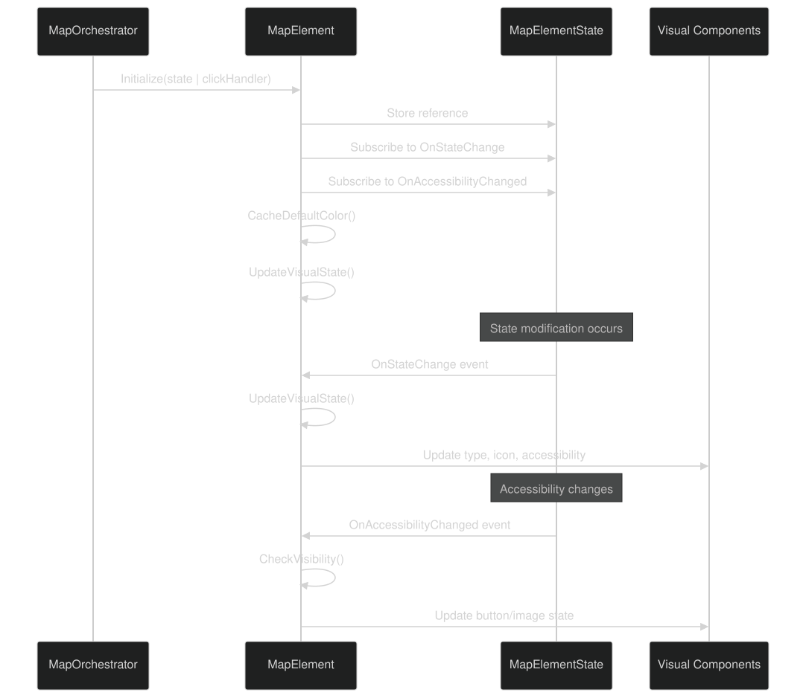
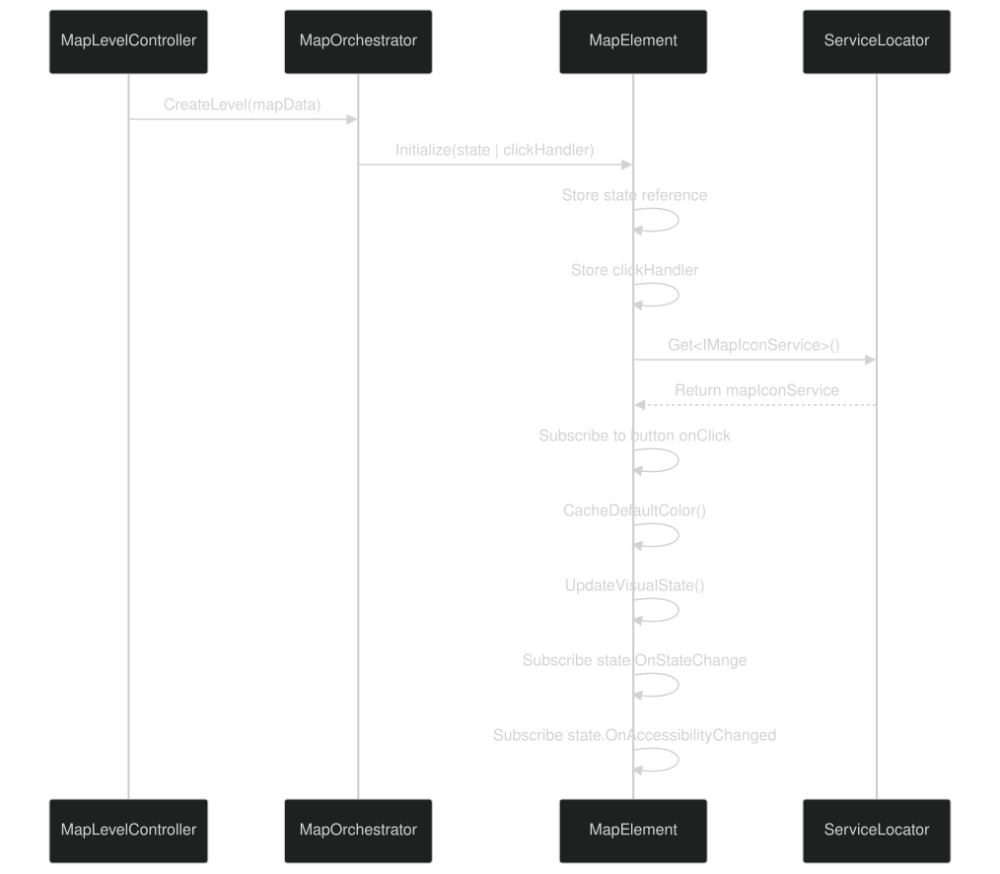

# Map Elements & Interactive Nodes

<details>
<summary>Relevant source files</summary>


- [CarnageClub/Assets/GameResources/Art/Preloader/CarnageClub_Preloader.png](https://github.com/Wolfs0ng/CarnageClub/blob/0021fcdc/CarnageClub/Assets/GameResources/Art/Preloader/CarnageClub_Preloader.png)
- [CarnageClub/Assets/GameResources/Art/Preloader/CarnageClub_Preloader.png.meta](https://github.com/Wolfs0ng/CarnageClub/blob/0021fcdc/CarnageClub/Assets/GameResources/Art/Preloader/CarnageClub_Preloader.png.meta)
- [CarnageClub/Assets/GameResources/Font/Cinzel-VariableFont_wght SDF.asset](https://github.com/Wolfs0ng/CarnageClub/blob/0021fcdc/CarnageClub/Assets/GameResources/Font/Cinzel-VariableFont_wght SDF.asset)
- [CarnageClub/Assets/GameResources/Font/StoryScript-Regular SDF 1.asset](https://github.com/Wolfs0ng/CarnageClub/blob/0021fcdc/CarnageClub/Assets/GameResources/Font/StoryScript-Regular SDF 1.asset)
- [CarnageClub/Assets/GameResources/Prefabs/Map/Levels/Map_Level_1.prefab](https://github.com/Wolfs0ng/CarnageClub/blob/0021fcdc/CarnageClub/Assets/GameResources/Prefabs/Map/Levels/Map_Level_1.prefab)
- [CarnageClub/Assets/GameResources/Prefabs/Map/Levels/Map_Level_2.prefab](https://github.com/Wolfs0ng/CarnageClub/blob/0021fcdc/CarnageClub/Assets/GameResources/Prefabs/Map/Levels/Map_Level_2.prefab)
- [CarnageClub/Assets/Scenes/MainMenu.unity](https://github.com/Wolfs0ng/CarnageClub/blob/0021fcdc/CarnageClub/Assets/Scenes/MainMenu.unity)
- [CarnageClub/Assets/Scripts/Map/Data/MapData.cs](https://github.com/Wolfs0ng/CarnageClub/blob/0021fcdc/CarnageClub/Assets/Scripts/Map/Data/MapData.cs)
- [CarnageClub/Assets/Scripts/Map/Elements/MapElement.cs](https://github.com/Wolfs0ng/CarnageClub/blob/0021fcdc/CarnageClub/Assets/Scripts/Map/Elements/MapElement.cs)
- [CarnageClub/Assets/Scripts/Utils/Core/Enum/EventTypes.cs](https://github.com/Wolfs0ng/CarnageClub/blob/0021fcdc/CarnageClub/Assets/Scripts/Utils/Core/Enum/EventTypes.cs)
- [CarnageClub/Assets/Scripts/Utils/Core/SaveService.cs](https://github.com/Wolfs0ng/CarnageClub/blob/0021fcdc/CarnageClub/Assets/Scripts/Utils/Core/SaveService.cs)


</details>

## Purpose and Scope

This document details the `MapElement` component and its associated systems, which represent interactive nodes in the game's map navigation structure. Map elements are the clickable UI entities that players interact with to traverse the map, enter battles, access stores, and trigger level transitions.

Scope : This page covers the `MapElement` component architecture, element identification, type system, accessibility states, and visual management. For behavior implementations triggered when players interact with elements, see [Element Behaviors & Interactions](#6.3) . For pathfinding and movement between elements, see [Map Navigation & Movement](#6.1) . For level data structure and prefab configuration, see [Map Data & Prefabs](#6.5) .

## MapElement Component Architecture

The `MapElement` class is a Unity MonoBehaviour that serves as the primary component for all interactive map nodes. Each element represents a single location on the map that players can navigate to and interact with.



Sources : [CarnageClub/Assets/Scripts/Map/Elements/MapElement.cs #24-179](https://github.com/Wolfs0ng/CarnageClub/blob/0021fcdc/CarnageClub/Assets/Scripts/Map/Elements/MapElement.cs#L24-L179)

## Element Identification System

Each map element has a unique identifier composed of two integers that form a hierarchical addressing scheme.

### MapElementId Structure

Example from Level 1 Prefab :

- `{id: 1, subId: 1}`Element_11: - BoneFire element
- `{id: 1, subId: 3}`Element_13: - Store element
- `{id: 2, subId: 2}`Element_22: - Stairs element


This two-tier system allows for logical grouping of elements (e.g., by map region or progression tier) while maintaining unique identifiers for pathfinding and state management.

Sources : [CarnageClub/Assets/Scripts/Map/Elements/MapElement.cs #26](https://github.com/Wolfs0ng/CarnageClub/blob/0021fcdc/CarnageClub/Assets/Scripts/Map/Elements/MapElement.cs#L26-L26)  [CarnageClub/Assets/GameResources/Prefabs/Map/Levels/Map_Level_1.prefab #136-138](https://github.com/Wolfs0ng/CarnageClub/blob/0021fcdc/CarnageClub/Assets/GameResources/Prefabs/Map/Levels/Map_Level_1.prefab#L136-L138)

## Element Types and Icon System

Map elements are classified by both their functional type and their visual representation.

### MapElementType Enumeration

The `MapElementType` enum defines the functional behavior category of each element:

### MapIconType System

Each element type has a corresponding `MapIconType` that determines its visual sprite. The `IMapIconService` provides the mapping from icon type to Unity `Sprite` assets.


Sources : [CarnageClub/Assets/Scripts/Map/Elements/MapElement.cs #29-30](https://github.com/Wolfs0ng/CarnageClub/blob/0021fcdc/CarnageClub/Assets/Scripts/Map/Elements/MapElement.cs#L29-L30)  [CarnageClub/Assets/Scripts/Map/Elements/MapElement.cs #90-99](https://github.com/Wolfs0ng/CarnageClub/blob/0021fcdc/CarnageClub/Assets/Scripts/Map/Elements/MapElement.cs#L90-L99)  [CarnageClub/Assets/GameResources/Prefabs/Map/Levels/Map_Level_1.prefab #141-142](https://github.com/Wolfs0ng/CarnageClub/blob/0021fcdc/CarnageClub/Assets/GameResources/Prefabs/Map/Levels/Map_Level_1.prefab#L141-L142)

## Accessibility System

The accessibility system controls which elements players can interact with at any given time. It uses a flags-based enum to support multiple simultaneous states.

### MapElementAccessibility Flags



### Visual State Behavior

[CarnageClub/Assets/Scripts/Map/Elements/MapElement.cs #111-138](https://github.com/Wolfs0ng/CarnageClub/blob/0021fcdc/CarnageClub/Assets/Scripts/Map/Elements/MapElement.cs#L111-L138) implements the visibility check:

Sources : [CarnageClub/Assets/Scripts/Map/Elements/MapElement.cs #31](https://github.com/Wolfs0ng/CarnageClub/blob/0021fcdc/CarnageClub/Assets/Scripts/Map/Elements/MapElement.cs#L31-L31)  [CarnageClub/Assets/Scripts/Map/Elements/MapElement.cs #111-138](https://github.com/Wolfs0ng/CarnageClub/blob/0021fcdc/CarnageClub/Assets/Scripts/Map/Elements/MapElement.cs#L111-L138)

## State Management and Lifecycle

Map elements use a reactive state management pattern where `MapElementState` serves as the source of truth for runtime state.

### State Synchronization Flow



### UpdateVisualState Implementation

[CarnageClub/Assets/Scripts/Map/Elements/MapElement.cs #145-155](https://github.com/Wolfs0ng/CarnageClub/blob/0021fcdc/CarnageClub/Assets/Scripts/Map/Elements/MapElement.cs#L145-L155) synchronizes visual components with state:

```block
mapElementType = State.MapElementTypemapIconType = State.MapIconTypemapElementAccessibility = State.MapElementAccessibilityneighborElementsHandler = State.NeighborElementsHandlerBaseElementBehaviourData = State.BehaviourData SetIcon()CheckVisibility()
```

This pattern ensures that visual representation always reflects the authoritative state, enabling features like:

- Dynamic accessibility changes (e.g., unlocking after clearing a boss)
- State persistence and restoration across save/load cycles
- Centralized state management for UI updates


Sources : [CarnageClub/Assets/Scripts/Map/Elements/MapElement.cs #51-62](https://github.com/Wolfs0ng/CarnageClub/blob/0021fcdc/CarnageClub/Assets/Scripts/Map/Elements/MapElement.cs#L51-L62)  [CarnageClub/Assets/Scripts/Map/Elements/MapElement.cs #145-155](https://github.com/Wolfs0ng/CarnageClub/blob/0021fcdc/CarnageClub/Assets/Scripts/Map/Elements/MapElement.cs#L145-L155)

## Neighbor Graph Structure

Map elements form a directed graph where each node explicitly declares its adjacent nodes. This enables pathfinding and determines which elements become accessible after interacting with a given element.

### NeighborElementsHandler Structure



The `NeighborElementsHandler` contains a list of `MapElementId` references:

```block
neighborElements:  - {id: 1, subId: 0}  - {id: 1, subId: 3}
```

Graph Properties :

- Directed: Edges are one-way; Element A can list B as a neighbor without B listing A
- Explicit: No implicit connections; all edges must be manually configured
- Hierarchical`{id, subId}`: The structure supports logical grouping
- Dynamic: Neighbor accessibility can change based on game state (e.g., boss defeat unlocks next area)


Usage in Pathfinding : The `MapPathfinder` service (see [Map Navigation & Movement](#6.1) ) traverses this graph to calculate routes between the player's current position and clicked elements.

Sources : [CarnageClub/Assets/Scripts/Map/Elements/MapElement.cs #32](https://github.com/Wolfs0ng/CarnageClub/blob/0021fcdc/CarnageClub/Assets/Scripts/Map/Elements/MapElement.cs#L32-L32)  [CarnageClub/Assets/Scripts/Map/Elements/MapElement.cs #48](https://github.com/Wolfs0ng/CarnageClub/blob/0021fcdc/CarnageClub/Assets/Scripts/Map/Elements/MapElement.cs#L48-L48)  [CarnageClub/Assets/GameResources/Prefabs/Map/Levels/Map_Level_1.prefab #144-149](https://github.com/Wolfs0ng/CarnageClub/blob/0021fcdc/CarnageClub/Assets/GameResources/Prefabs/Map/Levels/Map_Level_1.prefab#L144-L149)

## Element Initialization and Click Handling

### Initialization Flow

The `MapElement.Initialize()` method establishes the component's runtime state and connections:



Key Initialization Steps  [CarnageClub/Assets/Scripts/Map/Elements/MapElement.cs #51-62](https://github.com/Wolfs0ng/CarnageClub/blob/0021fcdc/CarnageClub/Assets/Scripts/Map/Elements/MapElement.cs#L51-L62) :

### Click Handling Flow


When a player clicks an element:

This decouples the visual component from game logic, allowing the orchestrator to control navigation flow while elements remain simple view components.

Sources : [CarnageClub/Assets/Scripts/Map/Elements/MapElement.cs #51-62](https://github.com/Wolfs0ng/CarnageClub/blob/0021fcdc/CarnageClub/Assets/Scripts/Map/Elements/MapElement.cs#L51-L62)  [CarnageClub/Assets/Scripts/Map/Elements/MapElement.cs #80-88](https://github.com/Wolfs0ng/CarnageClub/blob/0021fcdc/CarnageClub/Assets/Scripts/Map/Elements/MapElement.cs#L80-L88)  [CarnageClub/Assets/Scripts/Map/Elements/MapElement.cs #140-143](https://github.com/Wolfs0ng/CarnageClub/blob/0021fcdc/CarnageClub/Assets/Scripts/Map/Elements/MapElement.cs#L140-L143)

## Cleanup and Memory Management

The `MapElement` implements proper cleanup to prevent memory leaks and dangling event subscriptions.

### OnDestroy Pattern

[CarnageClub/Assets/Scripts/Map/Elements/MapElement.cs #157-178](https://github.com/Wolfs0ng/CarnageClub/blob/0021fcdc/CarnageClub/Assets/Scripts/Map/Elements/MapElement.cs#L157-L178) handles cleanup:

Button Events :

```block
elementButton.onClick.RemoveAllListeners()
```

State Events :

```block
State.OnStateChange -= UpdateVisualStateState.OnAccessibilityChanged -= accessibilityListener
```

This pattern ensures that:

- Unity Button references are cleared before object destruction
- State event subscriptions are removed to prevent callbacks on destroyed objects
- Custom accessibility listeners are properly unregistered
- No memory leaks occur during level transitions or scene changes


Sources : [CarnageClub/Assets/Scripts/Map/Elements/MapElement.cs #157-178](https://github.com/Wolfs0ng/CarnageClub/blob/0021fcdc/CarnageClub/Assets/Scripts/Map/Elements/MapElement.cs#L157-L178)

## Integration Points

### With Map Systems

### With Behavior System

Elements delegate behavioral logic to implementations of `IMapElementBehaviour` (detailed in [Element Behaviors & Interactions](#6.3) ):

- `BaseElementBehaviourData`stores configuration for the assigned behavior
- `MapOrchestrator`Behavior is resolved via type and executed by when player arrives
- `MapElement`Separation of concerns: handles presentation, behaviors handle game logic


### With Event System

Map-related events flow through `IEventService` (see [Event Service & Communication](#4.2) ):

- `LaunchBattle`- Triggered by Fight/Boss element behaviors
- `LevelChange`- Triggered by Stairs element behaviors
- `MapElementState`Element state changes propagate through events


Sources : [CarnageClub/Assets/Scripts/Map/Elements/MapElement.cs #49](https://github.com/Wolfs0ng/CarnageClub/blob/0021fcdc/CarnageClub/Assets/Scripts/Map/Elements/MapElement.cs#L49-L49)  [CarnageClub/Assets/Scripts/Utils/Core/Enum/EventTypes.cs #15-23](https://github.com/Wolfs0ng/CarnageClub/blob/0021fcdc/CarnageClub/Assets/Scripts/Utils/Core/Enum/EventTypes.cs#L15-L23)