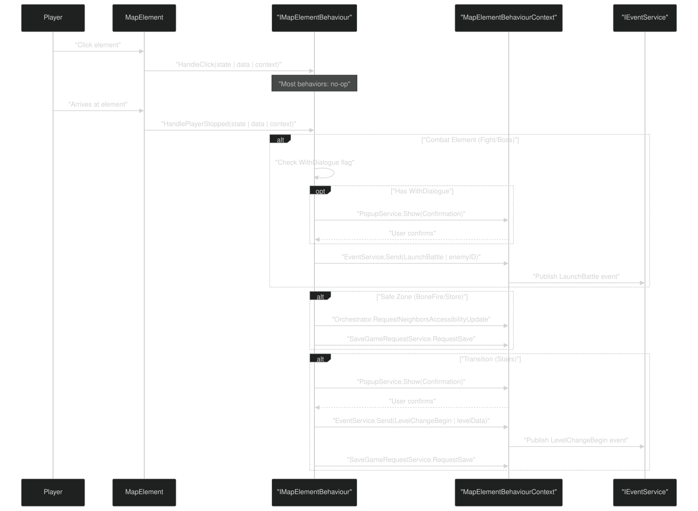
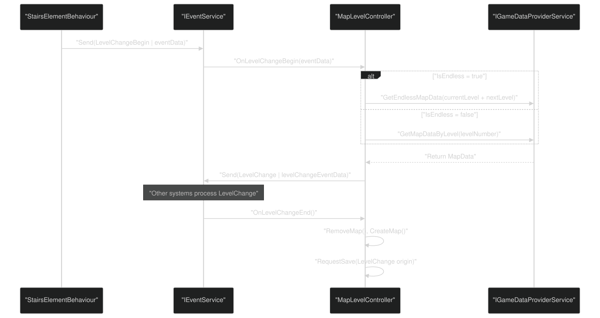

# Element Behaviors & Interactions

<details>
<summary>Relevant source files</summary>


- [CarnageClub/Assets/GameResources/ScriptableObjects/BaseGameData/MapLevels/Level_2_MapData.asset](https://github.com/Wolfs0ng/CarnageClub/blob/0021fcdc/CarnageClub/Assets/GameResources/ScriptableObjects/BaseGameData/MapLevels/Level_2_MapData.asset)
- [CarnageClub/Assets/Scenes/Map.unity](https://github.com/Wolfs0ng/CarnageClub/blob/0021fcdc/CarnageClub/Assets/Scenes/Map.unity)
- [CarnageClub/Assets/Scripts/Map/Controllers/MapLevelController.cs](https://github.com/Wolfs0ng/CarnageClub/blob/0021fcdc/CarnageClub/Assets/Scripts/Map/Controllers/MapLevelController.cs)
- [CarnageClub/Assets/Scripts/Map/Elements/Behaviours/BoneFireElementBehaviour.cs](https://github.com/Wolfs0ng/CarnageClub/blob/0021fcdc/CarnageClub/Assets/Scripts/Map/Elements/Behaviours/BoneFireElementBehaviour.cs)
- [CarnageClub/Assets/Scripts/Map/Elements/Behaviours/BossElementBehaviour.cs](https://github.com/Wolfs0ng/CarnageClub/blob/0021fcdc/CarnageClub/Assets/Scripts/Map/Elements/Behaviours/BossElementBehaviour.cs)
- [CarnageClub/Assets/Scripts/Map/Elements/Behaviours/Data/StairsElementBehaviourData.cs](https://github.com/Wolfs0ng/CarnageClub/blob/0021fcdc/CarnageClub/Assets/Scripts/Map/Elements/Behaviours/Data/StairsElementBehaviourData.cs)
- [CarnageClub/Assets/Scripts/Map/Elements/Behaviours/FightElementBehaviour.cs](https://github.com/Wolfs0ng/CarnageClub/blob/0021fcdc/CarnageClub/Assets/Scripts/Map/Elements/Behaviours/FightElementBehaviour.cs)
- [CarnageClub/Assets/Scripts/Map/Elements/Behaviours/StairsElementBehaviour.cs](https://github.com/Wolfs0ng/CarnageClub/blob/0021fcdc/CarnageClub/Assets/Scripts/Map/Elements/Behaviours/StairsElementBehaviour.cs)
- [CarnageClub/Assets/Scripts/Map/Elements/Behaviours/StoreElementBehaviour.cs](https://github.com/Wolfs0ng/CarnageClub/blob/0021fcdc/CarnageClub/Assets/Scripts/Map/Elements/Behaviours/StoreElementBehaviour.cs)
- [CarnageClub/Assets/Scripts/Map/Events/LevelChangeBeginEventData.cs](https://github.com/Wolfs0ng/CarnageClub/blob/0021fcdc/CarnageClub/Assets/Scripts/Map/Events/LevelChangeBeginEventData.cs)
- [CarnageClub/Assets/Scripts/Map/Events/LevelChangeEventData.cs](https://github.com/Wolfs0ng/CarnageClub/blob/0021fcdc/CarnageClub/Assets/Scripts/Map/Events/LevelChangeEventData.cs)


</details>

## Purpose and Scope

This document describes the behavior pattern implementation for map elements in the Carnage Club codebase. Map element behaviors define how interactive nodes respond to player actions and state changes. Each map element type (Fight, Boss, BoneFire, Store, Stairs, etc.) has a corresponding behavior class that encapsulates its interaction logic.

For information about the map element data structures and visual state management, see [Map Elements & Interactive Nodes](#6.2) . For details on level loading and transitions, see [Level Management & Transitions](#6.4) . For battle system integration, see [Battle Flow & Turn Management](#5.1) .

## Behavior Pattern Architecture

The system implements the Strategy pattern to enable pluggable behaviors for map elements. Each element type has a behavior class that implements the `IMapElementBehaviour` interface, allowing different interaction logic without inheritance hierarchies or type-checking.

### IMapElementBehaviour Interface



Sources:  [CarnageClub/Assets/Scripts/Map/Elements/Behaviours/FightElementBehaviour.cs #1-81](https://github.com/Wolfs0ng/CarnageClub/blob/0021fcdc/CarnageClub/Assets/Scripts/Map/Elements/Behaviours/FightElementBehaviour.cs#L1-L81)  [CarnageClub/Assets/Scripts/Map/Elements/Behaviours/BossElementBehaviour.cs #1-81](https://github.com/Wolfs0ng/CarnageClub/blob/0021fcdc/CarnageClub/Assets/Scripts/Map/Elements/Behaviours/BossElementBehaviour.cs#L1-L81)  [CarnageClub/Assets/Scripts/Map/Elements/Behaviours/BoneFireElementBehaviour.cs #1-49](https://github.com/Wolfs0ng/CarnageClub/blob/0021fcdc/CarnageClub/Assets/Scripts/Map/Elements/Behaviours/BoneFireElementBehaviour.cs#L1-L49)  [CarnageClub/Assets/Scripts/Map/Elements/Behaviours/StoreElementBehaviour.cs #1-49](https://github.com/Wolfs0ng/CarnageClub/blob/0021fcdc/CarnageClub/Assets/Scripts/Map/Elements/Behaviours/StoreElementBehaviour.cs#L1-L49)  [CarnageClub/Assets/Scripts/Map/Elements/Behaviours/StairsElementBehaviour.cs #1-71](https://github.com/Wolfs0ng/CarnageClub/blob/0021fcdc/CarnageClub/Assets/Scripts/Map/Elements/Behaviours/StairsElementBehaviour.cs#L1-L71)

The interface defines three lifecycle hooks:

### MapElementBehaviourContext

Behaviors receive dependencies through a `MapElementBehaviourContext` object, implementing dependency injection without constructor coupling:



Sources: Context injection pattern inferred from [CarnageClub/Assets/Scripts/Map/Elements/Behaviours/FightElementBehaviour.cs #25-30](https://github.com/Wolfs0ng/CarnageClub/blob/0021fcdc/CarnageClub/Assets/Scripts/Map/Elements/Behaviours/FightElementBehaviour.cs#L25-L30)  [CarnageClub/Assets/Scripts/Map/Elements/Behaviours/StairsElementBehaviour.cs #26-45](https://github.com/Wolfs0ng/CarnageClub/blob/0021fcdc/CarnageClub/Assets/Scripts/Map/Elements/Behaviours/StairsElementBehaviour.cs#L26-L45)  [CarnageClub/Assets/Scripts/Map/Elements/Behaviours/BoneFireElementBehaviour.cs #30-42](https://github.com/Wolfs0ng/CarnageClub/blob/0021fcdc/CarnageClub/Assets/Scripts/Map/Elements/Behaviours/BoneFireElementBehaviour.cs#L30-L42)

The context provides access to:

- IEventService: Pub/sub communication (battle launches, level changes)
- IPopupService: User confirmations
- ISaveGameRequestService: Save game triggers
- MapOrchestrator: Element accessibility updates


### MapElementBehaviourData Hierarchy

Each behavior has a corresponding data class for configuration:



Sources:  [CarnageClub/Assets/Scripts/Map/Elements/Behaviours/Data/StairsElementBehaviourData.cs #17-26](https://github.com/Wolfs0ng/CarnageClub/blob/0021fcdc/CarnageClub/Assets/Scripts/Map/Elements/Behaviours/Data/StairsElementBehaviourData.cs#L17-L26)  [CarnageClub/Assets/GameResources/ScriptableObjects/BaseGameData/MapLevels/Level_2_MapData.asset #157-200](https://github.com/Wolfs0ng/CarnageClub/blob/0021fcdc/CarnageClub/Assets/GameResources/ScriptableObjects/BaseGameData/MapLevels/Level_2_MapData.asset#L157-L200)

These data classes are serialized in `MapData` ScriptableObjects and associated with specific map elements, providing configuration without hardcoding behavior logic.

## Behavior Lifecycle

### Execution Flow



Sources:  [CarnageClub/Assets/Scripts/Map/Elements/Behaviours/FightElementBehaviour.cs #32-47](https://github.com/Wolfs0ng/CarnageClub/blob/0021fcdc/CarnageClub/Assets/Scripts/Map/Elements/Behaviours/FightElementBehaviour.cs#L32-L47)  [CarnageClub/Assets/Scripts/Map/Elements/Behaviours/BoneFireElementBehaviour.cs #30-42](https://github.com/Wolfs0ng/CarnageClub/blob/0021fcdc/CarnageClub/Assets/Scripts/Map/Elements/Behaviours/BoneFireElementBehaviour.cs#L30-L42)  [CarnageClub/Assets/Scripts/Map/Elements/Behaviours/StairsElementBehaviour.cs #33-45](https://github.com/Wolfs0ng/CarnageClub/blob/0021fcdc/CarnageClub/Assets/Scripts/Map/Elements/Behaviours/StairsElementBehaviour.cs#L33-L45)

The primary interaction point is `HandlePlayerStopped` , which fires when the player's pathfinding completes at an element. `HandleClick` is currently a no-op in all implementations, reserved for future direct-click interactions. `HandleAccessibilityChanged` is also unused but allows behaviors to react to state changes.

## Concrete Behavior Implementations

### Combat Behaviors: FightElementBehaviour and BossElementBehaviour

Both combat behaviors follow identical logic, differing only in the enemy ID field:

FightElementBehaviour

- `MapElementAccessibility.WithDialogue`[CarnageClub/Assets/Scripts/Map/Elements/Behaviours/FightElementBehaviour.cs#40-44](https://github.com/Wolfs0ng/CarnageClub/blob/0021fcdc/CarnageClub/Assets/Scripts/Map/Elements/Behaviours/FightElementBehaviour.cs#L40-L44)Checks for flag
- [CarnageClub/Assets/Scripts/Map/Elements/Behaviours/FightElementBehaviour.cs#42-43](https://github.com/Wolfs0ng/CarnageClub/blob/0021fcdc/CarnageClub/Assets/Scripts/Map/Elements/Behaviours/FightElementBehaviour.cs#L42-L43)If flag absent: immediately launches battle
- [CarnageClub/Assets/Scripts/Map/Elements/Behaviours/FightElementBehaviour.cs#46](https://github.com/Wolfs0ng/CarnageClub/blob/0021fcdc/CarnageClub/Assets/Scripts/Map/Elements/Behaviours/FightElementBehaviour.cs#L46-L46)If flag present: shows confirmation popup, launches on confirm
- `EventTypes.LaunchBattle``LaunchBattleEventData(enemyID)`[CarnageClub/Assets/Scripts/Map/Elements/Behaviours/FightElementBehaviour.cs#78](https://github.com/Wolfs0ng/CarnageClub/blob/0021fcdc/CarnageClub/Assets/Scripts/Map/Elements/Behaviours/FightElementBehaviour.cs#L78-L78)Sends with


BossElementBehaviour

- `FightElementBehaviour`[CarnageClub/Assets/Scripts/Map/Elements/Behaviours/BossElementBehaviour.cs#32-78](https://github.com/Wolfs0ng/CarnageClub/blob/0021fcdc/CarnageClub/Assets/Scripts/Map/Elements/Behaviours/BossElementBehaviour.cs#L32-L78)Identical to
- `BossElementBehaviourData.BossID``FightElementBehaviourData.EnemyID`Uses instead of


WithDialogue Flag Usage

The `WithDialogue` accessibility flag controls whether the player sees a confirmation dialog before entering combat. This allows level designers to create "ambush" fights (no dialog) vs. "announced" fights (with dialog):



Sources:  [CarnageClub/Assets/Scripts/Map/Elements/Behaviours/FightElementBehaviour.cs #32-79](https://github.com/Wolfs0ng/CarnageClub/blob/0021fcdc/CarnageClub/Assets/Scripts/Map/Elements/Behaviours/FightElementBehaviour.cs#L32-L79)  [CarnageClub/Assets/Scripts/Map/Elements/Behaviours/BossElementBehaviour.cs #32-79](https://github.com/Wolfs0ng/CarnageClub/blob/0021fcdc/CarnageClub/Assets/Scripts/Map/Elements/Behaviours/BossElementBehaviour.cs#L32-L79)

### Safe Zone Behaviors: BoneFireElementBehaviour and StoreElementBehaviour

Both safe zone behaviors provide checkpoint functionality :

BoneFireElementBehaviour

StoreElementBehaviour

- `BoneFireElementBehaviour`[CarnageClub/Assets/Scripts/Map/Elements/Behaviours/StoreElementBehaviour.cs#30-42](https://github.com/Wolfs0ng/CarnageClub/blob/0021fcdc/CarnageClub/Assets/Scripts/Map/Elements/Behaviours/StoreElementBehaviour.cs#L30-L42)Identical implementation to
- Future differentiation may include store UI display


Neighbor Unlocking Mechanism

Safe zones use `AccessibilityUpdateMode.Add` to make neighboring elements accessible:

Sources:  [CarnageClub/Assets/Scripts/Map/Elements/Behaviours/BoneFireElementBehaviour.cs #1-49](https://github.com/Wolfs0ng/CarnageClub/blob/0021fcdc/CarnageClub/Assets/Scripts/Map/Elements/Behaviours/BoneFireElementBehaviour.cs#L1-L49)  [CarnageClub/Assets/Scripts/Map/Elements/Behaviours/StoreElementBehaviour.cs #1-49](https://github.com/Wolfs0ng/CarnageClub/blob/0021fcdc/CarnageClub/Assets/Scripts/Map/Elements/Behaviours/StoreElementBehaviour.cs#L1-L49)

### Transition Behavior: StairsElementBehaviour

Handles level transitions with configuration flexibility:

StairsElementBehaviourData Configuration

- `NextLevels`: List of possible next level numbers (supports branching)
- `PlayerPosition`: Where to spawn player on next level (MapElementId)
- `IsEndless`: Whether this is an endless mode transition


Behavior Flow  [CarnageClub/Assets/Scripts/Map/Elements/Behaviours/StairsElementBehaviour.cs #33-69](https://github.com/Wolfs0ng/CarnageClub/blob/0021fcdc/CarnageClub/Assets/Scripts/Map/Elements/Behaviours/StairsElementBehaviour.cs#L33-L69)

Level Change Event Chain



Sources:  [CarnageClub/Assets/Scripts/Map/Elements/Behaviours/StairsElementBehaviour.cs #33-69](https://github.com/Wolfs0ng/CarnageClub/blob/0021fcdc/CarnageClub/Assets/Scripts/Map/Elements/Behaviours/StairsElementBehaviour.cs#L33-L69)  [CarnageClub/Assets/Scripts/Map/Controllers/MapLevelController.cs #85-118](https://github.com/Wolfs0ng/CarnageClub/blob/0021fcdc/CarnageClub/Assets/Scripts/Map/Controllers/MapLevelController.cs#L85-L118)

The `NextLevels` list currently only uses the first element ( `[0]` ), but the data structure supports multiple possible levels for future branching level design.

## Interaction Patterns

### Battle Launching Pattern

Combat behaviors use the event system for loose coupling:


Event Data Structure

- `EventTypes.LaunchBattle`Event Type:
- `LaunchBattleEventData(int enemyId)`Payload:


This pattern ensures behaviors don't directly depend on the battle system. The event service routes the launch request to the appropriate handler.

Sources:  [CarnageClub/Assets/Scripts/Map/Elements/Behaviours/FightElementBehaviour.cs #71-79](https://github.com/Wolfs0ng/CarnageClub/blob/0021fcdc/CarnageClub/Assets/Scripts/Map/Elements/Behaviours/FightElementBehaviour.cs#L71-L79)  [CarnageClub/Assets/Scripts/Map/Elements/Behaviours/BossElementBehaviour.cs #71-79](https://github.com/Wolfs0ng/CarnageClub/blob/0021fcdc/CarnageClub/Assets/Scripts/Map/Elements/Behaviours/BossElementBehaviour.cs#L71-L79)

### Save Game Triggering Pattern

Three behavior types trigger saves:

Additionally, `MapLevelController` triggers saves:

- `SaveGameRequestOrigin.LevelChange`[CarnageClub/Assets/Scripts/Map/Controllers/MapLevelController.cs#115-117](https://github.com/Wolfs0ng/CarnageClub/blob/0021fcdc/CarnageClub/Assets/Scripts/Map/Controllers/MapLevelController.cs#L115-L117)After level change completes:


Save Request Structure

```block
SaveGameRequest request = new(    MapElementId originElementId,  // Where save was triggered    SaveGameRequestOrigin origin    // Why save was triggered);context.SaveGameRequestService.RequestSave(request);
```

Sources:  [CarnageClub/Assets/Scripts/Map/Elements/Behaviours/BoneFireElementBehaviour.cs #40-41](https://github.com/Wolfs0ng/CarnageClub/blob/0021fcdc/CarnageClub/Assets/Scripts/Map/Elements/Behaviours/BoneFireElementBehaviour.cs#L40-L41)  [CarnageClub/Assets/Scripts/Map/Elements/Behaviours/StairsElementBehaviour.cs #43-44](https://github.com/Wolfs0ng/CarnageClub/blob/0021fcdc/CarnageClub/Assets/Scripts/Map/Elements/Behaviours/StairsElementBehaviour.cs#L43-L44)  [CarnageClub/Assets/Scripts/Map/Controllers/MapLevelController.cs #115-117](https://github.com/Wolfs0ng/CarnageClub/blob/0021fcdc/CarnageClub/Assets/Scripts/Map/Controllers/MapLevelController.cs#L115-L117)

### Neighbor Accessibility Updates

Safe zone behaviors modify neighbor accessibility through the orchestrator:



This creates a "ripple effect" where reaching a safe zone unlocks adjacent areas. The neighbor relationships are defined in `MapData` via `NeighborElementsHandler` .

Example from Level_2_MapData.asset  [CarnageClub/Assets/GameResources/ScriptableObjects/BaseGameData/MapLevels/Level_2_MapData.asset #16-46](https://github.com/Wolfs0ng/CarnageClub/blob/0021fcdc/CarnageClub/Assets/GameResources/ScriptableObjects/BaseGameData/MapLevels/Level_2_MapData.asset#L16-L46) :

- Element [0,0] (BoneFire) has neighbors: [1,0], [2,0], [3,0]
- When player reaches [0,0], all three neighbors become accessible


Sources:  [CarnageClub/Assets/Scripts/Map/Elements/Behaviours/BoneFireElementBehaviour.cs #38](https://github.com/Wolfs0ng/CarnageClub/blob/0021fcdc/CarnageClub/Assets/Scripts/Map/Elements/Behaviours/BoneFireElementBehaviour.cs#L38-L38)  [CarnageClub/Assets/GameResources/ScriptableObjects/BaseGameData/MapLevels/Level_2_MapData.asset #16-46](https://github.com/Wolfs0ng/CarnageClub/blob/0021fcdc/CarnageClub/Assets/GameResources/ScriptableObjects/BaseGameData/MapLevels/Level_2_MapData.asset#L16-L46)

## Configuration and Data Flow

### MapData Structure

Map configurations use Unity's serialization system with `SerializeReference` for polymorphic behavior data:



MapElementState Fields (relevant to behaviors):

- `MapElementId`: Unique identifier
- `MapElementType`: Element type enum (Fight, Boss, BoneFire, etc.)
- `MapElementAccessibility`: Bit flags (Accessible, WithDialogue, etc.)
- `NeighborElementsHandler`: List of adjacent element IDs
- `BehaviourData`: Polymorphic behavior configuration


Sources:  [CarnageClub/Assets/GameResources/ScriptableObjects/BaseGameData/MapLevels/Level_2_MapData.asset #16-200](https://github.com/Wolfs0ng/CarnageClub/blob/0021fcdc/CarnageClub/Assets/GameResources/ScriptableObjects/BaseGameData/MapLevels/Level_2_MapData.asset#L16-L200)

### Behavior Registration and Execution

While the specific registry implementation isn't shown in the provided files, the pattern suggests:

The separation between state ( `MapElementState` ), configuration ( `MapElementBehaviourData` ), and logic ( `IMapElementBehaviour` ) follows single responsibility principle :

- State: Runtime mutability
- Configuration: Design-time immutability
- Logic: Reusable behavior implementation


Sources: Pattern inferred from [CarnageClub/Assets/Scripts/Map/Elements/Behaviours/FightElementBehaviour.cs #1-81](https://github.com/Wolfs0ng/CarnageClub/blob/0021fcdc/CarnageClub/Assets/Scripts/Map/Elements/Behaviours/FightElementBehaviour.cs#L1-L81)  [CarnageClub/Assets/GameResources/ScriptableObjects/BaseGameData/MapLevels/Level_2_MapData.asset #1-201](https://github.com/Wolfs0ng/CarnageClub/blob/0021fcdc/CarnageClub/Assets/GameResources/ScriptableObjects/BaseGameData/MapLevels/Level_2_MapData.asset#L1-L201)

## Summary Table: Behavior Types

All behaviors operate through the context's service interfaces, ensuring loose coupling with the battle system, save system, and UI system. The behavior pattern allows new element types to be added without modifying existing code, supporting the open/closed principle .