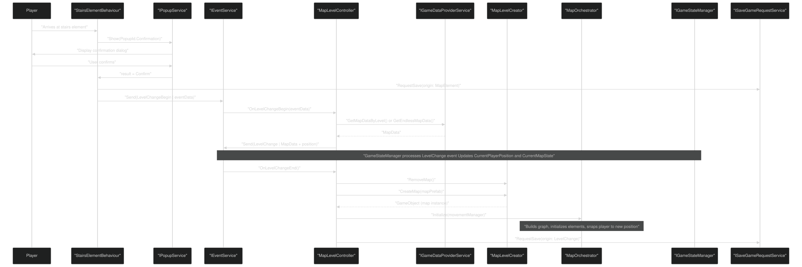

# Level Management & Transitions

<details>
<summary>Relevant source files</summary>


- [CarnageClub/Assets/GameResources/ScriptableObjects/BaseGameData/MapLevels/Level_2_MapData.asset](https://github.com/Wolfs0ng/CarnageClub/blob/0021fcdc/CarnageClub/Assets/GameResources/ScriptableObjects/BaseGameData/MapLevels/Level_2_MapData.asset)
- [CarnageClub/Assets/Scenes/Map.unity](https://github.com/Wolfs0ng/CarnageClub/blob/0021fcdc/CarnageClub/Assets/Scenes/Map.unity)
- [CarnageClub/Assets/Scripts/Core/Abstract/IGameStateManager.cs](https://github.com/Wolfs0ng/CarnageClub/blob/0021fcdc/CarnageClub/Assets/Scripts/Core/Abstract/IGameStateManager.cs)
- [CarnageClub/Assets/Scripts/Map/Controllers/MapCompositionRoot.cs](https://github.com/Wolfs0ng/CarnageClub/blob/0021fcdc/CarnageClub/Assets/Scripts/Map/Controllers/MapCompositionRoot.cs)
- [CarnageClub/Assets/Scripts/Map/Controllers/MapLevelController.cs](https://github.com/Wolfs0ng/CarnageClub/blob/0021fcdc/CarnageClub/Assets/Scripts/Map/Controllers/MapLevelController.cs)
- [CarnageClub/Assets/Scripts/Map/Controllers/MapOrchestrator.cs](https://github.com/Wolfs0ng/CarnageClub/blob/0021fcdc/CarnageClub/Assets/Scripts/Map/Controllers/MapOrchestrator.cs)
- [CarnageClub/Assets/Scripts/Map/Elements/Behaviours/Data/StairsElementBehaviourData.cs](https://github.com/Wolfs0ng/CarnageClub/blob/0021fcdc/CarnageClub/Assets/Scripts/Map/Elements/Behaviours/Data/StairsElementBehaviourData.cs)
- [CarnageClub/Assets/Scripts/Map/Elements/Behaviours/StairsElementBehaviour.cs](https://github.com/Wolfs0ng/CarnageClub/blob/0021fcdc/CarnageClub/Assets/Scripts/Map/Elements/Behaviours/StairsElementBehaviour.cs)
- [CarnageClub/Assets/Scripts/Map/Events/LevelChangeBeginEventData.cs](https://github.com/Wolfs0ng/CarnageClub/blob/0021fcdc/CarnageClub/Assets/Scripts/Map/Events/LevelChangeBeginEventData.cs)
- [CarnageClub/Assets/Scripts/Map/Events/LevelChangeEventData.cs](https://github.com/Wolfs0ng/CarnageClub/blob/0021fcdc/CarnageClub/Assets/Scripts/Map/Events/LevelChangeEventData.cs)
- [CarnageClub/Assets/Scripts/Map/MapMovement/MapPlayerMovementManager.cs](https://github.com/Wolfs0ng/CarnageClub/blob/0021fcdc/CarnageClub/Assets/Scripts/Map/MapMovement/MapPlayerMovementManager.cs)


</details>

## Purpose & Scope

This document explains how the game manages level loading, unloading, and transitions between map levels. It covers the orchestration of level changes triggered by map elements (primarily stairs), the event-driven architecture that coordinates transitions, and how player position and game state are synchronized across level boundaries.

For information about map element behaviors that trigger level changes, see [Element Behaviors & Interactions](#6.3) . For details about map data structure and prefab organization, see [Map Data & Prefabs](#6.5) . For player movement mechanics within a level, see [Map Navigation & Movement](#6.1) .

## Level Transition Flow Overview



Sources:

- [CarnageClub/Assets/Scripts/Map/Elements/Behaviours/StairsElementBehaviour.cs#33-69](https://github.com/Wolfs0ng/CarnageClub/blob/0021fcdc/CarnageClub/Assets/Scripts/Map/Elements/Behaviours/StairsElementBehaviour.cs#L33-L69)
- [CarnageClub/Assets/Scripts/Map/Controllers/MapLevelController.cs#85-118](https://github.com/Wolfs0ng/CarnageClub/blob/0021fcdc/CarnageClub/Assets/Scripts/Map/Controllers/MapLevelController.cs#L85-L118)


## Core Components

### MapLevelController

`MapLevelController` is the central orchestrator for level lifecycle management. It coordinates level creation, destruction, and the transition sequence.

Key Fields:

- `mapPlayerMovementManager`- Player movement controller
- `mapLevelCreator`- Prefab instantiation handler
- `mapScrollController`- Camera scroll controller
- `currentMapObject`- Current instantiated map GameObject


Sources:

- [CarnageClub/Assets/Scripts/Map/Controllers/MapLevelController.cs#26-141](https://github.com/Wolfs0ng/CarnageClub/blob/0021fcdc/CarnageClub/Assets/Scripts/Map/Controllers/MapLevelController.cs#L26-L141)


### MapLevelCreator

`MapLevelCreator` encapsulates map prefab instantiation and destruction logic. While its implementation is not provided in the files, its interface is clear from usage:

Methods (inferred):

- `CreateMap(GameObject prefab) : GameObject`- Instantiates a map prefab and returns the instance
- `RemoveMap()`- Destroys the current map instance
- `IsMapCreated : bool`- Property indicating whether a map is currently instantiated


Sources:

- [CarnageClub/Assets/Scripts/Map/Controllers/MapLevelController.cs#44-52](https://github.com/Wolfs0ng/CarnageClub/blob/0021fcdc/CarnageClub/Assets/Scripts/Map/Controllers/MapLevelController.cs#L44-L52)
- [CarnageClub/Assets/Scripts/Map/Controllers/MapLevelController.cs#73-75](https://github.com/Wolfs0ng/CarnageClub/blob/0021fcdc/CarnageClub/Assets/Scripts/Map/Controllers/MapLevelController.cs#L73-L75)
- [CarnageClub/Assets/Scripts/Map/Controllers/MapLevelController.cs#110-112](https://github.com/Wolfs0ng/CarnageClub/blob/0021fcdc/CarnageClub/Assets/Scripts/Map/Controllers/MapLevelController.cs#L110-L112)


### Event-Driven Architecture

Level transitions use a three-event sequence to decouple concerns:



Sources:

- [CarnageClub/Assets/Scripts/Map/Events/LevelChangeBeginEventData.cs#1-30](https://github.com/Wolfs0ng/CarnageClub/blob/0021fcdc/CarnageClub/Assets/Scripts/Map/Events/LevelChangeBeginEventData.cs#L1-L30)
- [CarnageClub/Assets/Scripts/Map/Events/LevelChangeEventData.cs#1-32](https://github.com/Wolfs0ng/CarnageClub/blob/0021fcdc/CarnageClub/Assets/Scripts/Map/Events/LevelChangeEventData.cs#L1-L32)
- [CarnageClub/Assets/Scripts/Map/Elements/Behaviours/StairsElementBehaviour.cs#64-66](https://github.com/Wolfs0ng/CarnageClub/blob/0021fcdc/CarnageClub/Assets/Scripts/Map/Elements/Behaviours/StairsElementBehaviour.cs#L64-L66)
- [CarnageClub/Assets/Scripts/Map/Controllers/MapLevelController.cs#85-106](https://github.com/Wolfs0ng/CarnageClub/blob/0021fcdc/CarnageClub/Assets/Scripts/Map/Controllers/MapLevelController.cs#L85-L106)


## Level Transition Sequence

### Phase 1: Trigger (User Interaction)

When a player reaches a stairs element, `StairsElementBehaviour.HandlePlayerStopped()` executes:

Sources:

- [CarnageClub/Assets/Scripts/Map/Elements/Behaviours/StairsElementBehaviour.cs#33-69](https://github.com/Wolfs0ng/CarnageClub/blob/0021fcdc/CarnageClub/Assets/Scripts/Map/Elements/Behaviours/StairsElementBehaviour.cs#L33-L69)


### Phase 2: Data Resolution (MapLevelController)

`MapLevelController.OnLevelChangeBegin()` processes the request:



Fixed Levels:

- `GeMapDataByLevel(levelNumber)``MapData`Uses to retrieve pre-configured ScriptableObject
- Level number is an absolute index (1, 2, 3, ...)


Endless Mode:

- `GetEndlessMapData(currentLevel + levelNumber)`Uses
- Generates procedural map data based on current level + increment
- Continues indefinitely with scaling difficulty


Sources:

- [CarnageClub/Assets/Scripts/Map/Controllers/MapLevelController.cs#85-106](https://github.com/Wolfs0ng/CarnageClub/blob/0021fcdc/CarnageClub/Assets/Scripts/Map/Controllers/MapLevelController.cs#L85-L106)


### Phase 3: State Update (GameStateManager)

`GameStateManager` (not shown in provided files) processes the `LevelChange` event:

This phase is critical because it ensures the game state is synchronized before map reconstruction.

Sources:

- [CarnageClub/Assets/Scripts/Core/Abstract/IGameStateManager.cs#24-42](https://github.com/Wolfs0ng/CarnageClub/blob/0021fcdc/CarnageClub/Assets/Scripts/Core/Abstract/IGameStateManager.cs#L24-L42)Inferred from
- [CarnageClub/Assets/Scripts/Map/Controllers/MapLevelController.cs#68](https://github.com/Wolfs0ng/CarnageClub/blob/0021fcdc/CarnageClub/Assets/Scripts/Map/Controllers/MapLevelController.cs#L68-L68)Event subscription in


### Phase 4: Map Reconstruction (MapLevelController)

`MapLevelController.OnLevelChangeEnd()` rebuilds the map scene:



Key Steps:

Sources:

- [CarnageClub/Assets/Scripts/Map/Controllers/MapLevelController.cs#108-118](https://github.com/Wolfs0ng/CarnageClub/blob/0021fcdc/CarnageClub/Assets/Scripts/Map/Controllers/MapLevelController.cs#L108-L118)
- [CarnageClub/Assets/Scripts/Map/Controllers/MapLevelController.cs#78-83](https://github.com/Wolfs0ng/CarnageClub/blob/0021fcdc/CarnageClub/Assets/Scripts/Map/Controllers/MapLevelController.cs#L78-L83)
- [CarnageClub/Assets/Scripts/Map/Controllers/MapOrchestrator.cs#59-82](https://github.com/Wolfs0ng/CarnageClub/blob/0021fcdc/CarnageClub/Assets/Scripts/Map/Controllers/MapOrchestrator.cs#L59-L82)


## MapData Structure & Resolution

### MapData ScriptableObject

`MapData` is a ScriptableObject that defines a complete level configuration:

Each `MapElementState` contains:

- `MapElementId`(id + subId)
- `MapElementType`(Fight, BoneFire, Stairs, Boss, etc.)
- `MapIconType`(visual representation)
- `MapElementAccessibility`(bitflags: CanStand, PassThrough, etc.)
- `NeighborElementsHandler`(neighbor IDs for graph construction)
- `BehaviourData``StairsElementBehaviourData`(type-specific data, e.g., )


Example: Level 2 Stairs Element

```block
MapElementId: {id: 0, subId: 0}MapElementType: Stairs (5)MapElementAccessibility: CanStand | Interactable (17)BehaviourData: StairsElementBehaviourData  - NextLevels: [1]  - PlayerPosition: {id: 1, subId: 3}  - IsEndless: false
```

Sources:

- [CarnageClub/Assets/GameResources/ScriptableObjects/BaseGameData/MapLevels/Level_2_MapData.asset#1-201](https://github.com/Wolfs0ng/CarnageClub/blob/0021fcdc/CarnageClub/Assets/GameResources/ScriptableObjects/BaseGameData/MapLevels/Level_2_MapData.asset#L1-L201)
- [CarnageClub/Assets/Scripts/Map/Events/LevelChangeEventData.cs#18-29](https://github.com/Wolfs0ng/CarnageClub/blob/0021fcdc/CarnageClub/Assets/Scripts/Map/Events/LevelChangeEventData.cs#L18-L29)


### MapData Resolution Flow



Sources:

- [CarnageClub/Assets/Scripts/Map/Controllers/MapLevelController.cs#92-101](https://github.com/Wolfs0ng/CarnageClub/blob/0021fcdc/CarnageClub/Assets/Scripts/Map/Controllers/MapLevelController.cs#L92-L101)
- [CarnageClub/Assets/Scripts/Map/Controllers/MapLevelController.cs#125-128](https://github.com/Wolfs0ng/CarnageClub/blob/0021fcdc/CarnageClub/Assets/Scripts/Map/Controllers/MapLevelController.cs#L125-L128)


## Player Position Management

### Position Synchronization Across Levels

Player position is managed through `MapPositionState` :

```block
MapPositionState {    Level: int    MapElementId: { id: int, subId: int }}
```

During Level Transition:

Sources:

- [CarnageClub/Assets/Scripts/Map/Elements/Behaviours/Data/StairsElementBehaviourData.cs#19-25](https://github.com/Wolfs0ng/CarnageClub/blob/0021fcdc/CarnageClub/Assets/Scripts/Map/Elements/Behaviours/Data/StairsElementBehaviourData.cs#L19-L25)
- [CarnageClub/Assets/Scripts/Map/Controllers/MapOrchestrator.cs#173-177](https://github.com/Wolfs0ng/CarnageClub/blob/0021fcdc/CarnageClub/Assets/Scripts/Map/Controllers/MapOrchestrator.cs#L173-L177)
- [CarnageClub/Assets/Scripts/Map/MapMovement/MapPlayerMovementManager.cs#77-85](https://github.com/Wolfs0ng/CarnageClub/blob/0021fcdc/CarnageClub/Assets/Scripts/Map/MapMovement/MapPlayerMovementManager.cs#L77-L85)


### Initial Position Setup

When `MapOrchestrator.Initialize()` runs on a new level:



This ensures:

- Player transform is immediately positioned at target element
- `CanStand`Target element is marked as
- Neighboring elements become accessible


Sources:

- [CarnageClub/Assets/Scripts/Map/Controllers/MapOrchestrator.cs#173-185](https://github.com/Wolfs0ng/CarnageClub/blob/0021fcdc/CarnageClub/Assets/Scripts/Map/Controllers/MapOrchestrator.cs#L173-L185)
- [CarnageClub/Assets/Scripts/Map/MapMovement/MapPlayerMovementManager.cs#47-57](https://github.com/Wolfs0ng/CarnageClub/blob/0021fcdc/CarnageClub/Assets/Scripts/Map/MapMovement/MapPlayerMovementManager.cs#L47-L57)
- [CarnageClub/Assets/Scripts/Map/MapMovement/MapPlayerMovementManager.cs#97-108](https://github.com/Wolfs0ng/CarnageClub/blob/0021fcdc/CarnageClub/Assets/Scripts/Map/MapMovement/MapPlayerMovementManager.cs#L97-L108)


## Save Integration

Level transitions trigger saves at two critical points:

### Save Point 1: Pre-Transition (Stairs Element)

When player stops at stairs element:

```block
SaveGameRequest request = new(state.MapElementId, SaveGameRequestOrigin.MapElement);context.SaveGameRequestService.RequestSave(request);
```

This creates a checkpoint before the transition, allowing rollback on failure.

Sources:

- [CarnageClub/Assets/Scripts/Map/Elements/Behaviours/StairsElementBehaviour.cs#43-44](https://github.com/Wolfs0ng/CarnageClub/blob/0021fcdc/CarnageClub/Assets/Scripts/Map/Elements/Behaviours/StairsElementBehaviour.cs#L43-L44)


### Save Point 2: Post-Transition (Level Change Complete)

After map reconstruction completes:

```block
SaveGameRequest request = new(gameStateManager.CurrentPlayerPosition.MapElementId,     SaveGameRequestOrigin.LevelChange);saveGameRequestService.RequestSave(request);
```

This records the new level state with:

- `CurrentPlayerPosition`Updated (new level + element)
- `CurrentMapState`Updated (new level's element states)
- Player positioned at target element


Sources:

- [CarnageClub/Assets/Scripts/Map/Controllers/MapLevelController.cs#115-117](https://github.com/Wolfs0ng/CarnageClub/blob/0021fcdc/CarnageClub/Assets/Scripts/Map/Controllers/MapLevelController.cs#L115-L117)


## Endless Mode vs Fixed Levels

### Fixed Levels

Characteristics:

- `MapData``Level_2_MapData.asset`Pre-designed ScriptableObjects (e.g., )
- Sequential level numbers (1, 2, 3, ...)
- `NextLevels``IsEndless: false`Stairs elements specify and
- `GetMapDataByLevel(levelNumber)`Retrieved via


Example Stairs Configuration:

```block
StairsElementBehaviourData {    NextLevels: [1]          // Transition to level 1    PlayerPosition: {id: 1, subId: 3}    IsEndless: false}
```

Sources:

- [CarnageClub/Assets/GameResources/ScriptableObjects/BaseGameData/MapLevels/Level_2_MapData.asset#157-164](https://github.com/Wolfs0ng/CarnageClub/blob/0021fcdc/CarnageClub/Assets/GameResources/ScriptableObjects/BaseGameData/MapLevels/Level_2_MapData.asset#L157-L164)


### Endless Mode

Characteristics:

- `MapData`Procedurally generated
- `currentLevel + increment`Level number is relative to current level:
- `IsEndless: true`Stairs elements specify
- `GetEndlessMapData(currentLevel + levelNumber)`Retrieved via


Example Endless Stairs Configuration:

```block
ElevatorElementBehaviourData {    NextLevels: [3]          // Increment by 3    PlayerPosition: {id: 0, subId: 0}    IsEndless: false         // Can transition to endless from fixed level}
```

The `IsEndless` flag propagates through the event chain to ensure correct data provider method is called.

Sources:

- [CarnageClub/Assets/Scripts/Map/Controllers/MapLevelController.cs#92-101](https://github.com/Wolfs0ng/CarnageClub/blob/0021fcdc/CarnageClub/Assets/Scripts/Map/Controllers/MapLevelController.cs#L92-L101)
- [CarnageClub/Assets/GameResources/ScriptableObjects/BaseGameData/MapLevels/Level_2_MapData.asset#183-190](https://github.com/Wolfs0ng/CarnageClub/blob/0021fcdc/CarnageClub/Assets/GameResources/ScriptableObjects/BaseGameData/MapLevels/Level_2_MapData.asset#L183-L190)


## Component Initialization Flow



Key Points:

- `MapCompositionRoot`is the entry point for the Map scene
- `MapLevelController.Initialize()`is idempotent - checks if map already exists
- `GameStateManager.CurrentPlayerPosition.Level`On first load, creates map from
- On return from Battle scene, map is already created and just needs re-initialization


Sources:

- [CarnageClub/Assets/Scripts/Map/Controllers/MapCompositionRoot.cs#30-43](https://github.com/Wolfs0ng/CarnageClub/blob/0021fcdc/CarnageClub/Assets/Scripts/Map/Controllers/MapCompositionRoot.cs#L30-L43)
- [CarnageClub/Assets/Scripts/Map/Controllers/MapLevelController.cs#39-55](https://github.com/Wolfs0ng/CarnageClub/blob/0021fcdc/CarnageClub/Assets/Scripts/Map/Controllers/MapLevelController.cs#L39-L55)