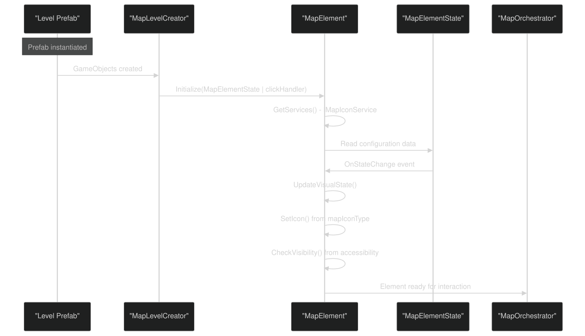

# Map Data & Prefabs

Relevant source files

- [CarnageClub/Assets/GameResources/Art/Preloader/CarnageClub_Preloader.png](https://github.com/Wolfs0ng/CarnageClub/blob/0021fcdc/CarnageClub/Assets/GameResources/Art/Preloader/CarnageClub_Preloader.png)
- [CarnageClub/Assets/GameResources/Art/Preloader/CarnageClub_Preloader.png.meta](https://github.com/Wolfs0ng/CarnageClub/blob/0021fcdc/CarnageClub/Assets/GameResources/Art/Preloader/CarnageClub_Preloader.png.meta)
- [CarnageClub/Assets/GameResources/Font/Cinzel-VariableFont_wght SDF.asset](https://github.com/Wolfs0ng/CarnageClub/blob/0021fcdc/CarnageClub/Assets/GameResources/Font/Cinzel-VariableFont_wght SDF.asset)
- [CarnageClub/Assets/GameResources/Font/StoryScript-Regular SDF 1.asset](https://github.com/Wolfs0ng/CarnageClub/blob/0021fcdc/CarnageClub/Assets/GameResources/Font/StoryScript-Regular SDF 1.asset)
- [CarnageClub/Assets/GameResources/Prefabs/Map/Levels/Map_Level_1.prefab](https://github.com/Wolfs0ng/CarnageClub/blob/0021fcdc/CarnageClub/Assets/GameResources/Prefabs/Map/Levels/Map_Level_1.prefab)
- [CarnageClub/Assets/GameResources/Prefabs/Map/Levels/Map_Level_2.prefab](https://github.com/Wolfs0ng/CarnageClub/blob/0021fcdc/CarnageClub/Assets/GameResources/Prefabs/Map/Levels/Map_Level_2.prefab)
- [CarnageClub/Assets/Scenes/MainMenu.unity](https://github.com/Wolfs0ng/CarnageClub/blob/0021fcdc/CarnageClub/Assets/Scenes/MainMenu.unity)
- [CarnageClub/Assets/Scripts/Map/Data/MapData.cs](https://github.com/Wolfs0ng/CarnageClub/blob/0021fcdc/CarnageClub/Assets/Scripts/Map/Data/MapData.cs)
- [CarnageClub/Assets/Scripts/Map/Elements/MapElement.cs](https://github.com/Wolfs0ng/CarnageClub/blob/0021fcdc/CarnageClub/Assets/Scripts/Map/Elements/MapElement.cs)
- [CarnageClub/Assets/Scripts/Utils/Core/Enum/EventTypes.cs](https://github.com/Wolfs0ng/CarnageClub/blob/0021fcdc/CarnageClub/Assets/Scripts/Utils/Core/Enum/EventTypes.cs)
- [CarnageClub/Assets/Scripts/Utils/Core/SaveService.cs](https://github.com/Wolfs0ng/CarnageClub/blob/0021fcdc/CarnageClub/Assets/Scripts/Utils/Core/SaveService.cs)

This page documents the data-driven level design system for Carnage Club's map navigation. It covers the `MapData` structure, map element configuration, level prefabs, and the neighbor relationship system that forms the navigation graph.

For information about runtime map navigation and player movement, see [Map Navigation & Movement](#6.1) . For element behaviors and interaction handling, see [Element Behaviors & Interactions](#6.3) . For level loading and transitions, see [Level Management & Transitions](#6.4) .

## Overview

The map system uses a data-driven approach where levels are defined through:

- MapDataclasses containing element configurations
- Unity Prefabscontaining visual layout and component setup
- Neighbor relationshipsdefining the navigation graph structure

This separation allows designers to configure level topology, element types, accessibility, and visual placement independently while maintaining a consistent runtime architecture.

Sources:  [CarnageClub/Assets/Scripts/Map/Data/MapData.cs](https://github.com/Wolfs0ng/CarnageClub/blob/0021fcdc/CarnageClub/Assets/Scripts/Map/Data/MapData.cs)

## MapData Structure

### Core Components

The `MapData` class serves as the container for level configuration:

Key Responsibilities:

- Level Identification`Level`: Integer property for level ordering
- Element Collection`MapElementData`: List of defining all interactive nodes
- State Transfer`ApplyFrom()`: method for updating element lists during level transitions

Sources:  [CarnageClub/Assets/Scripts/Map/Data/MapData.cs #20-46](https://github.com/Wolfs0ng/CarnageClub/blob/0021fcdc/CarnageClub/Assets/Scripts/Map/Data/MapData.cs#L20-L46)

## Map Element Configuration

### MapElement Component Fields

Each element in a level prefab has a `MapElement` component with the following serialized configuration:

Sources:  [CarnageClub/Assets/Scripts/Map/Elements/MapElement.cs #24-50](https://github.com/Wolfs0ng/CarnageClub/blob/0021fcdc/CarnageClub/Assets/Scripts/Map/Elements/MapElement.cs#L24-L50)

### Element ID System

The dual-ID system allows:

- Logical grouping`id`of elements within regions (same )
- Unique identification`id``subId`via the / pair
- Simplified neighbor referenceswithin the same region

Sources:  [CarnageClub/Assets/GameResources/Prefabs/Map/Levels/Map_Level_1.prefab #136-138](https://github.com/Wolfs0ng/CarnageClub/blob/0021fcdc/CarnageClub/Assets/GameResources/Prefabs/Map/Levels/Map_Level_1.prefab#L136-L138)

## Prefab Structure

### Level Prefab Organization

Each level prefab ( `Map_Level_X.prefab` ) follows this hierarchy:

Hierarchy Details:

- Root GameObject: Container with RectTransform for UI canvas placement
- Background: Full-screen background image specific to the level aesthetic
- Element GameObjects`Element_XY`: Named where X is the main ID group and Y is the sub-identifier

Sources:  [CarnageClub/Assets/GameResources/Prefabs/Map/Levels/Map_Level_1.prefab #1-50](https://github.com/Wolfs0ng/CarnageClub/blob/0021fcdc/CarnageClub/Assets/GameResources/Prefabs/Map/Levels/Map_Level_1.prefab#L1-L50)  [CarnageClub/Assets/GameResources/Prefabs/Map/Levels/Map_Level_2.prefab #1-50](https://github.com/Wolfs0ng/CarnageClub/blob/0021fcdc/CarnageClub/Assets/GameResources/Prefabs/Map/Levels/Map_Level_2.prefab#L1-L50)

### Element GameObject Configuration

Example from `Map_Level_1.prefab` :

Component Breakdown:

Sources:  [CarnageClub/Assets/GameResources/Prefabs/Map/Levels/Map_Level_1.prefab #3-150](https://github.com/Wolfs0ng/CarnageClub/blob/0021fcdc/CarnageClub/Assets/GameResources/Prefabs/Map/Levels/Map_Level_1.prefab#L3-L150)

## Neighbor Relationship System

### Graph Structure Definition

The navigation graph is defined through `NeighborElementsHandler` on each element:

Neighbor Configuration:

- `MapElementId`Defined as a list of references
- Each element explicitly lists its adjacent nodes
- Bidirectionality must be configured manually (not automatically reciprocal)
- `MapPathfinder`Used by for navigation graph traversal

Sources:  [CarnageClub/Assets/GameResources/Prefabs/Map/Levels/Map_Level_1.prefab #144-149](https://github.com/Wolfs0ng/CarnageClub/blob/0021fcdc/CarnageClub/Assets/GameResources/Prefabs/Map/Levels/Map_Level_1.prefab#L144-L149)  [CarnageClub/Assets/GameResources/Prefabs/Map/Levels/Map_Level_2.prefab #364-371](https://github.com/Wolfs0ng/CarnageClub/blob/0021fcdc/CarnageClub/Assets/GameResources/Prefabs/Map/Levels/Map_Level_2.prefab#L364-L371)

### Accessibility Flags

The `mapElementAccessibility` field is a bitfield controlling element state:

These flags integrate with:

- MapPlayerMovementManager: Path validation
- MapElement.CheckVisibility(): Visual state updates (grayed out vs. interactive)
- Element behaviors: Unlock/lock mechanics after interactions

Sources:  [CarnageClub/Assets/Scripts/Map/Elements/MapElement.cs #111-126](https://github.com/Wolfs0ng/CarnageClub/blob/0021fcdc/CarnageClub/Assets/Scripts/Map/Elements/MapElement.cs#L111-L126)

## Data Flow: Configuration to Runtime

### Level Loading Pipeline

Key Steps:

Sources:  [CarnageClub/Assets/Scripts/Map/Elements/MapElement.cs #51-62](https://github.com/Wolfs0ng/CarnageClub/blob/0021fcdc/CarnageClub/Assets/Scripts/Map/Elements/MapElement.cs#L51-L62)  [CarnageClub/Assets/Scripts/Map/Elements/MapElement.cs #145-155](https://github.com/Wolfs0ng/CarnageClub/blob/0021fcdc/CarnageClub/Assets/Scripts/Map/Elements/MapElement.cs#L145-L155)

### MapData to Prefab Relationship

Design Pattern:

- Prefabsdefine visual structure and component relationships
- MapDatadefines logical configuration and graph topology
- Runtime merge`MapElement.Initialize()`happens in where serialized prefab data meets runtime state

Sources:  [CarnageClub/Assets/Scripts/Map/Data/MapData.cs #20-36](https://github.com/Wolfs0ng/CarnageClub/blob/0021fcdc/CarnageClub/Assets/Scripts/Map/Data/MapData.cs#L20-L36)  [CarnageClub/Assets/Scripts/Map/Elements/MapElement.cs #51-62](https://github.com/Wolfs0ng/CarnageClub/blob/0021fcdc/CarnageClub/Assets/Scripts/Map/Elements/MapElement.cs#L51-L62)

## Element Type Configuration

### Common Element Types

Based on prefab analysis, elements are configured with:

The `mapElementType` determines which `IMapElementBehaviour` is executed when the player stops at the element (see [Element Behaviors & Interactions](#6.3) for behavior mapping).

Sources:  [CarnageClub/Assets/GameResources/Prefabs/Map/Levels/Map_Level_1.prefab #141-143](https://github.com/Wolfs0ng/CarnageClub/blob/0021fcdc/CarnageClub/Assets/GameResources/Prefabs/Map/Levels/Map_Level_1.prefab#L141-L143)  [CarnageClub/Assets/GameResources/Prefabs/Map/Levels/Map_Level_2.prefab #216-218](https://github.com/Wolfs0ng/CarnageClub/blob/0021fcdc/CarnageClub/Assets/GameResources/Prefabs/Map/Levels/Map_Level_2.prefab#L216-L218)

## Visual State Management

### Icon and Color Updates

The `MapElement` component synchronizes visual state with runtime data:

State Update Triggers:

- `Initialize()`Initial state assignment in
- `MapElementState.OnStateChange`Runtime state changes via event
- Accessibility updates from neighbor unlock mechanics

Sources:  [CarnageClub/Assets/Scripts/Map/Elements/MapElement.cs #90-155](https://github.com/Wolfs0ng/CarnageClub/blob/0021fcdc/CarnageClub/Assets/Scripts/Map/Elements/MapElement.cs#L90-L155)

## Integration Points

### How Map Data Connects to Other Systems

Cross-System Dependencies:

- MapLevelController`MapData.Level``MapElements`: Reads and to initialize level state
- MapLevelCreator`MapElement`: Instantiates prefabs and wires up components
- MapOrchestrator: Uses element states for click handling and state updates
- MapPathfinder`neighborElementsHandler`: Traverses for pathfinding
- Save/Load: Serializes element accessibility and state changes

Sources:  [CarnageClub/Assets/Scripts/Map/Data/MapData.cs](https://github.com/Wolfs0ng/CarnageClub/blob/0021fcdc/CarnageClub/Assets/Scripts/Map/Data/MapData.cs)  [CarnageClub/Assets/Scripts/Map/Elements/MapElement.cs](https://github.com/Wolfs0ng/CarnageClub/blob/0021fcdc/CarnageClub/Assets/Scripts/Map/Elements/MapElement.cs)

## Design Workflow

### Creating a New Level

Sources:  [CarnageClub/Assets/GameResources/Prefabs/Map/Levels/Map_Level_1.prefab](https://github.com/Wolfs0ng/CarnageClub/blob/0021fcdc/CarnageClub/Assets/GameResources/Prefabs/Map/Levels/Map_Level_1.prefab)  [CarnageClub/Assets/GameResources/Prefabs/Map/Levels/Map_Level_2.prefab](https://github.com/Wolfs0ng/CarnageClub/blob/0021fcdc/CarnageClub/Assets/GameResources/Prefabs/Map/Levels/Map_Level_2.prefab)

## Summary

The map data and prefab system provides a flexible, data-driven approach to level design:

- MapDataclasses define logical configuration (types, IDs, neighbors, accessibility)
- Unity Prefabsdefine visual layout and component hierarchy
- Runtime merge`MapElement.Initialize()`happens via syncing state with components
- Neighbor graphenables pathfinding and navigation validation
- Accessibility flagscontrol interactive vs. locked element states
- Icon service integration`mapIconType`allows dynamic sprite assignment based on

This architecture separates concerns between data design, visual layout, and runtime behavior, enabling rapid iteration on level topology without code changes.

Sources:  [CarnageClub/Assets/Scripts/Map/Data/MapData.cs](https://github.com/Wolfs0ng/CarnageClub/blob/0021fcdc/CarnageClub/Assets/Scripts/Map/Data/MapData.cs)  [CarnageClub/Assets/Scripts/Map/Elements/MapElement.cs](https://github.com/Wolfs0ng/CarnageClub/blob/0021fcdc/CarnageClub/Assets/Scripts/Map/Elements/MapElement.cs)  [CarnageClub/Assets/GameResources/Prefabs/Map/Levels/Map_Level_1.prefab](https://github.com/Wolfs0ng/CarnageClub/blob/0021fcdc/CarnageClub/Assets/GameResources/Prefabs/Map/Levels/Map_Level_1.prefab)  [CarnageClub/Assets/GameResources/Prefabs/Map/Levels/Map_Level_2.prefab](https://github.com/Wolfs0ng/CarnageClub/blob/0021fcdc/CarnageClub/Assets/GameResources/Prefabs/Map/Levels/Map_Level_2.prefab)