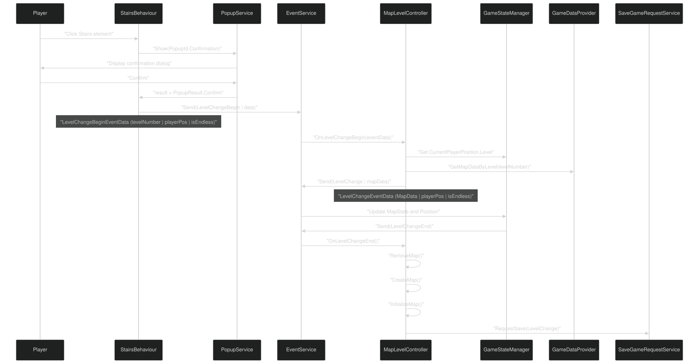

# Map System

<details>
<summary>Relevant source files</summary>


- [CarnageClub/Assets/GameResources/Font/Cinzel-VariableFont_wght SDF.asset](https://github.com/Wolfs0ng/CarnageClub/blob/0021fcdc/CarnageClub/Assets/GameResources/Font/Cinzel-VariableFont_wght SDF.asset)
- [CarnageClub/Assets/GameResources/ScriptableObjects/BaseGameData/MapLevels/Level_2_MapData.asset](https://github.com/Wolfs0ng/CarnageClub/blob/0021fcdc/CarnageClub/Assets/GameResources/ScriptableObjects/BaseGameData/MapLevels/Level_2_MapData.asset)
- [CarnageClub/Assets/Scenes/Map.unity](https://github.com/Wolfs0ng/CarnageClub/blob/0021fcdc/CarnageClub/Assets/Scenes/Map.unity)
- [CarnageClub/Assets/Scripts/Map/Controllers/MapLevelController.cs](https://github.com/Wolfs0ng/CarnageClub/blob/0021fcdc/CarnageClub/Assets/Scripts/Map/Controllers/MapLevelController.cs)
- [CarnageClub/Assets/Scripts/Map/Data/MapData.cs](https://github.com/Wolfs0ng/CarnageClub/blob/0021fcdc/CarnageClub/Assets/Scripts/Map/Data/MapData.cs)
- [CarnageClub/Assets/Scripts/Map/Elements/Behaviours/Data/StairsElementBehaviourData.cs](https://github.com/Wolfs0ng/CarnageClub/blob/0021fcdc/CarnageClub/Assets/Scripts/Map/Elements/Behaviours/Data/StairsElementBehaviourData.cs)
- [CarnageClub/Assets/Scripts/Map/Elements/Behaviours/StairsElementBehaviour.cs](https://github.com/Wolfs0ng/CarnageClub/blob/0021fcdc/CarnageClub/Assets/Scripts/Map/Elements/Behaviours/StairsElementBehaviour.cs)
- [CarnageClub/Assets/Scripts/Map/Elements/MapElement.cs](https://github.com/Wolfs0ng/CarnageClub/blob/0021fcdc/CarnageClub/Assets/Scripts/Map/Elements/MapElement.cs)
- [CarnageClub/Assets/Scripts/Map/Events/LevelChangeBeginEventData.cs](https://github.com/Wolfs0ng/CarnageClub/blob/0021fcdc/CarnageClub/Assets/Scripts/Map/Events/LevelChangeBeginEventData.cs)
- [CarnageClub/Assets/Scripts/Map/Events/LevelChangeEventData.cs](https://github.com/Wolfs0ng/CarnageClub/blob/0021fcdc/CarnageClub/Assets/Scripts/Map/Events/LevelChangeEventData.cs)
- [CarnageClub/Assets/Scripts/Utils/Core/Enum/EventTypes.cs](https://github.com/Wolfs0ng/CarnageClub/blob/0021fcdc/CarnageClub/Assets/Scripts/Utils/Core/Enum/EventTypes.cs)
- [CarnageClub/Assets/Scripts/Utils/Core/SaveService.cs](https://github.com/Wolfs0ng/CarnageClub/blob/0021fcdc/CarnageClub/Assets/Scripts/Utils/Core/SaveService.cs)


</details>

Purpose and Scope : This document provides an overview of the node-based map navigation system in Carnage Club. It covers the core architecture, key components, level transitions, and how map elements trigger game events. For detailed information about specific subsystems, see:

- [Map Navigation & Movement](#6.1)- pathfinding and player movement mechanics
- [Map Elements & Interactive Nodes](#6.2)- element lifecycle and state management
- [Element Behaviors & Interactions](#6.3)- behavior pattern implementation details
- [Level Management & Transitions](#6.4)- level loading and scene transitions
- [Map Data & Prefabs](#6.5)- data-driven level design approach


## System Overview

The Map System implements a node-based navigation model where players traverse a graph of `MapElement` nodes. Each element represents an interactive location (Fight, BoneFire, Boss, Store, Stairs, etc.) with configurable behaviors and accessibility rules. The system uses event-driven communication to integrate with the Battle System ( [Battle System](#5) ) and Core Systems ( [Core Systems](#4) ).

## Core Architecture

The Map System consists of five primary components that work together to create the exploration experience:

### Map System Architecture



Sources:

- [CarnageClub/Assets/Scripts/Map/Controllers/MapLevelController.cs#26-141](https://github.com/Wolfs0ng/CarnageClub/blob/0021fcdc/CarnageClub/Assets/Scripts/Map/Controllers/MapLevelController.cs#L26-L141)
- [CarnageClub/Assets/Scripts/Map/Elements/MapElement.cs#24-179](https://github.com/Wolfs0ng/CarnageClub/blob/0021fcdc/CarnageClub/Assets/Scripts/Map/Elements/MapElement.cs#L24-L179)


## Map Elements and Node Graph

### Element Type Hierarchy

Each `MapElement` has a `MapElementType` that determines its visual representation and behavior. The system supports:

### Element State Management

Each `MapElement` has an associated `MapElementState` stored in `GameStateManager.CurrentMapState` . The state contains:

```block
MapElementState├── MapElementId (id, subId)├── MapElementType├── MapIconType├── MapElementAccessibility (flags)├── NeighborElementsHandler (neighbor list)└── BehaviourData (element-specific config)
```

The `MapElement` component subscribes to state changes via `State.OnStateChange` and updates its visual representation automatically in the `UpdateVisualState()` method.

Sources:

- [CarnageClub/Assets/Scripts/Map/Elements/MapElement.cs#24-179](https://github.com/Wolfs0ng/CarnageClub/blob/0021fcdc/CarnageClub/Assets/Scripts/Map/Elements/MapElement.cs#L24-L179)
- [CarnageClub/Assets/GameResources/ScriptableObjects/BaseGameData/MapLevels/Level_2_MapData.asset#16-152](https://github.com/Wolfs0ng/CarnageClub/blob/0021fcdc/CarnageClub/Assets/GameResources/ScriptableObjects/BaseGameData/MapLevels/Level_2_MapData.asset#L16-L152)


## Level Transition Flow

Level transitions occur when the player interacts with Stairs or Elevator elements. The system uses a three-stage event flow to ensure clean state transitions:

### Level Transition Sequence



### Event Types

The Map System uses three level transition events defined in `EventTypes` :

Sources:

- [CarnageClub/Assets/Scripts/Map/Controllers/MapLevelController.cs#65-118](https://github.com/Wolfs0ng/CarnageClub/blob/0021fcdc/CarnageClub/Assets/Scripts/Map/Controllers/MapLevelController.cs#L65-L118)
- [CarnageClub/Assets/Scripts/Map/Elements/Behaviours/StairsElementBehaviour.cs#33-69](https://github.com/Wolfs0ng/CarnageClub/blob/0021fcdc/CarnageClub/Assets/Scripts/Map/Elements/Behaviours/StairsElementBehaviour.cs#L33-L69)
- [CarnageClub/Assets/Scripts/Utils/Core/Enum/EventTypes.cs#15-23](https://github.com/Wolfs0ng/CarnageClub/blob/0021fcdc/CarnageClub/Assets/Scripts/Utils/Core/Enum/EventTypes.cs#L15-L23)
- [CarnageClub/Assets/Scripts/Map/Events/LevelChangeBeginEventData.cs#17-29](https://github.com/Wolfs0ng/CarnageClub/blob/0021fcdc/CarnageClub/Assets/Scripts/Map/Events/LevelChangeBeginEventData.cs#L17-L29)
- [CarnageClub/Assets/Scripts/Map/Events/LevelChangeEventData.cs#18-30](https://github.com/Wolfs0ng/CarnageClub/blob/0021fcdc/CarnageClub/Assets/Scripts/Map/Events/LevelChangeEventData.cs#L18-L30)


## Element Behavior Pattern

The Map System uses the Strategy pattern to encapsulate element-specific logic. Each `MapElementType` has a corresponding `IMapElementBehaviour` implementation that defines:

### Behavior Example: Stairs Element

The `StairsElementBehaviour` demonstrates the pattern:

Behavior implementations receive a `MapElementBehaviourContext` containing references to:

- `IEventService``LaunchBattle``LevelChangeBegin`- for sending events like or
- `IPopupService`- for showing confirmation dialogs
- `ISaveGameRequestService`- for triggering save operations
- `IMapElementUpdateService`- for modifying element states


For comprehensive behavior documentation, see [Element Behaviors & Interactions](#6.3) .

Sources:

- [CarnageClub/Assets/Scripts/Map/Elements/Behaviours/StairsElementBehaviour.cs#24-70](https://github.com/Wolfs0ng/CarnageClub/blob/0021fcdc/CarnageClub/Assets/Scripts/Map/Elements/Behaviours/StairsElementBehaviour.cs#L24-L70)


## Integration with Core Systems

### Event-Driven Communication

The Map System communicates with other systems via `IEventService` pub/sub (see [Event Service & Communication](#4.2) ):

Outbound Events

Inbound Events

The Map System subscribes to events from the Battle System to update element accessibility after combat outcomes. See [Battle Flow & Turn Management](#5.1) for details on battle-to-map communication.

### Save System Integration

The Map System triggers save operations at two points:

Both use `ISaveGameRequestService.RequestSave()` with a `SaveGameRequest` containing:

- `MapElementId`- the element triggering the save
- `SaveGameRequestOrigin``MapElement``LevelChange`- either or


The save includes the current `MapState` (all element states) and `MapPositionState` (current level and element). For save data structure, see [Save & Load System](#4.3) .

Sources:

- [CarnageClub/Assets/Scripts/Map/Controllers/MapLevelController.cs#115-117](https://github.com/Wolfs0ng/CarnageClub/blob/0021fcdc/CarnageClub/Assets/Scripts/Map/Controllers/MapLevelController.cs#L115-L117)
- [CarnageClub/Assets/Scripts/Map/Elements/Behaviours/StairsElementBehaviour.cs#43-44](https://github.com/Wolfs0ng/CarnageClub/blob/0021fcdc/CarnageClub/Assets/Scripts/Map/Elements/Behaviours/StairsElementBehaviour.cs#L43-L44)


## Map Data Structure

Levels are defined using `MapData` ScriptableObjects containing:

```block
MapData├── Level (int)└── MapElements (List<MapElementData>)    ├── MapElementId (id, subId)    ├── MapElementType    ├── MapIconType    ├── MapElementAccessibility (flags)    ├── NeighborElementsHandler    │   └── neighborElements (List<MapElementId>)    └── BehaviourData (polymorphic)        └── (Type-specific data, e.g. StairsElementBehaviourData)
```

### Example: Level 2 Layout

Level 2 contains 10 elements forming a branched path:



The `StairsElementBehaviourData` for element (0,0) specifies:

- `NextLevels: [1]`- transitions to level 1
- `PlayerPosition: (1,3)`- player spawns at element (1,3) in next level
- `IsEndless: false`- standard progression (not procedurally generated)


For data-driven design details, see [Map Data & Prefabs](#6.5) .

Sources:

- [CarnageClub/Assets/Scripts/Map/Data/MapData.cs#20-46](https://github.com/Wolfs0ng/CarnageClub/blob/0021fcdc/CarnageClub/Assets/Scripts/Map/Data/MapData.cs#L20-L46)
- [CarnageClub/Assets/GameResources/ScriptableObjects/BaseGameData/MapLevels/Level_2_MapData.asset#16-201](https://github.com/Wolfs0ng/CarnageClub/blob/0021fcdc/CarnageClub/Assets/GameResources/ScriptableObjects/BaseGameData/MapLevels/Level_2_MapData.asset#L16-L201)
- [CarnageClub/Assets/Scripts/Map/Elements/Behaviours/Data/StairsElementBehaviourData.cs#19-25](https://github.com/Wolfs0ng/CarnageClub/blob/0021fcdc/CarnageClub/Assets/Scripts/Map/Elements/Behaviours/Data/StairsElementBehaviourData.cs#L19-L25)


## Key Classes and Responsibilities

### Controller Layer

### Movement Layer

### Element Layer

### Data Layer

### Behavior Layer

### Scene Structure

The `Map.unity` scene contains:

- `MapLevelController`- root controller component
- `MapElements`container - parent for level prefab instances
- UI layers for overlays and menus


Level prefabs (e.g., `Level_1_Map.prefab` , `Level_2_Map.prefab` ) contain:

- `MapOrchestrator`component
- `MapPlayerMovementManager`component
- `MapElement`Individual GameObjects positioned in the scene


Sources:

- [CarnageClub/Assets/Scenes/Map.unity#122-763](https://github.com/Wolfs0ng/CarnageClub/blob/0021fcdc/CarnageClub/Assets/Scenes/Map.unity#L122-L763)
- [CarnageClub/Assets/Scripts/Map/Controllers/MapLevelController.cs#26-141](https://github.com/Wolfs0ng/CarnageClub/blob/0021fcdc/CarnageClub/Assets/Scripts/Map/Controllers/MapLevelController.cs#L26-L141)
- [CarnageClub/Assets/Scripts/Map/Elements/MapElement.cs#24-179](https://github.com/Wolfs0ng/CarnageClub/blob/0021fcdc/CarnageClub/Assets/Scripts/Map/Elements/MapElement.cs#L24-L179)


## Design Principles

The Map System follows the architectural patterns established in [Architecture & Design Principles](#2) :

This architecture enables clean integration with the Battle System (see [Battle System](#5) ) and AI System (see [AI System](#3) ) without tight coupling.

Sources:

- [CarnageClub/Assets/Scripts/Map/Elements/MapElement.cs#75-78](https://github.com/Wolfs0ng/CarnageClub/blob/0021fcdc/CarnageClub/Assets/Scripts/Map/Elements/MapElement.cs#L75-L78)
- [CarnageClub/Assets/Scripts/Map/Controllers/MapLevelController.cs#57-63](https://github.com/Wolfs0ng/CarnageClub/blob/0021fcdc/CarnageClub/Assets/Scripts/Map/Controllers/MapLevelController.cs#L57-L63)