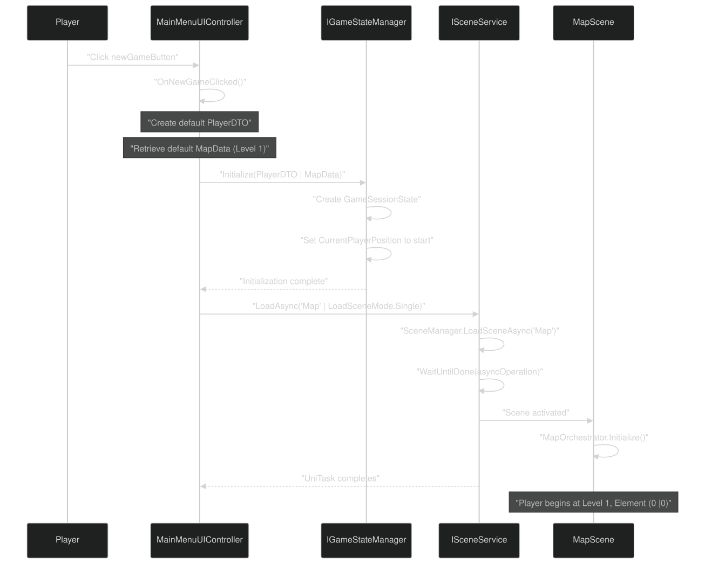
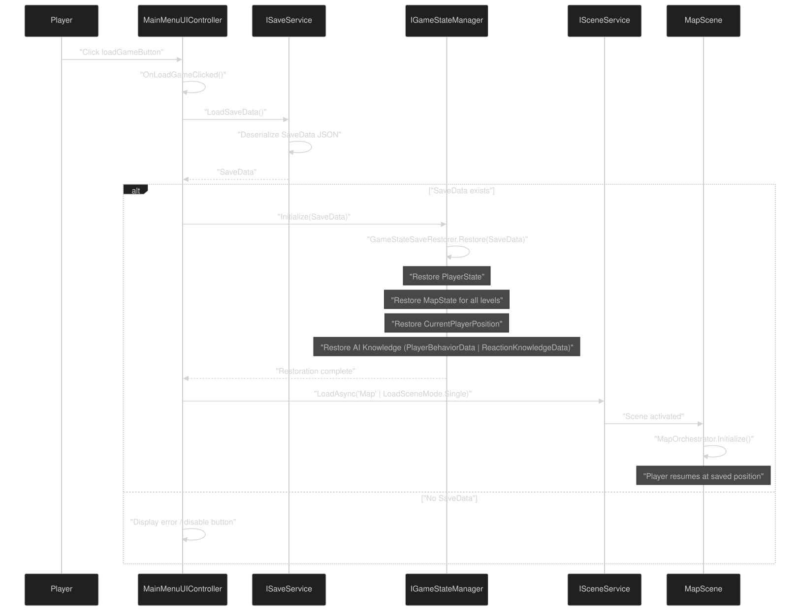

# Main Menu & Scene Flow

<details>
<summary>Relevant source files</summary>


- [CarnageClub/Assets/GameResources/Art/Preloader/CarnageClub_Preloader.png](https://github.com/Wolfs0ng/CarnageClub/blob/0021fcdc/CarnageClub/Assets/GameResources/Art/Preloader/CarnageClub_Preloader.png)
- [CarnageClub/Assets/GameResources/Art/Preloader/CarnageClub_Preloader.png.meta](https://github.com/Wolfs0ng/CarnageClub/blob/0021fcdc/CarnageClub/Assets/GameResources/Art/Preloader/CarnageClub_Preloader.png.meta)
- [CarnageClub/Assets/GameResources/Font/StoryScript-Regular SDF 1.asset](https://github.com/Wolfs0ng/CarnageClub/blob/0021fcdc/CarnageClub/Assets/GameResources/Font/StoryScript-Regular SDF 1.asset)
- [CarnageClub/Assets/GameResources/Prefabs/Map/Levels/Map_Level_1.prefab](https://github.com/Wolfs0ng/CarnageClub/blob/0021fcdc/CarnageClub/Assets/GameResources/Prefabs/Map/Levels/Map_Level_1.prefab)
- [CarnageClub/Assets/GameResources/Prefabs/Map/Levels/Map_Level_2.prefab](https://github.com/Wolfs0ng/CarnageClub/blob/0021fcdc/CarnageClub/Assets/GameResources/Prefabs/Map/Levels/Map_Level_2.prefab)
- [CarnageClub/Assets/Scenes/MainMenu.unity](https://github.com/Wolfs0ng/CarnageClub/blob/0021fcdc/CarnageClub/Assets/Scenes/MainMenu.unity)
- [CarnageClub/Assets/Scripts/Battle/Abstract/BaseBattleManager.cs](https://github.com/Wolfs0ng/CarnageClub/blob/0021fcdc/CarnageClub/Assets/Scripts/Battle/Abstract/BaseBattleManager.cs)
- [CarnageClub/Assets/Scripts/Utils/Core/Abstract/ISceneService.cs](https://github.com/Wolfs0ng/CarnageClub/blob/0021fcdc/CarnageClub/Assets/Scripts/Utils/Core/Abstract/ISceneService.cs)
- [CarnageClub/Assets/Scripts/Utils/Core/SceneService.cs](https://github.com/Wolfs0ng/CarnageClub/blob/0021fcdc/CarnageClub/Assets/Scripts/Utils/Core/SceneService.cs)


</details>

## Purpose & Scope

This document describes the Main Menu scene and the scene transition flow from application startup to gameplay. It covers the `MainMenuUIController` , UI structure, and how the `ISceneService` orchestrates scene loading for new game and load game flows.

For information about:

- [Service Locator Pattern](#2.1)Service registration and dependency injection, see
- [Game State Manager](#4.1)Game state initialization and persistence, see
- [Map Navigation & Movement](#6.1)Map scene navigation after loading, see


## Main Menu Scene Structure

The MainMenu scene is the first interactive scene loaded after the application startup sequence. It presents two primary user actions: New Game and Load Game .

### Scene Hierarchy

The MainMenu scene contains the following key GameObjects:

The canvas uses a CanvasScaler configured for screen-space overlay rendering with reference resolution `1440x2960` and match width-or-height set to `1` (height priority).

Sources:

- [CarnageClub/Assets/Scenes/MainMenu.unity#122-168](https://github.com/Wolfs0ng/CarnageClub/blob/0021fcdc/CarnageClub/Assets/Scenes/MainMenu.unity#L122-L168)
- [CarnageClub/Assets/Scenes/MainMenu.unity#169-272](https://github.com/Wolfs0ng/CarnageClub/blob/0021fcdc/CarnageClub/Assets/Scenes/MainMenu.unity#L169-L272)


## Main Menu UI Controller

The `MainMenuUIController` class (namespace `VeilBorn.UI.Controllers` ) is the entry point for user interactions in the MainMenu scene.

### Responsibilities

### Inspector Configuration

The controller exposes the following serialized fields:

```block
[SerializeField] private string sceneName = "Map";[SerializeField] private Button newGameButton;[SerializeField] private Button loadGameButton;
```

The `sceneName` field is hardcoded to `"Map"` , which is the target scene for both new game and load game flows.

Sources:

- [CarnageClub/Assets/Scenes/MainMenu.unity#139-153](https://github.com/Wolfs0ng/CarnageClub/blob/0021fcdc/CarnageClub/Assets/Scenes/MainMenu.unity#L139-L153)


## Scene Flow Overview

The following diagram illustrates the complete scene transition flow from application startup through the main menu to gameplay:



### Key Transition Points

Sources:

- High-level architecture Diagram 3: Game Flow
- [CarnageClub/Assets/Scripts/Utils/Core/Abstract/ISceneService.cs#20-64](https://github.com/Wolfs0ng/CarnageClub/blob/0021fcdc/CarnageClub/Assets/Scripts/Utils/Core/Abstract/ISceneService.cs#L20-L64)


## New Game Flow

When the player clicks the New Game button, the following sequence occurs:



### State Initialization Details

For a new game , the following initial state is established:

- PlayerState: Default HP, Stamina, Level 1, no equipment
- MapState: Level 1 map with all elements in initial accessibility states
- MapPositionState`{Level: 1, MapElementId: {id: 0, subId: 0}}`:
- AI Knowledge: Empty (no learned patterns yet)


Sources:

- High-level architecture Diagram 3: Game Flow
- High-level architecture Diagram 4: Data Flow - Save/Load and State Management
- [CarnageClub/Assets/Scripts/Utils/Core/SceneService.cs#43-59](https://github.com/Wolfs0ng/CarnageClub/blob/0021fcdc/CarnageClub/Assets/Scripts/Utils/Core/SceneService.cs#L43-L59)


## Load Game Flow

When the player clicks the Load Game button, the system restores a previously saved session:



### Restored State Components

The Load Game flow restores the following from `SaveData` :

Note: The AI knowledge persistence is critical to the game's core concept: "The world remembers your habits." Enemies retain learned player patterns across sessions.

Sources:

- High-level architecture Diagram 4: Data Flow - Save/Load and State Management
- [Save & Load System](#4.3)(referenced)


## Scene Service Integration

The `ISceneService` provides the abstraction layer for all scene transitions. The `MainMenuUIController` interacts with this service exclusively through dependency injection.

### ISceneService API

```block
public interface ISceneService : IServiceLifecycle{    UniTask LoadAsync(string sceneName, LoadSceneMode mode, CancellationToken cancellationToken);    UniTask PreloadAsync(string sceneName, Action onReady, LoadSceneMode mode, CancellationToken cancellationToken);    UniTask UnloadAsync(string sceneName, CancellationToken cancellationToken);}
```

### Scene Loading Implementation

The `SceneService` class wraps Unity's `SceneManager.LoadSceneAsync` with async/await patterns using UniTask :

The service supports cancellation through `CancellationToken` and propagates `OperationCanceledException` when canceled.

Sources:

- [CarnageClub/Assets/Scripts/Utils/Core/Abstract/ISceneService.cs#20-64](https://github.com/Wolfs0ng/CarnageClub/blob/0021fcdc/CarnageClub/Assets/Scripts/Utils/Core/Abstract/ISceneService.cs#L20-L64)
- [CarnageClub/Assets/Scripts/Utils/Core/SceneService.cs#43-59](https://github.com/Wolfs0ng/CarnageClub/blob/0021fcdc/CarnageClub/Assets/Scripts/Utils/Core/SceneService.cs#L43-L59)
- [CarnageClub/Assets/Scripts/Utils/Core/SceneService.cs#132-144](https://github.com/Wolfs0ng/CarnageClub/blob/0021fcdc/CarnageClub/Assets/Scripts/Utils/Core/SceneService.cs#L132-L144)


## Scene Loading Modes

The `MainMenuUIController` uses `LoadSceneMode.Single` for all transitions from the menu:

This ensures a clean state transition where the MainMenu scene is completely unloaded before the Map scene activates.

Sources:

- [CarnageClub/Assets/Scripts/Utils/Core/Abstract/ISceneService.cs#27-34](https://github.com/Wolfs0ng/CarnageClub/blob/0021fcdc/CarnageClub/Assets/Scripts/Utils/Core/Abstract/ISceneService.cs#L27-L34)
- [CarnageClub/Assets/Scripts/Utils/Core/SceneService.cs#43-59](https://github.com/Wolfs0ng/CarnageClub/blob/0021fcdc/CarnageClub/Assets/Scripts/Utils/Core/SceneService.cs#L43-L59)


## Error Handling

The scene transition flow includes the following error handling mechanisms:

### SceneService Validation

```block
// Validates scene name before loadingif (string.IsNullOrWhiteSpace(sceneName)){    throw new ArgumentException("Scene name must be provided.", nameof(sceneName));} // Validates async operation started successfullyif (asyncOperation == null){    throw new InvalidOperationException($"Unable to start loading scene '{sceneName}'.");}
```

### Cancellation Support

All scene operations accept a `CancellationToken` and throw `OperationCanceledException` when canceled. The `MainMenuUIController` can pass a token to cancel long-running scene loads.

Sources:

- [CarnageClub/Assets/Scripts/Utils/Core/SceneService.cs#46-55](https://github.com/Wolfs0ng/CarnageClub/blob/0021fcdc/CarnageClub/Assets/Scripts/Utils/Core/SceneService.cs#L46-L55)
- [CarnageClub/Assets/Scripts/Utils/Core/SceneService.cs#140-142](https://github.com/Wolfs0ng/CarnageClub/blob/0021fcdc/CarnageClub/Assets/Scripts/Utils/Core/SceneService.cs#L140-L142)


## Main Menu to Map Transition Diagram

The following diagram bridges the natural language flow to the concrete code entities involved:



Sources:

- [CarnageClub/Assets/Scenes/MainMenu.unity#122-168](https://github.com/Wolfs0ng/CarnageClub/blob/0021fcdc/CarnageClub/Assets/Scenes/MainMenu.unity#L122-L168)
- [CarnageClub/Assets/Scripts/Utils/Core/SceneService.cs#27-59](https://github.com/Wolfs0ng/CarnageClub/blob/0021fcdc/CarnageClub/Assets/Scripts/Utils/Core/SceneService.cs#L27-L59)
- [Service Locator Pattern](#2.1)(referenced)


## Integration with Battle System

While the MainMenu scene does not directly interact with the Battle system, the scene flow establishes the pattern used throughout the game:

This pattern is established by the same `ISceneService` used in the MainMenu flow.

Sources:

- High-level architecture Diagram 5: Map and Battle Integration
- [Battle Flow & Turn Management](#5.1)(referenced)
- [CarnageClub/Assets/Scripts/Battle/Abstract/BaseBattleManager.cs#87-228](https://github.com/Wolfs0ng/CarnageClub/blob/0021fcdc/CarnageClub/Assets/Scripts/Battle/Abstract/BaseBattleManager.cs#L87-L228)


## Summary

The Main Menu & Scene Flow system provides:

- A clean entry point for player interaction after service registration
- Two distinct initialization paths (New Game vs Load Game)
- `ISceneService`Consistent scene loading abstraction through
- `IGameStateManager``ISaveService`State persistence and restoration through and
- Error handling and cancellation support for async operations


The scene transition flow establishes the architectural pattern used throughout the game: event-driven communication , service-oriented dependencies , and async/await scene management .