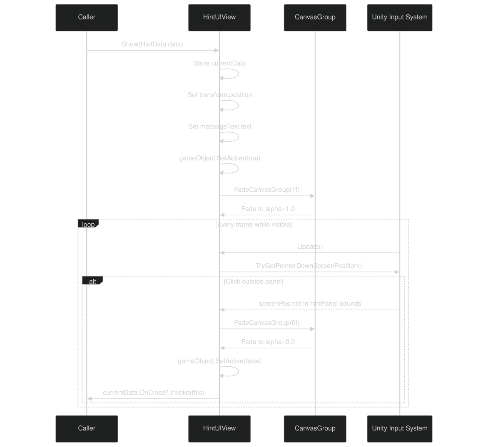

# Overlay UI: Hints & Notifications

<details>
<summary>Relevant source files</summary>


- [CarnageClub/Assets/Scripts/Utils/Core/Overlays/Abstract/INotificationService.cs](https://github.com/Wolfs0ng/CarnageClub/blob/0021fcdc/CarnageClub/Assets/Scripts/Utils/Core/Overlays/Abstract/INotificationService.cs)
- [CarnageClub/Assets/Scripts/Utils/Core/Overlays/Abstract/INotificationView.cs](https://github.com/Wolfs0ng/CarnageClub/blob/0021fcdc/CarnageClub/Assets/Scripts/Utils/Core/Overlays/Abstract/INotificationView.cs)
- [CarnageClub/Assets/Scripts/Utils/Core/Overlays/Abstract/INotificationView.cs.meta](https://github.com/Wolfs0ng/CarnageClub/blob/0021fcdc/CarnageClub/Assets/Scripts/Utils/Core/Overlays/Abstract/INotificationView.cs.meta)
- [CarnageClub/Assets/Scripts/Utils/Core/Overlays/Enums/NotificationId.cs](https://github.com/Wolfs0ng/CarnageClub/blob/0021fcdc/CarnageClub/Assets/Scripts/Utils/Core/Overlays/Enums/NotificationId.cs)
- [CarnageClub/Assets/Scripts/Utils/Core/Overlays/Enums/NotificationId.cs.meta](https://github.com/Wolfs0ng/CarnageClub/blob/0021fcdc/CarnageClub/Assets/Scripts/Utils/Core/Overlays/Enums/NotificationId.cs.meta)
- [CarnageClub/Assets/Scripts/Utils/Core/Overlays/HintUIController.cs](https://github.com/Wolfs0ng/CarnageClub/blob/0021fcdc/CarnageClub/Assets/Scripts/Utils/Core/Overlays/HintUIController.cs)
- [CarnageClub/Assets/Scripts/Utils/Core/Overlays/HintUIView.cs](https://github.com/Wolfs0ng/CarnageClub/blob/0021fcdc/CarnageClub/Assets/Scripts/Utils/Core/Overlays/HintUIView.cs)
- [CarnageClub/Assets/Scripts/Utils/Core/Overlays/Models/NotificationData.cs](https://github.com/Wolfs0ng/CarnageClub/blob/0021fcdc/CarnageClub/Assets/Scripts/Utils/Core/Overlays/Models/NotificationData.cs)
- [CarnageClub/Assets/Scripts/Utils/Core/Overlays/Models/NotificationData.cs.meta](https://github.com/Wolfs0ng/CarnageClub/blob/0021fcdc/CarnageClub/Assets/Scripts/Utils/Core/Overlays/Models/NotificationData.cs.meta)
- [CarnageClub/Assets/Scripts/Utils/Core/Overlays/NotificationService.cs](https://github.com/Wolfs0ng/CarnageClub/blob/0021fcdc/CarnageClub/Assets/Scripts/Utils/Core/Overlays/NotificationService.cs)
- [CarnageClub/Assets/Scripts/Utils/UI/OverlayUIRoot.cs](https://github.com/Wolfs0ng/CarnageClub/blob/0021fcdc/CarnageClub/Assets/Scripts/Utils/UI/OverlayUIRoot.cs)


</details>

## Purpose & Scope

This document covers the persistent overlay UI system that displays hints and notifications across all game scenes. The overlay system provides contextual help messages (hints) and informational messages (notifications) without disrupting gameplay flow. This system is distinct from modal popups (covered in [7.3](#7.3) ) which require user interaction to dismiss.

The overlay UI persists across scene transitions using Unity's `DontDestroyOnLoad` mechanism and operates independently of scene-specific UI hierarchies.

## System Architecture

The overlay UI system consists of three primary components:

Sources:  [CarnageClub/Assets/Scripts/Utils/UI/OverlayUIRoot.cs #1-24](https://github.com/Wolfs0ng/CarnageClub/blob/0021fcdc/CarnageClub/Assets/Scripts/Utils/UI/OverlayUIRoot.cs#L1-L24)

### Component Hierarchy



Sources:  [CarnageClub/Assets/Scripts/Utils/UI/OverlayUIRoot.cs #17-23](https://github.com/Wolfs0ng/CarnageClub/blob/0021fcdc/CarnageClub/Assets/Scripts/Utils/UI/OverlayUIRoot.cs#L17-L23)  [CarnageClub/Assets/Scripts/Utils/Core/Overlays/HintUIController.cs #21-77](https://github.com/Wolfs0ng/CarnageClub/blob/0021fcdc/CarnageClub/Assets/Scripts/Utils/Core/Overlays/HintUIController.cs#L21-L77)

## OverlayUIRoot: Persistent Container

The `OverlayUIRoot` component serves as the anchor point for all overlay UI elements. It uses Unity's `DontDestroyOnLoad` mechanism to persist across scene transitions.

Key Characteristics:

- Attached to a root GameObject in the scene hierarchy
- Survives all scene loads/unloads
- Contains child controllers for hints and notifications
- No gameplay logic—purely a lifecycle container


Implementation:



The `Awake()` method at [CarnageClub/Assets/Scripts/Utils/UI/OverlayUIRoot.cs #19-22](https://github.com/Wolfs0ng/CarnageClub/blob/0021fcdc/CarnageClub/Assets/Scripts/Utils/UI/OverlayUIRoot.cs#L19-L22) is the only implementation detail—it marks the GameObject as persistent.

Sources:  [CarnageClub/Assets/Scripts/Utils/UI/OverlayUIRoot.cs #17-23](https://github.com/Wolfs0ng/CarnageClub/blob/0021fcdc/CarnageClub/Assets/Scripts/Utils/UI/OverlayUIRoot.cs#L17-L23)

## Hint System: Pooled Contextual Help

The hint system displays position-anchored help messages that users can dismiss by clicking outside the hint panel. Hints use object pooling to avoid runtime allocations.

### HintUIController: Pooling & Rental

The `HintUIController` manages a pool of `IHintView` instances organized by `HintId` . When a hint is requested, the controller searches for an available (non-visible) view in the pool.

Pool Structure:



Sources:  [CarnageClub/Assets/Scripts/Utils/Core/Overlays/HintUIController.cs #21-77](https://github.com/Wolfs0ng/CarnageClub/blob/0021fcdc/CarnageClub/Assets/Scripts/Utils/Core/Overlays/HintUIController.cs#L21-L77)

Pool Initialization:

The pool is constructed in `Awake()` from a serialized array of `HintTemplateEntry` structs [CarnageClub/Assets/Scripts/Utils/Core/Overlays/HintUIController.cs #51-76](https://github.com/Wolfs0ng/CarnageClub/blob/0021fcdc/CarnageClub/Assets/Scripts/Utils/Core/Overlays/HintUIController.cs#L51-L76) Each entry maps a `HintId` to a pre-instantiated `IHintView` GameObject.

Rental Logic:

The `Rent(HintId hintID)` method at [CarnageClub/Assets/Scripts/Utils/Core/Overlays/HintUIController.cs #34-49](https://github.com/Wolfs0ng/CarnageClub/blob/0021fcdc/CarnageClub/Assets/Scripts/Utils/Core/Overlays/HintUIController.cs#L34-L49) implements the pool lookup:

Sources:  [CarnageClub/Assets/Scripts/Utils/Core/Overlays/HintUIController.cs #21-77](https://github.com/Wolfs0ng/CarnageClub/blob/0021fcdc/CarnageClub/Assets/Scripts/Utils/Core/Overlays/HintUIController.cs#L21-L77)

### HintUIView: Display & Interaction

The `HintUIView` class implements the `IHintView` interface, providing fade animations and auto-dismiss on click-outside behavior.

View Lifecycle:



Sources:  [CarnageClub/Assets/Scripts/Utils/Core/Overlays/HintUIView.cs #23-131](https://github.com/Wolfs0ng/CarnageClub/blob/0021fcdc/CarnageClub/Assets/Scripts/Utils/Core/Overlays/HintUIView.cs#L23-L131)

Key Implementation Details:

| Method | Responsibility | Lines | 
| --- | --- | --- |
| Show(HintData data) | Position hint, set text, activate, fade in | 36-56 | 
| Hide() | Fade out, deactivate, invoke OnClose callback | 58-66 | 
| Update() | Detect click-outside-panel to auto-dismiss | 68-79 | 
| TryGetPointerDownScreenPosition() | Check for pointer press this frame | 81-92 | 
| FadeCoroutine() | Lerp CanvasGroup.alpha over fadeDuration | 109-122 | 


Click-Outside Detection:

The `Update()` method uses Unity's Input System to detect pointer presses. If a press occurs outside the `hintPanel` RectTransform bounds, `Hide()` is called automatically [CarnageClub/Assets/Scripts/Utils/Core/Overlays/HintUIView.cs #68-79](https://github.com/Wolfs0ng/CarnageClub/blob/0021fcdc/CarnageClub/Assets/Scripts/Utils/Core/Overlays/HintUIView.cs#L68-L79)

Sources:  [CarnageClub/Assets/Scripts/Utils/Core/Overlays/HintUIView.cs #23-131](https://github.com/Wolfs0ng/CarnageClub/blob/0021fcdc/CarnageClub/Assets/Scripts/Utils/Core/Overlays/HintUIView.cs#L23-L131)

### HintData Model

The `HintData` class (not provided in files but referenced) carries configuration for a hint display:

Sources:  [CarnageClub/Assets/Scripts/Utils/Core/Overlays/HintUIView.cs #36-65](https://github.com/Wolfs0ng/CarnageClub/blob/0021fcdc/CarnageClub/Assets/Scripts/Utils/Core/Overlays/HintUIView.cs#L36-L65)

## Notification System: Transient Messages

The notification system displays informational messages that do not require user interaction. Unlike hints, notifications typically auto-dismiss after a duration or specific event.

### NotificationService: Facade

The `NotificationService` class implements `INotificationService` and acts as the public API for displaying notifications. It delegates to a `NotificationUIController` for view management.

Service Flow:



Sources:  [CarnageClub/Assets/Scripts/Utils/Core/Overlays/NotificationService.cs #18-50](https://github.com/Wolfs0ng/CarnageClub/blob/0021fcdc/CarnageClub/Assets/Scripts/Utils/Core/Overlays/NotificationService.cs#L18-L50)  [CarnageClub/Assets/Scripts/Utils/Core/Overlays/Abstract/INotificationService.cs #18-22](https://github.com/Wolfs0ng/CarnageClub/blob/0021fcdc/CarnageClub/Assets/Scripts/Utils/Core/Overlays/Abstract/INotificationService.cs#L18-L22)

Implementation Details:

The `NotificationService` class at [CarnageClub/Assets/Scripts/Utils/Core/Overlays/NotificationService.cs #18-50](https://github.com/Wolfs0ng/CarnageClub/blob/0021fcdc/CarnageClub/Assets/Scripts/Utils/Core/Overlays/NotificationService.cs#L18-L50) is minimal:

Null Safety:

The `Show()` method validates both `notificationData` and `uiController` before attempting to rent a view. If `Rent()` returns `null` , the method exits gracefully [CarnageClub/Assets/Scripts/Utils/Core/Overlays/NotificationService.cs #36-48](https://github.com/Wolfs0ng/CarnageClub/blob/0021fcdc/CarnageClub/Assets/Scripts/Utils/Core/Overlays/NotificationService.cs#L36-L48)

Sources:  [CarnageClub/Assets/Scripts/Utils/Core/Overlays/NotificationService.cs #18-50](https://github.com/Wolfs0ng/CarnageClub/blob/0021fcdc/CarnageClub/Assets/Scripts/Utils/Core/Overlays/NotificationService.cs#L18-L50)

### INotificationView Interface

The `INotificationView` interface defines the contract for notification view implementations:



Interface Members:

Sources:  [CarnageClub/Assets/Scripts/Utils/Core/Overlays/Abstract/INotificationView.cs #17-23](https://github.com/Wolfs0ng/CarnageClub/blob/0021fcdc/CarnageClub/Assets/Scripts/Utils/Core/Overlays/Abstract/INotificationView.cs#L17-L23)

### NotificationData Model

The `NotificationData` class at [CarnageClub/Assets/Scripts/Utils/Core/Overlays/Models/NotificationData.cs #32-39](https://github.com/Wolfs0ng/CarnageClub/blob/0021fcdc/CarnageClub/Assets/Scripts/Utils/Core/Overlays/Models/NotificationData.cs#L32-L39) carries configuration for notification display:

Sources:  [CarnageClub/Assets/Scripts/Utils/Core/Overlays/Models/NotificationData.cs #25-39](https://github.com/Wolfs0ng/CarnageClub/blob/0021fcdc/CarnageClub/Assets/Scripts/Utils/Core/Overlays/Models/NotificationData.cs#L25-L39)

### NotificationId Enum

The `NotificationId` enum at [CarnageClub/Assets/Scripts/Utils/Core/Overlays/Enums/NotificationId.cs #15-20](https://github.com/Wolfs0ng/CarnageClub/blob/0021fcdc/CarnageClub/Assets/Scripts/Utils/Core/Overlays/Enums/NotificationId.cs#L15-L20) defines notification types:

```block
public enum NotificationId{    None,    Default,    // Additional IDs added as needed}
```

The `None` value serves as a null/invalid marker, while `Default` represents the standard notification view. Game systems can extend this enum to add custom notification types.

Sources:  [CarnageClub/Assets/Scripts/Utils/Core/Overlays/Enums/NotificationId.cs #15-20](https://github.com/Wolfs0ng/CarnageClub/blob/0021fcdc/CarnageClub/Assets/Scripts/Utils/Core/Overlays/Enums/NotificationId.cs#L15-L20)

## Integration with Game Systems

The overlay UI integrates with multiple game systems to provide contextual feedback without disrupting scene flow.

### Service Registration

Both the hint and notification systems are registered in the Service Locator during `AppStartup` . The `INotificationService` is registered as a singleton that persists across scenes (similar to other UI services documented in [2.1](#2.1) ).



Sources:  [CarnageClub/Assets/Scripts/Utils/Core/Overlays/Abstract/INotificationService.cs #18-22](https://github.com/Wolfs0ng/CarnageClub/blob/0021fcdc/CarnageClub/Assets/Scripts/Utils/Core/Overlays/Abstract/INotificationService.cs#L18-L22)  [CarnageClub/Assets/Scripts/Utils/Core/Overlays/NotificationService.cs #18-50](https://github.com/Wolfs0ng/CarnageClub/blob/0021fcdc/CarnageClub/Assets/Scripts/Utils/Core/Overlays/NotificationService.cs#L18-L50)

### Usage Patterns

Game systems typically follow this pattern to display notifications:

For hints, the pattern is similar but requires direct access to the `HintUIController` (typically referenced from a scene-specific controller):

Sources:  [CarnageClub/Assets/Scripts/Utils/Core/Overlays/NotificationService.cs #35-49](https://github.com/Wolfs0ng/CarnageClub/blob/0021fcdc/CarnageClub/Assets/Scripts/Utils/Core/Overlays/NotificationService.cs#L35-L49)  [CarnageClub/Assets/Scripts/Utils/Core/Overlays/HintUIController.cs #34-49](https://github.com/Wolfs0ng/CarnageClub/blob/0021fcdc/CarnageClub/Assets/Scripts/Utils/Core/Overlays/HintUIController.cs#L34-L49)

## Design Rationale

### Pooling vs Instantiation

Hints use pooling because:

- Hints are frequently shown/hidden during map navigation and battle
- `HintId`Pool size is bounded by types (typically <10)
- Avoids garbage collection pressure from repeated instantiation


Notifications use rental (likely pooled in `NotificationUIController` , not provided) because:

- Notifications are transient and less frequent
- Multiple notifications may display simultaneously
- Pooling prevents allocation spikes during notification bursts


Sources:  [CarnageClub/Assets/Scripts/Utils/Core/Overlays/HintUIController.cs #34-49](https://github.com/Wolfs0ng/CarnageClub/blob/0021fcdc/CarnageClub/Assets/Scripts/Utils/Core/Overlays/HintUIController.cs#L34-L49)

### DontDestroyOnLoad Pattern

The `OverlayUIRoot` uses `DontDestroyOnLoad` to:

- Maintain UI state across scene transitions (Main Menu → Map → Battle)
- Avoid re-initializing pools and view hierarchies per scene
- Provide consistent UI behavior regardless of active scene


This pattern is consistent with other persistent services documented in [4.1](#4.1) (GameStateManager) and [4.2](#4.2) (EventService).

Sources:  [CarnageClub/Assets/Scripts/Utils/UI/OverlayUIRoot.cs #19-22](https://github.com/Wolfs0ng/CarnageClub/blob/0021fcdc/CarnageClub/Assets/Scripts/Utils/UI/OverlayUIRoot.cs#L19-L22)

### Interface Abstraction

Both `IHintView` and `INotificationView` are interfaces (rather than concrete classes) to:

- `HintId``NotificationId`Support multiple view implementations per /
- Enable unit testing without Unity dependencies
- Follow the dependency inversion principle (controllers depend on abstractions)


Sources:  [CarnageClub/Assets/Scripts/Utils/Core/Overlays/Abstract/INotificationView.cs #17-23](https://github.com/Wolfs0ng/CarnageClub/blob/0021fcdc/CarnageClub/Assets/Scripts/Utils/Core/Overlays/Abstract/INotificationView.cs#L17-L23)

## Summary

The overlay UI system provides persistent, non-modal feedback across all game scenes:

The system integrates with Map and Battle systems via `ServiceLocator` , enabling loose coupling and testability. Pooling prevents allocation overhead during frequent hint displays, while the interface-based design supports extensibility.

For modal popups requiring user confirmation, see [7.3](#7.3) . For main menu UI flow, see [7.1](#7.1) .