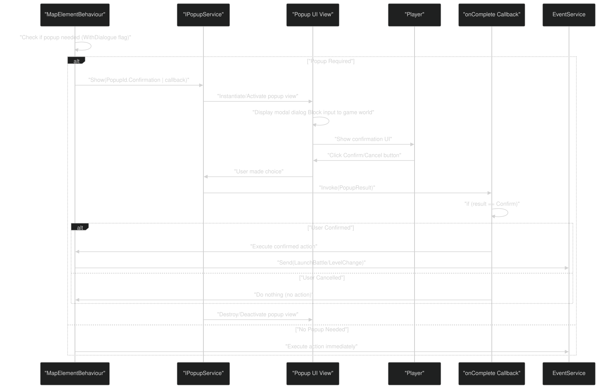

# Popup Service & Confirmations

<details>
<summary>Relevant source files</summary>


- [CarnageClub/Assets/Scripts/Map/Elements/Behaviours/BoneFireElementBehaviour.cs](https://github.com/Wolfs0ng/CarnageClub/blob/0021fcdc/CarnageClub/Assets/Scripts/Map/Elements/Behaviours/BoneFireElementBehaviour.cs)
- [CarnageClub/Assets/Scripts/Map/Elements/Behaviours/BossElementBehaviour.cs](https://github.com/Wolfs0ng/CarnageClub/blob/0021fcdc/CarnageClub/Assets/Scripts/Map/Elements/Behaviours/BossElementBehaviour.cs)
- [CarnageClub/Assets/Scripts/Map/Elements/Behaviours/FightElementBehaviour.cs](https://github.com/Wolfs0ng/CarnageClub/blob/0021fcdc/CarnageClub/Assets/Scripts/Map/Elements/Behaviours/FightElementBehaviour.cs)
- [CarnageClub/Assets/Scripts/Map/Elements/Behaviours/StoreElementBehaviour.cs](https://github.com/Wolfs0ng/CarnageClub/blob/0021fcdc/CarnageClub/Assets/Scripts/Map/Elements/Behaviours/StoreElementBehaviour.cs)
- [CarnageClub/Assets/Scripts/Utils/Core/Overlays/Abstract/INotificationService.cs](https://github.com/Wolfs0ng/CarnageClub/blob/0021fcdc/CarnageClub/Assets/Scripts/Utils/Core/Overlays/Abstract/INotificationService.cs)
- [CarnageClub/Assets/Scripts/Utils/Core/Overlays/Abstract/INotificationView.cs](https://github.com/Wolfs0ng/CarnageClub/blob/0021fcdc/CarnageClub/Assets/Scripts/Utils/Core/Overlays/Abstract/INotificationView.cs)
- [CarnageClub/Assets/Scripts/Utils/Core/Overlays/Abstract/INotificationView.cs.meta](https://github.com/Wolfs0ng/CarnageClub/blob/0021fcdc/CarnageClub/Assets/Scripts/Utils/Core/Overlays/Abstract/INotificationView.cs.meta)
- [CarnageClub/Assets/Scripts/Utils/Core/Overlays/Enums/NotificationId.cs](https://github.com/Wolfs0ng/CarnageClub/blob/0021fcdc/CarnageClub/Assets/Scripts/Utils/Core/Overlays/Enums/NotificationId.cs)
- [CarnageClub/Assets/Scripts/Utils/Core/Overlays/Enums/NotificationId.cs.meta](https://github.com/Wolfs0ng/CarnageClub/blob/0021fcdc/CarnageClub/Assets/Scripts/Utils/Core/Overlays/Enums/NotificationId.cs.meta)
- [CarnageClub/Assets/Scripts/Utils/Core/Overlays/HintUIController.cs](https://github.com/Wolfs0ng/CarnageClub/blob/0021fcdc/CarnageClub/Assets/Scripts/Utils/Core/Overlays/HintUIController.cs)
- [CarnageClub/Assets/Scripts/Utils/Core/Overlays/HintUIView.cs](https://github.com/Wolfs0ng/CarnageClub/blob/0021fcdc/CarnageClub/Assets/Scripts/Utils/Core/Overlays/HintUIView.cs)
- [CarnageClub/Assets/Scripts/Utils/Core/Overlays/Models/NotificationData.cs](https://github.com/Wolfs0ng/CarnageClub/blob/0021fcdc/CarnageClub/Assets/Scripts/Utils/Core/Overlays/Models/NotificationData.cs)
- [CarnageClub/Assets/Scripts/Utils/Core/Overlays/Models/NotificationData.cs.meta](https://github.com/Wolfs0ng/CarnageClub/blob/0021fcdc/CarnageClub/Assets/Scripts/Utils/Core/Overlays/Models/NotificationData.cs.meta)
- [CarnageClub/Assets/Scripts/Utils/Core/Overlays/NotificationService.cs](https://github.com/Wolfs0ng/CarnageClub/blob/0021fcdc/CarnageClub/Assets/Scripts/Utils/Core/Overlays/NotificationService.cs)
- [CarnageClub/Assets/Scripts/Utils/UI/OverlayUIRoot.cs](https://github.com/Wolfs0ng/CarnageClub/blob/0021fcdc/CarnageClub/Assets/Scripts/Utils/UI/OverlayUIRoot.cs)


</details>

## Purpose and Scope

This document describes the popup system used for user confirmations throughout Carnage Club. It covers the `IPopupService` interface, popup lifecycle, integration with map element behaviors, and the callback-based interaction model. The popup service provides modal dialogs for critical user decisions, such as confirming battle starts and level transitions.

For information about persistent UI overlays (hints and notifications), see [Overlay UI: Hints & Notifications](#7.2) . For map element behavior patterns in general, see [Element Behaviors & Interactions](#6.3) .

## System Overview

The popup service implements a modal dialog system that blocks gameplay until the user responds. Popups are used primarily for:

- Battle confirmations`WithDialogue`: When players interact with Fight or Boss elements that have the accessibility flag
- Level transitions: When confirming movement to new map levels via Stairs elements
- Critical game decisions: Any scenario requiring explicit user consent before proceeding


The service is accessed through the `IPopupService` interface, which is injected into `MapElementBehaviourContext` and made available to all map element behaviors. Popups use a callback-based architecture where the caller provides a completion handler that receives a `PopupResult` indicating the user's choice.

Architecture Positioning:



Sources:

- [CarnageClub/Assets/Scripts/Map/Elements/Behaviours/FightElementBehaviour.cs#1-81](https://github.com/Wolfs0ng/CarnageClub/blob/0021fcdc/CarnageClub/Assets/Scripts/Map/Elements/Behaviours/FightElementBehaviour.cs#L1-L81)
- [CarnageClub/Assets/Scripts/Map/Elements/Behaviours/BossElementBehaviour.cs#1-81](https://github.com/Wolfs0ng/CarnageClub/blob/0021fcdc/CarnageClub/Assets/Scripts/Map/Elements/Behaviours/BossElementBehaviour.cs#L1-L81)
- [CarnageClub/Assets/Scripts/Utils/UI/OverlayUIRoot.cs#1-24](https://github.com/Wolfs0ng/CarnageClub/blob/0021fcdc/CarnageClub/Assets/Scripts/Utils/UI/OverlayUIRoot.cs#L1-L24)


## IPopupService Interface

The `IPopupService` interface provides a single public method for displaying modal popups:

```block
void Show(PopupId popupId, Action<PopupResult> onComplete)
```

### Method Parameters

### Usage Pattern

The typical usage pattern, as seen in map element behaviors:

Example from FightElementBehaviour:

```block
// <FileRef file-url="https://github.com/Wolfs0ng/CarnageClub/blob/0021fcdc/CarnageClub/Assets/Scripts/Map/Elements/Behaviours/FightElementBehaviour.cs#L62-L68" min=62 max=68 file-path="CarnageClub/Assets/Scripts/Map/Elements/Behaviours/FightElementBehaviour.cs">Hii</FileRef>context.PopupService.Show(PopupId.Confirmation, result =>{    if (result == PopupResult.Confirm)    {        LaunchBattle(data, context);    }});
```

The service does not return a value directly; all responses are asynchronous through the callback mechanism.

Sources:

- [CarnageClub/Assets/Scripts/Map/Elements/Behaviours/FightElementBehaviour.cs#54-69](https://github.com/Wolfs0ng/CarnageClub/blob/0021fcdc/CarnageClub/Assets/Scripts/Map/Elements/Behaviours/FightElementBehaviour.cs#L54-L69)
- [CarnageClub/Assets/Scripts/Map/Elements/Behaviours/BossElementBehaviour.cs#54-69](https://github.com/Wolfs0ng/CarnageClub/blob/0021fcdc/CarnageClub/Assets/Scripts/Map/Elements/Behaviours/BossElementBehaviour.cs#L54-L69)


## Popup Lifecycle

The popup system follows a request-response lifecycle with clear phases:



### Lifecycle Phases

Sources:

- [CarnageClub/Assets/Scripts/Map/Elements/Behaviours/FightElementBehaviour.cs#32-47](https://github.com/Wolfs0ng/CarnageClub/blob/0021fcdc/CarnageClub/Assets/Scripts/Map/Elements/Behaviours/FightElementBehaviour.cs#L32-L47)
- [CarnageClub/Assets/Scripts/Map/Elements/Behaviours/FightElementBehaviour.cs#54-69](https://github.com/Wolfs0ng/CarnageClub/blob/0021fcdc/CarnageClub/Assets/Scripts/Map/Elements/Behaviours/FightElementBehaviour.cs#L54-L69)


## Integration with Map Element Behaviors

The popup service is tightly integrated with the map element behavior system. Behaviors access the service through `MapElementBehaviourContext` , which is injected into all behavior interface methods.

### FightElementBehaviour Integration

Decision Logic:



Implementation Flow:

### BossElementBehaviour Integration

`BossElementBehaviour` uses an identical pattern to `FightElementBehaviour` :

- `WithDialogue`[BossElementBehaviour.cs#40](https://github.com/Wolfs0ng/CarnageClub/blob/0021fcdc/BossElementBehaviour.cs#L40-L40)Same accessibility check for flag
- `TryShowConfirmationPopup()`[BossElementBehaviour.cs#54-69](https://github.com/Wolfs0ng/CarnageClub/blob/0021fcdc/BossElementBehaviour.cs#L54-L69)Same method structure
- `PopupResult.Confirm`[BossElementBehaviour.cs#64](https://github.com/Wolfs0ng/CarnageClub/blob/0021fcdc/BossElementBehaviour.cs#L64-L64)Same callback handling with check
- `BossID``EnemyID``LaunchBattleEventData`[BossElementBehaviour.cs#78](https://github.com/Wolfs0ng/CarnageClub/blob/0021fcdc/BossElementBehaviour.cs#L78-L78)Only difference: sends instead of in


### Comparison with Non-Confirming Behaviors

Behaviors that do NOT use popups:

These behaviors execute immediately in `HandlePlayerStopped()` without any confirmation step.

Code Comparison:

Sources:

- [CarnageClub/Assets/Scripts/Map/Elements/Behaviours/FightElementBehaviour.cs#32-79](https://github.com/Wolfs0ng/CarnageClub/blob/0021fcdc/CarnageClub/Assets/Scripts/Map/Elements/Behaviours/FightElementBehaviour.cs#L32-L79)
- [CarnageClub/Assets/Scripts/Map/Elements/Behaviours/BossElementBehaviour.cs#32-79](https://github.com/Wolfs0ng/CarnageClub/blob/0021fcdc/CarnageClub/Assets/Scripts/Map/Elements/Behaviours/BossElementBehaviour.cs#L32-L79)
- [CarnageClub/Assets/Scripts/Map/Elements/Behaviours/BoneFireElementBehaviour.cs#30-42](https://github.com/Wolfs0ng/CarnageClub/blob/0021fcdc/CarnageClub/Assets/Scripts/Map/Elements/Behaviours/BoneFireElementBehaviour.cs#L30-L42)
- [CarnageClub/Assets/Scripts/Map/Elements/Behaviours/StoreElementBehaviour.cs#30-42](https://github.com/Wolfs0ng/CarnageClub/blob/0021fcdc/CarnageClub/Assets/Scripts/Map/Elements/Behaviours/StoreElementBehaviour.cs#L30-L42)


## Popup Types and Results

### PopupId Enumeration

The `PopupId` enum identifies which popup configuration to display:

```block
// Namespace: CarnageClub.Utils.Core.Overlays.Enumspublic enum PopupId{    // Values inferred from usage:    Confirmation  // Used by Fight and Boss element behaviors    // Additional values may exist but are not visible in provided files}
```

Known PopupId Values:

The actual enum definition is not provided in the analyzed files, but usage patterns show at least the `Confirmation` value exists.

### PopupResult Enumeration

The `PopupResult` enum indicates the user's response to the popup:

```block
// Namespace: CarnageClub.Utils.Core.Overlays.Enumspublic enum PopupResult{    // Values inferred from usage:    Confirm  // User clicked confirm/accept button    // Additional values (e.g., Cancel, Decline) likely exist}
```

Known PopupResult Values:

Callback Pattern:

The callback checks specifically for `PopupResult.Confirm` . Any other result (explicit cancel, timeout, etc.) is treated as a "do nothing" case by omitting an `else` branch:

```block
// <FileRef file-url="https://github.com/Wolfs0ng/CarnageClub/blob/0021fcdc/FightElementBehaviour.cs#L64-L67" min=64 max=67 file-path="FightElementBehaviour.cs">Hii</FileRef>if (result == PopupResult.Confirm){    LaunchBattle(data, context);}// No else branch: cancellation is handled by inaction
```

Sources:

- [CarnageClub/Assets/Scripts/Map/Elements/Behaviours/FightElementBehaviour.cs#62-68](https://github.com/Wolfs0ng/CarnageClub/blob/0021fcdc/CarnageClub/Assets/Scripts/Map/Elements/Behaviours/FightElementBehaviour.cs#L62-L68)
- [CarnageClub/Assets/Scripts/Map/Elements/Behaviours/BossElementBehaviour.cs#62-68](https://github.com/Wolfs0ng/CarnageClub/blob/0021fcdc/CarnageClub/Assets/Scripts/Map/Elements/Behaviours/BossElementBehaviour.cs#L62-L68)


## Relationship to Overlay UI System

The popup service is part of the broader overlay UI infrastructure that persists across scene transitions:

Overlay UI Architecture:



### Key Characteristics

### Distinction from Other Overlay Systems

Sources:

- [CarnageClub/Assets/Scripts/Utils/UI/OverlayUIRoot.cs#1-24](https://github.com/Wolfs0ng/CarnageClub/blob/0021fcdc/CarnageClub/Assets/Scripts/Utils/UI/OverlayUIRoot.cs#L1-L24)
- [CarnageClub/Assets/Scripts/Utils/Core/Overlays/NotificationService.cs#1-51](https://github.com/Wolfs0ng/CarnageClub/blob/0021fcdc/CarnageClub/Assets/Scripts/Utils/Core/Overlays/NotificationService.cs#L1-L51)
- [CarnageClub/Assets/Scripts/Utils/Core/Overlays/HintUIController.cs#1-78](https://github.com/Wolfs0ng/CarnageClub/blob/0021fcdc/CarnageClub/Assets/Scripts/Utils/Core/Overlays/HintUIController.cs#L1-L78)


## Implementation Details

### Service Access Pattern

The popup service follows the dependency injection pattern used throughout the codebase:

Dependency Flow:



### Thread Safety and Re-entrancy

While not explicitly documented in the provided files, the popup service follows Unity's main-thread execution model:

- `Show()`All calls occur on the Unity main thread
- Callbacks are invoked synchronously on the main thread when the user responds
- Multiple simultaneous popups are not supported (modal behavior)
- Re-entrant calls (showing a popup from within a popup callback) are possible but discouraged


Sources:

- [CarnageClub/Assets/Scripts/Map/Elements/Behaviours/FightElementBehaviour.cs#25-79](https://github.com/Wolfs0ng/CarnageClub/blob/0021fcdc/CarnageClub/Assets/Scripts/Map/Elements/Behaviours/FightElementBehaviour.cs#L25-L79)


## Design Rationale

### Callback-Based Architecture

The popup service uses callbacks instead of async/await or coroutines for several reasons:

### Accessibility Flag Integration

The `WithDialogue` flag integration demonstrates the separation of concerns:

- State Layer`MapElementAccessibility`: flags define behavior capabilities
- Behavior Layer: Behaviors interpret flags and decide when to show popups
- Service Layer: Popup service handles UI presentation, unaware of map state


This allows:

- Map designers to enable/disable confirmations via data (ScriptableObjects)
- Behaviors to remain flexible (same code handles both dialogue and non-dialogue cases)
- Popup service to remain generic (no map-specific logic)


Sources:

- [CarnageClub/Assets/Scripts/Map/Elements/Behaviours/FightElementBehaviour.cs#40-47](https://github.com/Wolfs0ng/CarnageClub/blob/0021fcdc/CarnageClub/Assets/Scripts/Map/Elements/Behaviours/FightElementBehaviour.cs#L40-L47)
- [CarnageClub/Assets/Scripts/Map/Elements/Behaviours/FightElementBehaviour.cs#54-60](https://github.com/Wolfs0ng/CarnageClub/blob/0021fcdc/CarnageClub/Assets/Scripts/Map/Elements/Behaviours/FightElementBehaviour.cs#L54-L60)


## Extension Points

### Adding New Popup Types

To add a new popup type (e.g., `PopupId.ItemPurchase` ):

### Custom PopupResult Values

To add new result types (e.g., `PopupResult.AskLater` ):

```block
context.PopupService.Show(PopupId.Confirmation, result =>{    if (result == PopupResult.Confirm)    {        // Execute action    }    else if (result == PopupResult.AskLater)    {        // Schedule reminder    }    // else: do nothing (cancelled)});
```

Sources:

- [CarnageClub/Assets/Scripts/Map/Elements/Behaviours/FightElementBehaviour.cs#62-68](https://github.com/Wolfs0ng/CarnageClub/blob/0021fcdc/CarnageClub/Assets/Scripts/Map/Elements/Behaviours/FightElementBehaviour.cs#L62-L68)