# UI Systems

<details>
<summary>Relevant source files</summary>


- [CarnageClub/Assets/GameResources/Art/Preloader/CarnageClub_Preloader.png](https://github.com/Wolfs0ng/CarnageClub/blob/0021fcdc/CarnageClub/Assets/GameResources/Art/Preloader/CarnageClub_Preloader.png)
- [CarnageClub/Assets/GameResources/Art/Preloader/CarnageClub_Preloader.png.meta](https://github.com/Wolfs0ng/CarnageClub/blob/0021fcdc/CarnageClub/Assets/GameResources/Art/Preloader/CarnageClub_Preloader.png.meta)
- [CarnageClub/Assets/GameResources/Font/StoryScript-Regular SDF 1.asset](https://github.com/Wolfs0ng/CarnageClub/blob/0021fcdc/CarnageClub/Assets/GameResources/Font/StoryScript-Regular SDF 1.asset)
- [CarnageClub/Assets/GameResources/Prefabs/Map/Levels/Map_Level_1.prefab](https://github.com/Wolfs0ng/CarnageClub/blob/0021fcdc/CarnageClub/Assets/GameResources/Prefabs/Map/Levels/Map_Level_1.prefab)
- [CarnageClub/Assets/GameResources/Prefabs/Map/Levels/Map_Level_2.prefab](https://github.com/Wolfs0ng/CarnageClub/blob/0021fcdc/CarnageClub/Assets/GameResources/Prefabs/Map/Levels/Map_Level_2.prefab)
- [CarnageClub/Assets/Scenes/MainMenu.unity](https://github.com/Wolfs0ng/CarnageClub/blob/0021fcdc/CarnageClub/Assets/Scenes/MainMenu.unity)
- [CarnageClub/Assets/Scripts/Utils/Core/Overlays/Abstract/INotificationService.cs](https://github.com/Wolfs0ng/CarnageClub/blob/0021fcdc/CarnageClub/Assets/Scripts/Utils/Core/Overlays/Abstract/INotificationService.cs)
- [CarnageClub/Assets/Scripts/Utils/Core/Overlays/Abstract/INotificationView.cs](https://github.com/Wolfs0ng/CarnageClub/blob/0021fcdc/CarnageClub/Assets/Scripts/Utils/Core/Overlays/Abstract/INotificationView.cs)
- [CarnageClub/Assets/Scripts/Utils/Core/Overlays/Abstract/INotificationView.cs.meta](https://github.com/Wolfs0ng/CarnageClub/blob/0021fcdc/CarnageClub/Assets/Scripts/Utils/Core/Overlays/Abstract/INotificationView.cs.meta)
- [CarnageClub/Assets/Scripts/Utils/Core/Overlays/Enums/NotificationId.cs](https://github.com/Wolfs0ng/CarnageClub/blob/0021fcdc/CarnageClub/Assets/Scripts/Utils/Core/Overlays/Enums/NotificationId.cs)
- [CarnageClub/Assets/Scripts/Utils/Core/Overlays/Enums/NotificationId.cs.meta](https://github.com/Wolfs0ng/CarnageClub/blob/0021fcdc/CarnageClub/Assets/Scripts/Utils/Core/Overlays/Enums/NotificationId.cs.meta)
- [CarnageClub/Assets/Scripts/Utils/Core/Overlays/HintUIController.cs](https://github.com/Wolfs0ng/CarnageClub/blob/0021fcdc/CarnageClub/Assets/Scripts/Utils/Core/Overlays/HintUIController.cs)
- [CarnageClub/Assets/Scripts/Utils/Core/Overlays/HintUIView.cs](https://github.com/Wolfs0ng/CarnageClub/blob/0021fcdc/CarnageClub/Assets/Scripts/Utils/Core/Overlays/HintUIView.cs)
- [CarnageClub/Assets/Scripts/Utils/Core/Overlays/Models/NotificationData.cs](https://github.com/Wolfs0ng/CarnageClub/blob/0021fcdc/CarnageClub/Assets/Scripts/Utils/Core/Overlays/Models/NotificationData.cs)
- [CarnageClub/Assets/Scripts/Utils/Core/Overlays/Models/NotificationData.cs.meta](https://github.com/Wolfs0ng/CarnageClub/blob/0021fcdc/CarnageClub/Assets/Scripts/Utils/Core/Overlays/Models/NotificationData.cs.meta)
- [CarnageClub/Assets/Scripts/Utils/Core/Overlays/NotificationService.cs](https://github.com/Wolfs0ng/CarnageClub/blob/0021fcdc/CarnageClub/Assets/Scripts/Utils/Core/Overlays/NotificationService.cs)
- [CarnageClub/Assets/Scripts/Utils/UI/OverlayUIRoot.cs](https://github.com/Wolfs0ng/CarnageClub/blob/0021fcdc/CarnageClub/Assets/Scripts/Utils/UI/OverlayUIRoot.cs)


</details>

## Purpose and Scope

This document covers the user interface systems in Carnage Club: the persistent overlay system (hints and notifications), the main menu, and the popup service. These systems provide visual feedback and user interactions across different scenes.

For information about battle-specific UI (direction selection, combat log, result screens), see [Battle UI & Combat Log](#5.4) . For map element visualization and interaction, see [Map Elements & Interactive Nodes](#6.2) .

## System Architecture Overview

The UI systems are divided into three main categories: persistent overlays, scene-specific controllers, and transient popups.

Diagram: UI System Components


Sources:

- [CarnageClub/Assets/Scripts/Utils/UI/OverlayUIRoot.cs#1-24](https://github.com/Wolfs0ng/CarnageClub/blob/0021fcdc/CarnageClub/Assets/Scripts/Utils/UI/OverlayUIRoot.cs#L1-L24)
- [CarnageClub/Assets/Scripts/Utils/Core/Overlays/HintUIController.cs#1-78](https://github.com/Wolfs0ng/CarnageClub/blob/0021fcdc/CarnageClub/Assets/Scripts/Utils/Core/Overlays/HintUIController.cs#L1-L78)
- [CarnageClub/Assets/Scripts/Utils/Core/Overlays/NotificationService.cs#1-51](https://github.com/Wolfs0ng/CarnageClub/blob/0021fcdc/CarnageClub/Assets/Scripts/Utils/Core/Overlays/NotificationService.cs#L1-L51)


## Persistent Overlay System

The overlay system provides hints and notifications that persist across scene transitions. It is instantiated once and marked with `DontDestroyOnLoad` .

### OverlayUIRoot

The `OverlayUIRoot` component is the container for all persistent UI elements.


Key Characteristics:

- Simple MonoBehaviour with minimal logic
- Ensures overlay UI survives scene loads
- Acts as parent container for hint and notification controllers


Sources:

- [CarnageClub/Assets/Scripts/Utils/UI/OverlayUIRoot.cs#17-23](https://github.com/Wolfs0ng/CarnageClub/blob/0021fcdc/CarnageClub/Assets/Scripts/Utils/UI/OverlayUIRoot.cs#L17-L23)


## Hint System

The hint system displays contextual tooltips at specific screen positions. It uses object pooling to reuse hint views efficiently.

### Architecture

Sources:

- [CarnageClub/Assets/Scripts/Utils/Core/Overlays/HintUIController.cs#21-77](https://github.com/Wolfs0ng/CarnageClub/blob/0021fcdc/CarnageClub/Assets/Scripts/Utils/Core/Overlays/HintUIController.cs#L21-L77)
- [CarnageClub/Assets/Scripts/Utils/Core/Overlays/HintUIView.cs#23-131](https://github.com/Wolfs0ng/CarnageClub/blob/0021fcdc/CarnageClub/Assets/Scripts/Utils/Core/Overlays/HintUIView.cs#L23-L131)


### HintUIController Pooling

The `HintUIController` maintains pools of hint views indexed by `HintId` .

Initialization Process:

| Step | Action | Code Location | 
| --- | --- | --- |
| 1 | Awake() initializes presetPoolMap | HintUIController.cs#52-53 | 
| 2 | Iterates through presets array | HintUIController.cs#55-56 | 
| 3 | Skips entries with HintId.None or null views | HintUIController.cs#59-67 | 
| 4 | Adds views to pool by HintId | HintUIController.cs#69-74 | 


Renting a Hint View:

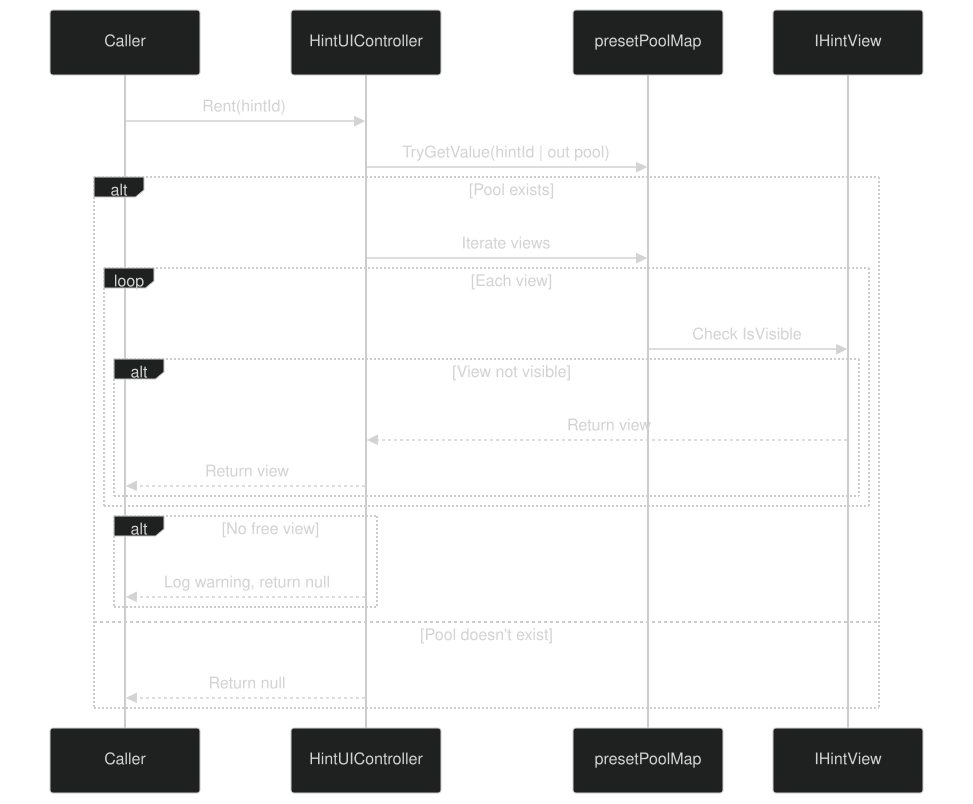

Sources:

- [CarnageClub/Assets/Scripts/Utils/Core/Overlays/HintUIController.cs#34-49](https://github.com/Wolfs0ng/CarnageClub/blob/0021fcdc/CarnageClub/Assets/Scripts/Utils/Core/Overlays/HintUIController.cs#L34-L49)


### HintUIView Behavior

The `HintUIView` handles display, positioning, fade animations, and dismissal.

Show/Hide Flow:


Dismissal Detection:

The view polls for pointer input in `Update()` and dismisses if the user clicks outside the hint panel.

Sources:

- [CarnageClub/Assets/Scripts/Utils/Core/Overlays/HintUIView.cs#36-66](https://github.com/Wolfs0ng/CarnageClub/blob/0021fcdc/CarnageClub/Assets/Scripts/Utils/Core/Overlays/HintUIView.cs#L36-L66)
- [CarnageClub/Assets/Scripts/Utils/Core/Overlays/HintUIView.cs#68-92](https://github.com/Wolfs0ng/CarnageClub/blob/0021fcdc/CarnageClub/Assets/Scripts/Utils/Core/Overlays/HintUIView.cs#L68-L92)


## Notification System

The notification system displays temporary messages to the player. It follows a similar pooling pattern to the hint system.

### Architecture

Sources:

- [CarnageClub/Assets/Scripts/Utils/Core/Overlays/NotificationService.cs#18-50](https://github.com/Wolfs0ng/CarnageClub/blob/0021fcdc/CarnageClub/Assets/Scripts/Utils/Core/Overlays/NotificationService.cs#L18-L50)
- [CarnageClub/Assets/Scripts/Utils/Core/Overlays/Models/NotificationData.cs#32-38](https://github.com/Wolfs0ng/CarnageClub/blob/0021fcdc/CarnageClub/Assets/Scripts/Utils/Core/Overlays/Models/NotificationData.cs#L32-L38)
- [CarnageClub/Assets/Scripts/Utils/Core/Overlays/Abstract/INotificationService.cs#18-21](https://github.com/Wolfs0ng/CarnageClub/blob/0021fcdc/CarnageClub/Assets/Scripts/Utils/Core/Overlays/Abstract/INotificationService.cs#L18-L21)
- [CarnageClub/Assets/Scripts/Utils/Core/Overlays/Abstract/INotificationView.cs#17-22](https://github.com/Wolfs0ng/CarnageClub/blob/0021fcdc/CarnageClub/Assets/Scripts/Utils/Core/Overlays/Abstract/INotificationView.cs#L17-L22)
- [CarnageClub/Assets/Scripts/Utils/Core/Overlays/Enums/NotificationId.cs#15-19](https://github.com/Wolfs0ng/CarnageClub/blob/0021fcdc/CarnageClub/Assets/Scripts/Utils/Core/Overlays/Enums/NotificationId.cs#L15-L19)


### NotificationService

The `NotificationService` is registered with the `ServiceLocator` and provides the public API for showing notifications.

Service Flow:

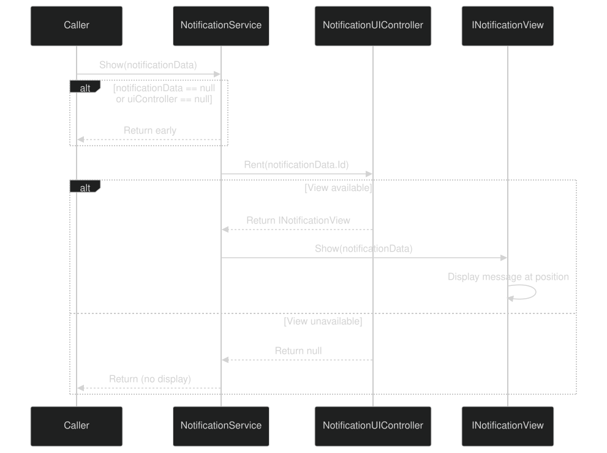

Sources:

- [CarnageClub/Assets/Scripts/Utils/Core/Overlays/NotificationService.cs#35-49](https://github.com/Wolfs0ng/CarnageClub/blob/0021fcdc/CarnageClub/Assets/Scripts/Utils/Core/Overlays/NotificationService.cs#L35-L49)


## Main Menu System

The main menu is the entry point for the game, allowing players to start a new game or load a saved game.

### MainMenu Scene Structure


Sources:

- [CarnageClub/Assets/Scenes/MainMenu.unity#122-168](https://github.com/Wolfs0ng/CarnageClub/blob/0021fcdc/CarnageClub/Assets/Scenes/MainMenu.unity#L122-L168)
- [CarnageClub/Assets/Scenes/MainMenu.unity#169-272](https://github.com/Wolfs0ng/CarnageClub/blob/0021fcdc/CarnageClub/Assets/Scenes/MainMenu.unity#L169-L272)


### MainMenuUIController

The `MainMenuUIController` handles button clicks and initiates scene transitions.

Controller Configuration:

Expected Behavior:

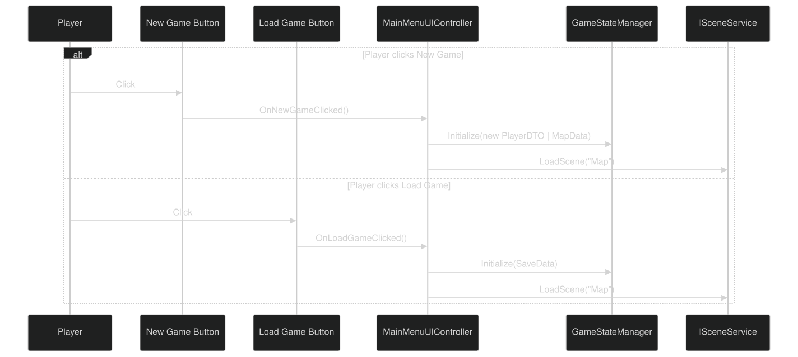

Sources:

- [CarnageClub/Assets/Scenes/MainMenu.unity#139-153](https://github.com/Wolfs0ng/CarnageClub/blob/0021fcdc/CarnageClub/Assets/Scenes/MainMenu.unity#L139-L153)


## Popup Service

The popup service provides modal confirmations for critical player actions (e.g., starting battles, changing levels).

### Integration with Map Elements

From the high-level diagrams, the popup service integrates with map element behaviors:

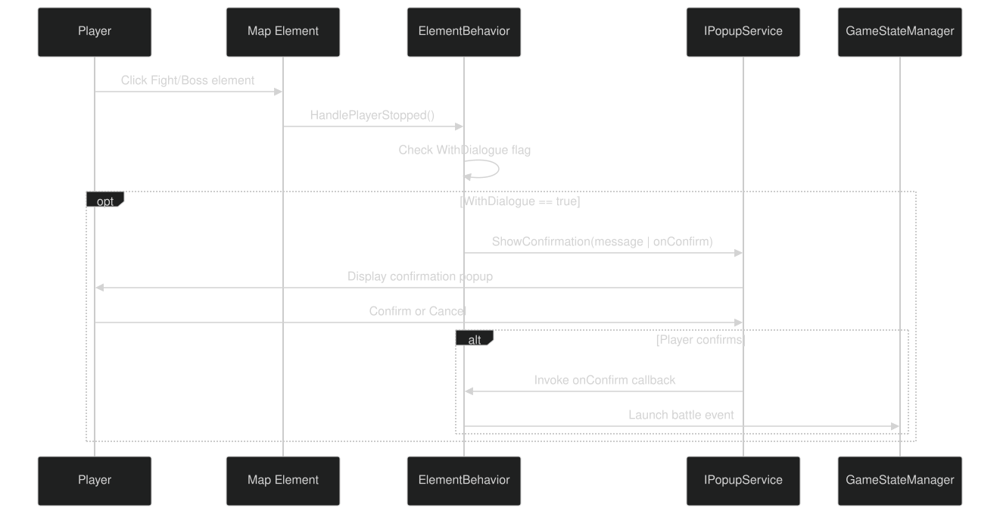

Usage Contexts:

Sources:

- High-level Diagram 5: Map and Battle Integration


## Data Models

### HintData

Encapsulates data for displaying a hint.

Properties:

Sources:

- [CarnageClub/Assets/Scripts/Utils/Core/Overlays/HintUIView.cs#36-56](https://github.com/Wolfs0ng/CarnageClub/blob/0021fcdc/CarnageClub/Assets/Scripts/Utils/Core/Overlays/HintUIView.cs#L36-L56)Inferred from


### NotificationData

Encapsulates data for displaying a notification.

Properties:

Sources:

- [CarnageClub/Assets/Scripts/Utils/Core/Overlays/Models/NotificationData.cs#32-38](https://github.com/Wolfs0ng/CarnageClub/blob/0021fcdc/CarnageClub/Assets/Scripts/Utils/Core/Overlays/Models/NotificationData.cs#L32-L38)


## Service Registration

The UI services are registered during application startup through the `ServiceLocator` pattern.

Registration Sequence (from High-Level Diagram 3):


Registered UI Services:

- `INotificationService``NotificationService`→
- `IPopupService`→ (implementation not shown)


Sources:

- High-level Diagram 3: Game Flow - Service Registration


## UI Assets

### Fonts

The codebase uses TextMeshPro with a custom font asset:

- Font Asset:`StoryScript-Regular SDF 1.asset`
- Atlas Size:1024x1024
- Format:Signed Distance Field (SDF)


Sources:

- [CarnageClub/Assets/GameResources/Font/StoryScript-Regular SDF 1.asset#1-50](https://github.com/Wolfs0ng/CarnageClub/blob/0021fcdc/CarnageClub/Assets/GameResources/Font/StoryScript-Regular SDF 1.asset#L1-L50)


### Preloader

The application preloader displays during initial load:

- Preloader Image:`CarnageClub_Preloader.png`
- Resolution:2560x1440
- Format:PNG with alpha transparency
- Platform Overrides:4096x4096 max on Android (ETC2)


Sources:

- [CarnageClub/Assets/GameResources/Art/Preloader/CarnageClub_Preloader.png.meta#1-170](https://github.com/Wolfs0ng/CarnageClub/blob/0021fcdc/CarnageClub/Assets/GameResources/Art/Preloader/CarnageClub_Preloader.png.meta#L1-L170)


## Design Patterns

### Object Pooling

Both hint and notification systems use object pooling to avoid instantiation overhead:

Pool Structure:

```block
Dictionary<HintId, List<IHintView>> presetPoolMap    ├─ HintId.Default → [HintUIView1 (free), HintUIView2 (in use)]    ├─ HintId.BattleTip → [HintUIView3 (free)]    └─ HintId.MapHelp → [HintUIView4 (free), HintUIView5 (free)]
```

Rent Algorithm:

Sources:

- [CarnageClub/Assets/Scripts/Utils/Core/Overlays/HintUIController.cs#34-49](https://github.com/Wolfs0ng/CarnageClub/blob/0021fcdc/CarnageClub/Assets/Scripts/Utils/Core/Overlays/HintUIController.cs#L34-L49)


### Service Locator

UI services are accessed via the `ServiceLocator` :

```block
// Example usage (inferred)INotificationService notifService = ServiceLocator.Get<INotificationService>();notifService.Show(new NotificationData { ... }); IPopupService popupService = ServiceLocator.Get<IPopupService>();popupService.ShowConfirmation("Continue?", onConfirm: () => { ... });
```

Sources:

- [CarnageClub/Assets/Scripts/Utils/Core/Overlays/NotificationService.cs#18-50](https://github.com/Wolfs0ng/CarnageClub/blob/0021fcdc/CarnageClub/Assets/Scripts/Utils/Core/Overlays/NotificationService.cs#L18-L50)
- High-level Diagram 1: Service Locator integration


### Fade Animations

The hint system uses coroutine-based fade animations for smooth transitions:

Fade Implementation:

Sources:

- [CarnageClub/Assets/Scripts/Utils/Core/Overlays/HintUIView.cs#94-122](https://github.com/Wolfs0ng/CarnageClub/blob/0021fcdc/CarnageClub/Assets/Scripts/Utils/Core/Overlays/HintUIView.cs#L94-L122)


## Integration Points

### Map System Integration

Map element behaviors use the popup service for confirmations:


Sources:

- High-level Diagram 5: Map and Battle Integration


### Battle System Integration

Battle UI displays hints and notifications during combat:


Sources:

- High-level Diagram 1: Overlay UI hints for Battle system


## Summary

The UI systems provide three core capabilities:

All systems follow consistent patterns: object pooling, service locator access, and data-driven configuration through DTOs ( `HintData` , `NotificationData` ). The `OverlayUIRoot` ensures UI persistence across scenes using Unity's `DontDestroyOnLoad` .