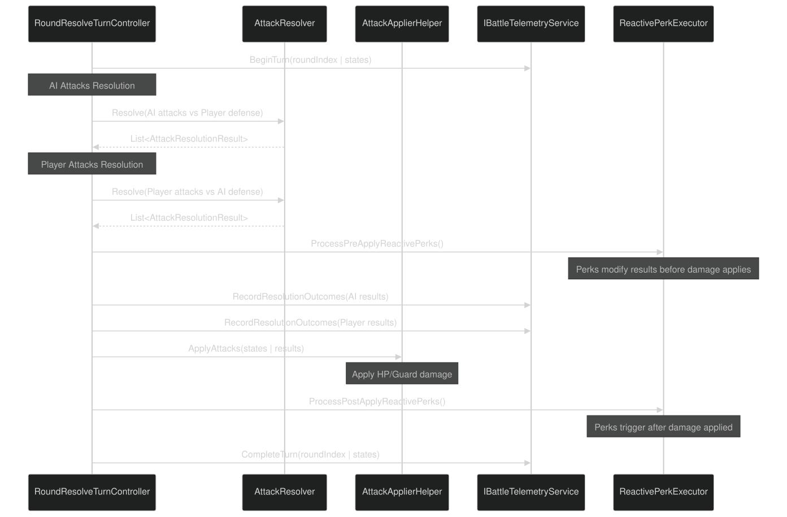

# Combat Rules & Mechanics

Relevant source files

- [CarnageClub/Assets/Scenes/Battle.unity](https://github.com/Wolfs0ng/CarnageClub/blob/0021fcdc/CarnageClub/Assets/Scenes/Battle.unity)
- [CarnageClub/Assets/Scripts/Battle/Turns/Controllers/RoundResolveTurnController.cs](https://github.com/Wolfs0ng/CarnageClub/blob/0021fcdc/CarnageClub/Assets/Scripts/Battle/Turns/Controllers/RoundResolveTurnController.cs)
- [CarnageClub/Assets/Scripts/Battle/Turns/RoundResolveTurn.cs](https://github.com/Wolfs0ng/CarnageClub/blob/0021fcdc/CarnageClub/Assets/Scripts/Battle/Turns/RoundResolveTurn.cs)
- [GDD_EN.md](https://github.com/Wolfs0ng/CarnageClub/blob/0021fcdc/GDD_EN.md)
- [GDD_UA.md](https://github.com/Wolfs0ng/CarnageClub/blob/0021fcdc/GDD_UA.md)
- [README.md](https://github.com/Wolfs0ng/CarnageClub/blob/0021fcdc/README.md)

## Purpose and Scope

This document details the combat rules and mechanics of Carnage Club: the 4-direction attack/defense system, resolution rules, damage types, and special combat effects. This covers the design rules that govern how combat works, not the implementation details.

For information about the battle system's implementation (turn management, battle lifecycle, UI components), see [Battle System](#5) . For information about how AI makes combat decisions based on these rules, see [AI System](#3) .

## Overview

Carnage Club uses a directional turn-based combat system where both the player and AI select attack and defense directions simultaneously. Each round, attacks are resolved per-direction, checking if the attacker's chosen direction matches the defender's defensive coverage. The system supports multiple outcomes based on coverage, character stats, and active perks.

Key Principles:

- Combat is deterministic and explainable (no hidden RNG)
- Each attack direction resolves independently
- Defense can cover multiple directions
- [Layer 0: Telemetry System](#3.2)Outcomes feed into AI learning (see )

Sources: [GDD_EN.md #79-104](https://github.com/Wolfs0ng/CarnageClub/blob/0021fcdc/GDD_EN.md#L79-L104)  [README.md #26-36](https://github.com/Wolfs0ng/CarnageClub/blob/0021fcdc/README.md#L26-L36)

## The 4-Direction Combat System

### Attack and Defense Directions

Combat uses four body zones that serve as both attack targets and defense positions:

Sources: [CarnageClub/Assets/Scenes/Battle.unity #1005-1029](https://github.com/Wolfs0ng/CarnageClub/blob/0021fcdc/CarnageClub/Assets/Scenes/Battle.unity#L1005-L1029)  [GDD_EN.md #81-85](https://github.com/Wolfs0ng/CarnageClub/blob/0021fcdc/GDD_EN.md#L81-L85)

### Direction Selection

Each turn, both actors select:

Multi-Direction Support:

- Attacking multiple directions simultaneously is allowed (1-3 typical)
- Defense can cover multiple zones (weapon + shield combinations)
- Each attack direction resolves independently against the defense setup

The player selects directions via UI toggles, while AI uses `AiDecisionSelectionService` (see [Layer 3: Tactical Decision System](#3.4) ).

Sources: [GDD_EN.md #81-93](https://github.com/Wolfs0ng/CarnageClub/blob/0021fcdc/GDD_EN.md#L81-L93)  [CarnageClub/Assets/Scripts/Battle/Turns/Controllers/RoundResolveTurnController.cs #172-201](https://github.com/Wolfs0ng/CarnageClub/blob/0021fcdc/CarnageClub/Assets/Scripts/Battle/Turns/Controllers/RoundResolveTurnController.cs#L172-L201)

## Attack Resolution Process

### Resolution Flow

The combat resolution follows a strict pipeline that ensures deterministic, explainable outcomes:

Key Steps:

Sources: [CarnageClub/Assets/Scripts/Battle/Turns/Controllers/RoundResolveTurnController.cs #79-128](https://github.com/Wolfs0ng/CarnageClub/blob/0021fcdc/CarnageClub/Assets/Scripts/Battle/Turns/Controllers/RoundResolveTurnController.cs#L79-L128)

### Attack Context and Resolution

Each attack direction is resolved individually using an `AttackContext` :

Resolution Logic:

The `AttackResolver` checks if the attack direction matches any defense direction:

- Match Found
- `DefenseType`Result depends on (Block, Parry, etc.)
- `AttackOutcome.Blocked``AttackOutcome.Parry`Typically: or
- Guard damage may apply to defender

: Defense covers the attack
- No Match
- `AttackOutcome.DamageHealth``AttackOutcome.DamageGuard`Result: or
- HP or Guard damage calculated from attacker stats
- Special effects may trigger (Critical, Guard Break, Exhaust)

: Attack is undefended

Sources: [CarnageClub/Assets/Scripts/Battle/Turns/Controllers/RoundResolveTurnController.cs #172-201](https://github.com/Wolfs0ng/CarnageClub/blob/0021fcdc/CarnageClub/Assets/Scripts/Battle/Turns/Controllers/RoundResolveTurnController.cs#L172-L201)  [CarnageClub/Assets/Scripts/Battle/Turns/Controllers/RoundResolveTurnController.cs #188-197](https://github.com/Wolfs0ng/CarnageClub/blob/0021fcdc/CarnageClub/Assets/Scripts/Battle/Turns/Controllers/RoundResolveTurnController.cs#L188-L197)

## Outcome Types

### AttackOutcome Enum

Each attack direction resolves to one of these outcomes:

Reactive Perk Execution:

Perks can modify outcomes at two stages:

- Pre-Apply`ReactivePerkExecutionStage.PreApply`
- `Blocked``Parry`Triggered on or outcomes
- `DamageHealth``DamageGuard`Also triggered on or outcomes
- Example: Convert a block into a counter-attack

( ): Modifies result before damage applies
- Post-Apply`ReactivePerkExecutionStage.PostApply`
- `FinalDamageToHp > 0``FinalDamageToGuard > 0`Triggered when or
- `BattleEventPhase.EndTurn`Always triggered at
- Example: Lifesteal, applying bleed effects

( ): Triggered after damage applies

Sources: [CarnageClub/Assets/Scripts/Battle/Turns/Controllers/RoundResolveTurnController.cs #203-263](https://github.com/Wolfs0ng/CarnageClub/blob/0021fcdc/CarnageClub/Assets/Scripts/Battle/Turns/Controllers/RoundResolveTurnController.cs#L203-L263)  [GDD_EN.md #95-99](https://github.com/Wolfs0ng/CarnageClub/blob/0021fcdc/GDD_EN.md#L95-L99)

## Damage Types

### HP Damage vs Guard Damage

Combat uses two distinct damage pools representing different defensive layers:

HP (Health Points):

- Primary life pool
- Battle ends when HP ≤ 0
- Regenerates only at BoneFire elements or via consumables
- `CharacterState.CurrentHp``CharacterState.MaxHp`Managed in and

Guard (Guard Stance):

- Temporary defensive buffer
- Absorbs damage before HP is affected
- Regenerates between rounds (typically)
- `Fortitude`Strength influenced by stat
- `CharacterState.CurrentGuard``CharacterState.MaxGuard`Managed in and

Damage Application:

The `AttackApplierHelper` applies damage based on the resolution outcome:

Sources: [GDD_EN.md #95-99](https://github.com/Wolfs0ng/CarnageClub/blob/0021fcdc/GDD_EN.md#L95-L99)  [CarnageClub/Assets/Scripts/Battle/Turns/Controllers/RoundResolveTurnController.cs #105-106](https://github.com/Wolfs0ng/CarnageClub/blob/0021fcdc/CarnageClub/Assets/Scripts/Battle/Turns/Controllers/RoundResolveTurnController.cs#L105-L106)  [GDD_UA.md #98-101](https://github.com/Wolfs0ng/CarnageClub/blob/0021fcdc/GDD_UA.md#L98-L101)

## Special Mechanics

### Guard Break

Guard Break occurs when an attack reduces the defender's Guard to 0 or below.

Current Status:  In design

Planned Mechanics:

- `Guard`Triggered when damage exceeds remaining Guard value
- Overflow damage can apply to HP via perks (e.g., "Mighty Blow" ability)
- May apply debuffs or vulnerable states
- `AttackResolutionResult.IsGuardBreak`Tracked in flag

Related Stats:

- Strength: Increases Guard penetration
- Fortitude: Increases Guard strength and regeneration

Sources: [GDD_EN.md #102](https://github.com/Wolfs0ng/CarnageClub/blob/0021fcdc/GDD_EN.md#L102-L102)  [GDD_UA.md #103](https://github.com/Wolfs0ng/CarnageClub/blob/0021fcdc/GDD_UA.md#L103-L103)

### Critical Hits

Critical Hits multiply damage output when attacking undefended targets.

Current Status:  In design

Planned Mechanics:

- Chance to trigger on successful HP damage attacks
- Damage multiplied by critical modifier
- MasteryInfluenced by stat (increases crit chance)
- Certain weapons or abilities increase crit chance/damage
- `AttackResolutionResult.IsCritical`Tracked in flag

Abilities Interaction:

- "See Weak Spots" ability: Increases critical chance
- Head strikes: Higher base crit chance (planned)

Sources: [GDD_EN.md #103](https://github.com/Wolfs0ng/CarnageClub/blob/0021fcdc/GDD_EN.md#L103-L103)  [GDD_UA.md #104](https://github.com/Wolfs0ng/CarnageClub/blob/0021fcdc/GDD_UA.md#L104-L104)  [GDD_UA.md #139](https://github.com/Wolfs0ng/CarnageClub/blob/0021fcdc/GDD_UA.md#L139-L139)

### Parry

Parry is a defensive technique that blocks an attack and creates a counter-attack opportunity.

Current Status:  In design

Planned Mechanics:

- `DefenseType.Parry`Requires selection
- Direction must match incoming attack
- If successful: No damage taken, counter-attack into attacker's zone
- Counter damage may be reduced or full depending on weapon/stats
- More stamina-intensive than blocking
- `AttackResolutionResult.IsParry`Tracked in flag

Abilities Interaction:

- "Bestial Reaction" ability: Converts would-be HP damage into Guard damage when hitting a parry direction

Sources: [GDD_EN.md #99](https://github.com/Wolfs0ng/CarnageClub/blob/0021fcdc/GDD_EN.md#L99-L99)  [GDD_UA.md #101](https://github.com/Wolfs0ng/CarnageClub/blob/0021fcdc/GDD_UA.md#L101-L101)  [GDD_UA.md #145](https://github.com/Wolfs0ng/CarnageClub/blob/0021fcdc/GDD_UA.md#L145-L145)

### Exhaust

Exhaust occurs when a character's Stamina drops to 0 or below.

Current Status:  In design

Planned Mechanics:

- Triggered when Stamina ≤ 0 after action costs
- Applies debuffs until Stamina regenerates
- May prevent certain actions (skills, multi-direction attacks)
- MasteryStamina influenced by stat
- Stamina regenerates partially each turn

Related Systems:

- Action Points system (skills consume stamina)
- Mastery stat increases max stamina and regen rate

Sources: [GDD_EN.md #104](https://github.com/Wolfs0ng/CarnageClub/blob/0021fcdc/GDD_EN.md#L104-L104)  [GDD_UA.md #105](https://github.com/Wolfs0ng/CarnageClub/blob/0021fcdc/GDD_UA.md#L105-L105)

## Combat Resolution Example

### Turn Execution Flow

This example demonstrates a single round where both actors attack and defend simultaneously:

Setup:

- HeadBellyLeftHandPlayer: Attacks + , Defends (Block)
- BellyRightHandHeadBellyAI: Attacks + , Defends + (Block)

Resolution Breakdown:

Telemetry Recording:

All outcomes are recorded in `BattleTurnTelemetry` for AI learning:

- Per-direction outcomes (Hit, Block, Parry)
- Damage values (HP, Guard)
- Special effects triggered (Critical, Guard Break, Exhaust)
- Pre/post states (HP, Guard, Stamina)

This data feeds into:

- [Layer 1-2: Knowledge Systems](#3.3)for pattern learning
- [Layer 3: Tactical Decision System](#3.4)for candidate ranking
- [Layer 5: Emotion System](#3.6)for aggression/fear modulation

Sources: [CarnageClub/Assets/Scripts/Battle/Turns/Controllers/RoundResolveTurnController.cs #79-128](https://github.com/Wolfs0ng/CarnageClub/blob/0021fcdc/CarnageClub/Assets/Scripts/Battle/Turns/Controllers/RoundResolveTurnController.cs#L79-L128)  [GDD_EN.md #88-93](https://github.com/Wolfs0ng/CarnageClub/blob/0021fcdc/GDD_EN.md#L88-L93)

## Summary

Carnage Club's combat system is built on deterministic, direction-based resolution:

- 4 Directions: Head, Belly, LeftHand, RightHand serve as both attack targets and defense positions
- Per-Direction Resolution: Each attack resolves independently against the defense setup
- Clear Outcomes: Blocked, Parry, DamageGuard, DamageHealth
- Two Damage Types: HP (primary life) and Guard (temporary shield)
- Special Mechanics: Guard Break, Critical, Parry, Exhaust (most in design)
- Telemetry Integration: All outcomes feed into AI learning systems

This design prioritizes readability over randomness — players can analyze each round's outcomes to adapt their strategy, while the AI uses the same information to learn player patterns.

For implementation details of the resolution process, see [Round Resolution & Combat Mechanics](#5.2) . For how AI uses combat outcomes to adapt, see [Layer 0: Telemetry System](#3.2) .

Sources: [GDD_EN.md #79-104](https://github.com/Wolfs0ng/CarnageClub/blob/0021fcdc/GDD_EN.md#L79-L104)  [CarnageClub/Assets/Scripts/Battle/Turns/Controllers/RoundResolveTurnController.cs #1-290](https://github.com/Wolfs0ng/CarnageClub/blob/0021fcdc/CarnageClub/Assets/Scripts/Battle/Turns/Controllers/RoundResolveTurnController.cs#L1-L290)