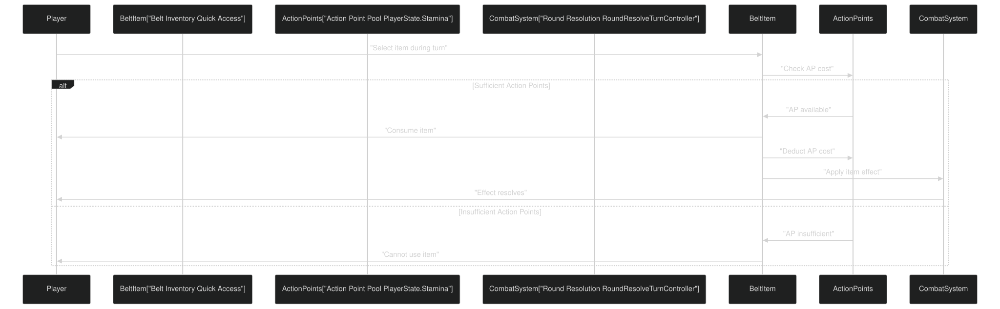

# Character Progression

Relevant source files

- [GDD_EN.md](https://github.com/Wolfs0ng/CarnageClub/blob/0021fcdc/GDD_EN.md)
- [GDD_UA.md](https://github.com/Wolfs0ng/CarnageClub/blob/0021fcdc/GDD_UA.md)
- [README.md](https://github.com/Wolfs0ng/CarnageClub/blob/0021fcdc/README.md)

## Purpose & Scope

This page documents the character progression mechanics in Carnage Club: how character stats affect combat, the equipment system, skills, abilities, and how the unique Focus stat interacts with AI learning. This page covers the game design aspects of character growth and customization.

For combat mechanics and damage resolution, see [Combat Rules & Mechanics](#8.1) . For how enemies evolve in response to player defeats, see [Nemesis System](#8.3) . For how Focus affects AI learning speed, see [AI Architecture Overview](#3.1) .

## Character Stats System

Carnage Club uses four core stats that define character capabilities. Each stat influences multiple combat mechanics and progression paths.

### Core Stats Table

Sources:  [GDD_EN.md #108-119](https://github.com/Wolfs0ng/CarnageClub/blob/0021fcdc/GDD_EN.md#L108-L119)  [GDD_UA.md #108-118](https://github.com/Wolfs0ng/CarnageClub/blob/0021fcdc/GDD_UA.md#L108-L118)

### Stat Interactions Overview

Diagram: Character Stats Flow Through Combat and AI Systems

This diagram shows how character stats influence both combat resolution and AI learning. Strength and Fortitude affect direct combat mechanics, Mastery enables special effects and stamina management, while Focus uniquely bridges the player character to the AI knowledge systems.

Sources:  [GDD_EN.md #108-119](https://github.com/Wolfs0ng/CarnageClub/blob/0021fcdc/GDD_EN.md#L108-L119)  [GDD_UA.md #108-118](https://github.com/Wolfs0ng/CarnageClub/blob/0021fcdc/GDD_UA.md#L108-L118) High-level diagrams (AI System architecture)

## Focus: The Unique AI-Interactive Stat

Focus is the key differentiator in Carnage Club's character progression. Unlike traditional RPG stats that only affect numbers, Focus directly modifies how the AI learns from and adapts to the player.

### Focus Mechanics

Focus influences three distinct AI subsystems:

### Focus-AI Integration Points

Diagram: Focus Stat Integration with AI Layers

Focus acts as a bidirectional modifier: it accelerates the player's ability to learn enemy patterns (via faster knowledge accumulation) while simultaneously slowing enemy counter-adaptation. This creates a skill-based progression where investing in Focus rewards players who actively study and adapt to AI behavior.

Sources:  [GDD_EN.md #117](https://github.com/Wolfs0ng/CarnageClub/blob/0021fcdc/GDD_EN.md#L117-L117)  [GDD_UA.md #116](https://github.com/Wolfs0ng/CarnageClub/blob/0021fcdc/GDD_UA.md#L116-L116) High-level AI architecture diagram

### Design Intent

The Focus stat embodies the core game concept "The world remembers your habits." By making Focus a stat rather than a hidden system variable, it:

- Provides player agency over AI difficulty
- Creates meaningful build diversity (combat stats vs. learning stats)
- Rewards analytical playstyles
- Ties character progression directly to the AI system

Sources:  [README.md #34-36](https://github.com/Wolfs0ng/CarnageClub/blob/0021fcdc/README.md#L34-L36)  [GDD_EN.md #27](https://github.com/Wolfs0ng/CarnageClub/blob/0021fcdc/GDD_EN.md#L27-L27)  [GDD_UA.md #27](https://github.com/Wolfs0ng/CarnageClub/blob/0021fcdc/GDD_UA.md#L27-L27)

## Equipment System

The equipment system in Carnage Club uses a slot-based approach with combinatorial complexity. Different weapon combinations fundamentally alter combat playstyles.

### Equipment Slots

Diagram: Equipment Slot Structure

Sources:  [GDD_EN.md #153-192](https://github.com/Wolfs0ng/CarnageClub/blob/0021fcdc/GDD_EN.md#L153-L192)  [GDD_UA.md #150-185](https://github.com/Wolfs0ng/CarnageClub/blob/0021fcdc/GDD_UA.md#L150-L185)

### Weapon Combinations & Playstyles

Status: In design phase. Exact mechanics subject to balance testing.

Sources:  [GDD_EN.md #183-192](https://github.com/Wolfs0ng/CarnageClub/blob/0021fcdc/GDD_EN.md#L183-L192)  [GDD_UA.md #176-185](https://github.com/Wolfs0ng/CarnageClub/blob/0021fcdc/GDD_UA.md#L176-L185)

### Equipment-Stat Interaction

Equipment items modify base stats and enable specific abilities. The system is designed to create build diversity:

- Strength buildsfavor two-handed weapons for maximum damage
- Fortitude buildsuse shield + armor for sustained defense
- Mastery buildsenable dual-wielding with stamina-efficient attacks
- Focus buildspair with any weapon style but enhance AI reading capabilities

Sources:  [GDD_EN.md #108-192](https://github.com/Wolfs0ng/CarnageClub/blob/0021fcdc/GDD_EN.md#L108-L192)  [GDD_UA.md #108-185](https://github.com/Wolfs0ng/CarnageClub/blob/0021fcdc/GDD_UA.md#L108-L185)

## Skills System

Skills are active abilities that consume Action Points and require player activation. All skills are designed to create tactical decision points during combat.

### Skill Characteristics

- Cost:Every skill consumes 1+ Action Points
- Targeting:
- Directional- require selecting 1+ attack/defense directions
- Non-directional- activate without targeting

Skills can be:
- Duration:Most skills affect the next turn or current turn only

### Skill Categories & Examples

Status: In design phase. Skill list is not final.

Sources:  [GDD_EN.md #122-132](https://github.com/Wolfs0ng/CarnageClub/blob/0021fcdc/GDD_EN.md#L122-L132)  [GDD_UA.md #122-130](https://github.com/Wolfs0ng/CarnageClub/blob/0021fcdc/GDD_UA.md#L122-L130)

### Skills vs. Abilities Distinction

Diagram: Skills vs Abilities Execution Model

Sources:  [GDD_EN.md #122-150](https://github.com/Wolfs0ng/CarnageClub/blob/0021fcdc/GDD_EN.md#L122-L150)  [GDD_UA.md #122-147](https://github.com/Wolfs0ng/CarnageClub/blob/0021fcdc/GDD_UA.md#L122-L147)

## Abilities System

Abilities are passive or triggered effects that do not require manual activation or Action Point expenditure. They represent permanent character capabilities.

### Passive Abilities

Passive abilities are always active and modify base character stats or mechanics.

### Triggered Abilities

Triggered abilities activate automatically when specific conditions are met during combat.

Status: In design phase. Ability mechanics subject to combat testing.

Sources:  [GDD_EN.md #136-150](https://github.com/Wolfs0ng/CarnageClub/blob/0021fcdc/GDD_EN.md#L136-L150)  [GDD_UA.md #133-147](https://github.com/Wolfs0ng/CarnageClub/blob/0021fcdc/GDD_UA.md#L133-L147)

### Ability Acquisition

The document does not specify how abilities are acquired (level-up, equipment, quest rewards, etc.). This system is marked as "in design" and likely ties into the overall character progression arc.

## Inventory & Quick Access System

The Belt equipment slot enables a unique combat mechanic: consumable items usable during battle.

### Quick Access Mechanics

- Belt-Equipped Itemscan be used during combat
- Cost:Item consumption + Action Points
- Item Types:
- Potions- Healing, buffs, status removal
- Grenades- Area damage, debuffs
- Thrown Weapons- Ranged damage options
- Scrolls- Tactical effects (in design)

### Combat Flow Integration

Diagram: Belt Item Usage Flow

This system creates tension between using consumables for immediate advantage vs. saving Action Points for skills or multi-direction attacks/defenses.

Sources:  [GDD_EN.md #175-182](https://github.com/Wolfs0ng/CarnageClub/blob/0021fcdc/GDD_EN.md#L175-L182)  [GDD_UA.md #168-175](https://github.com/Wolfs0ng/CarnageClub/blob/0021fcdc/GDD_UA.md#L168-L175)

## Stat Progression Arc

While specific leveling mechanics are not documented in the provided files, the stat system suggests several progression paths:

### Build Archetypes

### Focus Build Strategic Value

The Focus stat creates a unique meta-game where players can:

- Invest in Focus early to slow AI learning, making late-game encounters easier
- Skip Focus to challenge themselves with faster-adapting enemies
- Combine Focus with combat stats for balanced builds

This ties directly into the Nemesis System (see [Nemesis System](#8.3) ), where evolved enemies retain learned knowledge. High Focus builds reduce the knowledge accumulation rate, making rematches more manageable.

Sources:  [GDD_EN.md #108-119](https://github.com/Wolfs0ng/CarnageClub/blob/0021fcdc/GDD_EN.md#L108-L119)  [GDD_UA.md #108-118](https://github.com/Wolfs0ng/CarnageClub/blob/0021fcdc/GDD_UA.md#L108-L118) High-level architecture diagrams

## Design Status Summary

The character progression system is currently in mixed development states:

Sources:  [GDD_EN.md #108-192](https://github.com/Wolfs0ng/CarnageClub/blob/0021fcdc/GDD_EN.md#L108-L192)  [GDD_UA.md #108-185](https://github.com/Wolfs0ng/CarnageClub/blob/0021fcdc/GDD_UA.md#L108-L185)

## Integration with Other Systems

Character progression touches every major system in Carnage Club:

- Combat System[#8.1](#8.1)( ): Stats directly modify damage calculations, special effect chances, and action point pools
- AI System[#3](#3)( ): Focus stat modifies telemetry recording rate and knowledge accumulation speed
- Nemesis System[#8.3](#8.3)( ): Evolved enemies benefit from accumulated AI knowledge; Focus stat mitigates this
- Battle System[#5](#5)( ): Equipment determines available attack/defense directions, skills consume action points tracked by turn manager
- Save System[#4.3](#4.3)( ): Character stats, equipment, and abilities must persist across sessions

The Focus stat is particularly significant as it's the only player-facing stat that directly references the AI system's internal mechanics, making the "world remembers your habits" concept tangible through gameplay.

Sources: High-level architecture diagrams, [README.md #34-36](https://github.com/Wolfs0ng/CarnageClub/blob/0021fcdc/README.md#L34-L36)