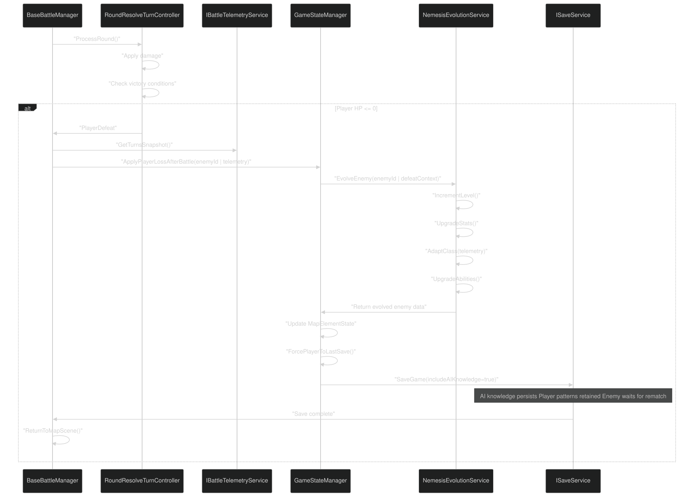

# Nemesis System

<details>
<summary>Relevant source files</summary>


- [Carnage_Club_AI_Architecture_EN.md](https://github.com/Wolfs0ng/CarnageClub/blob/0021fcdc/Carnage_Club_AI_Architecture_EN.md)
- [Carnage_Club_AI_Architecture_UA.md](https://github.com/Wolfs0ng/CarnageClub/blob/0021fcdc/Carnage_Club_AI_Architecture_UA.md)
- [Diagrams/0_Runtime Sequence.md](https://github.com/Wolfs0ng/CarnageClub/blob/0021fcdc/Diagrams/0_Runtime Sequence.md)
- [Diagrams/10_Emotion_System.md](https://github.com/Wolfs0ng/CarnageClub/blob/0021fcdc/Diagrams/10_Emotion_System.md)
- [Diagrams/1_Telemetry_Data_Model.md](https://github.com/Wolfs0ng/CarnageClub/blob/0021fcdc/Diagrams/1_Telemetry_Data_Model.md)
- [Diagrams/2_Knowledge_1.md](https://github.com/Wolfs0ng/CarnageClub/blob/0021fcdc/Diagrams/2_Knowledge_1.md)
- [Diagrams/3_Knowledge_2.md](https://github.com/Wolfs0ng/CarnageClub/blob/0021fcdc/Diagrams/3_Knowledge_2.md)
- [Diagrams/4_Decision.md](https://github.com/Wolfs0ng/CarnageClub/blob/0021fcdc/Diagrams/4_Decision.md)
- [GDD_EN.md](https://github.com/Wolfs0ng/CarnageClub/blob/0021fcdc/GDD_EN.md)
- [GDD_UA.md](https://github.com/Wolfs0ng/CarnageClub/blob/0021fcdc/GDD_UA.md)
- [README.md](https://github.com/Wolfs0ng/CarnageClub/blob/0021fcdc/README.md)


</details>

## Purpose and Scope

This document describes the Nemesis System - a core gameplay mechanic that transforms enemy encounters into persistent rivalries. When an enemy defeats the player, that enemy evolves: gaining levels, adapting their class, upgrading stats and abilities, and crucially, retaining all learned AI knowledge about the player's combat patterns .

For information about:

- [Layers 1-2: Knowledge Systems](#3.3)How AI learns player behavior, see
- [Battle Flow & Turn Management](#5.1)Battle outcome processing, see
- [Character Progression](#8.2)Character stats and progression, see
- [Save & Load System](#4.3)Save/load mechanics, see


Sources:  [GDD_EN.md #266-272](https://github.com/Wolfs0ng/CarnageClub/blob/0021fcdc/GDD_EN.md#L266-L272)  [GDD_UA.md #259-265](https://github.com/Wolfs0ng/CarnageClub/blob/0021fcdc/GDD_UA.md#L259-L265)  [README.md #34-36](https://github.com/Wolfs0ng/CarnageClub/blob/0021fcdc/README.md#L34-L36)

## Core Concept: "The World Remembers Your Habits"

The Nemesis System implements the game's foundational promise: enemies learn from you and grow stronger through conflict . Unlike traditional games where death is a simple reload, Carnage Club creates a persistent narrative of rivalry. Each defeat becomes a story beat where your opponent:

This creates a psychological loop: the player must adapt to an enemy that has already adapted to them.

Sources:  [GDD_EN.md #11-27](https://github.com/Wolfs0ng/CarnageClub/blob/0021fcdc/GDD_EN.md#L11-L27)  [Carnage_Club_AI_Architecture_EN.md #9-10](https://github.com/Wolfs0ng/CarnageClub/blob/0021fcdc/Carnage_Club_AI_Architecture_EN.md#L9-L10)

## Battle Outcome Flow with Nemesis Trigger



Sources:  [GDD_EN.md #266-272](https://github.com/Wolfs0ng/CarnageClub/blob/0021fcdc/GDD_EN.md#L266-L272) Diagram analysis from high-level architecture

## Evolution Mechanics

### Level and Stat Progression

When an enemy defeats the player, their core attributes increase:

The Focus stat is particularly important in the Nemesis context - evolved enemies learn even faster, making subsequent defeats more likely if the player doesn't adapt.

Sources:  [GDD_EN.md #109-119](https://github.com/Wolfs0ng/CarnageClub/blob/0021fcdc/GDD_EN.md#L109-L119)  [GDD_UA.md #109-119](https://github.com/Wolfs0ng/CarnageClub/blob/0021fcdc/GDD_UA.md#L109-L119)

## Class Adaptation System

### Adaptive Class Evolution

The enemy's class can change based on how the player defeated themselves (their own tactical weaknesses):



Note: Class adaptation is currently in design phase. The system will analyze the `BattleTurnTelemetry` history to determine the player's tactical approach and evolve the enemy to counter it.

Sources:  [GDD_EN.md #266-272](https://github.com/Wolfs0ng/CarnageClub/blob/0021fcdc/GDD_EN.md#L266-L272)

## Ability and Perk Upgrades

### Perk Evolution

Existing perks become more powerful:

### New Ability Acquisition

Evolved enemies can gain entirely new abilities based on the player's weaknesses:



Sources:  [GDD_EN.md #134-150](https://github.com/Wolfs0ng/CarnageClub/blob/0021fcdc/GDD_EN.md#L134-L150)  [GDD_UA.md #134-147](https://github.com/Wolfs0ng/CarnageClub/blob/0021fcdc/GDD_UA.md#L134-L147)

## AI Knowledge Persistence: The Critical Advantage

### Why Knowledge Persistence Matters

This is the most important aspect of the Nemesis System. When the player respawns for a rematch:

❌ What DOES NOT Reset:

- `PlayerBattleBehaviourKnowledge`- all learned attack/defense patterns, bigrams, trigrams
- `AiReactionKnowledge`- complete 4×16 action-reaction matrices
- `AiBanditStatsManager`- prior statistics for Thompson Sampling
- Direction usage frequencies
- Pattern masks effectiveness data


✅ What DOES Reset:

- `EmotionManager`state (Aggression, Fear, Confidence)
- `AiExplorationBudget`contextual state
- Battle-specific telemetry records
- Turn-by-turn tactical state




Sources:  [Carnage_Club_AI_Architecture_EN.md #327-341](https://github.com/Wolfs0ng/CarnageClub/blob/0021fcdc/Carnage_Club_AI_Architecture_EN.md#L327-L341)  [Carnage_Club_AI_Architecture_UA.md #299-311](https://github.com/Wolfs0ng/CarnageClub/blob/0021fcdc/Carnage_Club_AI_Architecture_UA.md#L299-L311)

## Integration with Core Systems

### GameStateManager Integration

The `GameStateManager` orchestrates the Nemesis flow:

On Player Defeat:

```block
GameStateManager.ApplyPlayerLossAfterBattle()├── Record defeat context (enemy ID, location, telemetry summary)├── Trigger NemesisEvolutionService.EvolveEnemy(enemyId, defeatContext)├── Save evolved enemy state to CurrentMapState├── Force player position to LastSavePosition└── Save game state (preserves AI knowledge)
```

Key Methods (conceptual):

- `GameStateManager.ApplyPlayerLossAfterBattle()`- entry point
- `NemesisEvolutionService.EvolveEnemy(enemyId, defeatContext)`- applies evolution
- `GameStateManager.ForcePlayerToLastSave()`- respawn logic


Sources: High-level architecture diagram "Game Flow - From Menu to Battle to Map"

### Battle System Integration

The `BattleManager` detects defeat conditions and triggers the Nemesis flow:



Sources: Diagram analysis from high-level architecture

### Map System Integration

The evolved enemy remains at the original encounter location:

Map Element State After Evolution:

The player respawns at the last `BoneFire` save point and must navigate back to face the evolved enemy.

Sources: Related to MapElementState structure from context

## The Player Experience Flow

### First Encounter → Defeat → Rematch



Sources: Conceptual flow based on game design documents

## Data Model and Persistence

### Nemesis Evolution Data Structure

Conceptual structure (not yet implemented in provided files):

```block
EnemyNemesisData {    enemyId: string    baseLevel: int    currentLevel: int    evolutionCount: int    playerDefeats: int        statModifiers: {        strength: int        fortitude: int        mastery: int        focus: int    }        classEvolution: {        originalClass: string        currentClass: string        adaptationReason: string    }        abilityUpgrades: [        { abilityId: string, level: int }    ]        newAbilities: [        { abilityId: string, acquisitionRound: int }    ]        lastDefeatContext: {        playerLevel: int        turnCount: int        primaryDamageType: string        playerWeaknesses: [string]    }}
```

This data would be stored in `SaveData` alongside `PlayerBattleBehaviourData` and `AiReactionKnowledgeData` .

Sources: Conceptual design based on save system architecture

### Save Data Integration

The Nemesis evolution state is saved with AI knowledge:



Sources:  [Diagram 4 #NaN-NaN](https://github.com/Wolfs0ng/CarnageClub/blob/0021fcdc/Diagram 4#LNaN-LNaN)

## Implementation Status

### Currently Implemented (from provided files)

✅ Foundation Systems:

- Battle defeat detection and outcome handling
- Save/load system with AI knowledge persistence
- GameStateManager player respawn to last save
- Map element state tracking


✅ AI Knowledge Persistence:

- `PlayerBattleBehaviourKnowledge`saves/loads correctly
- `AiReactionKnowledge`saves/loads correctly
- Knowledge systems continue learning across sessions


### In Design/Planning Phase

🔄 Evolution Mechanics:

- Automatic level/stat increases on defeat
- Class adaptation based on defeat context
- Ability and perk upgrade system
- Nemesis-specific data structures


🔄 UI/UX:

- Defeat screen showing enemy evolution
- Nemesis indicator on map elements
- Evolution details display
- Rivalry narrative text


🔄 Balance Systems:

- Evolution scaling formulas
- Maximum evolution caps
- Player catch-up mechanics
- Difficulty curve tuning


Sources:  [GDD_EN.md #266-272](https://github.com/Wolfs0ng/CarnageClub/blob/0021fcdc/GDD_EN.md#L266-L272)  [GDD_UA.md #259-265](https://github.com/Wolfs0ng/CarnageClub/blob/0021fcdc/GDD_UA.md#L259-L265)

## Design Considerations

### Balance Challenges

Problem: If enemies evolve too quickly, the game becomes unwinnable.

Solutions:

### Focus Stat Interaction

The player's Focus stat becomes critically important in Nemesis encounters:

This creates a strategic choice: invest in Focus to reduce Nemesis advantage, or invest in other stats for immediate combat power.

Sources:  [GDD_EN.md #117](https://github.com/Wolfs0ng/CarnageClub/blob/0021fcdc/GDD_EN.md#L117-L117)  [GDD_UA.md #118](https://github.com/Wolfs0ng/CarnageClub/blob/0021fcdc/GDD_UA.md#L118-L118)

## Future Enhancements

### Potential Extensions

### Integration with Emotion System

Evolved enemies could have persistent emotional baselines:

```block
NemesisEmotionProfile {    baseAggression: 0.7  // More aggressive after victory    baseFear: 0.2        // Less cautious    baseConfidence: 0.8  // More confident in learned patterns}
```

This would make Nemesis encounters feel distinct even at the emotion layer.

Sources:  [Carnage_Club_AI_Architecture_EN.md #236-295](https://github.com/Wolfs0ng/CarnageClub/blob/0021fcdc/Carnage_Club_AI_Architecture_EN.md#L236-L295)

## Summary

The Nemesis System transforms combat defeats into meaningful narrative beats by:

This system implements the core promise: "The world remembers your habits." Every defeat becomes a lesson for your enemies, forcing you to adapt or face increasingly impossible odds.

The brilliance of the design is that it leverages the already-implemented AI knowledge systems - the same `PlayerBattleBehaviourKnowledge` and `AiReactionKnowledge` that make enemies intelligent now become permanent advantages when combined with mechanical evolution.

Sources:  [README.md #34-36](https://github.com/Wolfs0ng/CarnageClub/blob/0021fcdc/README.md#L34-L36)  [GDD_EN.md #11-272](https://github.com/Wolfs0ng/CarnageClub/blob/0021fcdc/GDD_EN.md#L11-L272)  [Carnage_Club_AI_Architecture_EN.md #9-10](https://github.com/Wolfs0ng/CarnageClub/blob/0021fcdc/Carnage_Club_AI_Architecture_EN.md#L9-L10)