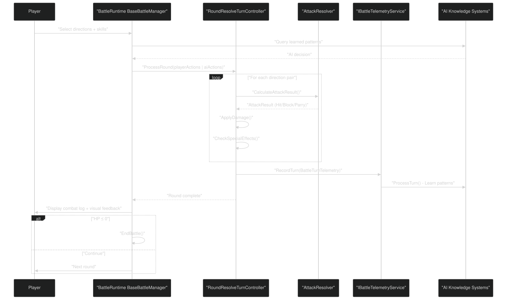

# Gameplay Mechanics

Relevant source files

- [GDD_EN.md](https://github.com/Wolfs0ng/CarnageClub/blob/0021fcdc/GDD_EN.md)
- [GDD_UA.md](https://github.com/Wolfs0ng/CarnageClub/blob/0021fcdc/GDD_UA.md)
- [README.md](https://github.com/Wolfs0ng/CarnageClub/blob/0021fcdc/README.md)

## Purpose and Scope

This document provides a comprehensive overview of the gameplay mechanics that define Carnage Club as a tactical duel-based combat game. It covers the core combat system, character progression mechanics, and the Nemesis System that drives player-enemy rivalry.

For implementation details of how these mechanics are executed in code:

- [5](#5)Combat resolution and damage calculation: see Battle System
- [3](#3)AI decision-making based on combat data: see AI System
- [4.1](#4.1)Player state management and persistence: see Game State Manager

This document focuses on the game design layer —the rules and mechanics that players interact with—rather than the code architecture that implements them.

## Combat System Overview

Carnage Club uses a 4-direction turn-based duel system where players and AI opponents simultaneously select attack and defense directions. The core principle is: the enemy does not attack randomly—it thinks, plans, tests, and remembers .

### Direction System

The combat system revolves around four directional zones:

Players can select:

- 1-4 attack directionssimultaneously
- 1-4 defense directionssimultaneously
- Skills and abilitiesusing Action Points

Direction System Representation

Sources: [GDD_EN.md #79-105](https://github.com/Wolfs0ng/CarnageClub/blob/0021fcdc/GDD_EN.md#L79-L105)  [GDD_UA.md #79-106](https://github.com/Wolfs0ng/CarnageClub/blob/0021fcdc/GDD_UA.md#L79-L106)

### Combat Outcomes

Each attack direction is resolved independently against each defense direction:

### Special Combat Effects

Combat Flow with AI Integration

Sources: [GDD_EN.md #79-105](https://github.com/Wolfs0ng/CarnageClub/blob/0021fcdc/GDD_EN.md#L79-L105)  [GDD_UA.md #79-106](https://github.com/Wolfs0ng/CarnageClub/blob/0021fcdc/GDD_UA.md#L79-L106)

## Character Stats and Progression

Character effectiveness is determined by four core stats that interact with both combat mechanics and AI behavior:

### Core Stats

Focus Stat: The AI Interface

`Focus` is the unique stat that creates a direct mechanical link between character progression and the AI system. Higher Focus values:

- Accelerate the player's ability to "read" enemy patterns
- Slow down the rate at which AI knowledge systems adapt to the player
- Create a gameplay loop where mental stat investment affects AI behavior

Stat Interaction Flow

Sources: [GDD_EN.md #108-120](https://github.com/Wolfs0ng/CarnageClub/blob/0021fcdc/GDD_EN.md#L108-L120)  [GDD_UA.md #108-118](https://github.com/Wolfs0ng/CarnageClub/blob/0021fcdc/GDD_UA.md#L108-L118)

### Skills System

Skills are active abilities that consume Action Points during combat:

Design Status : Skills are currently in design phase.

### Abilities System

Abilities provide passive bonuses or conditional triggers :
Passive Abilities
- Endurance: Increased HP pool
- Ambidexterity: Reduced penalties for off-hand weapons
- See Weak Spots: Increased critical hit chance

Triggered Abilities
- Cleave: Two-handed weapon bonus—unblocked head hit causes top-down directional damage
- Bestial Reaction: Convert HP damage to Guard damage when hitting a parry
- Mighty Blow: On Guard Break, overflow damage applies to HP

Design Status : Abilities are currently in design phase.

Sources: [GDD_EN.md #122-150](https://github.com/Wolfs0ng/CarnageClub/blob/0021fcdc/GDD_EN.md#L122-L150)  [GDD_UA.md #123-148](https://github.com/Wolfs0ng/CarnageClub/blob/0021fcdc/GDD_UA.md#L123-L148)

## Equipment and Inventory

The equipment system affects combat mechanics through weapon combinations and armor stats:

### Weapon Combinations

### Equipment Slots

Weapons :

- Left hand: One-handed or Two-handed weapon
- Right hand: One-handed weapon (weakened stats) or Shield

Armor :

- Helmet, Cloak, Body Armor, Gloves, Pants, Belt, Boots

Accessories :

- Amulet(s), Rings (2+)

### Quick Access Slots (Belt Items)

Items worn on the belt can be used during combat by spending Action Points:

- Potions: Healing, stamina restoration, status removal
- Grenades: Area damage, status effects
- Thrown Weapons: Ranged attacks
- Scrolls: Magical effects

Design Status : Inventory system is currently in design phase.

Sources: [GDD_EN.md #152-192](https://github.com/Wolfs0ng/CarnageClub/blob/0021fcdc/GDD_EN.md#L152-L192)  [GDD_UA.md #150-185](https://github.com/Wolfs0ng/CarnageClub/blob/0021fcdc/GDD_UA.md#L150-L185)

## The Nemesis System

The Nemesis System creates persistent enemy rivalry by evolving enemies that defeat the player.

### Evolution Mechanics

When an enemy kills the player:

Nemesis Evolution Flow

### Integration with AI Learning

The Nemesis System leverages the persistent AI knowledge layer:

This creates a unique dynamic: the world remembers your habits . An evolved enemy doesn't just have higher stats—it has a complete memory of how it defeated the player and can anticipate familiar patterns.

Code Integration Points

Sources: [GDD_EN.md #266-271](https://github.com/Wolfs0ng/CarnageClub/blob/0021fcdc/GDD_EN.md#L266-L271)  [GDD_UA.md #259-265](https://github.com/Wolfs0ng/CarnageClub/blob/0021fcdc/GDD_UA.md#L259-L265)  [README.md #34-36](https://github.com/Wolfs0ng/CarnageClub/blob/0021fcdc/README.md#L34-L36)

## Gameplay Loop: Mechanics in Action

The core gameplay loop integrates all mechanics into a cohesive experience:

Integration with Code Systems

Sources: [GDD_EN.md #16-28](https://github.com/Wolfs0ng/CarnageClub/blob/0021fcdc/GDD_EN.md#L16-L28)  [GDD_UA.md #16-28](https://github.com/Wolfs0ng/CarnageClub/blob/0021fcdc/GDD_UA.md#L16-L28)  [README.md #26-36](https://github.com/Wolfs0ng/CarnageClub/blob/0021fcdc/README.md#L26-L36)

## Design Philosophy: Mechanics Over Randomness

Carnage Club's mechanics are designed around a core principle: enemies think, plan, test, and remember . This philosophy manifests in:

- No Random Attacks: AI decisions are based on learned patterns and tactical evaluation
- Explainable Outcomes: Every combat result has a clear cause (direction mismatch, stat difference, special effect trigger)
- Persistent Learning: Player habits affect AI behavior across all sessions
- Stat-Based Strategy: Focus stat creates mechanical link between character progression and AI behavior
- Meaningful Consequences: Defeat leads to enemy evolution, not simple retry

This design ensures that player skill, pattern recognition, and strategic thinking matter more than luck or grinding.

Sources: [GDD_EN.md #79-105](https://github.com/Wolfs0ng/CarnageClub/blob/0021fcdc/GDD_EN.md#L79-L105)  [GDD_UA.md #79-106](https://github.com/Wolfs0ng/CarnageClub/blob/0021fcdc/GDD_UA.md#L79-L106)  [README.md #34-36](https://github.com/Wolfs0ng/CarnageClub/blob/0021fcdc/README.md#L34-L36)