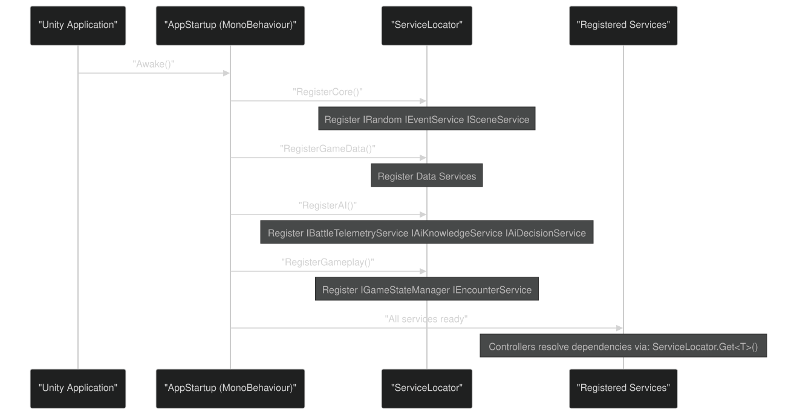

# Coding Standards & Patterns

<details>
<summary>Relevant source files</summary>


- [CarnageClub/.aiassistant/rules/AI_INSTRUCTIONS.md](https://github.com/Wolfs0ng/CarnageClub/blob/0021fcdc/CarnageClub/.aiassistant/rules/AI_INSTRUCTIONS.md)
- [CarnageClub/.aiassistant/rules/context/AI_SYSTEMS.md](https://github.com/Wolfs0ng/CarnageClub/blob/0021fcdc/CarnageClub/.aiassistant/rules/context/AI_SYSTEMS.md)
- [CarnageClub/.aiassistant/rules/context/ARCHITECTURE.md](https://github.com/Wolfs0ng/CarnageClub/blob/0021fcdc/CarnageClub/.aiassistant/rules/context/ARCHITECTURE.md)
- [CarnageClub/.aiassistant/rules/context/CODING_STANDARDS.md](https://github.com/Wolfs0ng/CarnageClub/blob/0021fcdc/CarnageClub/.aiassistant/rules/context/CODING_STANDARDS.md)
- [CarnageClub/.aiassistant/rules/context/CONTEXT_INDEX.md](https://github.com/Wolfs0ng/CarnageClub/blob/0021fcdc/CarnageClub/.aiassistant/rules/context/CONTEXT_INDEX.md)
- [CarnageClub/.aiassistant/rules/context/GAMEPLAY_RULES.md](https://github.com/Wolfs0ng/CarnageClub/blob/0021fcdc/CarnageClub/.aiassistant/rules/context/GAMEPLAY_RULES.md)
- [CarnageClub/.aiassistant/rules/context/PROJECT_OVERVIEW.md](https://github.com/Wolfs0ng/CarnageClub/blob/0021fcdc/CarnageClub/.aiassistant/rules/context/PROJECT_OVERVIEW.md)
- [CarnageClub/.aiassistant/rules/context/TELEMETRY.md](https://github.com/Wolfs0ng/CarnageClub/blob/0021fcdc/CarnageClub/.aiassistant/rules/context/TELEMETRY.md)


</details>

Purpose : This document defines the strict coding standards, architectural patterns, and design principles enforced across the Carnage Club codebase. It serves as the authoritative guide for writing, reviewing, and refactoring code to ensure consistency, maintainability, and debuggability.

Scope : Covers forbidden patterns, required practices, naming conventions, architectural layering, and performance guidelines. For AI-specific architecture, see [AI Architecture Overview](#3.1) . For testing and debugging practices, see [Testing & Debugging AI Systems](#9.2) .

## Core Philosophy: Solo-Developer Mindset

The entire codebase is designed around the principle that one developer must understand any code in 10 seconds . Every architectural decision prioritizes:

This philosophy drives all coding standards and patterns in this document.

Sources : [.aiassistant/rules/AI_INSTRUCTIONS.md #34-43](https://github.com/Wolfs0ng/CarnageClub/blob/0021fcdc/.aiassistant/rules/AI_INSTRUCTIONS.md#L34-L43)  [.aiassistant/rules/AI_INSTRUCTIONS.md #70-72](https://github.com/Wolfs0ng/CarnageClub/blob/0021fcdc/.aiassistant/rules/AI_INSTRUCTIONS.md#L70-L72)  [.aiassistant/rules/AI_INSTRUCTIONS.md #150-157](https://github.com/Wolfs0ng/CarnageClub/blob/0021fcdc/.aiassistant/rules/AI_INSTRUCTIONS.md#L150-L157)

## Forbidden Patterns

The following patterns are strictly prohibited in the codebase. Any code review that identifies these patterns should result in an immediate refactor request.

### Optional Parameters

Forbidden : Methods with optional parameters, default values, or null defaults.

```block
// ❌ FORBIDDENvoid DoSomething(int value, bool flag = false, string name = null) { }
```

Reason : Optional parameters create ambiguity about method intent and hide complexity. They make it impossible to understand what a method does without reading its implementation.

Required Alternative : Create separate, explicitly named methods.

```block
// ✅ REQUIREDvoid DoSomething(int value) { }void DoSomethingWithFlag(int value, bool flag) { }void DoSomethingWithName(int value, string name) { }
```

### Boolean Flags Changing Method Meaning

Forbidden : Boolean parameters that fundamentally change what a method does.

```block
// ❌ FORBIDDENvoid ProcessData(Data data, bool aggressive) { }void Save(SaveData data, bool includeAI = false) { }
```

Reason : The method name no longer describes what it does. Readers must mentally branch on every call site.

Required Alternative : Separate methods with descriptive names.

```block
// ✅ REQUIREDvoid ProcessDataNormally(Data data) { }void ProcessDataAggressively(Data data) { } void SaveGameState(SaveData data) { }void SaveGameStateWithAI(SaveData data) { }
```

### God Classes

Forbidden : Classes with more than 3-4 responsibilities or that orchestrate unrelated systems.

Reason : God classes become unmaintainable and create bottlenecks for understanding the codebase.

Required Alternative : Split into focused services with single responsibilities. See `GameStateManager` as an example of a well-scoped coordinator - it manages state but delegates save/load, event broadcasting, and validation to separate services.

### Hidden Side Effects

Forbidden : Methods that modify state without declaring it in their signature or name.

```block
// ❌ FORBIDDENPlayerState GetPlayerState() {    _lastAccessTime = Time.time; // Hidden side effect    return _state;}
```

Reason : Side effects break the principle that method names should describe what they do.

Required Alternative : Make side effects explicit in method naming or separate them.

```block
// ✅ REQUIREDPlayerState GetPlayerState() { return _state; }void RecordPlayerStateAccess() { _lastAccessTime = Time.time; }
```

Sources : [.aiassistant/rules/AI_INSTRUCTIONS.md #106-120](https://github.com/Wolfs0ng/CarnageClub/blob/0021fcdc/.aiassistant/rules/AI_INSTRUCTIONS.md#L106-L120)  [.aiassistant/rules/context/CODING_STANDARDS.md #15-20](https://github.com/Wolfs0ng/CarnageClub/blob/0021fcdc/.aiassistant/rules/context/CODING_STANDARDS.md#L15-L20)

## Required Practices

### Explicit Data Models

Rule : If something is optional, model it explicitly using a dedicated type or discriminated union pattern.

```block
// ✅ GOOD: Explicit optional datapublic struct OptionalBehaviorData{    public bool HasData;    public BehaviorData Data;        public static OptionalBehaviorData None() => new() { HasData = false };    public static OptionalBehaviorData Some(BehaviorData data) => new() { HasData = true, Data = data };}
```

Example from codebase : `MapElementState` explicitly models optional `BehaviorData` through nullable reference types and validation guards.

### Single Responsibility Methods

Rule : Each method should do exactly one thing, described completely by its name.

Example from codebase :

- `RoundResolveTurnController.ExecuteTurn()`[CarnageClub/Assets/_Scripts/Battle/Controllers/Turns/RoundResolveTurnController.cs#25-30](https://github.com/Wolfs0ng/CarnageClub/blob/0021fcdc/CarnageClub/Assets/_Scripts/Battle/Controllers/Turns/RoundResolveTurnController.cs#L25-L30)orchestrates the turn
- `AttackResolver.Resolve()`[CarnageClub/Assets/_Scripts/Battle/Combat/AttackResolver.cs#15-25](https://github.com/Wolfs0ng/CarnageClub/blob/0021fcdc/CarnageClub/Assets/_Scripts/Battle/Combat/AttackResolver.cs#L15-L25)resolves one attack
- `AttackApplierHelper.ApplyHit()`[CarnageClub/Assets/_Scripts/Battle/Combat/AttackApplierHelper.cs](https://github.com/Wolfs0ng/CarnageClub/blob/0021fcdc/CarnageClub/Assets/_Scripts/Battle/Combat/AttackApplierHelper.cs)applies damage


Each method has a single, clear responsibility.

### Guard Clauses

Rule : Validate inputs immediately at method entry. Fail fast with clear exceptions.

```block
// ✅ REQUIRED PATTERNpublic void ProcessBattleTurn(BattleTurnTelemetry telemetry){    if (telemetry == null)        throw new ArgumentNullException(nameof(telemetry));        if (telemetry.PlayerActions == null)        throw new ArgumentException("PlayerActions cannot be null", nameof(telemetry));            // Main logic here}
```

Reason : Guard clauses prevent invalid states from propagating through the system and make debugging immediate.

### One Class Per File

Rule : Each file contains exactly one `class` , `struct` , `enum` , or `interface` . Nested types are forbidden.

File naming : The file name must exactly match the type name: `PlayerState.cs` contains `PlayerState` class.

Reason : Eliminates "where is this type defined?" questions. Enforces discoverability.

Sources : [.aiassistant/rules/AI_INSTRUCTIONS.md #111](https://github.com/Wolfs0ng/CarnageClub/blob/0021fcdc/.aiassistant/rules/AI_INSTRUCTIONS.md#L111-L111)  [.aiassistant/rules/context/CODING_STANDARDS.md #8-11](https://github.com/Wolfs0ng/CarnageClub/blob/0021fcdc/.aiassistant/rules/context/CODING_STANDARDS.md#L8-L11)  [.aiassistant/rules/context/CODING_STANDARDS.md #23-27](https://github.com/Wolfs0ng/CarnageClub/blob/0021fcdc/.aiassistant/rules/context/CODING_STANDARDS.md#L23-L27)

## Naming Conventions

Unity-specific : Serialized fields use `camelCase` without underscore, as Unity Inspector displays them.

Sources : [.aiassistant/rules/context/CODING_STANDARDS.md #8-12](https://github.com/Wolfs0ng/CarnageClub/blob/0021fcdc/.aiassistant/rules/context/CODING_STANDARDS.md#L8-L12)

## Architectural Patterns

### Layered Architecture Overview

The codebase follows a service-oriented architecture with strict layering. Each layer has specific responsibilities and may only depend on layers below it.



Key Principle : Data flows unidirectionally down the layers. Higher layers may read from lower layers but may only mutate through services.

Sources : [.aiassistant/rules/context/ARCHITECTURE.md #27-34](https://github.com/Wolfs0ng/CarnageClub/blob/0021fcdc/.aiassistant/rules/context/ARCHITECTURE.md#L27-L34)

### DTO vs Runtime State Separation

One of the most critical patterns in the codebase is the strict separation between Data Transfer Objects (DTOs) used for persistence and Runtime State objects used during gameplay.



Rules :

Example : `GameStateManager` maintains `GameSessionState` for runtime, but saves/loads through `SaveData` via builder/restorer pattern.

Sources : [.aiassistant/rules/context/ARCHITECTURE.md #28-30](https://github.com/Wolfs0ng/CarnageClub/blob/0021fcdc/.aiassistant/rules/context/ARCHITECTURE.md#L28-L30)  [.aiassistant/rules/context/ARCHITECTURE.md #34](https://github.com/Wolfs0ng/CarnageClub/blob/0021fcdc/.aiassistant/rules/context/ARCHITECTURE.md#L34-L34)

### Service Registration Pattern

All services are registered through `ServiceLocator` during application startup. This provides dependency injection without heavyweight frameworks.



Pattern :

- plain C# classesServices are (not MonoBehaviours)
- statelessServices are or manage isolated state
- Services are registered once at startup
- `ServiceLocator.Get<IServiceInterface>()`Controllers resolve dependencies via


Example Service Registration  [CarnageClub/Assets/_Scripts/Core/AppStartup.cs](https://github.com/Wolfs0ng/CarnageClub/blob/0021fcdc/CarnageClub/Assets/_Scripts/Core/AppStartup.cs) :

```block
private void RegisterAI(){    ServiceLocator.Register<IBattleTelemetryService>(new BattleTelemetryService());    ServiceLocator.Register<IAiKnowledgeService>(new AiKnowledgeService());    ServiceLocator.Register<IAiDecisionService>(new AiDecisionService());}
```

Sources : [.aiassistant/rules/context/ARCHITECTURE.md #20-24](https://github.com/Wolfs0ng/CarnageClub/blob/0021fcdc/.aiassistant/rules/context/ARCHITECTURE.md#L20-L24)  [.aiassistant/rules/context/ARCHITECTURE.md #7-18](https://github.com/Wolfs0ng/CarnageClub/blob/0021fcdc/.aiassistant/rules/context/ARCHITECTURE.md#L7-L18)

### Unidirectional Data Flow

The codebase enforces strict unidirectional data flow to prevent circular dependencies and hidden state mutations.



Rules :

This pattern is most visible in the AI system but applies globally. See [Layer 0: Telemetry System](#3.2) and [AI Architecture Overview](#3.1) for detailed examples.

Sources : [.aiassistant/rules/context/TELEMETRY.md #18-23](https://github.com/Wolfs0ng/CarnageClub/blob/0021fcdc/.aiassistant/rules/context/TELEMETRY.md#L18-L23)  [.aiassistant/rules/context/ARCHITECTURE.md #34](https://github.com/Wolfs0ng/CarnageClub/blob/0021fcdc/.aiassistant/rules/context/ARCHITECTURE.md#L34-L34)

## Performance Guidelines

### No Allocations in Hot Paths

Rule : Combat loops, AI decision loops, and per-frame updates must not allocate memory.

Techniques :

- `Awake()``Start()`Cache component references in or
- `HintUIController`Use object pooling for UI elements (see )
- `struct``AttackDirections``DamageResult`Prefer for hot data (e.g., , )
- Avoid LINQ in hot paths - use explicit loops


Example from codebase : `AttackResolver` uses cached references and struct return values [CarnageClub/Assets/_Scripts/Battle/Combat/AttackResolver.cs](https://github.com/Wolfs0ng/CarnageClub/blob/0021fcdc/CarnageClub/Assets/_Scripts/Battle/Combat/AttackResolver.cs)

### Prefer Structs for Hot Data

Rule : Use `struct` for data that is:

- Created/destroyed frequently
- Small (< 16 bytes recommended, < 64 bytes acceptable)
- Immutable or rarely mutated


Examples :

- `AttackDirections`- combat data created every turn
- `MapPositionState`- position queries happen constantly
- `DamageResult`- returned from attack resolution


Caution : Structs are copied by value. Never use large structs or structs with reference fields in hot paths.

### Cache Components

Rule : Resolve Unity components and services once during initialization.

```block
// ✅ GOODprivate IEventService _eventService;private Transform _playerTransform; private void Awake(){    _eventService = ServiceLocator.Get<IEventService>();    _playerTransform = player.transform;} // ❌ BADprivate void Update(){    var eventService = ServiceLocator.Get<IEventService>(); // Allocation!    var transform = player.transform; // Component lookup!}
```

Sources : [.aiassistant/rules/context/CODING_STANDARDS.md #29-35](https://github.com/Wolfs0ng/CarnageClub/blob/0021fcdc/.aiassistant/rules/context/CODING_STANDARDS.md#L29-L35)

## The 10-Second Comprehension Rule

Rule : Any developer (including future you) should understand what a piece of code does within 10 seconds of opening the file.

### How to Achieve This

### Testing the Rule

Before committing code, ask:

- Can I explain this class's purpose in one sentence?
- Can I explain this method's purpose without reading its implementation?
- If I open this file in 6 months, will I immediately understand it?


If the answer is "no", refactor.

Sources : [.aiassistant/rules/AI_INSTRUCTIONS.md #150-157](https://github.com/Wolfs0ng/CarnageClub/blob/0021fcdc/.aiassistant/rules/AI_INSTRUCTIONS.md#L150-L157)  [.aiassistant/rules/AI_INSTRUCTIONS.md #34-43](https://github.com/Wolfs0ng/CarnageClub/blob/0021fcdc/.aiassistant/rules/AI_INSTRUCTIONS.md#L34-L43)

## Decision Flowchart: Adding New Code

Use this flowchart when deciding how to structure new code:



Sources : [.aiassistant/rules/context/ARCHITECTURE.md #7-34](https://github.com/Wolfs0ng/CarnageClub/blob/0021fcdc/.aiassistant/rules/context/ARCHITECTURE.md#L7-L34)

## Examples from Codebase

### Example 1: Explicit Separation (GameStateManager)

`GameStateManager` demonstrates proper separation of concerns:

- Internal state`GameSessionState _sessionState`: (mutable, private)
- Public API: Readonly properties and explicit mutation methods
- Persistence`GameStateSaveBuilder``GameStateSaveRestorer`: Separate and classes
- No god class`ISaveService``IEventService`: Delegates save I/O to , events to


[CarnageClub/Assets/_Scripts/Core/GameState/GameStateManager.cs](https://github.com/Wolfs0ng/CarnageClub/blob/0021fcdc/CarnageClub/Assets/_Scripts/Core/GameState/GameStateManager.cs)

### Example 2: Single Responsibility (Attack Resolution)

Attack resolution is split into focused classes:

Each class has exactly one responsibility, making testing and debugging trivial.

### Example 3: Explicit Data Models (MapElementState)

`MapElementState` explicitly models all optional data:

```block
// From MapElementStatepublic string? BehaviorData { get; private set; } // Nullable, explicitpublic bool IsAccessible { get; private set; }    // Boolean propertypublic List<MapElementId> Neighbors { get; }      // Never null, explicit list
```

No optional parameters, no hidden state. Everything is explicit and queryable.

[CarnageClub/Assets/_Scripts/Map/State/MapElementState.cs](https://github.com/Wolfs0ng/CarnageClub/blob/0021fcdc/CarnageClub/Assets/_Scripts/Map/State/MapElementState.cs)

### Example 4: Guard Clauses (BattleTelemetryService)

`BattleTelemetryService.RecordTurn()` validates all inputs immediately:

```block
public void RecordTurn(BattleTurnTelemetry telemetry){    if (telemetry == null)        throw new ArgumentNullException(nameof(telemetry));            // Validation continues for each field    // Only then proceeds with recording}
```

Failures happen immediately with clear error messages, not deep in the call stack.

[CarnageClub/Assets/_Scripts/AI/Telemetry/BattleTelemetryService.cs](https://github.com/Wolfs0ng/CarnageClub/blob/0021fcdc/CarnageClub/Assets/_Scripts/AI/Telemetry/BattleTelemetryService.cs)

Sources : Multiple files cited in examples above

## Summary Table

Sources : [.aiassistant/rules/AI_INSTRUCTIONS.md #104-120](https://github.com/Wolfs0ng/CarnageClub/blob/0021fcdc/.aiassistant/rules/AI_INSTRUCTIONS.md#L104-L120)  [.aiassistant/rules/context/CODING_STANDARDS.md](https://github.com/Wolfs0ng/CarnageClub/blob/0021fcdc/.aiassistant/rules/context/CODING_STANDARDS.md)  [.aiassistant/rules/context/ARCHITECTURE.md](https://github.com/Wolfs0ng/CarnageClub/blob/0021fcdc/.aiassistant/rules/context/ARCHITECTURE.md)