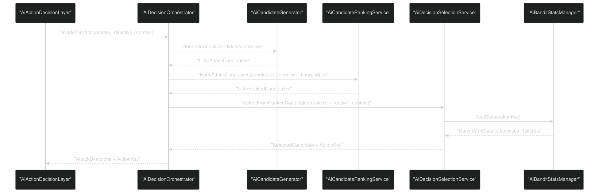

# Testing & Debugging AI Systems

<details>
<summary>Relevant source files</summary>


- [CarnageClub/.aiassistant/rules/AI_INSTRUCTIONS.md](https://github.com/Wolfs0ng/CarnageClub/blob/0021fcdc/CarnageClub/.aiassistant/rules/AI_INSTRUCTIONS.md)
- [CarnageClub/.aiassistant/rules/context/AI_SYSTEMS.md](https://github.com/Wolfs0ng/CarnageClub/blob/0021fcdc/CarnageClub/.aiassistant/rules/context/AI_SYSTEMS.md)
- [CarnageClub/.aiassistant/rules/context/ARCHITECTURE.md](https://github.com/Wolfs0ng/CarnageClub/blob/0021fcdc/CarnageClub/.aiassistant/rules/context/ARCHITECTURE.md)
- [CarnageClub/.aiassistant/rules/context/CODING_STANDARDS.md](https://github.com/Wolfs0ng/CarnageClub/blob/0021fcdc/CarnageClub/.aiassistant/rules/context/CODING_STANDARDS.md)
- [CarnageClub/.aiassistant/rules/context/CONTEXT_INDEX.md](https://github.com/Wolfs0ng/CarnageClub/blob/0021fcdc/CarnageClub/.aiassistant/rules/context/CONTEXT_INDEX.md)
- [CarnageClub/.aiassistant/rules/context/GAMEPLAY_RULES.md](https://github.com/Wolfs0ng/CarnageClub/blob/0021fcdc/CarnageClub/.aiassistant/rules/context/GAMEPLAY_RULES.md)
- [CarnageClub/.aiassistant/rules/context/PROJECT_OVERVIEW.md](https://github.com/Wolfs0ng/CarnageClub/blob/0021fcdc/CarnageClub/.aiassistant/rules/context/PROJECT_OVERVIEW.md)
- [CarnageClub/.aiassistant/rules/context/TELEMETRY.md](https://github.com/Wolfs0ng/CarnageClub/blob/0021fcdc/CarnageClub/.aiassistant/rules/context/TELEMETRY.md)
- [Carnage_Club_AI_Architecture_EN.md](https://github.com/Wolfs0ng/CarnageClub/blob/0021fcdc/Carnage_Club_AI_Architecture_EN.md)
- [Carnage_Club_AI_Architecture_UA.md](https://github.com/Wolfs0ng/CarnageClub/blob/0021fcdc/Carnage_Club_AI_Architecture_UA.md)
- [Diagrams/0_Runtime Sequence.md](https://github.com/Wolfs0ng/CarnageClub/blob/0021fcdc/Diagrams/0_Runtime Sequence.md)
- [Diagrams/10_Emotion_System.md](https://github.com/Wolfs0ng/CarnageClub/blob/0021fcdc/Diagrams/10_Emotion_System.md)
- [Diagrams/1_Telemetry_Data_Model.md](https://github.com/Wolfs0ng/CarnageClub/blob/0021fcdc/Diagrams/1_Telemetry_Data_Model.md)
- [Diagrams/2_Knowledge_1.md](https://github.com/Wolfs0ng/CarnageClub/blob/0021fcdc/Diagrams/2_Knowledge_1.md)
- [Diagrams/3_Knowledge_2.md](https://github.com/Wolfs0ng/CarnageClub/blob/0021fcdc/Diagrams/3_Knowledge_2.md)
- [Diagrams/4_Decision.md](https://github.com/Wolfs0ng/CarnageClub/blob/0021fcdc/Diagrams/4_Decision.md)


</details>

## Purpose and Scope

This document explains how to test and debug the AI system in Carnage Club. The AI is designed with observability as a first-class requirement - every decision must be traceable through the 5-layer architecture (Telemetry → Knowledge → Tactical Decisions → Strategic Intent → Emotions). This page covers inspection tools, validation techniques, and debugging workflows for each layer.

For understanding the AI architecture itself, see [AI System](#3) . For extending AI capabilities while maintaining debuggability, see [Extending the AI System](#9.4) .

## Debugging Philosophy: Explainability by Design

The AI system follows a strict architectural principle: no black boxes . Every decision must be explainable through observable data structures. This is enforced through:

The rule is simple: If you can't trace why the AI did something, the architecture is broken.

Sources:  [CarnageClub/.aiassistant/rules/context/TELEMETRY.md #1-28](https://github.com/Wolfs0ng/CarnageClub/blob/0021fcdc/CarnageClub/.aiassistant/rules/context/TELEMETRY.md#L1-L28)  [CarnageClub/.aiassistant/rules/AI_INSTRUCTIONS.md #1-157](https://github.com/Wolfs0ng/CarnageClub/blob/0021fcdc/CarnageClub/.aiassistant/rules/AI_INSTRUCTIONS.md#L1-L157)  [Carnage_Club_AI_Architecture_EN.md #1-367](https://github.com/Wolfs0ng/CarnageClub/blob/0021fcdc/Carnage_Club_AI_Architecture_EN.md#L1-L367)

## Layer 0: Inspecting Telemetry (The Foundation)

### Telemetry as Ground Truth

`IBattleTelemetryService` is the single source of truth for all AI learning. It records:

- Player and AI actions (attack/defend directions)
- Per-direction outcomes (hit, block, parry, damage)
- Before/after snapshots (HP, Guard, etc.)


All debugging starts here. If telemetry is wrong, everything downstream is wrong.

### Core Inspection Classes



Sources:  [Diagrams/1_Telemetry_Data_Model.md #1-50](https://github.com/Wolfs0ng/CarnageClub/blob/0021fcdc/Diagrams/1_Telemetry_Data_Model.md#L1-L50)  [Carnage_Club_AI_Architecture_EN.md #74-124](https://github.com/Wolfs0ng/CarnageClub/blob/0021fcdc/Carnage_Club_AI_Architecture_EN.md#L74-L124)

### Telemetry Inspection Workflow
Step 1: Access the Telemetry Service
```block
var telemetryService = ServiceLocator.Instance.Get<IBattleTelemetryService>();var turns = telemetryService.GetTurnsSnapshot();
```

This returns a read-only snapshot of all recorded turns in the current battle.
Step 2: Inspect Turn Data
Each `BattleTurnTelemetry` contains:
Step 3: Use TelemetryPrettyPrinter
`TelemetryPrettyPrinter` formats telemetry into human-readable logs. It shows:

- Normalized direction lists
- Outcome breakdowns (hit/block/parry counts)
- HP and Guard damage totals
- Critical hits and guard breaks


Sources:  [Carnage_Club_AI_Architecture_EN.md #95-124](https://github.com/Wolfs0ng/CarnageClub/blob/0021fcdc/Carnage_Club_AI_Architecture_EN.md#L95-L124)  [Diagrams/1_Telemetry_Data_Model.md #1-50](https://github.com/Wolfs0ng/CarnageClub/blob/0021fcdc/Diagrams/1_Telemetry_Data_Model.md#L1-L50)

### Telemetry Validation Checklist

Validate telemetry integrity by checking:

- `BeginTurn`called before any recording
- Directions are normalized (sorted, distinct, no duplicates)
- `Outcomes`count matches total attack directions
- Each outcome includes defender's block directions
- Before/after snapshots show expected HP/Guard changes
- `CompleteTurn`finalizes the record


Common Issues:

- Duplicate directions:`TelemetryDirections.NormalizeToList()`Check is called
- Missing outcomes:`RecordResolutionOutcomes()`Verify called for both AI and Player attacks
- Mismatched snapshots:`CompleteTurn()`Ensure receives current state, not cached state


Sources:  [Carnage_Club_AI_Architecture_EN.md #95-124](https://github.com/Wolfs0ng/CarnageClub/blob/0021fcdc/Carnage_Club_AI_Architecture_EN.md#L95-L124)  [CarnageClub/.aiassistant/rules/context/TELEMETRY.md #1-28](https://github.com/Wolfs0ng/CarnageClub/blob/0021fcdc/CarnageClub/.aiassistant/rules/context/TELEMETRY.md#L1-L28)

## Layers 1-2: Validating Knowledge Systems

### Knowledge as Persistent Learning

Knowledge systems consume telemetry and maintain persistent state that survives across sessions. There are two knowledge systems:

Both implement `ProcessTurn(BattleTurnTelemetry)` to incrementally update from telemetry.

Sources:  [Carnage_Club_AI_Architecture_EN.md #126-180](https://github.com/Wolfs0ng/CarnageClub/blob/0021fcdc/Carnage_Club_AI_Architecture_EN.md#L126-L180)  [Diagrams/2_Knowledge_1.md #1-26](https://github.com/Wolfs0ng/CarnageClub/blob/0021fcdc/Diagrams/2_Knowledge_1.md#L1-L26)  [Diagrams/3_Knowledge_2.md #1-31](https://github.com/Wolfs0ng/CarnageClub/blob/0021fcdc/Diagrams/3_Knowledge_2.md#L1-L31)

### Inspecting Player Behavior Knowledge



Validation Steps:

Cold Start Behavior : All counters initialize to zero. Early decisions rely on fallback exploration until sufficient data accumulates.

Sources:  [Carnage_Club_AI_Architecture_EN.md #126-154](https://github.com/Wolfs0ng/CarnageClub/blob/0021fcdc/Carnage_Club_AI_Architecture_EN.md#L126-L154)  [Diagrams/2_Knowledge_1.md #1-26](https://github.com/Wolfs0ng/CarnageClub/blob/0021fcdc/Diagrams/2_Knowledge_1.md#L1-L26)

### Inspecting AI Reaction Knowledge



Validation Steps:

Common Issues:

- Missing cells: Mask 0 is invalid and should never be stored
- Mismatched uses: Occurs when telemetry outcomes don't match recorded actions
- Zero damage cells: Valid for pure blocks/parries; check outcome type


Sources:  [Carnage_Club_AI_Architecture_EN.md #156-180](https://github.com/Wolfs0ng/CarnageClub/blob/0021fcdc/Carnage_Club_AI_Architecture_EN.md#L156-L180)  [Diagrams/3_Knowledge_2.md #1-31](https://github.com/Wolfs0ng/CarnageClub/blob/0021fcdc/Diagrams/3_Knowledge_2.md#L1-L31)

### Knowledge Persistence Validation

Both knowledge systems implement save/load via:

- `CreateSaveData()`→ serializable DTO
- `RestoreFromSaveData(data)`→ reconstruct internal state


Test Persistence:

```block
// Before savingvar knowledgeBefore = playerKnowledge.CreateSaveData(); // After loadingvar knowledgeAfter = playerKnowledge.CreateSaveData(); // Compare: should be identicalAssert.Equal(knowledgeBefore, knowledgeAfter);
```

Sources:  [Carnage_Club_AI_Architecture_EN.md #126-180](https://github.com/Wolfs0ng/CarnageClub/blob/0021fcdc/Carnage_Club_AI_Architecture_EN.md#L126-L180)

## Layer 3: Tracing Tactical Decisions

### Tactical Pipeline Overview

The tactical layer answers: "Which concrete attack/defense directions should the AI use this turn?"

This involves three stages:



Sources:  [Diagrams/4_Decision.md #1-58](https://github.com/Wolfs0ng/CarnageClub/blob/0021fcdc/Diagrams/4_Decision.md#L1-L58)  [Carnage_Club_AI_Architecture_EN.md #182-201](https://github.com/Wolfs0ng/CarnageClub/blob/0021fcdc/Carnage_Club_AI_Architecture_EN.md#L182-L201)

### Debugging Candidate Generation

`AiCandidateGenerator` produces all valid direction combinations based on `TacticalDirective` constraints.

Inspection Points:

Common Issues:

- Empty candidates: Directive constraints too restrictive
- Duplicate candidates: Generator not deduplicating masks


Sources:  [Diagrams/4_Decision.md #1-58](https://github.com/Wolfs0ng/CarnageClub/blob/0021fcdc/Diagrams/4_Decision.md#L1-L58)

### Debugging Candidate Ranking

`AiCandidateRankingService` scores each candidate using:

- Base Reward`AiRewardCalculator``AiRewardTuningSO`: From (config-driven via )
- Knowledge Bonus`AiReactionKnowledge`: From matrices (learned effectiveness)


Trace Ranking:

```block
var rankedAttacks = rankingService.RankAttackCandidates(    candidates,     tacticalDirective,     aiReactionKnowledge); foreach (var ranked in rankedAttacks) {    Debug.Log($"Candidate: {ranked.Candidate}, Score: {ranked.Score}");}
```

Validation:

- `AiRewardCalculator.CalculateAttackReward()`Scores should combine + knowledge matrix lookups
- Higher scores indicate better expected outcomes
- `TacticalDirective.KnowledgeTrust`Scores respect weighting


Sources:  [Diagrams/4_Decision.md #1-58](https://github.com/Wolfs0ng/CarnageClub/blob/0021fcdc/Diagrams/4_Decision.md#L1-L58)  [Carnage_Club_AI_Architecture_EN.md #182-201](https://github.com/Wolfs0ng/CarnageClub/blob/0021fcdc/Carnage_Club_AI_Architecture_EN.md#L182-L201)

### Debugging Selection (Thompson Sampling vs Exploration)

`AiDecisionSelectionService` chooses the final action using:

Inspection Workflow:

ActionKey Format:

- Uniquely identifies a specific attack/defense combination
- Used to track bandit statistics across turns
- Format varies by candidate type (attack vs defense)


Sources:  [Diagrams/4_Decision.md #1-58](https://github.com/Wolfs0ng/CarnageClub/blob/0021fcdc/Diagrams/4_Decision.md#L1-L58)  [Carnage_Club_AI_Architecture_EN.md #182-201](https://github.com/Wolfs0ng/CarnageClub/blob/0021fcdc/Carnage_Club_AI_Architecture_EN.md#L182-L201)

### End-to-End Tactical Decision Trace

Complete trace from`AiActionDecisionLayer`to final directions:



Sources:  [Diagrams/0_Runtime Sequence.md #1-51](https://github.com/Wolfs0ng/CarnageClub/blob/0021fcdc/Diagrams/0_Runtime Sequence.md#L1-L51)  [Diagrams/4_Decision.md #1-58](https://github.com/Wolfs0ng/CarnageClub/blob/0021fcdc/Diagrams/4_Decision.md#L1-L58)

## Layer 4: Debugging Strategic Intent & FSM

### Intent Planning and Commitment

The strategic layer answers: "How should the AI fight?" Intents are:

- `Pressure`: Aggressive offense
- `Survive`: Defensive focus
- `Punish`: Reactive counterplay


`AiIntentPlanner` uses utility scoring to choose intent. `AiSoftFsmExecutor` enforces commitment to prevent flip-flopping.



Sources:  [Carnage_Club_AI_Architecture_EN.md #203-236](https://github.com/Wolfs0ng/CarnageClub/blob/0021fcdc/Carnage_Club_AI_Architecture_EN.md#L203-L236)  [Diagrams/0_Runtime Sequence.md #1-51](https://github.com/Wolfs0ng/CarnageClub/blob/0021fcdc/Diagrams/0_Runtime Sequence.md#L1-L51)

### Debugging Intent Planner

Inspection Points:

Validation:

- `Survive``Punish`Utility scores should reflect combat context (low HP → , high pressure → )
- Emotion modifiers shift scores but don't dominate
- `Pressure`Intent aligns with game state (e.g., don't plan at 10% HP)


Sources:  [Carnage_Club_AI_Architecture_EN.md #203-236](https://github.com/Wolfs0ng/CarnageClub/blob/0021fcdc/Carnage_Club_AI_Architecture_EN.md#L203-L236)

### Debugging Soft FSM Executor

`AiSoftFsmExecutor` maintains `AiIntentState` and controls transitions.

State Structure:

Transition Logic:

```block
if (criticalOverride) {    // Immediate transition (e.g., HP < 20%)    return new intent;} else if (turnsSinceTransition < minCommitment) {    // Stay with current intent    return current intent;} else {    // Allow transition to planned intent    return planned intent;}
```

Debugging Questions:

- `TurnsSinceTransition`Is the AI stuck in one intent? → Check vs commitment threshold
- Does the AI flip-flop? → Check if commitment is too low
- Are critical overrides triggering correctly? → Verify HP/Guard thresholds


Sources:  [Carnage_Club_AI_Architecture_EN.md #203-236](https://github.com/Wolfs0ng/CarnageClub/blob/0021fcdc/Carnage_Club_AI_Architecture_EN.md#L203-L236)

### Debugging Tactical Directive

`AiTacticalDirectiveBuilder` translates intent into concrete parameters.

Directive Parameters:

Inspection:

```block
var directive = directiveBuilder.Build(intent, knowledgeSummary, context); Debug.Log($"RiskProfile: {directive.RiskProfile}");Debug.Log($"AttackWeight: {directive.AttackWeight}, DefenseWeight: {directive.DefenseWeight}");Debug.Log($"KnowledgeTrust: {directive.KnowledgeTrust}");
```

Validation:

- `Pressure``AttackWeight``RiskProfile`intent → high , high
- `Survive``DefenseWeight``RiskProfile`intent → high , low
- `Punish`intent → balanced weights, moderate risk
- Emotion biases should be visible but not extreme (±0.1 to ±0.3 range typical)


Sources:  [Carnage_Club_AI_Architecture_EN.md #203-236](https://github.com/Wolfs0ng/CarnageClub/blob/0021fcdc/Carnage_Club_AI_Architecture_EN.md#L203-L236)

## Layer 5: Debugging the Emotion System

### Emotion as Bias, Not Control

The emotion system maintains three values `[0..1]` :

- Aggression: Tendency toward pressure and risk
- Fear: Tendency toward caution and defense
- Confidence: Trust in learned knowledge


Critical Rule : Emotions never make decisions. They only produce `EmotionModifiers` that bias other layers.



Sources:  [Carnage_Club_AI_Architecture_EN.md #238-341](https://github.com/Wolfs0ng/CarnageClub/blob/0021fcdc/Carnage_Club_AI_Architecture_EN.md#L238-L341)  [Diagrams/10_Emotion_System.md #1-32](https://github.com/Wolfs0ng/CarnageClub/blob/0021fcdc/Diagrams/10_Emotion_System.md#L1-L32)

### Debugging Emotion Updates

Update Lifecycle:

Inspection Points:

```block
var emotionService = ServiceLocator.Instance.Get<IEmotionService>();var state = emotionService.GetCurrentState(); Debug.Log($"Aggression: {state.Aggression}");Debug.Log($"Fear: {state.Fear}");Debug.Log($"Confidence: {state.Confidence}");
```

Validation:

- Emotions should start near baseline (typically 0.5)
- `Aggression`After successful attacks → increases
- `Fear`After taking heavy damage → increases
- `Confidence`After consistent pattern recognition → increases
- `[0..1]`All values stay in range


Sources:  [Carnage_Club_AI_Architecture_EN.md #238-341](https://github.com/Wolfs0ng/CarnageClub/blob/0021fcdc/Carnage_Club_AI_Architecture_EN.md#L238-L341)  [Diagrams/10_Emotion_System.md #1-32](https://github.com/Wolfs0ng/CarnageClub/blob/0021fcdc/Diagrams/10_Emotion_System.md#L1-L32)

### Debugging Emotion Modifiers

`EmotionModifiers` are computed from emotion state:

Typical Ranges:

- Utility shifts: ±0.05 to ±0.15
- Weight multipliers: 0.7 to 1.3
- Risk shifts: ±0.1 to ±0.2


Red Flags:

- Modifiers consistently at extremes (0 or 1) → decay rate too slow
- No observable modifier impact → update logic not triggering
- Modifiers dominating decisions → bias magnitude too high


Sources:  [Carnage_Club_AI_Architecture_EN.md #238-341](https://github.com/Wolfs0ng/CarnageClub/blob/0021fcdc/Carnage_Club_AI_Architecture_EN.md#L238-L341)  [Diagrams/10_Emotion_System.md #1-32](https://github.com/Wolfs0ng/CarnageClub/blob/0021fcdc/Diagrams/10_Emotion_System.md#L1-L32)

### Emotion Persistence Rules

What IS Saved:

- `PlayerBattleBehaviourKnowledge`
- `AiReactionKnowledge`


What IS NOT Saved:

- Emotion state (resets each battle)
- Telemetry records (runtime only)
- Exploration budget (runtime only)


Design Rationale : "The world remembers your habits, not your emotions."

Sources:  [Carnage_Club_AI_Architecture_EN.md #326-341](https://github.com/Wolfs0ng/CarnageClub/blob/0021fcdc/Carnage_Club_AI_Architecture_EN.md#L326-L341)

## End-to-End Debugging Workflow

### Complete Decision Trace

To understand why the AI chose specific actions, trace backwards through all 5 layers:



Sources:  [Carnage_Club_AI_Architecture_EN.md #343-367](https://github.com/Wolfs0ng/CarnageClub/blob/0021fcdc/Carnage_Club_AI_Architecture_EN.md#L343-L367)  [Diagrams/0_Runtime Sequence.md #1-51](https://github.com/Wolfs0ng/CarnageClub/blob/0021fcdc/Diagrams/0_Runtime Sequence.md#L1-L51)

### Practical Debug Checklist

When debugging AI behavior, follow this order:
1. Telemetry Layer
- `IBattleTelemetryService.GetTurnsSnapshot()`shows all recent turns
- `TelemetryPrettyPrinter`output is readable and complete
- Directions are normalized (no duplicates)
- Outcomes match expected resolution logic

2. Knowledge Layer
- `PlayerBattleBehaviourKnowledge`shows accumulated player patterns
- `AiReactionKnowledge`matrices have sufficient data (cold start passed)
- `KnowledgeSummaryProvider.CreateSummary()`reflects current learning
- `CreateSaveData()``RestoreFromSaveData()`Persistence: matches

3. Tactical Layer
- `AiCandidateGenerator`produces expected candidates
- `AiCandidateRankingService`scores align with rewards + knowledge
- `AiDecisionSelectionService`mode (exploit vs explore) is correct
- `AiBanditStatsManager`priors accumulate from outcomes

4. Strategic Layer
- `AiIntentPlanner`utilities reflect combat context
- `AiSoftFsmExecutor`commitment prevents flip-flopping
- `AiTacticalDirectiveBuilder`parameters match intent + emotion
- Intent transitions make strategic sense

5. Emotion Layer
- `IEmotionService.GetCurrentState()`shows reasonable values
- `EmotionModifiers`are applied but not dominating
- Decay brings emotions back toward baseline
- Updates occur after turn resolution (not during)


Sources:  [Carnage_Club_AI_Architecture_EN.md #343-354](https://github.com/Wolfs0ng/CarnageClub/blob/0021fcdc/Carnage_Club_AI_Architecture_EN.md#L343-L354)

## Common Debugging Scenarios

### Scenario 1: "AI feels random"

Symptoms : Actions seem unpredictable, no pattern to behavior

Debug Steps :

Typical Causes :

- Early battle (cold start): Knowledge insufficient, exploration high
- `ExplorationBias`Exploration budget misconfigured: too high
- FSM commitment too low: Intent changes every turn


Sources:  [Carnage_Club_AI_Architecture_EN.md #1-367](https://github.com/Wolfs0ng/CarnageClub/blob/0021fcdc/Carnage_Club_AI_Architecture_EN.md#L1-L367)

### Scenario 2: "AI ignores learned knowledge"

Symptoms : AI doesn't adapt to player patterns

Debug Steps :

Typical Causes :

- `KnowledgeTrust`parameter near 0.0
- `Confidence``KnowledgeWeightMultiplier`Emotion consistently low → high penalty
- Exploration mode overriding exploitation


Sources:  [Carnage_Club_AI_Architecture_EN.md #182-341](https://github.com/Wolfs0ng/CarnageClub/blob/0021fcdc/Carnage_Club_AI_Architecture_EN.md#L182-L341)

### Scenario 3: "AI stuck in one intent"

Symptoms : AI never transitions from `Pressure` / `Survive` / `Punish`

Debug Steps :

Typical Causes :

- Commitment parameter set too high (e.g., 20 turns)
- Utility scoring broken: one intent always scores 1.0
- Critical overrides (HP thresholds) configured incorrectly


Sources:  [Carnage_Club_AI_Architecture_EN.md #203-236](https://github.com/Wolfs0ng/CarnageClub/blob/0021fcdc/Carnage_Club_AI_Architecture_EN.md#L203-L236)

### Scenario 4: "Emotion system not working"

Symptoms : Emotion values never change, or modifiers have no effect

Debug Steps :

Typical Causes :

- `AiDecisionOrchestrator.OnTurnResolved()`Update not wired to
- Decay rate too high: emotions reset to baseline instantly
- Modifier magnitude too low: shifts imperceptible (< 0.01)


Sources:  [Carnage_Club_AI_Architecture_EN.md #238-341](https://github.com/Wolfs0ng/CarnageClub/blob/0021fcdc/Carnage_Club_AI_Architecture_EN.md#L238-L341)  [Diagrams/10_Emotion_System.md #1-32](https://github.com/Wolfs0ng/CarnageClub/blob/0021fcdc/Diagrams/10_Emotion_System.md#L1-L32)

### Scenario 5: "Knowledge not persisting"

Symptoms : AI forgets learned patterns after save/load

Debug Steps :

Typical Causes :

- Knowledge not registered in save system
- DTO serialization broken (missing fields)
- Load sequence doesn't restore knowledge before battle


Sources:  [Carnage_Club_AI_Architecture_EN.md #126-180](https://github.com/Wolfs0ng/CarnageClub/blob/0021fcdc/Carnage_Club_AI_Architecture_EN.md#L126-L180)  [CarnageClub/.aiassistant/rules/context/TELEMETRY.md #1-28](https://github.com/Wolfs0ng/CarnageClub/blob/0021fcdc/CarnageClub/.aiassistant/rules/context/TELEMETRY.md#L1-L28)

## Testing Strategies

### Unit Testing Individual Layers

Each layer is designed for independent testing:

Sources:  [Carnage_Club_AI_Architecture_EN.md #1-367](https://github.com/Wolfs0ng/CarnageClub/blob/0021fcdc/Carnage_Club_AI_Architecture_EN.md#L1-L367)

### Integration Testing: Simulated Battles

Test Pattern:

Example Validation:

- `PlayerBattleBehaviourKnowledge`After 10 turns of player always using defense [0], AI should learn this via
- `AiReactionKnowledge`After 10 successful AI attacks on [0], should show high effectiveness
- By turn 15, AI should exploit this knowledge (attack [0] more frequently)


Sources:  [Carnage_Club_AI_Architecture_EN.md #1-367](https://github.com/Wolfs0ng/CarnageClub/blob/0021fcdc/Carnage_Club_AI_Architecture_EN.md#L1-L367)

### Regression Testing: Decision Reproducibility

Given identical:

- Telemetry history
- Knowledge state
- Emotion state
- Random seed


AI decisions must be deterministic .

Test Workflow:

Non-Deterministic Sources (Acceptable):

- Thompson Sampling (uses Beta distribution random sampling)
- Exploration mode (random candidate selection)


Solution : Test with fixed random seed for reproducibility.

Sources:  [CarnageClub/.aiassistant/rules/AI_INSTRUCTIONS.md #1-157](https://github.com/Wolfs0ng/CarnageClub/blob/0021fcdc/CarnageClub/.aiassistant/rules/AI_INSTRUCTIONS.md#L1-L157)

## Observability Guarantees

The AI architecture provides these guarantees:

Design Validation : If you cannot explain why the AI did something by inspecting these layers, the architecture has failed its core requirement.

Sources:  [CarnageClub/.aiassistant/rules/context/TELEMETRY.md #1-28](https://github.com/Wolfs0ng/CarnageClub/blob/0021fcdc/CarnageClub/.aiassistant/rules/context/TELEMETRY.md#L1-L28)  [CarnageClub/.aiassistant/rules/AI_INSTRUCTIONS.md #1-157](https://github.com/Wolfs0ng/CarnageClub/blob/0021fcdc/CarnageClub/.aiassistant/rules/AI_INSTRUCTIONS.md#L1-L157)  [Carnage_Club_AI_Architecture_EN.md #1-367](https://github.com/Wolfs0ng/CarnageClub/blob/0021fcdc/Carnage_Club_AI_Architecture_EN.md#L1-L367)