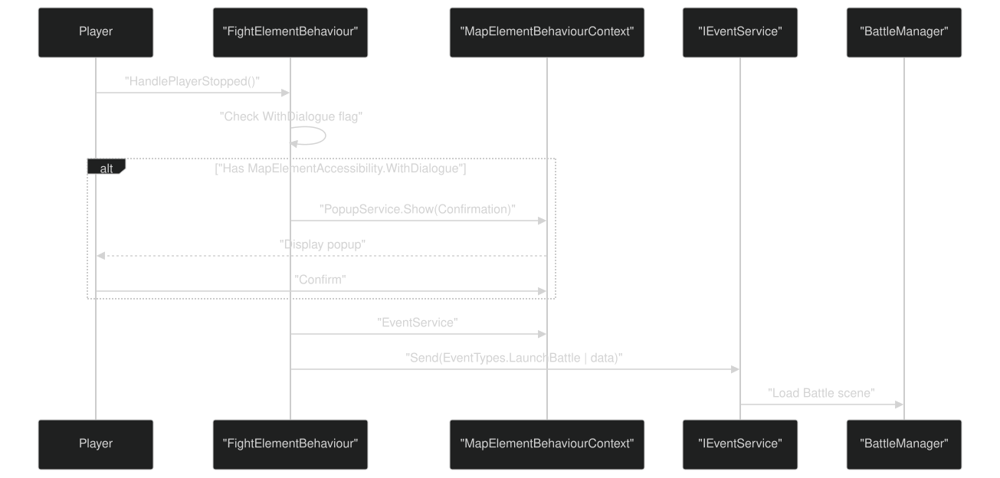
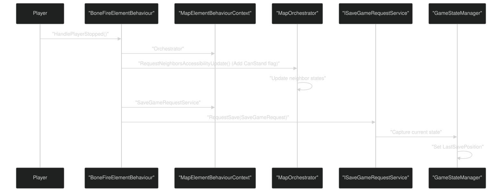

# Adding New Map Elements

<details>
<summary>Relevant source files</summary>


- [CarnageClub/Assets/GameResources/Font/Cinzel-VariableFont_wght SDF.asset](https://github.com/Wolfs0ng/CarnageClub/blob/0021fcdc/CarnageClub/Assets/GameResources/Font/Cinzel-VariableFont_wght SDF.asset)
- [CarnageClub/Assets/Scripts/Map/Data/MapData.cs](https://github.com/Wolfs0ng/CarnageClub/blob/0021fcdc/CarnageClub/Assets/Scripts/Map/Data/MapData.cs)
- [CarnageClub/Assets/Scripts/Map/Elements/Behaviours/BoneFireElementBehaviour.cs](https://github.com/Wolfs0ng/CarnageClub/blob/0021fcdc/CarnageClub/Assets/Scripts/Map/Elements/Behaviours/BoneFireElementBehaviour.cs)
- [CarnageClub/Assets/Scripts/Map/Elements/Behaviours/BossElementBehaviour.cs](https://github.com/Wolfs0ng/CarnageClub/blob/0021fcdc/CarnageClub/Assets/Scripts/Map/Elements/Behaviours/BossElementBehaviour.cs)
- [CarnageClub/Assets/Scripts/Map/Elements/Behaviours/FightElementBehaviour.cs](https://github.com/Wolfs0ng/CarnageClub/blob/0021fcdc/CarnageClub/Assets/Scripts/Map/Elements/Behaviours/FightElementBehaviour.cs)
- [CarnageClub/Assets/Scripts/Map/Elements/Behaviours/StoreElementBehaviour.cs](https://github.com/Wolfs0ng/CarnageClub/blob/0021fcdc/CarnageClub/Assets/Scripts/Map/Elements/Behaviours/StoreElementBehaviour.cs)
- [CarnageClub/Assets/Scripts/Map/Elements/MapElement.cs](https://github.com/Wolfs0ng/CarnageClub/blob/0021fcdc/CarnageClub/Assets/Scripts/Map/Elements/MapElement.cs)
- [CarnageClub/Assets/Scripts/Utils/Core/Enum/EventTypes.cs](https://github.com/Wolfs0ng/CarnageClub/blob/0021fcdc/CarnageClub/Assets/Scripts/Utils/Core/Enum/EventTypes.cs)
- [CarnageClub/Assets/Scripts/Utils/Core/SaveService.cs](https://github.com/Wolfs0ng/CarnageClub/blob/0021fcdc/CarnageClub/Assets/Scripts/Utils/Core/SaveService.cs)


</details>

## Purpose and Scope

This guide provides step-by-step instructions for developers extending the map system with new element types. It covers implementing the `IMapElementBehaviour` interface, defining behavior data classes, registering behaviors, and configuring map elements.

For information about the existing map element system and how elements interact with players, see [Element Behaviors & Interactions](#6.3) . For details on map navigation and movement mechanics, see [Map Navigation & Movement](#6.1) .

## Behavior Pattern Overview

The map system uses the Strategy pattern to decouple element types from their interactive behaviors. Each `MapElement` component delegates player interactions to an implementation of `IMapElementBehaviour` , allowing diverse element types without inheritance hierarchies.

### Behavior Architecture



Sources:  [CarnageClub/Assets/Scripts/Map/Elements/MapElement.cs #24-179](https://github.com/Wolfs0ng/CarnageClub/blob/0021fcdc/CarnageClub/Assets/Scripts/Map/Elements/MapElement.cs#L24-L179)  [CarnageClub/Assets/Scripts/Map/Elements/Behaviours/FightElementBehaviour.cs #23-80](https://github.com/Wolfs0ng/CarnageClub/blob/0021fcdc/CarnageClub/Assets/Scripts/Map/Elements/Behaviours/FightElementBehaviour.cs#L23-L80)  [CarnageClub/Assets/Scripts/Map/Elements/Behaviours/BossElementBehaviour.cs #23-80](https://github.com/Wolfs0ng/CarnageClub/blob/0021fcdc/CarnageClub/Assets/Scripts/Map/Elements/Behaviours/BossElementBehaviour.cs#L23-L80)

## IMapElementBehaviour Interface

All map element behaviors must implement the `IMapElementBehaviour` interface, which defines three lifecycle hooks:

### Method Signatures

```block
void HandleClick(    MapElementState state,     MapElementBehaviourData data,     MapElementBehaviourContext context) void HandlePlayerStopped(    MapElementState state,     MapElementBehaviourData data,     MapElementBehaviourContext context) void HandleAccessibilityChanged(    MapElementState state,     MapElementAccessibility previous,     MapElementAccessibility current,     MapElementBehaviourContext context)
```

### Parameters Explained

- `state``MapElementId``MapElementType``MapIconType`: Runtime element state containing , , , accessibility flags, and neighbor references
- `data`: Behavior-specific configuration data (cast to your concrete type)
- `context``IEventService``IPopupService``MapOrchestrator``ISaveGameRequestService`: Service access object providing , , ,


Sources:  [CarnageClub/Assets/Scripts/Map/Elements/Behaviours/FightElementBehaviour.cs #25-52](https://github.com/Wolfs0ng/CarnageClub/blob/0021fcdc/CarnageClub/Assets/Scripts/Map/Elements/Behaviours/FightElementBehaviour.cs#L25-L52)  [CarnageClub/Assets/Scripts/Map/Elements/Behaviours/BoneFireElementBehaviour.cs #23-47](https://github.com/Wolfs0ng/CarnageClub/blob/0021fcdc/CarnageClub/Assets/Scripts/Map/Elements/Behaviours/BoneFireElementBehaviour.cs#L23-L47)

## Step-by-Step Implementation Guide

### Step 1: Create Behavior Data Class

Define a data class inheriting from `MapElementBehaviourData` to hold configuration for your element type:

```block
// File: CarnageClub/Assets/Scripts/Map/Elements/Behaviours/Data/YourElementBehaviourData.cs using System;using UnityEngine; namespace CarnageClub.Map.Elements.Behaviours.Data{    [Serializable]    public class YourElementBehaviourData : MapElementBehaviourData    {        [field: SerializeField] public string CustomProperty { get; private set; }        [field: SerializeField] public int ConfigValue { get; private set; }                public YourElementBehaviourData(string customProperty, int configValue)        {            CustomProperty = customProperty;            ConfigValue = configValue;        }    }}
```

Key Points:

- `[Serializable]`Mark class for Unity serialization
- `[field: SerializeField]`Use for auto-properties
- `private`Make setters to enforce immutability
- Provide constructor for initialization


Examples:

- [CarnageClub/Assets/Scripts/Map/Elements/Behaviours/FightElementBehaviour.cs#71-79](https://github.com/Wolfs0ng/CarnageClub/blob/0021fcdc/CarnageClub/Assets/Scripts/Map/Elements/Behaviours/FightElementBehaviour.cs#L71-L79)`FightElementBehaviourData``EnemyID`uses with property
- [CarnageClub/Assets/Scripts/Map/Elements/Behaviours/BossElementBehaviour.cs#71-79](https://github.com/Wolfs0ng/CarnageClub/blob/0021fcdc/CarnageClub/Assets/Scripts/Map/Elements/Behaviours/BossElementBehaviour.cs#L71-L79)`BossElementBehaviourData``BossID`uses with property


### Step 2: Implement IMapElementBehaviour

Create your behavior class implementing the interface:

```block
// File: CarnageClub/Assets/Scripts/Map/Elements/Behaviours/YourElementBehaviour.cs using CarnageClub.Map.Data;using CarnageClub.Map.Elements.Behaviours.Abstract;using CarnageClub.Map.Elements.Behaviours.Data;using CarnageClub.Map.Enums; namespace CarnageClub.Map.Elements.Behaviours{    public class YourElementBehaviour : IMapElementBehaviour    {        public void HandleClick(MapElementState state, MapElementBehaviourData data,             MapElementBehaviourContext context)        {            // Optional: Handle click before player moves            // Most behaviors leave this empty        }         public void HandlePlayerStopped(MapElementState state, MapElementBehaviourData data,            MapElementBehaviourContext context)        {            if (state == null || context == null)            {                return;            }             // Cast data to your concrete type            if (data is not YourElementBehaviourData yourData)            {                return;            }             // Implement your element's behavior            ExecuteYourBehavior(state, yourData, context);        }         public void HandleAccessibilityChanged(MapElementState state,             MapElementAccessibility previous, MapElementAccessibility current,             MapElementBehaviourContext context)        {            // Optional: React to accessibility changes            // Most behaviors leave this empty        }         private void ExecuteYourBehavior(MapElementState state,             YourElementBehaviourData data, MapElementBehaviourContext context)        {            // Your custom logic here        }    }}
```

Sources:  [CarnageClub/Assets/Scripts/Map/Elements/Behaviours/FightElementBehaviour.cs #23-80](https://github.com/Wolfs0ng/CarnageClub/blob/0021fcdc/CarnageClub/Assets/Scripts/Map/Elements/Behaviours/FightElementBehaviour.cs#L23-L80)  [CarnageClub/Assets/Scripts/Map/Elements/Behaviours/BoneFireElementBehaviour.cs #21-48](https://github.com/Wolfs0ng/CarnageClub/blob/0021fcdc/CarnageClub/Assets/Scripts/Map/Elements/Behaviours/BoneFireElementBehaviour.cs#L21-L48)

## Common Behavior Patterns

### Pattern 1: Launch Battle Event

For combat elements (Fight, Boss), send `LaunchBattle` event via `IEventService` :



Code Example from FightElementBehaviour:

```block
// Check if confirmation dialog is neededif ((state.MapElementAccessibility & MapElementAccessibility.WithDialogue) == 0){    LaunchBattle(data, context);    return;} // Show confirmation popupcontext.PopupService.Show(PopupId.Confirmation, result =>{    if (result == PopupResult.Confirm)    {        LaunchBattle(data, context);    }}); // Send event to launch battleprivate void LaunchBattle(MapElementBehaviourData data, MapElementBehaviourContext context){    if (data is not FightElementBehaviourData fightData)    {        return;    }     context.EventService.Send(EventTypes.LaunchBattle,         new LaunchBattleEventData(fightData.EnemyID));}
```

Sources:  [CarnageClub/Assets/Scripts/Map/Elements/Behaviours/FightElementBehaviour.cs #32-79](https://github.com/Wolfs0ng/CarnageClub/blob/0021fcdc/CarnageClub/Assets/Scripts/Map/Elements/Behaviours/FightElementBehaviour.cs#L32-L79)  [CarnageClub/Assets/Scripts/Map/Elements/Behaviours/BossElementBehaviour.cs #32-79](https://github.com/Wolfs0ng/CarnageClub/blob/0021fcdc/CarnageClub/Assets/Scripts/Map/Elements/Behaviours/BossElementBehaviour.cs#L32-L79)  [CarnageClub/Assets/Scripts/Utils/Core/Enum/EventTypes.cs #20](https://github.com/Wolfs0ng/CarnageClub/blob/0021fcdc/CarnageClub/Assets/Scripts/Utils/Core/Enum/EventTypes.cs#L20-L20)

### Pattern 2: Unlock Neighbors and Save

For safe zone elements (BoneFire, Store), unlock adjacent elements and trigger save:



Code Example from BoneFireElementBehaviour:

```block
public void HandlePlayerStopped(MapElementState state, MapElementBehaviourData data,    MapElementBehaviourContext context){    if (state == null || context == null)    {        return;    }     // Unlock adjacent map elements    context.Orchestrator.RequestNeighborsAccessibilityUpdate(        state.MapElementId,         AccessibilityUpdateMode.Add);        // Trigger save game    SaveGameRequest request = new(        state.MapElementId,         SaveGameRequestOrigin.MapElement);    context.SaveGameRequestService.RequestSave(request);}
```

Sources:  [CarnageClub/Assets/Scripts/Map/Elements/Behaviours/BoneFireElementBehaviour.cs #30-42](https://github.com/Wolfs0ng/CarnageClub/blob/0021fcdc/CarnageClub/Assets/Scripts/Map/Elements/Behaviours/BoneFireElementBehaviour.cs#L30-L42)  [CarnageClub/Assets/Scripts/Map/Elements/Behaviours/StoreElementBehaviour.cs #30-42](https://github.com/Wolfs0ng/CarnageClub/blob/0021fcdc/CarnageClub/Assets/Scripts/Map/Elements/Behaviours/StoreElementBehaviour.cs#L30-L42)

### Pattern 3: Send Custom Events

For level transitions or custom mechanics, define and send new event types:

```block
// 1. Add event type to EventTypes enumpublic enum EventTypes{    LevelChangeBegin,    LevelChange,    LevelChangeEnd,    LaunchBattle,    PlayerTurnEnd,    AITurnEnd,    YourCustomEvent  // Add your event here} // 2. Create event data class if neededpublic class YourCustomEventData{    public string CustomProperty { get; }        public YourCustomEventData(string customProperty)    {        CustomProperty = customProperty;    }} // 3. Send event from behaviorcontext.EventService.Send(EventTypes.YourCustomEvent,     new YourCustomEventData("value"));
```

Sources:  [CarnageClub/Assets/Scripts/Utils/Core/Enum/EventTypes.cs #14-24](https://github.com/Wolfs0ng/CarnageClub/blob/0021fcdc/CarnageClub/Assets/Scripts/Utils/Core/Enum/EventTypes.cs#L14-L24)

## Step 3: Register Behavior with Registry

The behavior registry maps `MapElementType` enum values to behavior implementations. Register your behavior during service initialization:

### Behavior Registry Structure



### Registration Code Location

Find the behavior registry registration code in your service initialization:

```block
// Typical location: AppStartup or Map service registrationvar behaviourRegistry = new MapElementBehaviourRegistry(); behaviourRegistry.Register(MapElementType.Fight, new FightElementBehaviour());behaviourRegistry.Register(MapElementType.Boss, new BossElementBehaviour());behaviourRegistry.Register(MapElementType.BoneFire, new BoneFireElementBehaviour());behaviourRegistry.Register(MapElementType.Store, new StoreElementBehaviour());behaviourRegistry.Register(MapElementType.Stairs, new StairsElementBehaviour()); // Add your custom behaviorbehaviourRegistry.Register(MapElementType.YourCustomType, new YourElementBehaviour()); ServiceLocator.Register<IMapElementBehaviourRegistry>(behaviourRegistry);
```

Note: You must also add `MapElementType.YourCustomType` to the `MapElementType` enum definition.

Sources:  [CarnageClub/Assets/Scripts/Map/Elements/Behaviours/FightElementBehaviour.cs #23](https://github.com/Wolfs0ng/CarnageClub/blob/0021fcdc/CarnageClub/Assets/Scripts/Map/Elements/Behaviours/FightElementBehaviour.cs#L23-L23)  [CarnageClub/Assets/Scripts/Map/Elements/Behaviours/BossElementBehaviour.cs #23](https://github.com/Wolfs0ng/CarnageClub/blob/0021fcdc/CarnageClub/Assets/Scripts/Map/Elements/Behaviours/BossElementBehaviour.cs#L23-L23)

## Step 4: Configure MapData and MapElementData

Map elements are defined in `MapData` ScriptableObjects, which contain lists of `MapElementData` instances. Each `MapElementData` specifies the element's type, icon, accessibility, neighbors, and behavior data.

### MapData Structure

### MapElementData Structure

### Configuration Flow



### Example MapElementData Configuration

```block
// In Unity Inspector or ScriptableObject creation code:var elementData = new MapElementData{    ElementId = new MapElementId(1, 0),    MapElementType = MapElementType.YourCustomType,    MapIconType = MapIconType.CustomIcon,    MapElementAccessibility = MapElementAccessibility.CanStand |                               MapElementAccessibility.WithDialogue,    NeighborElementsHandler = new NeighborElementsHandler    {        Neighbors = new List<MapElementId>         {             new MapElementId(2, 0),             new MapElementId(3, 0)         }    },    BehaviourData = new YourElementBehaviourData("customValue", 42)};
```

Sources:  [CarnageClub/Assets/Scripts/Map/Data/MapData.cs #20-46](https://github.com/Wolfs0ng/CarnageClub/blob/0021fcdc/CarnageClub/Assets/Scripts/Map/Data/MapData.cs#L20-L46)  [CarnageClub/Assets/Scripts/Map/Elements/MapElement.cs #51-62](https://github.com/Wolfs0ng/CarnageClub/blob/0021fcdc/CarnageClub/Assets/Scripts/Map/Elements/MapElement.cs#L51-L62)

## Step 5: Create Map Element Prefabs

Each map element requires a Unity prefab with the `MapElement` component configured:

### Required Components

### Prefab Configuration Checklist

- `MapElement`Attach script to root GameObject
- `Button``elementButton`Assign reference to field
- `Image``elementImage`Assign reference to field
- `mapElementType``MapElementType`Set to your custom enum value
- `mapIconType``MapIconType`Set to corresponding enum value
- `mapElementAccessibility`Configure initial flags
- `unreachableColor`Assign for disabled state (default: gray)


### Visual State Management

The `MapElement` component automatically handles visual state updates:



Sources:  [CarnageClub/Assets/Scripts/Map/Elements/MapElement.cs #51-155](https://github.com/Wolfs0ng/CarnageClub/blob/0021fcdc/CarnageClub/Assets/Scripts/Map/Elements/MapElement.cs#L51-L155)

## Complete Implementation Checklist

### Code Implementation

- `YourElementBehaviourData``MapElementBehaviourData`Create class inheriting from
- `[Serializable]``[field: SerializeField]`Mark data class with properties
- `YourElementBehaviour``IMapElementBehaviour`Create class implementing
- `HandlePlayerStopped()`Implement with your custom logic
- `state``context`Add null checks for and parameters
- `data`Cast parameter to your concrete data type
- `MapElementBehaviourContext`Use to access services


### Behavior Registry

- `MapElementType.YourCustomType``MapElementType`Add to enum
- Register behavior in behavior registry during service initialization
- Verify registry resolves your type correctly


### Map Configuration

- `MapIconType.CustomIcon``MapIconType`Add to enum if using custom icon
- `MapData`Create or update ScriptableObject with your element
- `MapElementData`Configure with correct type, icon, and behavior data
- `MapElementAccessibility`Set appropriate flags
- `NeighborElementsHandler`Define neighbor relationships in


### Prefab Setup

- `MapElement``Button``Image`Create prefab with , , and components
- Assign component references in Inspector
- `mapElementType``mapIconType`Set and fields
- Test element instantiation in Map scene


### Testing

- Verify element appears correctly in map
- Test click interaction (if applicable)
- `HandlePlayerStopped()`Confirm executes when player arrives
- `MapElementBehaviourContext`Validate service access through
- Test accessibility changes and visual state updates


## Service Access Reference

The `MapElementBehaviourContext` provides access to core services:

### Example Service Usage

```block
// Send eventcontext.EventService.Send(EventTypes.LaunchBattle, eventData); // Show popupcontext.PopupService.Show(PopupId.Confirmation, result => {    if (result == PopupResult.Confirm)    {        // Handle confirmation    }}); // Update neighborscontext.Orchestrator.RequestNeighborsAccessibilityUpdate(    state.MapElementId,     AccessibilityUpdateMode.Add); // Request savevar request = new SaveGameRequest(    state.MapElementId,     SaveGameRequestOrigin.MapElement);context.SaveGameRequestService.RequestSave(request);
```

Sources:  [CarnageClub/Assets/Scripts/Map/Elements/Behaviours/FightElementBehaviour.cs #62-78](https://github.com/Wolfs0ng/CarnageClub/blob/0021fcdc/CarnageClub/Assets/Scripts/Map/Elements/Behaviours/FightElementBehaviour.cs#L62-L78)  [CarnageClub/Assets/Scripts/Map/Elements/Behaviours/BoneFireElementBehaviour.cs #38-41](https://github.com/Wolfs0ng/CarnageClub/blob/0021fcdc/CarnageClub/Assets/Scripts/Map/Elements/Behaviours/BoneFireElementBehaviour.cs#L38-L41)

## Common Pitfalls and Solutions

### Issue: Behavior Not Executing

Symptom:  `HandlePlayerStopped()` never called when player arrives at element.

Causes and Solutions:

### Issue: Data Cast Returns Null

Symptom:  `if (data is not YourElementBehaviourData yourData)` always fails.

Solution: Ensure `MapElementData.BehaviourData` field contains an instance of your concrete data class, not the base `MapElementBehaviourData` type.

### Issue: Services Not Available

Symptom:  `NullReferenceException` when accessing `context.EventService` or other services.

Solution: Verify services are registered in `ServiceLocator` before map scene loads. Check service initialization order in `AppStartup` .

Sources:  [CarnageClub/Assets/Scripts/Map/Elements/Behaviours/FightElementBehaviour.cs #25-79](https://github.com/Wolfs0ng/CarnageClub/blob/0021fcdc/CarnageClub/Assets/Scripts/Map/Elements/Behaviours/FightElementBehaviour.cs#L25-L79)  [CarnageClub/Assets/Scripts/Map/Elements/MapElement.cs #75-78](https://github.com/Wolfs0ng/CarnageClub/blob/0021fcdc/CarnageClub/Assets/Scripts/Map/Elements/MapElement.cs#L75-L78)

## Integration with Other Systems

### Battle System Integration

Elements launching battles send `LaunchBattle` events. See [Battle Flow & Turn Management](#5.1) for handling battle initialization and outcomes.

### AI System Integration

Battle outcomes from map-launched encounters feed into AI learning systems. See [Layer 0: Telemetry System](#3.2) for how combat data is recorded.

### Save System Integration

Safe zone elements trigger saves via `ISaveGameRequestService` . See [Save & Load System](#4.3) for save data structure and persistence mechanics.

Sources:  [CarnageClub/Assets/Scripts/Utils/Core/Enum/EventTypes.cs #20](https://github.com/Wolfs0ng/CarnageClub/blob/0021fcdc/CarnageClub/Assets/Scripts/Utils/Core/Enum/EventTypes.cs#L20-L20)  [CarnageClub/Assets/Scripts/Utils/Core/SaveService.cs #91-111](https://github.com/Wolfs0ng/CarnageClub/blob/0021fcdc/CarnageClub/Assets/Scripts/Utils/Core/SaveService.cs#L91-L111)