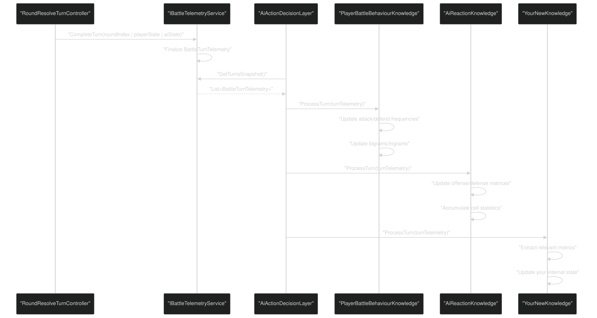
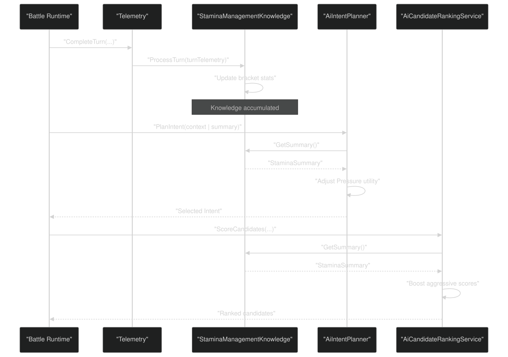

# Extending the AI System

<details>
<summary>Relevant source files</summary>


- [CarnageClub/.aiassistant/rules/AI_INSTRUCTIONS.md](https://github.com/Wolfs0ng/CarnageClub/blob/0021fcdc/CarnageClub/.aiassistant/rules/AI_INSTRUCTIONS.md)
- [CarnageClub/.aiassistant/rules/context/AI_SYSTEMS.md](https://github.com/Wolfs0ng/CarnageClub/blob/0021fcdc/CarnageClub/.aiassistant/rules/context/AI_SYSTEMS.md)
- [CarnageClub/.aiassistant/rules/context/ARCHITECTURE.md](https://github.com/Wolfs0ng/CarnageClub/blob/0021fcdc/CarnageClub/.aiassistant/rules/context/ARCHITECTURE.md)
- [CarnageClub/.aiassistant/rules/context/CODING_STANDARDS.md](https://github.com/Wolfs0ng/CarnageClub/blob/0021fcdc/CarnageClub/.aiassistant/rules/context/CODING_STANDARDS.md)
- [CarnageClub/.aiassistant/rules/context/CONTEXT_INDEX.md](https://github.com/Wolfs0ng/CarnageClub/blob/0021fcdc/CarnageClub/.aiassistant/rules/context/CONTEXT_INDEX.md)
- [CarnageClub/.aiassistant/rules/context/GAMEPLAY_RULES.md](https://github.com/Wolfs0ng/CarnageClub/blob/0021fcdc/CarnageClub/.aiassistant/rules/context/GAMEPLAY_RULES.md)
- [CarnageClub/.aiassistant/rules/context/PROJECT_OVERVIEW.md](https://github.com/Wolfs0ng/CarnageClub/blob/0021fcdc/CarnageClub/.aiassistant/rules/context/PROJECT_OVERVIEW.md)
- [CarnageClub/.aiassistant/rules/context/TELEMETRY.md](https://github.com/Wolfs0ng/CarnageClub/blob/0021fcdc/CarnageClub/.aiassistant/rules/context/TELEMETRY.md)
- [Carnage_Club_AI_Architecture_EN.md](https://github.com/Wolfs0ng/CarnageClub/blob/0021fcdc/Carnage_Club_AI_Architecture_EN.md)
- [Carnage_Club_AI_Architecture_UA.md](https://github.com/Wolfs0ng/CarnageClub/blob/0021fcdc/Carnage_Club_AI_Architecture_UA.md)
- [Diagrams/0_Runtime Sequence.md](https://github.com/Wolfs0ng/CarnageClub/blob/0021fcdc/Diagrams/0_Runtime Sequence.md)
- [Diagrams/10_Emotion_System.md](https://github.com/Wolfs0ng/CarnageClub/blob/0021fcdc/Diagrams/10_Emotion_System.md)
- [Diagrams/1_Telemetry_Data_Model.md](https://github.com/Wolfs0ng/CarnageClub/blob/0021fcdc/Diagrams/1_Telemetry_Data_Model.md)
- [Diagrams/2_Knowledge_1.md](https://github.com/Wolfs0ng/CarnageClub/blob/0021fcdc/Diagrams/2_Knowledge_1.md)
- [Diagrams/3_Knowledge_2.md](https://github.com/Wolfs0ng/CarnageClub/blob/0021fcdc/Diagrams/3_Knowledge_2.md)
- [Diagrams/4_Decision.md](https://github.com/Wolfs0ng/CarnageClub/blob/0021fcdc/Diagrams/4_Decision.md)


</details>

## Purpose & Scope

This page provides guidance for developers who want to extend the AI system with new capabilities. It covers:

- Adding new knowledge systems (Layers 1-2)
- Modifying tactical decision factors (Layer 3)
- Extending strategic intent utilities (Layer 4)
- Maintaining explainability guarantees throughout extensions


For understanding the AI architecture before extending it, see [AI Architecture Overview](#3.1) . For testing and debugging techniques, see [Testing & Debugging AI Systems](#9.2) .

## AI Extension Points Overview

The AI system provides explicit extension points at each layer. Understanding where to extend is critical to maintaining architectural integrity.

### Extension Point Map



Extension Priority by Layer:

Sources:  [CarnageClub/.aiassistant/rules/context/AI_SYSTEMS.md #1-32](https://github.com/Wolfs0ng/CarnageClub/blob/0021fcdc/CarnageClub/.aiassistant/rules/context/AI_SYSTEMS.md#L1-L32)  [Carnage_Club_AI_Architecture_EN.md #1-368](https://github.com/Wolfs0ng/CarnageClub/blob/0021fcdc/Carnage_Club_AI_Architecture_EN.md#L1-L368)  [Diagrams/0_Runtime Sequence.md #1-51](https://github.com/Wolfs0ng/CarnageClub/blob/0021fcdc/Diagrams/0_Runtime Sequence.md#L1-L51)

## Adding New Knowledge Systems

Knowledge systems (Layers 1-2) are the primary extension point. They consume telemetry and produce persistent learned data.

### Knowledge System Contract

All knowledge systems must follow this pattern:



### Implementation Template

Step 1: Define Your Data Structures

```block
Your knowledge system needs two data models: 1. Runtime State (in-memory, mutable)   - Efficient lookups (Dictionary, arrays)   - Hot-path optimized   - Located in: Assets/Scripts/AI/Knowledge/YourSystem/ 2. Persistence DTO (serializable, immutable)   - Unity-friendly collections (List, arrays)   - [Serializable] attribute   - Located in: Assets/Scripts/AI/Knowledge/YourSystem/Data/
```

Example Structure:

Step 2: Implement ProcessTurn

Your `ProcessTurn` method is called after every resolved turn. Reference implementation pattern from [Assets/Scripts/AI/Knowledge/PlayerBehaviour/PlayerBattleBehaviourKnowledge.cs #1-300](https://github.com/Wolfs0ng/CarnageClub/blob/0021fcdc/Assets/Scripts/AI/Knowledge/PlayerBehaviour/PlayerBattleBehaviourKnowledge.cs#L1-L300) :

```block
Key responsibilities:1. Extract relevant data from BattleTurnTelemetry2. Update internal statistics3. Avoid allocations (reuse buffers)4. Normalize direction lists before processing5. Handle cold-start cases (first few turns)
```

Step 3: Implement Persistence

Follow the builder/restorer pattern used by existing knowledge systems:

- Save:[Assets/Scripts/AI/Knowledge/PlayerBehaviour/PlayerBattleBehaviourKnowledgeBuilder.cs#1-150](https://github.com/Wolfs0ng/CarnageClub/blob/0021fcdc/Assets/Scripts/AI/Knowledge/PlayerBehaviour/PlayerBattleBehaviourKnowledgeBuilder.cs#L1-L150)
- Restore:[Assets/Scripts/AI/Knowledge/PlayerBehaviour/PlayerBattleBehaviourKnowledgeRestorer.cs#1-150](https://github.com/Wolfs0ng/CarnageClub/blob/0021fcdc/Assets/Scripts/AI/Knowledge/PlayerBehaviour/PlayerBattleBehaviourKnowledgeRestorer.cs#L1-L150)


Step 4: Register with Service Locator

Add registration in [Assets/Scripts/App/AppStartup.cs #1-500](https://github.com/Wolfs0ng/CarnageClub/blob/0021fcdc/Assets/Scripts/App/AppStartup.cs#L1-L500) :

```block
Location: ServiceRegistration.RegisterAiServices() Pattern:var yourKnowledge = new YourKnowledge();ServiceLocator.Register<IYourKnowledge>(yourKnowledge);
```

Step 5: Wire into Telemetry Processing

Connect your knowledge system in [Assets/Scripts/AI/Core/AiActionDecisionLayer.cs #1-300](https://github.com/Wolfs0ng/CarnageClub/blob/0021fcdc/Assets/Scripts/AI/Core/AiActionDecisionLayer.cs#L1-L300) :

```block
After telemetry is finalized (CompleteTurn):1. Get telemetry snapshot2. Call yourKnowledge.ProcessTurn(turnTelemetry)3. Update occurs synchronously in same frame
```

### Knowledge System Data Flow



### Cold Start Handling

All knowledge systems must handle the cold-start problem (first few turns with no data):

```block
Required behaviors:1. Define fallback values (uniform distributions, neutral baselines)2. Provide confidence metrics (0.0 = no data, 1.0 = high confidence)3. Gradually transition from fallback to learned data4. Never crash or return invalid data Example from AiReactionKnowledge:- Empty cells return neutral effectiveness (0.5)- Confidence = min(1.0, uses / minSampleSize)- Ranking uses: score * confidence + fallback * (1 - confidence)
```

Sources:  [Carnage_Club_AI_Architecture_EN.md #126-154](https://github.com/Wolfs0ng/CarnageClub/blob/0021fcdc/Carnage_Club_AI_Architecture_EN.md#L126-L154)  [Diagrams/2_Knowledge_1.md #1-25](https://github.com/Wolfs0ng/CarnageClub/blob/0021fcdc/Diagrams/2_Knowledge_1.md#L1-L25)  [Diagrams/3_Knowledge_2.md #1-30](https://github.com/Wolfs0ng/CarnageClub/blob/0021fcdc/Diagrams/3_Knowledge_2.md#L1-L30)  [CarnageClub/.aiassistant/rules/context/TELEMETRY.md #1-28](https://github.com/Wolfs0ng/CarnageClub/blob/0021fcdc/CarnageClub/.aiassistant/rules/context/TELEMETRY.md#L1-L28)

## Adding Decision Factors

Decision factors (Layer 3) affect how the AI scores and selects attack/defense combinations.

### Decision Pipeline Components



### Modifying Reward Calculation

The `AiRewardCalculator` computes base rewards for attack and defense outcomes. To add new factors:

Step 1: Extend AiRewardTuningSO

Location: [Assets/Scripts/AI/Decision/Reward/AiRewardTuningSO.cs #1-100](https://github.com/Wolfs0ng/CarnageClub/blob/0021fcdc/Assets/Scripts/AI/Decision/Reward/AiRewardTuningSO.cs#L1-L100)

```block
Add new serialized fields:[SerializeField] private float _yourNewFactorWeight = 1.0f;[SerializeField] private float _yourNewFactorMultiplier = 0.5f; Make them accessible:public float YourNewFactorWeight => _yourNewFactorWeight;
```

Step 2: Modify AiRewardCalculator

Location: [Assets/Scripts/AI/Decision/Reward/AiRewardCalculator.cs #1-200](https://github.com/Wolfs0ng/CarnageClub/blob/0021fcdc/Assets/Scripts/AI/Decision/Reward/AiRewardCalculator.cs#L1-L200)

```block
In CalculateAttackReward or CalculateDefenseReward: 1. Extract relevant data from turn telemetry2. Compute your factor's contribution3. Apply weight from tuning SO4. Add to total reward Pattern:float factorContribution = ComputeYourFactor(telemetry, context);float weightedContribution = factorContribution * _tuning.YourNewFactorWeight;totalReward += weightedContribution;
```

### Extending Candidate Ranking

The `AiCandidateRankingService` combines multiple scoring dimensions. To add new ranking criteria:

Step 1: Add Scoring Dimension

Location: [Assets/Scripts/AI/Decision/AiCandidateRankingService.cs #1-250](https://github.com/Wolfs0ng/CarnageClub/blob/0021fcdc/Assets/Scripts/AI/Decision/AiCandidateRankingService.cs#L1-L250)

```block
Add private method:private float ScoreYourDimension(    AiCandidate candidate,    TacticalDirective directive,    YourKnowledgeSystem knowledge){    // Extract candidate properties    // Query knowledge system    // Apply directive weights    // Return normalized score [0..1]}
```

Step 2: Integrate into Main Scoring

```block
In ScoreCandidate method: float yourScore = ScoreYourDimension(candidate, directive, knowledge);float yourWeight = directive.YourDimensionWeight; // Add to TacticalDirectivetotalScore += yourScore * yourWeight;
```

Step 3: Extend TacticalDirective

Location: [Assets/Scripts/AI/Decision/TacticalDirective.cs #1-150](https://github.com/Wolfs0ng/CarnageClub/blob/0021fcdc/Assets/Scripts/AI/Decision/TacticalDirective.cs#L1-L150)

```block
Add weight property:public float YourDimensionWeight { get; } Update builder to set value based on intent:In AiTacticalDirectiveBuilder, map Intent → YourDimensionWeight
```

### Custom Exploration Strategies

To implement new exploration approaches beyond Thompson Sampling:

Step 1: Implement IExplorationStrategy

```block
Create interface (if doesn't exist):public interface IExplorationStrategy{    bool ShouldExplore(        CombatContext context,        int turnIndex,        KnowledgeSummary summary);        AiCandidate SelectExplorationCandidate(        List<AiCandidate> candidates,        CombatContext context);}
```

Step 2: Register Strategy

Wire into `AiDecisionSelectionService` constructor or provide strategy via directive.

### Decision Factor Integration Map



Sources:  [Diagrams/4_Decision.md #1-58](https://github.com/Wolfs0ng/CarnageClub/blob/0021fcdc/Diagrams/4_Decision.md#L1-L58)  [Carnage_Club_AI_Architecture_EN.md #183-201](https://github.com/Wolfs0ng/CarnageClub/blob/0021fcdc/Carnage_Club_AI_Architecture_EN.md#L183-L201)  [CarnageClub/.aiassistant/rules/context/AI_SYSTEMS.md #1-32](https://github.com/Wolfs0ng/CarnageClub/blob/0021fcdc/CarnageClub/.aiassistant/rules/context/AI_SYSTEMS.md#L1-L32)

## Modifying Intent Utilities

Intent utilities (Layer 4) determine which strategic approach (Pressure, Survive, Punish) the AI adopts.

### Intent System Structure



### Adding a New Intent Type

Step 1: Define Intent Enum

Location: [Assets/Scripts/AI/Intent/AiIntent.cs #1-20](https://github.com/Wolfs0ng/CarnageClub/blob/0021fcdc/Assets/Scripts/AI/Intent/AiIntent.cs#L1-L20)

```block
Add enum value:public enum AiIntent{    Pressure,    Survive,    Punish,    YourNewIntent  // Add here}
```

Step 2: Implement Utility Function

Location: [Assets/Scripts/AI/Intent/AiIntentPlanner.cs #1-300](https://github.com/Wolfs0ng/CarnageClub/blob/0021fcdc/Assets/Scripts/AI/Intent/AiIntentPlanner.cs#L1-L300)

```block
Add private method:private float UtilityYourNewIntent(    CombatContext context,    KnowledgeSummary summary){    // Compute utility score [0..1] based on:    // - Combat situation (HP ratios, guard states)    // - Knowledge confidence    // - Player patterns    // - Match context        return normalizedUtility;} Add to utility map:private void InitializeUtilityFunctions(){    _utilityFunctions[AiIntent.YourNewIntent] = UtilityYourNewIntent;}
```

Step 3: Define Intent Parameters

Location: [Assets/Scripts/AI/Intent/TacticalDirective.cs #1-150](https://github.com/Wolfs0ng/CarnageClub/blob/0021fcdc/Assets/Scripts/AI/Intent/TacticalDirective.cs#L1-L150)

```block
Directives are immutable data structures defining how intent translates to behavior. Pattern (example from existing intents):- RiskProfile (0..1) — willingness to take risks- ExplorationBias (0..1) — exploration vs exploitation- AttackWeight (0..1) — offense emphasis- DefenseWeight (0..1) — defense emphasis- PreferredDefenseBehavior — specific defense strategy Add branch to AiTacticalDirectiveBuilder:case AiIntent.YourNewIntent:    return new TacticalDirective(        intent: intent,        riskProfile: ComputeRiskForYourIntent(summary),        explorationBias: ComputeExplorationForYourIntent(context),        ...    );
```

Step 4: Update FSM Transitions

Location: [Assets/Scripts/AI/Intent/AiSoftFsmExecutor.cs #1-250](https://github.com/Wolfs0ng/CarnageClub/blob/0021fcdc/Assets/Scripts/AI/Intent/AiSoftFsmExecutor.cs#L1-L250)

```block
Define transition rules from/to your new intent: private bool CanTransitionToYourIntent(    FsmStateData currentState,    IntentPlan newPlan,    CombatContext context){    // Define conditions:    // - Minimum commitment duration passed    // - Critical situation overrides    // - Utility threshold crossed        return shouldTransition;}
```

### Modifying Existing Utility Functions

To adjust how existing intents score situations:

Location:  [Assets/Scripts/AI/Intent/AiIntentPlanner.cs #100-250](https://github.com/Wolfs0ng/CarnageClub/blob/0021fcdc/Assets/Scripts/AI/Intent/AiIntentPlanner.cs#L100-L250)

```block
Each utility function computes score based on factors: UtilityPressure:- HP advantage- Guard state- Predictability (can exploit patterns)- Momentum (recent success) UtilitySurvive:- HP disadvantage- Low guard- Recent damage taken- Knowledge confidence (retreat if learning) UtilityPunish:- Pattern recognition confidence- Player predictability- Effective counter-patterns available
```

### Emotion Bias Integration

Emotions modify utility scores without controlling them. See [Layer 5: Emotion System](#3.6) for details.

Integration Point:  [Assets/Scripts/AI/Intent/AiIntentPlanner.cs #200-230](https://github.com/Wolfs0ng/CarnageClub/blob/0021fcdc/Assets/Scripts/AI/Intent/AiIntentPlanner.cs#L200-L230)

```block
After computing base utilities: private void ApplyEmotionalModifiers(    Dictionary<AiIntent, float> utilities,    EmotionModifiers modifiers){    utilities[AiIntent.Pressure] += modifiers.IntentUtilityShift.Pressure;    utilities[AiIntent.Survive] += modifiers.IntentUtilityShift.Survive;    utilities[AiIntent.Punish] += modifiers.IntentUtilityShift.Punish;    // Add your intent here        // Clamp to [0..1]}
```

Sources:  [Carnage_Club_AI_Architecture_EN.md #203-236](https://github.com/Wolfs0ng/CarnageClub/blob/0021fcdc/Carnage_Club_AI_Architecture_EN.md#L203-L236)  [Diagrams/10_Emotion_System.md #1-32](https://github.com/Wolfs0ng/CarnageClub/blob/0021fcdc/Diagrams/10_Emotion_System.md#L1-L32)  [CarnageClub/.aiassistant/rules/context/AI_SYSTEMS.md #19-32](https://github.com/Wolfs0ng/CarnageClub/blob/0021fcdc/CarnageClub/.aiassistant/rules/context/AI_SYSTEMS.md#L19-L32)

## Ensuring Explainability

Every AI extension must maintain explainability. If you cannot explain why the AI made a decision, it violates core design principles.

### Explainability Requirements

### Debug Surface Requirements



### Required Debug Methods

Template for Knowledge Systems:

```block
Location: Assets/Scripts/AI/Knowledge/YourSystem/YourKnowledge.cs Required methods: 1. GetSummary() — Aggregate statistics   Returns: Struct with key metrics (confidence, sample size, top patterns) 2. GetDetailedState() — Full state dump   Returns: Detailed breakdown for debugging   Use: Inspector display, test validation 3. PrettyPrint() — Human-readable string   Returns: Multi-line formatted string   Use: Console logs, combat log integration Example pattern from PlayerBattleBehaviourKnowledge:public PlayerBehaviourSummary GetSummary(){    return new PlayerBehaviourSummary    {        TotalActions = _totalActions,        MostFrequentAttack = GetMostFrequentDirection(_attackUsage),        MostFrequentDefense = GetMostFrequentDirection(_defendUsage),        Predictability = ComputePredictability(),        Confidence = ComputeConfidence()    };}
```

Template for Decision Systems:

```block
Location: Assets/Scripts/AI/Decision/YourSystem.cs Required logging: 1. Log candidate generation   - Total candidates generated   - Filtering criteria applied   2. Log scoring breakdown   - Per-candidate scores   - Per-dimension contributions   - Final weighted score   3. Log selection rationale   - Exploitation vs exploration decision   - Thompson sampling parameters (if used)   - Final selected candidate Use structured logging:Debug.Log($"[YourSystem] Generated {candidates.Count} candidates");Debug.Log($"[YourSystem] Top candidate: {candidate} Score: {score:F3}");
```

Template for Intent Systems:

```block
Location: Assets/Scripts/AI/Intent/YourIntent.cs Required state exposure: 1. Current intent + reason2. Utility scores for all intents3. FSM state (commitment, turns remaining)4. Emotion modifiers applied5. Directive parameters used Pattern:public IntentDebugData GetDebugData(){    return new IntentDebugData    {        CurrentIntent = _currentIntent,        UtilityScores = _lastUtilities.ToDictionary(),        TurnsInState = _fsmState.TurnsInCurrentState,        EmotionBias = _lastEmotionModifiers,        DirectiveParams = _lastDirective.ToDebugString()    };}
```

### Validation Checklist for Extensions

Before integrating an extension, verify:

- Unit tests pass— Cover cold-start, typical cases, edge cases
- Telemetry integration— ProcessTurn is called and updates state
- Persistence works— Save/load produces identical state
- Debug surfaces exist— GetSummary, PrettyPrint, detailed state
- Logging is structured— Key decisions are logged with context
- Performance is acceptable— No allocations in hot path, no LINQ
- Explainable decisions— You can answer "why did AI do this?"
- Fallback behavior defined— Cold-start and low-confidence handling
- Edge cases handled— Empty data, extreme values, invalid states
- Documentation updated— Code comments explain purpose and usage


Sources:  [CarnageClub/.aiassistant/rules/context/AI_SYSTEMS.md #26-32](https://github.com/Wolfs0ng/CarnageClub/blob/0021fcdc/CarnageClub/.aiassistant/rules/context/AI_SYSTEMS.md#L26-L32)  [CarnageClub/.aiassistant/rules/AI_INSTRUCTIONS.md #1-157](https://github.com/Wolfs0ng/CarnageClub/blob/0021fcdc/CarnageClub/.aiassistant/rules/AI_INSTRUCTIONS.md#L1-L157)  [Carnage_Club_AI_Architecture_EN.md #344-354](https://github.com/Wolfs0ng/CarnageClub/blob/0021fcdc/Carnage_Club_AI_Architecture_EN.md#L344-L354)

## Extension Workflow Example

### Complete Example: Adding Stamina Management Knowledge

This example demonstrates adding a new knowledge system that tracks stamina management patterns.

Step 1: Define Data Structures

Create `StaminaManagementKnowledge.cs` :

```block
Purpose: Track player's stamina usage patterns- Does player fight conservatively at low stamina?- Does player burn stamina aggressively early?- What stamina thresholds trigger behavior changes? Data tracked:- Actions per stamina bracket ([0-25%], [25-50%], [50-75%], [75-100%])- Stamina recovery patterns- Risk-taking correlation with stamina level
```

Create `StaminaManagementData.cs` (DTO):

```block
[Serializable]public class StaminaManagementData{    public List<StaminaBracketStats> BracketStats;    public int TotalActions;    public float AverageStaminaAtAction;} [Serializable]public class StaminaBracketStats{    public StaminaBracket Bracket;    public int Actions;    public int AggressiveActions;    public int ConservativeActions;}
```

Step 2: Implement ProcessTurn

```block
public void ProcessTurn(BattleTurnTelemetry turn){    // Extract stamina from snapshot    float staminaBefore = turn.PlayerBefore.Stamina;    float maxStamina = turn.PlayerBefore.MaxStamina;    float staminaPercent = staminaBefore / maxStamina;        // Classify stamina bracket    StaminaBracket bracket = GetBracket(staminaPercent);        // Analyze action aggressiveness    bool isAggressive = IsAggressiveAction(        turn.PlayerAction.AttackDirections,        turn.PlayerAction.DefendDirections    );        // Update statistics    _bracketStats[bracket].Actions++;    if (isAggressive)        _bracketStats[bracket].AggressiveActions++;    else        _bracketStats[bracket].ConservativeActions++;            _totalActions++;}
```

Step 3: Implement Persistence

```block
public StaminaManagementData CreateSaveData(){    return new StaminaManagementData    {        BracketStats = _bracketStats.Values.ToList(),        TotalActions = _totalActions,        AverageStaminaAtAction = ComputeAverage()    };} public void RestoreFromSaveData(StaminaManagementData data){    _totalActions = data.TotalActions;    foreach (var stat in data.BracketStats)        _bracketStats[stat.Bracket] = stat;}
```

Step 4: Add Debug Surfaces

```block
public StaminaSummary GetSummary(){    return new StaminaSummary    {        LowStaminaBehavior = GetBehaviorTendency(StaminaBracket.Low),        HighStaminaBehavior = GetBehaviorTendency(StaminaBracket.High),        RiskProfile = ComputeRiskProfile(),        Confidence = ComputeConfidence()    };} public string PrettyPrint(){    var sb = new StringBuilder();    sb.AppendLine("=== Stamina Management Knowledge ===");    foreach (var bracket in _bracketStats)    {        float aggression = bracket.Value.AggressiveActions /                           (float)bracket.Value.Actions;        sb.AppendLine($"{bracket.Key}: {aggression:P1} aggressive");    }    return sb.ToString();}
```

Step 5: Integrate with Intent System

Modify `AiIntentPlanner.UtilityPressure()` :

```block
private float UtilityPressure(    CombatContext context,    KnowledgeSummary summary){    float baseUtility = /* existing logic */;        // Factor in stamina knowledge    var staminaKnowledge = ServiceLocator.Get<IStaminaManagementKnowledge>();    var staminaSummary = staminaKnowledge.GetSummary();        // If player is conservative at low stamina, pressure them then    if (context.PlayerStaminaPercent < 0.3f &&        staminaSummary.LowStaminaBehavior == BehaviorTendency.Conservative)    {        baseUtility += 0.2f; // Boost pressure utility    }        return Mathf.Clamp01(baseUtility);}
```

Step 6: Integrate with Decision Scoring

Modify `AiCandidateRankingService` :

```block
private float ScoreWithStaminaKnowledge(    AiCandidate candidate,    StaminaSummary staminaKnowledge,    CombatContext context){    // If player is at low stamina and historically plays conservative,    // score aggressive attacks higher    float staminaPercent = context.PlayerStaminaPercent;    StaminaBracket bracket = GetBracket(staminaPercent);        if (staminaKnowledge.GetBehaviorTendency(bracket) == Conservative)    {        int aggressiveDirections = candidate.AttackDirections.Count;        return aggressiveDirections / 4.0f; // Normalize to [0..1]    }        return 0.5f; // Neutral}
```

Step 7: Testing

Create `StaminaManagementKnowledgeTests.cs` :

```block
Test cases:1. Cold start — Returns neutral behavior with 0 confidence2. Learning — After N turns, confidence increases3. Persistence — Save/load preserves exact state4. Aggregation — Correctly counts actions per bracket5. Edge cases — 0% stamina, 100% stamina, invalid data
```

### Integration Verification Diagram



Sources:  [Carnage_Club_AI_Architecture_EN.md #1-368](https://github.com/Wolfs0ng/CarnageClub/blob/0021fcdc/Carnage_Club_AI_Architecture_EN.md#L1-L368)  [Diagrams/0_Runtime Sequence.md #1-51](https://github.com/Wolfs0ng/CarnageClub/blob/0021fcdc/Diagrams/0_Runtime Sequence.md#L1-L51)  [CarnageClub/.aiassistant/rules/context/CODING_STANDARDS.md #1-35](https://github.com/Wolfs0ng/CarnageClub/blob/0021fcdc/CarnageClub/.aiassistant/rules/context/CODING_STANDARDS.md#L1-L35)

## Performance Considerations

AI extensions run every turn and must maintain 60 FPS on mobile devices.

### Hot Path Guidelines

Forbidden in ProcessTurn:

```block
❌ LINQ queries (Where, Select, OrderBy)❌ String concatenation in loops❌ Dictionary allocations❌ Boxing value types❌ Unnecessary struct copies
```

Required patterns:

```block
✓ Pre-allocated buffers✓ For loops with cached counts✓ Pooled temporary lists✓ Struct-based data when possible✓ Early exits with guard clauses
```

Example Optimization:

```block
// BAD (allocates)var aggressiveActions = telemetry.Outcomes    .Where(o => o.AttackerActor == Actor.Player)    .Count(o => o.DamageToHp > threshold); // GOOD (no allocations)int aggressiveActions = 0;var outcomes = telemetry.Outcomes;int count = outcomes.Count;for (int i = 0; i < count; i++){    var outcome = outcomes[i];    if (outcome.AttackerActor == Actor.Player &&        outcome.DamageToHp > threshold)    {        aggressiveActions++;    }}
```

### Memory Budget

Sources:  [CarnageClub/.aiassistant/rules/context/CODING_STANDARDS.md #29-35](https://github.com/Wolfs0ng/CarnageClub/blob/0021fcdc/CarnageClub/.aiassistant/rules/context/CODING_STANDARDS.md#L29-L35)  [CarnageClub/.aiassistant/rules/context/AI_SYSTEMS.md #19-27](https://github.com/Wolfs0ng/CarnageClub/blob/0021fcdc/CarnageClub/.aiassistant/rules/context/AI_SYSTEMS.md#L19-L27)

## Common Extension Pitfalls

### Pitfall 1: Breaking Unidirectional Data Flow

```block
❌ WRONG: Knowledge queries telemetrypublic void ProcessTurn(BattleTurnTelemetry turn){    var allTurns = _telemetry.GetAllTurns(); // BAD: circular dependency    // Process...} ✓ CORRECT: Knowledge only processes what's passed to itpublic void ProcessTurn(BattleTurnTelemetry turn){    // Use only the 'turn' parameter    // Maintain internal state for historical data}
```

### Pitfall 2: Overriding Intent with Emotions

```block
❌ WRONG: Emotions force intentif (emotion.Fear > 0.8f)    return AiIntent.Survive; // BAD: emotion controls decision ✓ CORRECT: Emotions bias utilityfloat utilityShift = emotion.Fear * 0.3f;utilities[AiIntent.Survive] += utilityShift; // GOOD: bias only
```

### Pitfall 3: Non-Deterministic Behavior

```block
❌ WRONG: Uncontrolled randomnessvar candidate = candidates[Random.Range(0, candidates.Count)]; ✓ CORRECT: Seeded random or explicit explorationvar candidate = _randomService.SelectRandom(candidates); // Seeded// ORvar candidate = _explorationBudget.ShouldExplore(context)    ? SelectExplorationCandidate(candidates)    : SelectBestCandidate(candidates);
```

### Pitfall 4: Missing Cold Start Handling

```block
❌ WRONG: Assumes data existsfloat avgDamage = _totalDamage / _actionCount; // Crashes if _actionCount = 0 ✓ CORRECT: Fallback for no datafloat avgDamage = _actionCount > 0    ? _totalDamage / _actionCount    : _defaultDamageValue;
```

### Pitfall 5: Hidden State Dependencies

```block
❌ WRONG: Implicit dependenciespublic float GetScore(){    var otherSystem = ServiceLocator.Get<IOtherSystem>();    return otherSystem.GetValue() * 2; // Hidden coupling} ✓ CORRECT: Explicit dependenciespublic float GetScore(float otherSystemValue){    return otherSystemValue * 2; // Clear input}
```

Sources:  [CarnageClub/.aiassistant/rules/context/ARCHITECTURE.md #1-45](https://github.com/Wolfs0ng/CarnageClub/blob/0021fcdc/CarnageClub/.aiassistant/rules/context/ARCHITECTURE.md#L1-L45)  [CarnageClub/.aiassistant/rules/context/TELEMETRY.md #18-23](https://github.com/Wolfs0ng/CarnageClub/blob/0021fcdc/CarnageClub/.aiassistant/rules/context/TELEMETRY.md#L18-L23)  [CarnageClub/.aiassistant/rules/AI_INSTRUCTIONS.md #103-118](https://github.com/Wolfs0ng/CarnageClub/blob/0021fcdc/CarnageClub/.aiassistant/rules/AI_INSTRUCTIONS.md#L103-L118)

## Extension Checklist

Use this checklist before merging any AI extension:

### Architecture Compliance

- Extension fits into one of the 5 layers (no hybrid components)
- Data flows unidirectionally (no circular dependencies)
- Uses service locator for dependencies (no direct class coupling)
- No optional parameters or boolean flags in public methods
- Follows single-responsibility principle


### Functional Requirements

- ProcessTurn completes in < 1ms on mobile device
- No allocations in hot path (verified with profiler)
- Cold-start case handled with reasonable fallbacks
- Persistence roundtrip tested (save → load → identical state)
- Deterministic behavior (same input → same output, given seed)


### Explainability Requirements

- GetSummary() method provides aggregate metrics
- PrettyPrint() method produces human-readable output
- All decisions logged with structured format
- Can answer "why did AI do X?" by inspecting logs
- No black-box algorithms or unexplainable heuristics


### Testing Requirements

- Unit tests cover cold start, normal cases, edge cases
- Integration test verifies telemetry → knowledge → decision flow
- Performance test validates frame time budget
- Persistence test validates save/load correctness
- Determinism test validates reproducible behavior


### Documentation Requirements

- Code comments explain "why", not "what"
- Public API documented with XML comments
- Debug surfaces documented in code
- This wiki page updated with extension details (if pattern differs)


Sources:  [CarnageClub/.aiassistant/rules/AI_INSTRUCTIONS.md #1-157](https://github.com/Wolfs0ng/CarnageClub/blob/0021fcdc/CarnageClub/.aiassistant/rules/AI_INSTRUCTIONS.md#L1-L157)  [CarnageClub/.aiassistant/rules/context/CODING_STANDARDS.md #1-35](https://github.com/Wolfs0ng/CarnageClub/blob/0021fcdc/CarnageClub/.aiassistant/rules/context/CODING_STANDARDS.md#L1-L35)  [Carnage_Club_AI_Architecture_EN.md #344-368](https://github.com/Wolfs0ng/CarnageClub/blob/0021fcdc/Carnage_Club_AI_Architecture_EN.md#L344-L368)