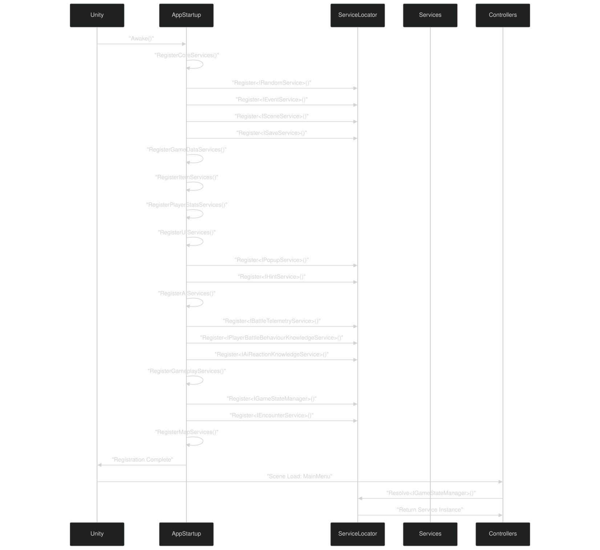

# Development Guide

<details>
<summary>Relevant source files</summary>


- [CarnageClub/.aiassistant/rules/AI_INSTRUCTIONS.md](https://github.com/Wolfs0ng/CarnageClub/blob/0021fcdc/CarnageClub/.aiassistant/rules/AI_INSTRUCTIONS.md)
- [CarnageClub/.aiassistant/rules/context/AI_SYSTEMS.md](https://github.com/Wolfs0ng/CarnageClub/blob/0021fcdc/CarnageClub/.aiassistant/rules/context/AI_SYSTEMS.md)
- [CarnageClub/.aiassistant/rules/context/ARCHITECTURE.md](https://github.com/Wolfs0ng/CarnageClub/blob/0021fcdc/CarnageClub/.aiassistant/rules/context/ARCHITECTURE.md)
- [CarnageClub/.aiassistant/rules/context/CODING_STANDARDS.md](https://github.com/Wolfs0ng/CarnageClub/blob/0021fcdc/CarnageClub/.aiassistant/rules/context/CODING_STANDARDS.md)
- [CarnageClub/.aiassistant/rules/context/CONTEXT_INDEX.md](https://github.com/Wolfs0ng/CarnageClub/blob/0021fcdc/CarnageClub/.aiassistant/rules/context/CONTEXT_INDEX.md)
- [CarnageClub/.aiassistant/rules/context/GAMEPLAY_RULES.md](https://github.com/Wolfs0ng/CarnageClub/blob/0021fcdc/CarnageClub/.aiassistant/rules/context/GAMEPLAY_RULES.md)
- [CarnageClub/.aiassistant/rules/context/PROJECT_OVERVIEW.md](https://github.com/Wolfs0ng/CarnageClub/blob/0021fcdc/CarnageClub/.aiassistant/rules/context/PROJECT_OVERVIEW.md)
- [CarnageClub/.aiassistant/rules/context/TELEMETRY.md](https://github.com/Wolfs0ng/CarnageClub/blob/0021fcdc/CarnageClub/.aiassistant/rules/context/TELEMETRY.md)


</details>

## Purpose and Scope

This document provides practical guidance for developers working on the Carnage Club codebase. It covers the development philosophy, architectural patterns, coding standards, and extension strategies that maintain system coherence across iterations.

For detailed coding rules and forbidden patterns, see [Coding Standards & Patterns](#9.1) . For AI-specific development, see [Testing & Debugging AI Systems](#9.2) and [Extending the AI System](#9.4) . For adding new gameplay content, see [Adding New Map Elements](#9.3) .

## Development Philosophy

### Solo-Developer Mindset

The codebase is designed for one developer working across multiple systems. Every architectural decision prioritizes:

Elegance and abstraction are secondary to these concerns. If a design choice increases cognitive load or makes debugging harder, it violates project principles.

Sources:  [.aiassistant/rules/AI_INSTRUCTIONS.md #33-43](https://github.com/Wolfs0ng/CarnageClub/blob/0021fcdc/.aiassistant/rules/AI_INSTRUCTIONS.md#L33-L43)  [.aiassistant/rules/context/ARCHITECTURE.md #38-44](https://github.com/Wolfs0ng/CarnageClub/blob/0021fcdc/.aiassistant/rules/context/ARCHITECTURE.md#L38-L44)

### The 10-Second Comprehension Rule

Any code construct—method, class, or system—must be comprehensible in 10 seconds or less . If it takes longer, the design needs simplification. This rule drives:

- Single-responsibility classes: Each class has one clear purpose
- Explicit data models: No hidden state or magic behavior
- No optional parameters: Every method signature is unambiguous
- No boolean flags: Separate methods instead of behavioral switches


Sources:  [.aiassistant/rules/AI_INSTRUCTIONS.md #150-157](https://github.com/Wolfs0ng/CarnageClub/blob/0021fcdc/.aiassistant/rules/AI_INSTRUCTIONS.md#L150-L157)

### Architectural Priorities



Diagram: Architectural Decision Framework - Every design choice must satisfy debuggability, observability, testability, and extendability requirements.

Sources:  [.aiassistant/rules/context/ARCHITECTURE.md #38-44](https://github.com/Wolfs0ng/CarnageClub/blob/0021fcdc/.aiassistant/rules/context/ARCHITECTURE.md#L38-L44)

## Codebase Structure Overview

### Service-Oriented Architecture

The project follows a service-oriented gameplay architecture with dependency injection via `ServiceLocator` . This is a guideline, not a strict rule—systems may use handlers, orchestrators, or domain objects when appropriate.



Diagram: Service Locator Architecture - All services register at startup via `AppStartup` . MonoBehaviour controllers resolve dependencies through `ServiceLocator` .

Sources:  [.aiassistant/rules/context/ARCHITECTURE.md #8-24](https://github.com/Wolfs0ng/CarnageClub/blob/0021fcdc/.aiassistant/rules/context/ARCHITECTURE.md#L8-L24)

### Layering Rules

The codebase enforces strict unidirectional data flow :

Critical Rule: Data flows one direction only . No circular dependencies. For example, telemetry records combat data → knowledge systems consume telemetry → decision systems consume knowledge. Telemetry never consumes knowledge.

Sources:  [.aiassistant/rules/context/ARCHITECTURE.md #26-45](https://github.com/Wolfs0ng/CarnageClub/blob/0021fcdc/.aiassistant/rules/context/ARCHITECTURE.md#L26-L45)  [.aiassistant/rules/context/TELEMETRY.md #19-22](https://github.com/Wolfs0ng/CarnageClub/blob/0021fcdc/.aiassistant/rules/context/TELEMETRY.md#L19-L22)

## Coding Principles

### Forbidden Patterns

The following patterns are explicitly prohibited :



Diagram: Forbidden Patterns and Their Violations - Each forbidden pattern violates the 10-second comprehension rule or debuggability principle.
Example Violations
```block
// ❌ FORBIDDEN: Optional parameter hides behaviorpublic void ProcessTurn(bool skipValidation = false) { } // ✅ CORRECT: Explicit methodspublic void ProcessTurn() { }public void ProcessTurnWithoutValidation() { } // ❌ FORBIDDEN: Boolean flag changes behaviorpublic void Attack(bool isCritical) { } // ✅ CORRECT: Separate methodspublic void Attack() { }public void CriticalAttack() { } // ❌ FORBIDDEN: Nested classpublic class BattleManager {    private class TurnData { } // Violates one-class-per-file} // ✅ CORRECT: Separate file for TurnData
```

Sources:  [.aiassistant/rules/context/CODING_STANDARDS.md #15-20](https://github.com/Wolfs0ng/CarnageClub/blob/0021fcdc/.aiassistant/rules/context/CODING_STANDARDS.md#L15-L20)  [.aiassistant/rules/AI_INSTRUCTIONS.md #106-118](https://github.com/Wolfs0ng/CarnageClub/blob/0021fcdc/.aiassistant/rules/AI_INSTRUCTIONS.md#L106-L118)

### Required Practices

Every code construct must follow these requirements:

Sources:  [.aiassistant/rules/context/CODING_STANDARDS.md #22-28](https://github.com/Wolfs0ng/CarnageClub/blob/0021fcdc/.aiassistant/rules/context/CODING_STANDARDS.md#L22-L28)  [.aiassistant/rules/context/CODING_STANDARDS.md #31-35](https://github.com/Wolfs0ng/CarnageClub/blob/0021fcdc/.aiassistant/rules/context/CODING_STANDARDS.md#L31-L35)

### Naming Conventions

Sources:  [.aiassistant/rules/context/CODING_STANDARDS.md #8-11](https://github.com/Wolfs0ng/CarnageClub/blob/0021fcdc/.aiassistant/rules/context/CODING_STANDARDS.md#L8-L11)

## Service Registration and Resolution

### AppStartup Registration Flow

All services register during application startup in `AppStartup.cs` . The registration order matters for dependencies:



Diagram: Service Registration Sequence - Services register in dependency order during `AppStartup.Awake()` . Controllers resolve services as needed.

### Resolving Services in Controllers

MonoBehaviour controllers resolve services through `ServiceLocator` :

```block
// Example from BaseBattleManagerpublic class BaseBattleManager : MonoBehaviour{    private IGameStateManager _gameStateManager;    private IBattleTelemetryService _telemetryService;    private IEventService _eventService;        private void Awake()    {        _gameStateManager = ServiceLocator.Resolve<IGameStateManager>();        _telemetryService = ServiceLocator.Resolve<IBattleTelemetryService>();        _eventService = ServiceLocator.Resolve<IEventService>();    }}
```

Critical Rule: Never resolve services in constructors or field initializers. Always resolve in `Awake()` or `Start()` to ensure `AppStartup` has completed registration.

Sources:  [.aiassistant/rules/context/ARCHITECTURE.md #20-24](https://github.com/Wolfs0ng/CarnageClub/blob/0021fcdc/.aiassistant/rules/context/ARCHITECTURE.md#L20-L24)

## Working with the AI System

### AI Explainability Requirement

The AI system has one non-negotiable design rule:

This principle drives the 5-layer architecture and enforces observability at every layer. See [AI Architecture Overview](#3.1) for the complete design.

Sources:  [.aiassistant/rules/context/AI_SYSTEMS.md #30-32](https://github.com/Wolfs0ng/CarnageClub/blob/0021fcdc/.aiassistant/rules/context/AI_SYSTEMS.md#L30-L32)

### Data Flow Direction

AI data flows unidirectionally through layers:



Diagram: AI Data Flow Direction - Data flows from combat → telemetry → knowledge → decisions → intent → emotions. No layer consumes data from layers below it.

Critical Rule: Telemetry never consumes knowledge. Knowledge systems never make decisions. Decision systems never record telemetry. This separation ensures debuggability—you can trace any AI action back through the layers to raw telemetry data.

Sources:  [.aiassistant/rules/context/TELEMETRY.md #19-27](https://github.com/Wolfs0ng/CarnageClub/blob/0021fcdc/.aiassistant/rules/context/TELEMETRY.md#L19-L27)  [.aiassistant/rules/context/AI_SYSTEMS.md #19-27](https://github.com/Wolfs0ng/CarnageClub/blob/0021fcdc/.aiassistant/rules/context/AI_SYSTEMS.md#L19-L27)

### Debugging AI Decisions

All AI decisions must be traceable:

For detailed debugging procedures, see [Testing & Debugging AI Systems](#9.2) .

Sources:  [.aiassistant/rules/context/TELEMETRY.md #26-27](https://github.com/Wolfs0ng/CarnageClub/blob/0021fcdc/.aiassistant/rules/context/TELEMETRY.md#L26-L27)

## Extension Points

### Adding New Systems

When adding a new system, follow this decision framework:

### Key Extension Points

## Testing Strategy

### Service Testing

Services are plain C# classes, making them unit-testable:

```block
// Example: Testing IGameStateManager[Test]public void GameStateManager_InitializePlayer_SetsCorrectState(){    // Arrange    var mockSaveService = new MockSaveService();    var mockEventService = new MockEventService();    var gameStateManager = new GameStateManager(mockSaveService, mockEventService);    var playerDTO = new PlayerDTO { Health = 100 };        // Act    gameStateManager.InitializePlayerForNewGame(playerDTO);        // Assert    Assert.AreEqual(100, gameStateManager.GetPlayerState().Health);}
```

### AI System Testing

AI systems require observability guarantees. Each layer must expose inspection methods:

- Telemetry`BattleTurnTelemetry`: Inspect records
- Knowledge: Query pattern frequencies, reaction matrices
- Decisions: Examine candidate scores, selection rationale
- Intent: Check active goals, FSM state
- Emotions: Read emotion values, decay rates


For specific testing procedures, see [Testing & Debugging AI Systems](#9.2) .

Sources:  [.aiassistant/rules/context/AI_SYSTEMS.md #26-27](https://github.com/Wolfs0ng/CarnageClub/blob/0021fcdc/.aiassistant/rules/context/AI_SYSTEMS.md#L26-L27)

### Integration Testing

Integration tests verify system interactions:

## Performance Considerations

### Hot Path Optimization

Critical performance rules for combat loops:

### Profiling Targets

Sources:  [.aiassistant/rules/context/CODING_STANDARDS.md #31-35](https://github.com/Wolfs0ng/CarnageClub/blob/0021fcdc/.aiassistant/rules/context/CODING_STANDARDS.md#L31-L35)

## Common Pitfalls

### Service Resolution Timing

Problem: Resolving services before `AppStartup` completes registration.

Solution: Always resolve in `Awake()` or later. Never in field initializers or constructors.

```block
// ❌ WRONG: Field initializer runs before AppStartupprivate IGameStateManager _gsm = ServiceLocator.Resolve<IGameStateManager>(); // ✅ CORRECT: Resolve in Awake()private IGameStateManager _gsm;private void Awake() {    _gsm = ServiceLocator.Resolve<IGameStateManager>();}
```

### Circular Data Flow

Problem: Creating circular dependencies between AI layers (e.g., telemetry consuming knowledge).

Solution: Enforce unidirectional data flow. Data flows: Combat → Telemetry → Knowledge → Decisions → Intent → Emotions. Never backwards.

### Optional Parameters

Problem: Using optional parameters to change method behavior.

Solution: Create separate methods with explicit names.

```block
// ❌ WRONG: Optional parameter hides behaviorpublic void SaveGame(bool force = false) { } // ✅ CORRECT: Explicit methodspublic void SaveGame() { }public void ForceSaveGame() { }
```

Sources:  [.aiassistant/rules/AI_INSTRUCTIONS.md #106-118](https://github.com/Wolfs0ng/CarnageClub/blob/0021fcdc/.aiassistant/rules/AI_INSTRUCTIONS.md#L106-L118)

## Development Workflow

### Making Changes

### Refactoring Checklist

Before refactoring, verify:

- Will this reduce cognitive load?
- Will this improve debuggability?
- Does this maintain unidirectional data flow?
- Are all service dependencies explicit?
- Does this preserve observability guarantees?
- Can existing tests still pass?
- Is the 10-second comprehension rule satisfied?


### Code Review Self-Check

Before committing code:

- No optional parameters
- No boolean flags changing behavior
- One class per file
- Guard clauses at method entry
- No LINQ in hot paths
- `Awake()`Components cached in
- `Awake()`Services resolved in
- Data flow is unidirectional
- AI decisions are traceable
- Code comprehensible in 10 seconds


Sources:  [.aiassistant/rules/AI_INSTRUCTIONS.md #150-157](https://github.com/Wolfs0ng/CarnageClub/blob/0021fcdc/.aiassistant/rules/AI_INSTRUCTIONS.md#L150-L157)  [.aiassistant/rules/context/CODING_STANDARDS.md](https://github.com/Wolfs0ng/CarnageClub/blob/0021fcdc/.aiassistant/rules/context/CODING_STANDARDS.md)

## Next Steps

- [Coding Standards & Patterns](#9.1)For detailed coding rules, see
- [Testing & Debugging AI Systems](#9.2)For AI debugging techniques, see
- [Adding New Map Elements](#9.3)For adding gameplay content, see
- [Extending the AI System](#9.4)For AI system extensions, see


Sources:  [.aiassistant/rules/AI_INSTRUCTIONS.md](https://github.com/Wolfs0ng/CarnageClub/blob/0021fcdc/.aiassistant/rules/AI_INSTRUCTIONS.md)  [.aiassistant/rules/context/ARCHITECTURE.md](https://github.com/Wolfs0ng/CarnageClub/blob/0021fcdc/.aiassistant/rules/context/ARCHITECTURE.md)  [.aiassistant/rules/context/CODING_STANDARDS.md](https://github.com/Wolfs0ng/CarnageClub/blob/0021fcdc/.aiassistant/rules/context/CODING_STANDARDS.md)  [.aiassistant/rules/context/AI_SYSTEMS.md](https://github.com/Wolfs0ng/CarnageClub/blob/0021fcdc/.aiassistant/rules/context/AI_SYSTEMS.md)  [.aiassistant/rules/context/TELEMETRY.md](https://github.com/Wolfs0ng/CarnageClub/blob/0021fcdc/.aiassistant/rules/context/TELEMETRY.md)  [.aiassistant/rules/context/PROJECT_OVERVIEW.md](https://github.com/Wolfs0ng/CarnageClub/blob/0021fcdc/.aiassistant/rules/context/PROJECT_OVERVIEW.md)